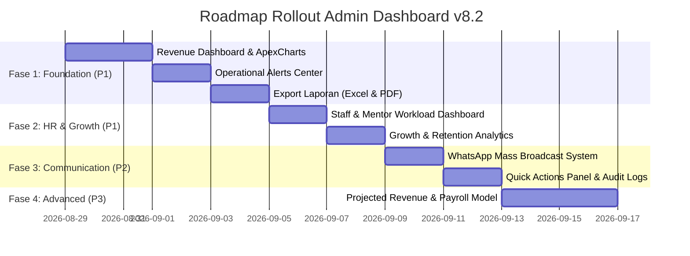

# Product Requirements Document (PRD): Admin Dashboard Enhancements (v8.2)

## 1. Executive Summary

- **Problem Statement**: Dasbor admin AL-HIKMAH LMS saat ini (v8.1) masih bersifat "summary statis" (hanya menampilkan angka total) tanpa visualisasi tren, breakdown per program, atau *insight* operasional yang *actionable*. Hal ini menghambat manajemen dalam mengambil keputusan strategis, memantau beban kerja mentor, dan mengelola arus kas (tagihan jatuh tempo).
- **Proposed Solution**: Membangun dasbor analitik lanjutan (v8.2) yang mencakup visualisasi pendapatan interaktif (*Revenue Dashboard*), manajemen SDM & beban mengajar (*Staff/HR Dashboard*), pusat peringatan operasional terpusat (*Operational Alerts Center*), analitik retensi (*Growth Analytics*), dan fitur ekspor laporan akuntansi (Excel/PDF).
- **Success Criteria**:
  - Waktu ekstraksi laporan keuangan berkurang sebesar 80% (dari manual ke ekspor Excel/PDF otomatis).
  - *Response time* terhadap isu operasional kritis (tagihan overdue >30 hari atau mentor overload) < 24 jam berkat *Operational Alerts Center*.
  - Kejelasan distribusi beban mengajar mentor dan rasio guru:santri divisualisasikan 100%.
  - Zero performance lag pada dasbor admin dengan implementasi AJAX data fetching & query caching.

---

## 2. User Experience & Functionality

### User Personas
- **Admin Keuangan & Bendahara**: Memantau arus kas harian/bulanan, tagihan jatuh tempo, dan mengekspor laporan resmi untuk yayasan/akuntansi.
- **Admin Akademik & HR**: Memantau kehadiran guru, beban santri binaan per mentor, dan mendeteksi guru yang mengalami kelebihan beban (*overload*).
- **Kepala Lembaga / Direktur Eksekutif**: Membutuhkan ringkasan performa pertumbuhan (*growth rate*), retensi santri (*churn rate*), serta tren pendapatan *Year-over-Year* (YoY) dan *Month-over-Month* (MoM).

### User Stories & Acceptance Criteria (AC)

#### Story 1: Revenue & Financial Analytics
> **As a** Manajemen / Admin Keuangan, **I want to** melihat dasbor pendapatan interaktif dengan grafik tren dan breakdown program, **so that** saya dapat memantau kesehatan finansial lembaga secara real-time.
- **AC**:
  - Menampilkan ringkasan: Total Pendapatan, Pendapatan Bulan Ini (+ % MoM), Pendapatan Bulan Lalu, dan Rata-rata per Santri (ARPU).
  - Grafik tren pendapatan 12 bulan terakhir menggunakan **ApexCharts** (interaktif: tooltip, filter, download SVG/PNG).
  - Breakdown pendapatan per program (Tahfidz, Tahsin, Bahasa Arab, Kelas Muslimah).
  - Monitoring status tagihan (Lunas, Jatuh Tempo, Overdue).

#### Story 2: Staff & HR Management (Beban Kerja Guru)
> **As an** Admin Akademik / HR, **I want to** melihat beban mengajar dan performa masing-masing mentor, **so that** distribusi santri binaan merata dan kualitas pendampingan terjaga.
- **AC**:
  - Menampilkan metrik: Total Mentor, Mentor Aktif, Guru Cuti Hari Ini, dan Rasio Guru:Santri.
  - Peringatan otomatis (*Red Alert*) untuk mentor yang *overload* (>40 santri).
  - Daftar *Top Performing Mentor* berdasarkan tingkat kehadiran mengajar dan ketercapaian target santri.
  - Visualisasi beban mengajar per program dan status kesiapan menerima santri baru.

#### Story 3: Operational Alerts Center (Pusat Peringatan Operasional)
> **As an** Admin Sistem, **I want to** memiliki pusat notifikasi operasional terpusat dengan level urgensi, **so that** tidak ada kendala santri, mentor, atau keuangan yang terlewat.
- **AC**:
  - Memisahkan notifikasi menjadi 3 kategori: **🔴 Kritis**, **🟡 Perhatian**, dan **🟢 Info**.
  - Menyediakan tombol aksi cepat (*Quick Action*) langsung menuju halaman penyelesaian masalah.

```
📋 DAFTAR ALERT SPESIFIK YANG DITAMPILKAN:

🔴 KRITIS (Harus Segera Ditangani)
├── 💰 Tagihan Overdue > 30 hari (Risiko piutang macet)
├── 👦 Santri Tidak Aktif > 30 hari (Risiko dropout)
├── 👨‍🏫 Mentor Overload (> 40 santri binaan aktif)
└── ⚠️ Payment Gateway Error / Webhook Timeout (Pakasir)

🟡 PERHATIAN (Perlu Monitoring Berkala)
├── ⏳ Tagihan Jatuh Tempo (7 – 30 hari)
├── 👦 Santri Tidak Aktif (14 – 30 hari tanpa mutaba'ah)
├── 📋 Pendaftaran Baru Belum Dialokasi Mentor (> 3 hari)
├── 🎯 Mentor Belum Menginput Target Santri (> 7 hari)
└── 📝 Sesi Kelas Bimbingan Tanpa Kehadiran (> 3x berturut-turut)

🟢 INFO (Pemberitahuan Rutin)
├── 🎉 Santri baru berhasil terdaftar
├── 💵 Pembayaran SPP / Pendaftaran terkonfirmasi lunas
├── 🎖️ Santri berhasil meraih lencana (badge) baru
├── 🎯 Target hafalan harian diselesaikan santri
└── 💾 Backup database otomatis harian berhasil
```

#### Story 4: Export Laporan Keuangan (Excel & PDF)
> **As an** Admin Keuangan, **I want to** mengekspor laporan transaksi dan rekapitulasi pendapatan, **so that** dapat digunakan untuk pelaporan pajak dan pembukuan resmi yayasan.
- **AC**:
  - Filter kustom berdasarkan rentang tanggal (*Date Range Picker*) dan filter per program.
  - Mendukung ekspor ke format `.xlsx` (menggunakan Laravel Excel) dan `.pdf` (menggunakan DomPDF).
  - Menyertakan ringkasan total transaksi, subtotal per program, dan status pembayaran.

#### Story 5: WhatsApp Mass Broadcast
> **As an** Pengelola Lembaga, **I want to** mengirimkan pengumuman massal via WhatsApp kepada wali santri, **so that** informasi libur, ujian, atau event tersampaikan dengan cepat.
- **AC**:
  - Pilihan target penerima: Semua Wali Santri, Wali per Program Tertentu, Wali binaan Mentor Tertentu, atau Pilihan Kustom.
  - Template pesan dengan variabel dinamis: `{nama_ortu}`, `{nama_anak}`, `{program}`.
  - *Rate Limiter* & Asynchronous Job Dispatcher (maksimal 50-100 pesan/menit) untuk mencegah pemblokiran nomor WhatsApp.

### Non-Goals
- Perhitungan penggajian (*payroll*) otomatis mentor (Dijadwalkan untuk rilis v8.3).
- Model AI Prediksi Pendapatan Machine Learning kompleks (MVP menggunakan rata-rata tren linier MoM).

---

## 3. Technical Specifications

### Architecture Overview
- **Visualisasi UI**: Menggunakan **ApexCharts (via CDN)** untuk grafik interaktif (tooltip, filter, zoom, kompatibel dengan tema Etrain & dark mode).
- **Backend Analytics Engine**: Controller analitik modular (`AdminRevenueController`, `AdminStaffController`, `AdminAlertController`) yang didukung oleh *Service Layer* terdedikasi (`RevenueAnalyticsService`, `StaffAnalyticsService`, `AlertService`).
- **AJAX Data Fetching**: Menyediakan endpoint API internal (`AnalyticsApiController`) untuk memuat data grafik secara asinkron tanpa memperlambat loading awal halaman (*initial page render*).
- **Background Processing**: Pengiriman WhatsApp broadcast dan kompilasi laporan PDF skala besar diproses di antrean (*Laravel Queue*).

### 📂 Struktur File Baru yang Akan Dibuat

```text
app/
├── Http/
│   └── Controllers/
│       ├── Admin/
│       │   ├── AdminRevenueController.php      # Controller analitik pendapatan
│       │   ├── AdminStaffController.php        # Controller beban & performa guru
│       │   ├── AdminReportController.php       # Controller export Excel & PDF
│       │   ├── AdminBroadcastController.php    # Controller WhatsApp broadcast
│       │   └── AdminAlertController.php        # Controller pusat alert operasional
│       └── Api/
│           └── AnalyticsApiController.php      # Endpoint JSON untuk data ApexCharts
├── Services/
│   ├── RevenueAnalyticsService.php             # Kalkulasi tren, MoM, YoY, & breakdown
│   ├── StaffAnalyticsService.php               # Analisis rasio, overload, & top mentor
│   ├── AlertService.php                        # Mesin pendeteksi kondisi Kritis, Perhatian, Info
│   └── BroadcastService.php                    # Job dispatcher & message templating
├── Models/
│   └── FinancialAuditLog.php                   # Model pencatat audit perubahan data keuangan
└── Exports/
    └── RevenueReportExport.php                 # Class export Laravel Excel (Maatwebsite)

database/
└── migrations/
    ├── 2026_08_29_000001_create_financial_audit_logs_table.php
    └── 2026_08_29_000002_add_analytics_indexes_to_payments_table.php

resources/
└── views/
    └── admin/
        ├── dashboard.blade.php                 # UPDATED dengan ringkasan & quick actions
        ├── revenue/
        │   ├── index.blade.php                 # Tampilan utama pendapatan & filter
        │   ├── partials/chart.blade.php        # Komponen container ApexCharts
        │   └── partials/stats-cards.blade.php  # Kartu metrik ARPU, MoM, total revenue
        ├── staff/
        │   ├── index.blade.php                 # Tampilan monitoring beban kerja guru
        │   └── partials/mentor-table.blade.php # Tabel beban santri & status overload
        ├── reports/
        │   ├── index.blade.php                 # Antarmuka generator laporan
        │   └── pdf/revenue-pdf.blade.php       # Template layout cetak PDF
        ├── broadcast/
        │   └── index.blade.php                 # Antarmuka form WhatsApp broadcast & log
        └── alerts/
            └── index.blade.php                 # Panel lengkap pusat peringatan operasional
```

### Database Schema (Tabel Baru & Indeks)

```sql
-- 1. Tabel Log Audit Finansial
CREATE TABLE financial_audit_logs (
    id BIGINT UNSIGNED AUTO_INCREMENT PRIMARY KEY,
    user_id BIGINT UNSIGNED NOT NULL,
    action VARCHAR(100) NOT NULL,            -- 'update_payment', 'manual_adjustment', 'refund'
    entity_type VARCHAR(50) NOT NULL,        -- 'payment', 'enrollment'
    entity_id BIGINT UNSIGNED NOT NULL,
    old_values JSON NULL,
    new_values JSON NULL,
    ip_address VARCHAR(45) NULL,
    created_at TIMESTAMP NULL,
    FOREIGN KEY (user_id) REFERENCES users(id) ON DELETE CASCADE,
    INDEX idx_entity (entity_type, entity_id),
    INDEX idx_created (created_at)
);

-- 2. Indeks Tambahan untuk Optimasi Kueri Analitik
ALTER TABLE payments ADD INDEX idx_status_paid_at (status, paid_at);
ALTER TABLE payments ADD INDEX idx_status_due_date (status, due_date);
```

### Integration Points
- **Library Grafik**: **ApexCharts v3.x (CDN)**.
- **Export Engine**: `maatwebsite/excel` (Excel/CSV) & `barryvdh/laravel-dompdf` (PDF).
- **Messaging Gateway**: WhatsApp Gateway Fonnte / Watzap API dengan *Rate Limiter* Laravel.

### Security & Privacy
- Seluruh rute analitik dilindungi middleware `auth` dan pengecekan role `isAdmin()`.
- Data finansial sensitif dan log audit tidak dapat diubah/dihapus (*append-only logs*).
- Sanitasi input ketat pada form filter tanggal untuk mencegah *SQL Injection*.

---

## 4. Risks & Roadmap

### Phased Rollout Strategy



### Technical Risks & Mitigation

| Risiko Teknis | Potensi Dampak | Strategi Mitigasi |
| :--- | :--- | :--- |
| **Kueri Agregasi Berat** | Dashboard lambat dibuka saat transaksi > 10.000 | Tambahkan indeks komposit pada `payments(status, paid_at)` dan terapkan Cache Laravel (`remember()`) 15-60 menit. |
| **Pemblokiran Nomor WhatsApp** | Nomor admin dibanned karena broadcast cepat | Gunakan antrean (*Queue Worker*) dengan jeda 2-5 detik per pesan serta random delay. |
| **Memory Limit Ekspor Data** | Server crash saat ekspor laporan ribuan baris | Gunakan *chunked query* (`FromQuery` di Laravel Excel) bukan `Collection` memori penuh. |

---

## 5. Keputusan Final Desain & Teknologi (*Settled Decisions*)

1. **Library Grafik**: **ApexCharts (CDN)** ditetapkan sebagai standar resmi karena memiliki performa interaktif tinggi (drill-down tooltip, zoom, multi-axis), visual modern, dan kompatibilitas tema gelap/terang yang optimal.
2. **Struktur Pengambilan Data**: Menggunakan pendekatan *Hybrid* — data ringkasan kartu di-*render* langsung via Blade pada *initial load*, sedangkan grafik tren bulanan diambil via AJAX (`AnalyticsApiController`) untuk menjaga kecepatan render awal < 1 detik.
3. **Format Pelaporan**: Mendukung format ganda — **Excel (.xlsx)** untuk analisis data/akuntansi, dan **PDF (.pdf)** dengan kop surat resmi AL-HIKMAH untuk laporan manajemen/pengurus.