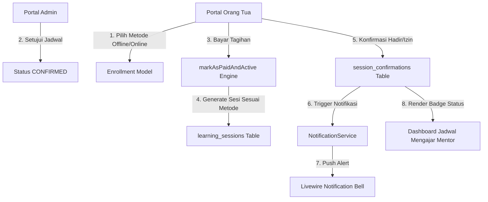

# 📋 PRODUCT REQUIREMENTS DOCUMENT (PRD)

# 🛠️ Perbaikan & Penyempurnaan Fitur Mentor, Sesi Belajar, Metode Belajar, & Konfirmasi Kehadiran Real-Time

> **Nomor Dokumen:** PRD-ALHIKMAH-2026-004  
> **Status:** 🟡 **DRAFT / READY FOR IMPLEMENTATION**  
> **Target Pengguna:** Junior Programmer / Developer Team  
> **Versi Target:** 4.1  
> **Tanggal:** 15 Agustus 2026  

---

## 1. EXECUTIVE SUMMARY

### 1.1 Problem Statement
1. **Kebocoran Data Santri Belum Lunas di Portal Mentor (`/mentor/students`)**: Santri yang baru disetujui jadwalnya oleh Admin (`CONFIRMED`) namun belum melunasi pembayaran SPP/pendaftaran sudah muncul di daftar santri binaan mentor.
2. **Hardcoded Metode Belajar ("Online") pada Sesi Belajar (`/mentor/sessions` & `/parent/schedules`)**: Pilihan metode belajar wali santri (misal: "Offline / Home Visit") terabaikan karena sistem selalu meng-generate sesi belajar dengan status `method = 'online'`.
3. **Format Tanggal Bahasa Inggris & Tampilan Tabel Berantakan (`/mentor/sessions`)**: Tampilan hari sesi mengajar masih berbahasa Inggris dan layout tabel memanjang/rusak pagination saat jumlah data bertambah banyak.
4. **Hilangnya Visibilitas Konfirmasi Kehadiran Anak di Dashboard Mentor (`/mentor/dashboard`)**: Ketika orang tua melakukan konfirmasi kehadiran (Hadir/Izin/Sakit) di `/parent/schedules/{id}`, data konfirmasi tersebut tidak muncul di jadwal mengajar mentor dan mentor tidak mendapatkan notifikasi apapun.

### 1.2 Proposed Solution
1. **Strict Payment Gate Query**: Memperbarui query daftar santri binaan mentor agar hanya menampilkan santri yang sudah berstatus `ACTIVE` (pembayaran lunas).
2. **Dynamic Learning Method Engine**: Menyimpan preferensi metode belajar (`online`, `offline`, `hybrid`) di tabel `enrollments` dan menggunakannya saat men-generate record di `learning_sessions`.
3. **Indonesian Localization & Clean DataTables / Responsive UI**: Menggunakan format tanggal terlokalisasi Bahasa Indonesia (`dddd, D MMMM Y`) dan mengintegrasikan tabel responsif berbasis DataTables / clean pagination tanpa glitch layout.
4. **Attendance Confirmation Real-time Bridge**: Menghubungkan model `Session` dengan `SessionConfirmation`, memicu `NotificationService` saat orang tua konfirmasi kehadiran, dan menampilkan badge kehadiran (Hadir/Izin/Sakit) di Dashboard & Jadwal Sesi Mentor.

### 1.3 Success Criteria (KPIs)
- **100% Akurasi Daftar Santri Mentor**: 0 santri berstatus belum lunas (`CONFIRMED` / unpaid) yang tampil di portal mentor.
- **100% Sinkronisasi Metode Belajar**: Sesi belajar di portal orang tua & mentor menampilkan metode yang sesuai dengan pilihan saat pendaftaran (`Offline`, `Online`, `Hybrid`).
- **100% Lokalisasi Tanggal**: Seluruh hari dan tanggal di `/mentor/sessions` tampil dalam Bahasa Indonesia (contoh: *Senin, 17 Agustus 2026*).
- **100% Real-Time Attendance Notification**: Mentor menerima notifikasi in-app & WhatsApp saat wali santri mengisi konfirmasi kehadiran anak serta melihat status badge kehadiran di Dashboard Jadwal Mengajar.
- **100% Automated Test Suite Passed**: Seluruh test case baru dan eksisting lulus pengujian (`php artisan test`).

---

## 2. USER EXPERIENCE & FUNCTIONALITY

### 2.1 User Personas
- **Mentor / Guru Pembimbing**: Memerlukan kepastian daftar santri binaan yang sudah resmi aktif, jadwal mengajar yang rapi dalam Bahasa Indonesia dengan metode belajar yang jelas (Online/Offline), serta informasi kehadiran santri hari ini.
- **Orang Tua / Wali Santri**: Mengharapkan bimbingan berlangsung sesuai metode yang dipilih (Offline ke rumah atau Online via Zoom/GMeet), dan konfirmasi izin/sakit langsung diketahui oleh Ustadz/Ustadzah.
- **Administrator Lembaga**: Memastikan data pendaftaran dan alokasi sesi mengajar sinkron tanpa kesalahan operasional di lapangan.

### 2.2 User Stories & Acceptance Criteria

#### 📌 User Story 1: Filter Santri Binaan Resmi (Hanya yang Sudah Bayar)
> **Sebagai** Guru Pembimbing (Mentor),  
> **Saya ingin** melihat hanya santri binaan yang telah melunasi pembayaran pendaftaran/SPP,  
> **Agar** saya tidak salah menghubungi atau membimbing santri yang pendaftarannya belum resmi/lunas.

- **Acceptance Criteria**:
  - `GIVEN` Pendaftaran santri baru disetujui Admin (`status = WAITING_PAYMENT / CONFIRMED`) tapi belum dibayar oleh Orang Tua,
  - `WHEN` Mentor membuka halaman `/mentor/students` atau dropdown catat progres,
  - `THEN` Nama santri tersebut **TIDAK MUNCUL** di daftar.
  - `GIVEN` Pembayaran santri telah berhasil diverifikasi (`status = ACTIVE`),
  - `WHEN` Mentor membuka halaman `/mentor/students`,
  - `THEN` Nama santri tersebut **MUNCUL LENGKAP** beserta data program dan kontak wali.

---

#### 📌 User Story 2: Jadwal Sesi Mengajar Rapi, Bahasa Indonesia & DataTables
> **Sebagai** Guru Pembimbing (Mentor),  
> **Saya ingin** tabel jadwal sesi mengajar ditampilkan dalam Bahasa Indonesia, rapi, responsif, dan mudah dicari,  
> **Agar** saya dapat mengelola jadwal mengajar dengan nyaman tanpa tampilan berantakan saat data sudah banyak.

- **Acceptance Criteria**:
  - Tanggal sesi diformat dalam Bahasa Indonesia baku (contoh: `Senin, 17 Agustus 2026 - 16:00 WIB`).
  - Tabel dilengkapi fitur pencarian cepat (*search*), filter status (*Semua, Terjadwal, Selesai*), dan pagination bersih yang responsif di layar HP maupun Desktop.
  - Badge metode belajar menampilkan warna informatif (`Offline (Home Visit)`: Hijau / `Online`: Biru).

---

#### 📌 User Story 3: Sinkronisasi Metode Belajar Sesuai Pilihan Orang Tua
> **Sebagai** Orang Tua Wali Santri,  
> **Saya ingin** jadwal sesi bimbingan anak saya mencantumkan metode belajar sesuai yang saya pilih (Offline / Online),  
> **Agar** tidak terjadi kesalahpahaman teknis pembelajaran dengan guru pembimbing.

- **Acceptance Criteria**:
  - Preferensi metode belajar tersimpan di database `enrollments.learning_method`.
  - Saat sesi belajar 4 minggu di-generate otomatis oleh sistem (`generateInitialLearningSessions`), kolom `learning_sessions.method` mengambil nilai dari `enrollments.learning_method`.
  - Di halaman `/parent/schedules` dan `/mentor/sessions`, metode belajar tampil sesuai: *Offline*, *Online*, atau *Hybrid*.

---

#### 📌 User Story 4: Konfirmasi Kehadiran Anak & Notifikasi Mentor
> **Sebagai** Orang Tua Wali Santri,  
> **Saya ingin** konfirmasi kehadiran anak saya (Hadir, Izin, atau Sakit) langsung terbaca oleh Mentor di dashboardnya,  
> **Agar** Mentor mengetahui kondisi anak sebelum sesi mengajar dimulai.

- **Acceptance Criteria**:
  - Ketika orang tua menekan simpan konfirmasi kehadiran di `/parent/schedules/{id}`, sistem membuat/memperbarui record di `session_confirmations`.
  - Sistem otomatis mengirim notifikasi ke Mentor melalui `NotificationService::send()`.
  - Di Dashboard Mentor (`/mentor/dashboard`) pada tabel **Jadwal Mengajar Hari Ini**, tampil badge status konfirmasi:
    - 🟢 `Hadir` -> Badge Hijau
    - 🟡 `Izin` -> Badge Kuning (dengan tooltip/catatan izin jika ada)
    - 🔴 `Sakit` -> Badge Merah
    - ⚪ `Belum Ada Konfirmasi` -> Badge Abu-abu

### 2.3 Non-Goals
- Tidak merubah payment gateway Midtrans yang sudah berjalan normal.
- Tidak merubah struktur role atau permission pengguna yang sudah ada.

---

## 3. TECHNICAL SPECIFICATIONS & ARCHITECTURE



### 3.1 Database Schema Modifications
1. **Tabel `enrollments`**:
   - Tambahkan kolom `learning_method` (enum/string: `offline`, `online`, `hybrid`) default `'offline'`.
2. **Tabel `learning_sessions`**:
   - Kolom `method` sudah ada (`offline`, `online`, `hybrid`).

### 3.2 Model Relations Updates
- **`App\Models\Session`**:
  ```php
  public function confirmation(): \Illuminate\Database\Eloquent\Relations\HasOne
  {
      return $this->hasOne(\App\Models\SessionConfirmation::class, 'session_id');
  }
  ```

---

## 4. PANDUAN LANGKAH IMPLEMENTASI UNTUK JUNIOR PROGRAMMER (STEP-BY-STEP)

Ikuti tahapan-tahapan berikut secara berurutan:

---

### 🚀 LANGKAH 1: Tambahkan Kolom `learning_method` pada Tabel `enrollments`

Buat file migrasi baru menggunakan perintah Artisan:
```bash
php artisan make:migration add_learning_method_to_enrollments_table --table=enrollments
```

Isi file migrasi tersebut:
```php
<?php

use Illuminate\Database\Migrations\Migration;
use Illuminate\Database\Schema\Blueprint;
use Illuminate\Support\Facades\Schema;

return new class extends Migration
{
    public function up(): void
    {
        Schema::table('enrollments', function (Blueprint $table) {
            $table->string('learning_method', 30)->default('offline')->after('program_price');
        });
    }

    public function down(): void
    {
        Schema::table('enrollments', function (Blueprint $table) {
            $table->dropColumn('learning_method');
        });
    }
};
```
Jalankan migrasi:
```bash
php artisan migrate
```

Perbarui file `app/Models/Enrollment.php` pada properti `$fillable`:
```php
protected $fillable = [
    'student_id',
    'program_id',
    'program_price',
    'learning_method', // Tambahkan ini
    'mentor_id',
    'requested_days',
    'requested_time',
    'parent_notes',
    'offered_days',
    'offered_time',
    'admin_notes',
    'status',
    'confirmed_at',
    'paid_at',
    'start_date',
];
```

---

### 🚀 LANGKAH 2: Perbaiki Query Daftar Santri Binaan Mentor (Hanya yang Sudah Lunas/Active)

Buka file `app/Http/Controllers/Mentor/StudentController.php`:
Ubah method `index()` dan `parents()` agar **HANYA** mengambil santri dengan enrollment `status = ACTIVE` atau pivot `mentor_student.is_active = true`:

```php
// app/Http/Controllers/Mentor/StudentController.php
public function index(): View
{
    $mentor = auth()->user()->mentor;

    if (! $mentor) {
        $students = collect();
        return view('mentor.students.index', compact('students'));
    }

    // HANYA ambil santri yang SUDAH LUNAS (ACTIVE)
    $students = Student::where(function ($q) use ($mentor) {
        $q->whereHas('mentors', fn ($m) => $m->where('mentors.id', $mentor->id)->where('mentor_student.is_active', true))
          ->orWhereHas('enrollments', fn ($e) => $e->where('mentor_id', $mentor->id)->where('status', EnrollmentStatus::ACTIVE->value));
    })->with(['user', 'parent.user', 'programs', 'enrollments' => fn ($e) => $e->where('mentor_id', $mentor->id)->where('status', EnrollmentStatus::ACTIVE->value)])
      ->paginate(10);

    return view('mentor.students.index', compact('students'));
}
```

Lakukan hal yang sama pada file `app/Http/Controllers/Mentor/DashboardController.php` (baris 23-31):
```php
// app/Http/Controllers/Mentor/DashboardController.php
$students = $mentorId
    ? Student::where(function ($q) use ($mentor) {
        $q->whereHas('mentors', fn ($m) => $m->where('mentors.id', $mentor->id)->where('mentor_student.is_active', true))
          ->orWhereHas('enrollments', fn ($e) => $e->where('mentor_id', $mentor->id)->where('status', EnrollmentStatus::ACTIVE->value));
    })->with(['user', 'parent.user', 'programs'])->get()
    : collect();
```

---

### 🚀 LANGKAH 3: Perbaiki Pemilihan & Pembuatan Sesi Sesuai Metode Belajar

1. Buka file `app/Http/Controllers/Parent/EnrollmentController.php`:
   Pada method `store()`, tangkap input `learning_method` (atau ambil dari session `pre_registration.metode`):
   ```php
   $learningMethod = $request->input('learning_method', session('pre_registration.metode', 'offline'));
   if (stripos($learningMethod, 'online') !== false) {
       $learningMethod = 'online';
   } elseif (stripos($learningMethod, 'hybrid') !== false) {
       $learningMethod = 'hybrid';
   } else {
       $learningMethod = 'offline';
   }

   $enrollment = Enrollment::create([
       'student_id' => $validated['student_id'],
       'program_id' => $validated['program_id'],
       'program_price' => $program->price,
       'learning_method' => $learningMethod,
       'requested_days' => $validated['requested_days'],
       'requested_time' => $validated['requested_time'] ?? '16:00:00',
       'parent_notes' => $validated['parent_notes'] ?? null,
       'status' => EnrollmentStatus::WAITING_ADMIN,
   ]);
   ```

2. Tambahkan pilihan metode belajar di `resources/views/parent/enrollments/create.blade.php`:
   ```html
   <!-- Pilih Metode Belajar -->
   <div class="mb-4">
       <label class="form-label fw-bold small text-secondary">Metode Belajar <span class="text-danger">*</span></label>
       <div class="row g-2">
           <div class="col-md-4">
               <div class="form-check p-2 border rounded-3 text-center">
                   <input class="form-check-input ms-0 me-2" type="radio" name="learning_method" value="offline" id="method_offline" checked>
                   <label class="form-check-label fw-medium small" for="method_offline">
                       🏠 Offline (Guru Datang)
                   </label>
               </div>
           </div>
           <div class="col-md-4">
               <div class="form-check p-2 border rounded-3 text-center">
                   <input class="form-check-input ms-0 me-2" type="radio" name="learning_method" value="online" id="method_online">
                   <label class="form-check-label fw-medium small" for="method_online">
                       💻 Online (Zoom / Video)
                   </label>
               </div>
           </div>
           <div class="col-md-4">
               <div class="form-check p-2 border rounded-3 text-center">
                   <input class="form-check-input ms-0 me-2" type="radio" name="learning_method" value="hybrid" id="method_hybrid">
                   <label class="form-check-label fw-medium small" for="method_hybrid">
                       🔄 Hybrid (Kombinasi)
                   </label>
               </div>
           </div>
       </div>
   </div>
   ```

3. Perbaiki method `generateInitialLearningSessions()` di `app/Models/Enrollment.php` (baris 278):
   ```php
   // app/Models/Enrollment.php
   $timeAssigned = $this->offered_time ?? $this->requested_time ?? '16:00:00';
   $startDate = $this->start_date ? Carbon::parse($this->start_date) : Carbon::today();
   
   // Gunakan metode belajar yang dipilih saat pendaftaran (Offline / Online / Hybrid)
   $method = $this->learning_method ?? 'offline';
   ```

---

### 🚀 LANGKAH 4: Hubungkan Model `Session` dengan `SessionConfirmation` & Notifikasi Mentor

1. Tambahkan relasi di `app/Models/Session.php`:
   ```php
   // app/Models/Session.php
   public function confirmation()
   {
       return $this->hasOne(SessionConfirmation::class, 'session_id');
   }
   ```

2. Buka `app/Http/Controllers/Parent/ParentScheduleController.php`:
   Pada method `confirm()`, tambahkan trigger notifikasi ke Mentor:
   ```php
   use App\Enums\NotificationType;
   use App\Services\NotificationService;

   public function confirm(Request $request, int $id): RedirectResponse
   {
       $request->validate([
           'status' => 'required|in:hadir,izin,sakit',
           'notes' => 'nullable|string|max:500',
       ]);

       $parent = auth()->user()->parentProfile;
       $childIds = $parent ? $parent->students()->pluck('id')->toArray() : [];

       $session = Session::with(['student.user', 'mentor.user'])->findOrFail($id);
       if (! in_array($session->student_id, $childIds)) {
           abort(403, 'Akses sesi anak ditolak.');
       }

       SessionConfirmation::updateOrCreate(
           [
               'session_id' => $session->id,
               'parent_id' => $parent->id,
           ],
           [
               'status' => $request->status,
               'notes' => $request->notes,
           ]
       );

       // Kirim Notifikasi ke Mentor Pembimbing
       if ($session->mentor?->user_id) {
           $studentName = $session->student?->getDisplayName() ?? 'Santri';
           $statusLabel = ucfirst($request->status);
           $sessionDate = \Carbon\Carbon::parse($session->date)->locale('id')->isoFormat('dddd, D MMMM Y');

           NotificationService::send(
               $session->mentor->user_id,
               "Konfirmasi Kehadiran: {$studentName} ({$statusLabel})",
               "Orang tua {$studentName} mengonfirmasi status kehadiran '{$statusLabel}' untuk sesi {$sessionDate}." . ($request->notes ? " Catatan: {$request->notes}" : ''),
               $request->status === 'hadir' ? NotificationType::SUCCESS : NotificationType::WARNING,
               route('mentor.dashboard'),
               'attendance',
               true
           );
       }

       return redirect()->back()->with('success', 'Konfirmasi kehadiran berhasil dikirim ke Ustadz/Ustadzah!');
   }
   ```

---

### 🚀 LANGKAH 5: Tampilkan Status Konfirmasi & Format Tanggal Indonesia di Dashboard & Sesi Mentor

1. Buka `app/Http/Controllers/Mentor/DashboardController.php`:
   Eager load relasi `confirmation` pada `$todaySessions`:
   ```php
   // Today's schedule with confirmation status
   $todaySessions = $mentorId
       ? Session::with(['student.user', 'student.parent.user', 'confirmation'])
           ->where('mentor_id', $mentorId)
           ->whereDate('date', today())
           ->orderBy('time', 'asc')
           ->get()
       : collect();
   ```

2. Buka `resources/views/mentor/dashboard.blade.php`:
   Pada tabel Jadwal Mengajar, tambahkan kolom / badge **Kehadiran Wali**:
   ```html
   <!-- Di thead Jadwal Mengajar -->
   <th>Waktu</th>
   <th>Santri</th>
   <th>Metode</th>
   <th>Konfirmasi Wali</th>
   <th>Status Sesi</th>
   <th>Aksi</th>

   <!-- Di tbody Jadwal Mengajar -->
   <td>
       @if($session->confirmation)
           @if($session->confirmation->status === 'hadir')
               <span class="badge bg-success text-white rounded-pill px-2" title="{{ $session->confirmation->notes }}">
                   <i class="bi bi-check-circle me-1"></i> Hadir
               </span>
           @elseif($session->confirmation->status === 'izin')
               <span class="badge bg-warning text-dark rounded-pill px-2" title="{{ $session->confirmation->notes }}">
                   <i class="bi bi-info-circle me-1"></i> Izin
               </span>
           @elseif($session->confirmation->status === 'sakit')
               <span class="badge bg-danger text-white rounded-pill px-2" title="{{ $session->confirmation->notes }}">
                   <i class="bi bi-heart-pulse me-1"></i> Sakit
               </span>
           @endif
           @if($session->confirmation->notes)
               <small class="d-block text-muted fst-italic mt-1">"{{ Str::limit($session->confirmation->notes, 30) }}"</small>
           @endif
       @else
           <span class="badge bg-light text-secondary rounded-pill border px-2">
               <i class="bi bi-hourglass-split me-1"></i> Belum Konfirmasi
           </span>
       @endif
   </td>
   ```

3. Buka `app/Http/Controllers/Mentor/SessionController.php`:
   Eager load `confirmation` pada query sesi:
   ```php
   $query = Session::with([
       'student.user',
       'student.parent.user',
       'student.programs',
       'confirmation',
       'student.enrollments' => function ($q) {
           $q->where('status', EnrollmentStatus::ACTIVE->value)->with('program');
       },
   ])->where('mentor_id', $mentor?->id);
   ```

4. Buka `resources/views/mentor/sessions/index.blade.php`:
   Perbaiki format tanggal Bahasa Indonesia dan render badge metode serta konfirmasi:
   ```html
   <td>
       <div class="fw-bold text-dark">
           {{ \Carbon\Carbon::parse($session->date)->locale('id')->isoFormat('dddd, D MMMM Y') }}
       </div>
       <small class="text-muted"><i class="bi bi-clock me-1"></i>{{ date('H:i', strtotime($session->time)) }} WIB</small>
   </td>
   ```
   Tambahkan badge Metode Belajar:
   ```html
   <td>
       @if($session->method === 'offline')
           <span class="badge bg-success-subtle text-success border border-success-subtle rounded-pill px-3 py-1">
               <i class="bi bi-house-door me-1"></i> Offline (Home Visit)
           </span>
       @elseif($session->method === 'online')
           <span class="badge bg-primary-subtle text-primary border border-primary-subtle rounded-pill px-3 py-1">
               <i class="bi bi-camera-video me-1"></i> Online
           </span>
       @else
           <span class="badge bg-info-subtle text-info border border-info-subtle rounded-pill px-3 py-1">
               <i class="bi bi-arrow-repeat me-1"></i> Hybrid
           </span>
       @endif
   </td>
   ```

---

### 🚀 LANGKAH 6: Integrasi DataTables / Styling Bersih Bebas Glitch Pagination

Pada `resources/views/mentor/sessions/index.blade.php`, tambahkan script inisialisasi DataTables atau custom clean pagination agar tabel tetap rapi dan tidak mengalami error tanda panah saat data berjumlah ratusan:

```html
@push('scripts')
<script>
    document.addEventListener('DOMContentLoaded', function() {
        if (typeof $ !== 'undefined' && $.fn.DataTable) {
            $('#mentorSessionsTable').DataTable({
                responsive: true,
                language: {
                    search: "Cari Sesi / Santri:",
                    lengthMenu: "Tampilkan _MENU_ data per halaman",
                    zeroRecords: "Tidak ada sesi belajar yang ditemukan",
                    info: "Menampilkan halaman _PAGE_ dari _PAGES_",
                    infoEmpty: "Data tidak tersedia",
                    paginate: {
                        first: "Awal",
                        last: "Akhir",
                        next: "Berikutnya",
                        previous: "Sebelumnya"
                    }
                }
            });
        }
    });
</script>
@endpush
```

---

### 🚀 LANGKAH 7: Verifikasi & Automated Testing

Buat feature test baru `tests/Feature/MentorSessionAndAttendanceTest.php`:
```bash
php artisan make:test --pest MentorSessionAndAttendanceTest
```

Cakupan pengujian:
1. `test_mentor_students_list_only_shows_paid_active_students`
2. `test_initial_session_generator_uses_parent_selected_learning_method`
3. `test_parent_session_confirmation_dispatches_notification_to_mentor`
4. `test_mentor_dashboard_displays_student_attendance_confirmation_badge`

Jalankan test:
```bash
php artisan test --filter=MentorSessionAndAttendanceTest
vendor/bin/pint --format agent
```

---

## 5. CHECKLIST PENYELESAIAN TUGAS (DEFINITION OF DONE)

- [ ] Kolom `learning_method` berhasil ditambahkan di tabel `enrollments`.
- [ ] Daftar santri di `/mentor/students` hanya memunculkan santri yang sudah berstatus `ACTIVE` (lunas).
- [ ] Sesi belajar yang dibuat (`generateInitialLearningSessions`) memiliki `method` yang sinkron dengan pilihan orang tua (Offline/Online/Hybrid).
- [ ] Di `/parent/schedules` dan `/mentor/sessions`, badge metode menampilkan nilai yang sesuai dari database.
- [ ] Tanggal dan hari di `/mentor/sessions` tampil dalam Bahasa Indonesia (`locale('id')`).
- [ ] Konfirmasi kehadiran anak dari orang tua mengirim notifikasi real-time ke mentor.
- [ ] Badge status konfirmasi kehadiran (Hadir/Izin/Sakit) tampil di tabel Jadwal Mengajar Dashboard Mentor.
- [ ] Seluruh unit & feature tests lulus 100% (`php artisan test`).
- [ ] Kode diformat rapi dengan Laravel Pint (`vendor/bin/pint --format agent`).

---

*Dokumen PRD ini disusun untuk menjadi panduan kerja yang terstruktur, jelas, dan mudah dieksekusi oleh Junior Programmer.*
