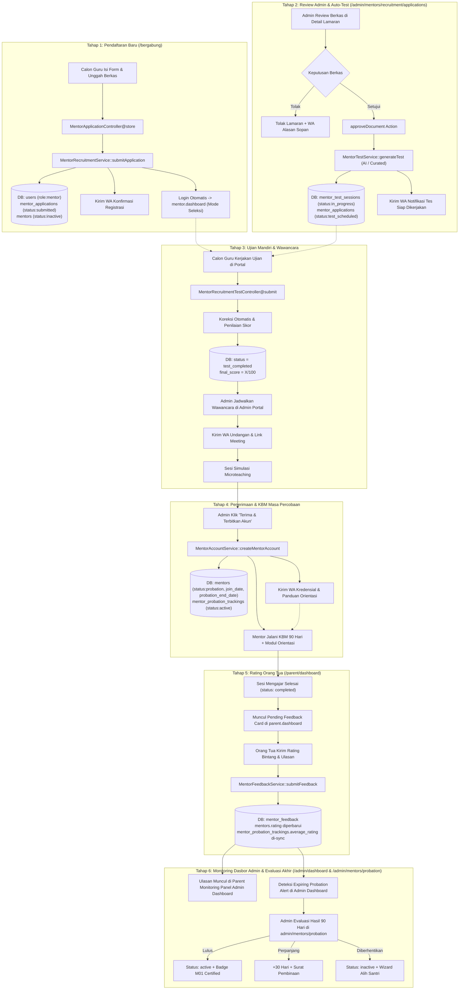

# Product Requirements Document (PRD): Revitalisasi Pipeline Rekrutmen Guru, Sistem Pemantauan Masa Percobaan (Probation), Fitur Rating Sesi Orang Tua, & Sinkronisasi Admin Executive Dashboard AL-HIKMAH LMS

---

## 1. Executive Summary

### 1.1 Problem Statement
Alur pendaftaran calon guru baru di AL-HIKMAH LMS (`/bergabung`) terputus dan membingungkan pelamar: pelamar langsung diarahkan ke dasbor namun terhambat di status peninjauan berkas tanpa kepastian sesi ujian otomatis, notifikasi WhatsApp kredensial tidak terkirim, serta tidak adanya visualisasi pipeline berbasis tahapan bagi admin (`/admin/mentors/recruitment/applications`). Modul pemantauan masa percobaan (`/admin/mentors/probation`) belum sempurna karena masih mengandalkan input nilai manual statis yang terisolasi dari log riil LMS, ketiadaan hub orientasi di dasbor mentor, dan tidak adanya alur serah-terima santri saat terminasi. Selain itu, ketiadaan integrasi pemicu rating di dasbor orang tua (`/parent/dashboard`) menyebabkan data kepuasan wali santri tidak pernah masuk ke sistem. Di sisi dasbor utama admin (`/admin/dashboard`), panel monitoring orang tua belum menampilkan tab ulasan guru dan belum ada sistem peringatan dini untuk guru probation yang masa tenggat 90 harinya segera habis.

### 1.2 Proposed Solution
Membangun ekosistem terpadu *Recruitment, Live Probation, Parent Feedback, & Admin Executive Control Closed-Loop* yang mencakup:
1. **Penyempurnaan Alur Pendaftaran & Seleksi**: Transisi otomatis satu-langkah dari verifikasi berkas ke penjadwalan ujian kompetensi AI, pengiriman notifikasi WhatsApp interaktif di setiap militer tahapan, serta penyediaan filter tab pipeline berbasis status di portal admin.
2. **Revitalisasi Modul Masa Percobaan (Probation Hub)**: Integrasi kalkulasi metrik riil LMS (kehadiran mengajar aktual, rating akumulatif wali santri, dan deteksi otomatis sesi perdana), modul orientasi interaktif 4 pilar di dasbor mentor probation, serta tata kelola keputusan akhir (pengangkatan ber-badge M01, perpanjangan ber-rekomendasi, atau terminasi dengan re-alokasi santri aman).
3. **Penyediaan Fitur Rating & Ulasan di Dasbor Orang Tua**: Mengaktifkan widget sesi selesai yang butuh diulas (*Pending Review Banner*) di dasbor orang tua (`parent.dashboard`), tombol rating interaktif pada riwayat jadwal bimbingan (`parent.schedules.show`), serta sinkronisasi otomatis nilai bintang wali ke metrik performa masa percobaan mentor.
4. **Sinkronisasi Dasbor Utama Admin (`/admin/dashboard`)**: Melengkapi *Parent Monitoring Panel* dengan Tab ke-4 untuk memantau rating & ulasan wali santri secara langsung, serta menambahkan indikator *Expiring Probation Alert* (peringatan masa uji coba <= 14 hari) pada ringkasan eksekutif SDM.

### 1.3 Success Criteria & KPIs
- **Waktu Siklus Rekrutmen (Time-to-Hire)**: Berkurang sebesar **50%** (dari rata-rata 14 hari kerja menjadi maksimal 7 hari kerja sejak pelamar mengirimkan formulir hingga keputusan probation).
- **Tingkat Transisi Otomatis (Automation Rate)**: **100%** pelamar yang berkasnya disetujui otomatis mendapatkan sesi tes kompetensi dan kredensial akses tanpa intervensi manual ganda dari admin.
- **Akurasi Metrik Kinerja Probation**: **100%** data kehadiran dan kepuasan wali santri di halaman probation disinkronkan secara real-time dari tabel `sessions`, `mentor_feedback`, dan `session_confirmations`.
- **Partisipasi Ulasan Wali Santri (Parent Feedback Rate)**: Mencapai **>= 75%** dari total sesi belajar yang telah berstatus selesai mendapatkan rating dan ulasan dari orang tua dalam kurun 48 jam pasca-sesi.
- **Transparansi Dasbor Eksekutif Admin**: **100%** ulasan wali santri dan status masa percobaan yang mendekati tenggat waktu termonitor langsung dari halaman utama `/admin/dashboard`.
- **Tingkat Penyelesaian Orientasi Mentor (Onboarding Completion Rate)**: Mencapai **>= 92%** mentor probation menuntaskan 4 modul orientasi mandiri sebelum hari ke-30 masa kerja.
- **Reliabilitas Pengiriman Notifikasi WhatsApp**: Mencapai tingkat keberhasilan pengiriman status dan kredensial **>= 98%** melalui integrasi fail-safe queue.

---

## 2. User Experience & Functionality

### 2.1 User Personas
1. **Ustadz / Ustadzah Pelamar (Calon Guru)**: Penghafal Al-Qur'an dan praktisi tajwid yang mendaftar secara online melalui halaman publik `/bergabung`, membutuhkan kejelasan tahapan seleksi, akses tes yang instan, serta arahan jadwal wawancara yang transparan.
2. **Admin HR & Seleksi Akademik**: Pengelola lembaga yang bertanggung jawab memverifikasi keabsahan sanad/syahadah, mereview hasil tes AI, menjadwalkan microteaching, dan mengesahkan pengangkatan mentor baru.
3. **Mentor Masa Percobaan (Probationary Mentor)**: Guru baru yang menjalani masa uji coba 90 hari, memerlukan visibilitas checklist orientasi kurikulum, jadwal bimbingan pertama, serta dasbor pemantauan performa harian.
4. **Orang Tua / Wali Santri**: Pengguna portal orang tua (`parent.dashboard`) yang mendampingi ananda belajar Al-Qur'an dan berhak memberikan feedback, rating bintang 1-5, serta catatan apresiasi/masukan langsung pasca-sesi bimbingan.
5. **Kepala Lembaga / Superadmin**: Pengambil keputusan final yang memerlukan visibilitas ringkasan eksekutif harian di `/admin/dashboard` terkait laju rekrutmen, ulasan kepuasan wali, dan peringatan dini masa probation guru.

---

### 2.2 User Stories & Acceptance Criteria

#### Epik 1: Perbaikan Alur Pendaftaran Baru & ATS Admin (`/admin/mentors/recruitment/applications`)

##### User Story 1.1: Pendaftaran Mandiri & Auto-Provisioning Calon Guru
> *Sebagai Calon Guru, saya ingin mengisi data pendaftaran dan mengunggah berkas CV/syahadah di `/bergabung` dengan validasi yang jelas, sehingga akun seleksi saya langsung aktif dan saya memahami tahapan berikutnya.*

**Acceptance Criteria:**
- Formulir pendaftaran memvalidasi format berkas CV (PDF max 2MB) dan Sertifikat/Syahadah (PDF/JPG/PNG max 2MB) dengan pesan kesalahan inline dalam Bahasa Indonesia.
- Sistem secara atomik (`DB::transaction`) membuat entri `users` (role `mentor`), `mentor_applications` (status: `submitted`, stage: 1), dan profil `mentors` (status: `inactive`, `is_active: false`).
- Nomor registrasi unik di-generate otomatis dengan format `APP-YYYYMM-XXXX`.
- Pelamar menerima pesan WhatsApp konfirmasi registrasi selamat datang yang memuat nomor registrasi dan instruksi pemantauan.
- Pelamar diarahkan ke `mentor.dashboard` mode seleksi dengan banner panduan *"Berkas Anda sedang diverifikasi oleh Tim Panitia Rekrutmen (Estimasi: 1x24 jam)"*.

##### User Story 1.2: Verifikasi Berkas Satu Langkah (Single-Action Verification & Auto-Test Generation)
> *Sebagai Admin Rekrutmen, saya ingin menyetujui berkas pelamar dalam satu klik dan sistem langsung men-generate paket tes kompetensi AI, sehingga pelamar tidak tertahan dalam ketidakpastian.*

**Acceptance Criteria:**
- Pada halaman detail lamaran (`admin.recruitment.applications.show`), tombol **"Setujui Berkas & Jadwalkan Tes"** mengeksekusi transisi status dari `submitted` langsung ke `test_scheduled` (Stage 3).
- Layanan backend otomatis memanggil `MentorTestService::generateTest()` untuk memproduksi paket 15 soal kompetensi (Tajwid, Makharijul Huruf, dan Pedagogi Al-Qur'an) dari bank soal atau Gemini AI.
- Sistem mengirimkan notifikasi WhatsApp ke pelamar: *"Alhamdulillah berkas Anda terverifikasi. Sesi tes kompetensi telah siap di dasbor Anda. Silakan selesaikan dalam waktu 2x24 jam."*
- Waktu respons aksi persetujuan berkas dan pembuatan soal tidak melebihi **1.500 ms**.

##### User Story 1.3: Visual Pipeline & Smart Filtering pada Daftar Lamaran
> *Sebagai Admin Rekrutmen, saya ingin melihat daftar pelamar dengan tab filter tahapan seleksi dan indikator aksi yang jelas, agar saya dapat memprioritaskan kandidat yang membutuhkan tindak lanjut.*

**Acceptance Criteria:**
- Halaman `admin/mentors/recruitment/applications` menyediakan filter tab cepat:
  1. *Semua Lamaran* (Counter total)
  2. *Perlu Verifikasi* (`submitted`)
  3. *Sedang Ujian* (`test_scheduled`)
  4. *Evaluasi Hasil Tes* (`test_completed`)
  5. *Jadwal Wawancara* (`interview_scheduled`)
  6. *Lulus / Probation* (`approved`)
  7. *Tidak Lolos* (`rejected`)
- Tabel mengadopsi styling DataTables resmi Al-Hikmah (`tableMentorApplications`) dengan fitur pencarian real-time, pagination 10/25/50 baris, dan ekspor CSV.
- Kolom "Tahap" menampilkan badge progress bar interaktif (contoh: `Tahap 3/5: Tes Kompetensi`).
- Kolom "Aksi" menampilkan tombol kontekstual dinamis:
  - Jika status `submitted`: Tombol hijau *"Verifikasi Berkas"*.
  - Jika status `test_completed`: Tombol kuning *"Jadwalkan Wawancara"*.
  - Jika status `interview_scheduled`: Tombol biru *"Putuskan Penerimaan"*.

##### User Story 1.4: Otomatisasi Undangan Wawancara & Notifikasi Kredensial
> *Sebagai Admin Rekrutmen, saya ingin menginput instruksi wawancara dan menerima pelamar menjadi mentor dengan pengiriman notifikasi WhatsApp otomatis, sehingga koordinasi berjalan instan.*

**Acceptance Criteria:**
- Modal "Jadwalkan Wawancara" menyimpan tanggal, waktu, media (Zoom / Google Meet / Offline), dan tautan meeting ke dalam database.
- Sistem mengeksekusi `WhatsAppService::sendMessage()` untuk mengirim pesan resmi berisi jadwal dan link ruang virtual ke nomor WhatsApp kandidat.
- Ketika tombol "Terima & Terbitkan Akun Mentor" diklik:
  1. Status aplikasi beralih ke `approved`.
  2. Status profil mentor diperbarui menjadi `probation` dengan `probation_end_date = today() + 90 hari`.
  3. Record `mentor_probation_trackings` diinisialisasi otomatis.
  4. Sistem memanggil `sendCredentialsNotification()` yang menyiarkan pesan selamat datang, status masa percobaan 90 hari, dan link panduan orientasi via WhatsApp.
  5. Antarmuka admin menampilkan tombol pintasan langsung: **"Buka Monitoring Probation Mentor Ini ->"** mengarah ke `admin/mentors/probation/{id}`.

---

#### Epik 2: Revitalisasi Fitur Pemantauan Masa Percobaan (`/admin/mentors/probation`)

##### User Story 2.1: Sinkronisasi Metrik Kinerja Aktual Otomatis (Live LMS Metrics)
> *Sebagai Admin Akademik & HR, saya ingin melihat metrik masa percobaan yang terhitung otomatis dari kegiatan mengajar riil di LMS, bukan dari input manual, agar evaluasi objektif dan berbasis data.*

**Acceptance Criteria:**
- Halaman `admin.mentors.probation.show` memiliki tombol **"Sinkronkan Data Aktual LMS"** serta kalkulasi otomatis saat halaman dibuka:
  - `total_sessions_conducted`: Dihitung dari `sessions` mentor yang berstatus selesai (`is_completed = true` atau `attendance = hadir`).
  - `attendance_rate`: Dihitung dari formula:  
    $$\text{Tingkat Kehadiran} = \left(\frac{\text{Sesi Hadir}}{\text{Total Jadwal Sesi yang Telah Lewat}}\right) \times 100\%$$
  - `average_rating`: Dihitung dari rata-rata nilai bintang dari tabel `mentor_feedback` yang dikirimkan orang tua.
  - `active_students_assigned`: Dihitung dari santri aktif yang terikat dalam kelas bimbingan mentor tersebut.
- Jika mentor telah berhasil melaksanakan sesi mengajar perdananya, checkbox `first_session_conducted` otomatis bernilai `true` (`checked`) dengan timestamp sesi pertama.
- Admin tetap memiliki hak opsi override manual (disertai pencatatan alasan di audit log) jika terdapat kondisi luar biasa.

##### User Story 2.2: Dasbor Hub Orientasi & Checklist di Sisi Mentor (`mentor.dashboard`)
> *Sebagai Mentor Masa Percobaan, saya ingin melihat kartu status probation dan panduan modul orientasi di dasbor saya, agar saya mengetahui target serta progres menuju pengangkatan guru tetap.*

**Acceptance Criteria:**
- Jika mentor memiliki `status == 'probation'`, bagian atas `mentor.dashboard` menampilkan **"Probation Progress Tracker Widget"**:
  - Countdown sisa hari masa percobaan (contoh: *58 Hari Tersisa dari 90 Hari*).
  - Status 4 Modul Orientasi Wajib:
    1. *Modul 1: Orientasi Lembaga & SOP Pengajaran Al-Hikmah*
    2. *Modul 2: Standar Mutaba'ah & Penilaian Tajwid Terpadu*
    3. *Modul 3: Simulasi Praktik Sesi Perdana di LMS*
    4. *Modul 4: Komunikasi Efektif & Pelaporan ke Wali Santri*
  - Progress bar pencapaian target kehadiran (Target: >= 90%) dan target rating wali (Target: >= 4.50).
  - Tautan tombol untuk mengakses panduan materi orientasi.

##### User Story 2.3: Keputusan Akhir Probation & Tata Kelola Status Santri
> *Sebagai Admin HR, saya ingin memproses keputusan akhir (Lulus / Perpanjang / Diberhentikan) dengan alur kerja yang aman, termasuk pemberian badge penghargaan atau pengalihan santri bimbingan.*

**Acceptance Criteria:**
- Modal keputusan akhir menyediakan 3 opsi dengan implikasi sistem yang jelas:
  1. **Lulus Menjadi Guru Tetap (`passed`)**:
     - Status mentor berubah menjadi `active`.
     - Sistem otomatis menyematkan Badge Kehormatan `M01 - Mentor Certified` ke dalam riwayat `mentor_trainings`.
     - Mengirimkan sertifikat kelulusan digital via notifikasi WhatsApp & dasbor.
  2. **Perpanjang Masa Percobaan (`extended`)**:
     - Sistem menambahkan masa tenggang 30 hari ke `probation_end_date`.
     - Admin wajib mengisi form catatan poin evaluasi perbaikan (*mid_review_notes*).
     - Mengirimkan surat peringatan pembinaan resmi via WhatsApp.
  3. **Diberhentikan / Tidak Diangkat (`terminated`)**:
     - Status mentor berubah menjadi `inactive`.
     - Sistem memvalidasi apakah mentor memiliki santri aktif bimbingan: jika ada, sistem menampilkan modal **"Alihkan Santri (Hand-over Wizard)"** untuk memilih mentor pengganti bagi santri tersebut agar KBM tidak terputus.
     - Mengirimkan surat apresiasi pengabdian dengan bahasa yang santun via WhatsApp.

---

#### Epik 3: Fitur Rating & Ulasan Sesi Mengajar oleh Orang Tua (Parent Rating & Feedback System)

##### User Story 3.1: Widget Notifikasi Sesi Selesai Butuh Ulasan di Dasbor Orang Tua (`parent.dashboard`)
> *Sebagai Orang Tua / Wali Santri, saya ingin melihat pemberitahuan interaktif di dasbor saya saat ananda selesai belajar bersama guru pembimbing, sehingga saya dapat langsung memberikan rating bintang dan apresiasi dalam 1 klik.*

**Acceptance Criteria:**
- Pada `ParentDashboardController::index()`, sistem mengkueri daftar sesi belajar ananda yang telah berstatus `completed` (atau telah lewat jadwal) namun belum pernah diulas oleh orang tua (`whereDoesntHave('feedback')`), dibatasi maksimal 3 sesi terbaru.
- Di bagian atas `parent/dashboard.blade.php`, jika terdapat sesi yang belum diulas, ditampilkan **"Widget Menunggu Ulasan (Pending Session Feedback Card)"**:
  - Menampilkan nama santri, tanggal/jam sesi, dan nama guru pembimbing.
  - Tombol CTA menonjol: **"⭐ Berikan Ulasan & Rating Sekarang"** yang langsung memanggil fungsi JavaScript `openFeedbackModal(sessionId, mentorId, mentorName)`.
  - Desain widget ramah keluarga dengan aksen warna hangat (`bg-warning-subtle text-dark border-warning`).
- Jika tidak ada sesi yang tertunda ulasannya, widget tidak ditampilkan (bersih dan rapi).

##### User Story 3.2: Tombol Beri Rating pada Riwayat Sesi & Jadwal Belajar (`parent.schedules.show` & `index`)
> *Sebagai Orang Tua, saya ingin dapat memberikan rating melalui halaman detail jadwal belajar ananda kapan saja, sehingga saya tidak melewatkan kesempatan menilai guru.*

**Acceptance Criteria:**
- Pada halaman detail sesi (`parent.schedules.show`) dan tabel riwayat jadwal (`parent.schedules.index` / `list`):
  - Jika sesi telah selesai dan **belum dinilai**: Ditampilkan tombol **"⭐ Beri Ulasan Guru"** yang membuka modal rating `parentFeedbackModal`.
  - Jika sesi **sudah dinilai**: Ditampilkan lencana bintang permanen, contoh: `⭐ 5.0 (Sudah Dinilai)` beserta kutipan ringkas komentar yang telah dikirimkan.
- Modal `resources/views/parent/partials/feedback-modal.blade.php` berfungsi mulus:
  - Pemilihan 1 - 5 bintang interaktif dengan label penjelasan (1 = Perlu Perbaikan, 5 = Sangat Memuaskan).
  - Multi-kategori opsional: Kualitas Materi, Kesabaran, Ketepatan Waktu.
  - Quick-tags instan (`#SangatSabar`, `#TepatWaktu`, `#PenyampaianJelas`, `#SantriSemangat`, dll).
  - Opsi toggle *"Kirim ulasan sebagai Anonim"* bagi wali santri yang menginginkan kerahasiaan identitas.

##### User Story 3.3: Sinkronisasi Otomatis Rating Wali ke Profil Mentor & Dasbor Probation
> *Sebagai Sistem LMS, saya ingin setiap kali orang tua mengirimkan rating, nilai rata-rata mentor di profil dan masa percobaannya ter-update seketika, agar admin dan mentor selalu melihat data riil.*

**Acceptance Criteria:**
- Ketika form dikirimkan ke route `parent.feedbacks.store`:
  1. Data tersimpan di tabel `mentor_feedback` dan rincian multi-kategori di `mentor_feedback_ratings`.
  2. Rata-rata bintang seluruh ulasan mentor tersebut dihitung ulang dan disimpan ke field `mentors.rating`.
  3. Jika mentor tersebut sedang dalam masa percobaan (`mentors.status == 'probation'`), sistem otomatis mengupdate field `average_rating` pada record `mentor_probation_trackings` yang aktif.
  4. Cache sesi pending review dibersihkan (`Cache::forget("parent_feedback_pending_{$studentId}")`).
  5. Menampilkan alert toast sukses yang santun: *"Jazakumullah khairan! Ulasan dan apresiasi Ayah/Bunda sangat berarti bagi peningkatan kualitas pembimbing kami."*

---

#### Epik 4: Sinkronisasi Dasbor Utama Admin (`/admin/dashboard`)

##### User Story 4.1: Tab 'Rating & Ulasan Guru' pada Parent Monitoring Panel
> *Sebagai Administrator / Kepala Lembaga, saya ingin memantau rating bintang dan komentar yang dikirimkan orang tua secara real-time di Dasbor Utama Admin, agar mutu pengajaran terpantau tanpa harus membuka laporan terpisah.*

**Acceptance Criteria:**
- Pada widget *Parent Monitoring Panel* di [admin/dashboard.blade.php](file:///c:/xampp/htdocs/al-hikmah-lms/resources/views/admin/dashboard.blade.php), ditambahkan tab ke-4: **"⭐ Rating & Ulasan Guru"** di samping tab Konfirmasi, SPP, dan Pesan.
- Tab menampilkan tabel 5 ulasan terbaru:
  - Kolom: *Wali Santri* (menampilkan nama atau *"Wali Santri (Anonim)"*), *Santri Binaan*, *Guru Pembimbing*, *Rating Bintang* (`⭐⭐⭐⭐⭐ 5.0`), *Kutipan Catatan / Quick Tags*, dan *Waktu Respon*.
- Data diambil melalui kueri eager-loaded `$recentFeedbacks` di `Admin\DashboardController::index()`.

##### User Story 4.2: Peringatan Masa Percobaan Mendekati Tenggat (Expiring Probation Alerts)
> *Sebagai Admin HR, saya ingin melihat indikator peringatan jika terdapat guru probation yang masa 90 harinya mendekati habis (<= 14 hari), agar jadwal evaluasi kelulusan tidak terlewat.*

**Acceptance Criteria:**
- Controller menghitung jumlah mentor probation aktif yang memiliki `end_date <= today()->addDays(14)` (`$expiringProbationsCount`).
- Pada tombol pintasan *"Masa Probation"* di widget Rekrutmen Guru pada Dasbor Admin, jika `$expiringProbationsCount > 0`, ditampilkan badge merah menyala: `X Perlu Evaluasi`.
- Mengarahkan admin langsung ke `/admin/mentors/probation` dengan sorotan baris yang berstatus tenggat dekat.

##### User Story 4.3: Deteksi Rating Kritis pada Operational Alerts Center
> *Sebagai Superadmin, saya ingin mendapatkan notifikasi otomatis di Operational Alerts Banner jika ada guru yang memperoleh rating rendah (<= 3.00), sehingga supervisi akademik dapat langsung bertindak.*

**Acceptance Criteria:**
- Layanan `AlertService::getAllAlerts()` mendeteksi ulasan wali santri dengan nilai `overall_rating <= 3` dalam 7 hari terakhir.
- Menampilkan peringatan warna kuning/oranye di bagian atas dasbor admin: *"⚠️ Perhatian: Ustadz [Nama] memperoleh rating [X.X] dari wali santri. Diperlukan peninjauan bimbingan."*

---

### 2.3 Non-Goals (Batasan Ruang Lingkup)
- **Bukan Payroll Engine Otomatis**: PRD ini tidak mencakup modul penggajian otomatis berbasis jam mengajar probation (akan dikembangkan pada sprint finansial berikutnya).
- **Bukan Video Call In-House**: Sesi wawancara dan microteaching menggunakan tautan eksternal (Zoom / Google Meet), bukan WebRTC kustom di dalam server LMS.
- **Bukan Sistem Koreksi Suara AI Mandiri (Audio Tajwid Recognizer)**: PRD ini memfokuskan evaluasi AI pada bank soal teks tajwid, makharijul huruf, dan rubrik studi kasus pedagogi.

---

## 3. AI System Requirements

### 3.1 Tool Requirements & Model Specifications
- **Model Engine**: Gemini 1.5 Flash / Gemini 2.0 Flash via API Service (`GeminiQuestionService`).
- **Prompt Architecture**:
  - *Context*: Lembaga Tahsin & Tahfidz Al-Qur'an Standar Hafsh 'an 'Ashim metode Jazariyyah.
  - *Output Format*: JSON terstruktur ketat (Strict Schema) yang memuat array pertanyaan: `question_text`, `options` (A, B, C, D), `correct_answer`, `category_code` (`tajwid_test`, `makharijul_huruf`, `tahsin`), dan `explanation`.
- **Fallback Engine**: Bank soal terkurasi internal (`MentorTestService::getCuratedQuestionBank`) yang aktif otomatis jika API eksternal mengalami timeout atau limitasi kuota.

### 3.2 Evaluation Strategy & Benchmark Targets
- **Kesesuaian Format JSON**: **100%** respons AI harus lolos validasi skema JSON parser tanpa fatal error; jika gagal, fallback lokal aktif seketika dalam waktu **< 200 ms**.
- **Tingkat Diskriminasi Soal**: Soal mencakup 40% tingkat kesulitan dasar, 40% tingkat menengah, dan 20% studi kasus pedagogi penanganan santri lambat membaca.
- **Kecepatan Inferensi**: Paket 15 soal harus selesai di-generate dan tersimpan di database dalam durasi **<= 4.0 detik**.

---

## 4. Technical Specifications (Panduan Khusus Junior Programmer)

### 4.1 Architecture Overview & Data Flow
Diagram alur berikut mengilustrasikan siklus lengkap dari pendaftaran pelamar, feedback orang tua, pemantauan dasbor admin, hingga evaluasi akhir masa percobaan:



---

### 4.2 File Target & Petunjuk Implementasi Langkah demi Langkah (Step-by-Step Implementation Guide)

Berikut adalah daftar file yang harus diubah atau disempurnakan oleh programmer beserta panduan kodenya:

#### File 1: `app/Http/Controllers/Parent/ParentDashboardController.php`
- **Lokasi**: [ParentDashboardController.php](file:///c:/xampp/htdocs/al-hikmah-lms/app/Http/Controllers/Parent/ParentDashboardController.php)
- **Tugas**: Ambil sesi belajar anak yang telah selesai tapi belum diberi rating oleh orang tua.
- **Implementasi**:
  ```php
  // Tambahkan kueri pending feedback sessions
  $pendingFeedbackSessions = ($hasPaidProgram && count($childIds) > 0)
      ? Session::with(['student.user', 'mentor.user'])
          ->whereIn('student_id', $childIds)
          ->where('status', 'completed')
          ->whereDoesntHave('feedback')
          ->latest('date')
          ->take(3)
          ->get()
      : collect();

  // Kirimkan ke view:
  return view('parent.dashboard', compact(
      // ... variabel lainnya ...
      'pendingFeedbackSessions'
  ));
  ```

#### File 2: `resources/views/parent/dashboard.blade.php`
- **Lokasi**: [dashboard.blade.php](file:///c:/xampp/htdocs/al-hikmah-lms/resources/views/parent/dashboard.blade.php)
- **Tugas**: Tambahkan Banner Widget "Menunggu Ulasan" di atas row statistik.
- **Implementasi**:
  ```blade
  @if(isset($pendingFeedbackSessions) && $pendingFeedbackSessions->isNotEmpty())
      <div class="card border-0 shadow-sm rounded-4 mb-4 overflow-hidden border-start border-4 border-warning bg-white">
          <div class="card-body p-4">
              <div class="d-flex align-items-center justify-content-between flex-wrap gap-3">
                  <div class="d-flex align-items-center gap-3">
                      <div class="rounded-circle bg-warning-subtle text-warning p-3 fs-3 d-flex align-items-center justify-content-center" style="width: 52px; height: 52px;">
                          <i class="bi bi-star-fill"></i>
                      </div>
                      <div>
                          <h5 class="fw-bold text-dark mb-1">⭐ Sesi Bimbingan Menunggu Ulasan Ayah / Bunda</h5>
                          <p class="text-muted small mb-0">
                              Ananda telah menyelesaikan sesi belajar terbaru. Mohon kesediaan waktu 30 detik untuk memberikan penilaian bagi Guru Pembimbing:
                          </p>
                      </div>
                  </div>
              </div>
              <div class="row g-3 mt-2">
                  @foreach($pendingFeedbackSessions as $pSession)
                      <div class="col-md-6 col-lg-4">
                          <div class="p-3 rounded-3 border bg-light d-flex justify-content-between align-items-center">
                              <div>
                                  <div class="fw-bold text-dark">{{ $pSession->student?->user?->name ?? 'Ananda' }}</div>
                                  <small class="text-muted d-block">Guru: {{ $pSession->mentor?->getDisplayName() ?? 'Ustaz' }}</small>
                                  <small class="text-secondary">{{ $pSession->date ? \Carbon\Carbon::parse($pSession->date)->locale('id')->isoFormat('D MMM Y') : '' }}</small>
                              </div>
                              <button type="button" class="btn btn-warning btn-sm rounded-pill px-3 fw-bold text-dark shadow-xs"
                                  onclick="openFeedbackModal('{{ $pSession->id }}', '{{ $pSession->mentor_id }}', '{{ addslashes($pSession->mentor?->getDisplayName() ?? 'Ustaz') }}')">
                                  ⭐ Beri Nilai
                              </button>
                          </div>
                      </div>
                  @endforeach
              </div>
          </div>
      </div>
  @endif
  ```

#### File 3: `resources/views/parent/schedules/show.blade.php`
- **Lokasi**: [show.blade.php](file:///c:/xampp/htdocs/al-hikmah-lms/resources/views/parent/schedules/show.blade.php)
- **Tugas**: Tambahkan kartu ulasan di sisi kanan bawah detail sesi.
- **Implementasi**:
  ```blade
  @if($session->status === 'completed')
      <div class="card border-0 shadow-sm rounded-4 bg-white p-4 mt-4">
          <h5 class="fw-bold text-dark border-bottom pb-3 mb-3"><i class="bi bi-star-half text-warning me-2"></i>Ulasan Sesi Ini</h5>
          @if($session->feedback)
              <div class="alert alert-success-subtle border-success-subtle rounded-3">
                  <div class="d-flex align-items-center gap-2 mb-2">
                      <span class="fs-4 text-warning">
                          @for($i = 1; $i <= 5; $i++)
                              <i class="bi bi-star{{ $i <= $session->feedback->overall_rating ? '-fill' : '' }}"></i>
                          @endfor
                      </span>
                      <strong class="text-success fs-5">{{ number_format($session->feedback->overall_rating, 1) }} / 5.0</strong>
                  </div>
                  @if($session->feedback->comment)
                      <p class="mb-0 text-dark small fst-italic">"{{ $session->feedback->comment }}"</p>
                  @endif
              </div>
          @else
              <p class="text-muted small">Sesi ini telah selesai dilaksanakan. Silakan sampaikan masukan dan apresiasi untuk guru pembimbing.</p>
              <button type="button" class="btn btn-warning rounded-pill px-4 fw-bold shadow-sm"
                  onclick="openFeedbackModal('{{ $session->id }}', '{{ $session->mentor_id }}', '{{ addslashes($session->mentor?->getDisplayName() ?? 'Ustaz') }}')">
                  ⭐ Berikan Rating & Ulasan Sekarang
              </button>
          @endif
      </div>
  @endif
  ```

#### File 4: `app/Services/MentorFeedbackService.php`
- **Lokasi**: [MentorFeedbackService.php](file:///c:/xampp/htdocs/al-hikmah-lms/app/Services/MentorFeedbackService.php)
- **Tugas**: Pastikan saat orang tua mengirimkan rating, tabel `mentor_probation_trackings` untuk mentor tersebut ikut ter-update otomatis.
- **Implementasi**:
  ```php
  // Di dalam method submitFeedback() setelah update rating mentor:
  $probation = \App\Models\MentorProbationTracking::where('mentor_id', $mentor->id)
      ->where('status', 'active')
      ->first();

  if ($probation) {
      $probation->update([
          'average_rating' => round((float) ($avg ?? 5.0), 2),
      ]);
  }
  ```

#### File 5: `app/Http/Controllers/Admin/AdminRecruitmentController.php` & `resources/views/admin/recruitment/applications/`
- **Tugas**:
  1. Ubah tombol *"Setujui Berkas"* agar langsung memicu pembuatan sesi ujian (`MentorTestService::generateTest`) dan mengubah status menjadi `test_scheduled`.
  2. Implementasikan integrasi panggilan `WhatsAppService` saat membuat jadwal wawancara di `scheduleInterview()` dan saat `acceptApplication()`.
  3. Tambahkan tab filter status di atas tabel `admin/recruitment/applications/index.blade.php`.
  4. Tambahkan tombol *"Ke Halaman Probation Mentor Ini ->"* di `admin/recruitment/applications/show.blade.php` ketika pelamar telah berstatus `approved`.

#### File 6: `app/Http/Controllers/Admin/AdminProbationController.php` & `MentorProbationService.php`
- **Tugas**:
  1. Tambahkan method `syncLiveMetrics($id)` yang menghitung otomatis:
     - Presensi kehadiran dari `sessions` selesai vs jadwal.
     - Rata-rata rating dari `mentor_feedback`.
     - Jumlah santri aktif dari `mentor_student`.
     - Otomatis centang `first_session_conducted = true` jika terdapat minimal 1 sesi berstatus `completed`.
  2. Tambahkan tombol **"🔄 Sinkronkan Data Aktual LMS"** di `admin/recruitment/probations/show.blade.php`.
  3. Sediakan widget countdown probation dan 4 checklist modul orientasi di `resources/views/mentor/dashboard.blade.php`.

#### File 7: `app/Http/Controllers/Admin/DashboardController.php` & `resources/views/admin/dashboard.blade.php`
- **Tugas**:
  1. Di `DashboardController::index()`, ambil data ulasan wali santri terbaru dan hitung probation yang mendekati tenggat:
     ```php
     $recentFeedbacks = \App\Models\MentorFeedback::with(['mentor.user', 'student.user', 'parent'])
         ->latest()
         ->take(5)
         ->get();

     $expiringProbationsCount = \App\Models\MentorProbationTracking::where('status', 'active')
         ->where('end_date', '<=', today()->addDays(14))
         ->count();
     ```
  2. Di `resources/views/admin/dashboard.blade.php`, tambahkan Tab ke-4 pada `Parent Monitoring Panel`:
     ```blade
     <li class="nav-item" role="presentation">
         <button class="nav-link rounded-pill px-3" id="feedbacks-tab" data-bs-toggle="tab" data-bs-target="#feedbacks-pane" type="button" role="tab">
             <i class="bi bi-star-fill text-warning me-1"></i> Rating & Ulasan Guru
         </button>
     </li>
     ```
  3. Tambahkan badge peringatan `$expiringProbationsCount` pada tombol pintasan *"Masa Probation"* di widget rekrutmen guru.

---

### 4.3 Database Schema Refinements & Integration Points

#### Perubahan / Penambahan Kolom Database:
1. **Tabel `mentor_applications`**:
   - `interview_scheduled_at` (`timestamp`, nullable): Waktu pelaksanaan wawancara.
   - `interview_meeting_link` (`string`, 255, nullable): Tautan platform pertemuan (Zoom/GMeet).
   - `interview_type` (`enum: online, offline`, default: `online`).
   - `interview_notes` (`text`, nullable): Catatan kualitatif penguji saat microteaching.

2. **Tabel `mentor_probation_trackings`**:
   - `application_id` (`foreignId`, nullable, references `mentor_applications.id` on delete set null): Menghubungkan langsung masa percobaan dengan berkas lamaran dan silsilah sanad awal kandidat.
   - `last_synced_at` (`timestamp`, nullable): Catatan waktu kapan metrik LMS (kehadiran, rating, sesi) terakhir disinkronkan.
   - `orientation_modules_status` (`json`, nullable): Menyimpan status penyelesaian individual 4 modul orientasi (contoh: `{"mod1": true, "mod2": true, "mod3": false, "mod4": false}`).

3. **Indeks Performa Database**:
   - `mentor_applications`: Indeks gabungan `(status, current_stage)` dan `(created_at)`.
   - `mentor_probation_trackings`: Indeks gabungan `(mentor_id, status)` dan `(end_date, status)`.
   - `mentor_feedback`: Indeks `(mentor_id, created_at)` dan `(session_id)`.

---

### 4.4 Security, Privacy & Audit Trail
- **Penyimpanan Berkas Lamaran**: Berkas CV dan sertifikat disimpan pada disk privat (`storage/app/private/mentor_applications/...`), diakses hanya melalui route berotentikasi controller (`downloadDocument`) dengan otorisasi role `admin` atau pemilik lamaran itu sendiri.
- **Proteksi Data Pribadi (PII) & Feedback Anonim**: Ketika orang tua mencentang `is_anonymous = true`, nama dan identitas orang tua disamarkan menjadi *"Wali Santri"* di dasbor mentor maupun admin.
- **Financial & HR Audit Logging**: Setiap perubahan status (verifikasi berkas, pembuatan tes, penjadwalan wawancara, penerimaan akun, dan putusan evaluasi probation) wajib dicatat dalam tabel `financial_audit_logs` dengan merekam `user_id` eksekutor, status lama, dan status baru.

---

## 5. Risks & Phased Roadmap

### 5.1 Phased Implementation Roadmap

```
2026-Q3
  ├── Sprint 1: Integrasi Pipeline Rekrutmen Guru (Hari 1 - 2)
  │     ├── Refactor AdminRecruitmentController & MentorRecruitmentService (Persetujuan berkas langsung jadwalkan tes)
  │     ├── Implementasi Tab Filter Status & Smart Action Buttons di admin.recruitment.applications.index
  │     ├── Integrasi pemanggilan WhatsAppService pada jadwal wawancara & penerimaan akun
  │     └── Penyediaan tautan navigasi langsung dari lamaran ke lembar probation
  │
  ├── Sprint 2: Fitur Rating Orang Tua & Dasbor Utama Admin (Hari 3 - 4)
  │     ├── Implementasi Pending Feedback Card di parent.dashboard (ParentDashboardController)
  │     ├── Pemasangan tombol rating di parent.schedules.show & index
  │     ├── Integrasi Tab 4 (Rating & Ulasan) pada Parent Monitoring Panel di admin/dashboard.blade.php
  │     ├── Integrasi pembaruan otomatis mentor_probation_trackings saat orang tua mengirimkan rating
  │     └── Implementasi method syncLiveMetrics() & tombol "Sinkronkan Data Aktual" di admin probation
  │
  └── Sprint 3: Probation Hub Mentor, Pengujian & Peluncuran (Hari 5)
        ├── Desain widget "Probation Tracker" di dasbor mentor (countdown 90 hari & checklist modul orientasi)
        ├── Implementasi alur serah-terima santri (Hand-over Wizard) untuk keputusan terminasi
        ├── Pembuatan Feature Test Pest komprehensif untuk seluruh alur pendaftaran, rating wali, dan probation
        └── Formatting kode menggunakan Laravel Pint (`vendor/bin/pint --format agent`)
```

---

### 5.2 Technical Risks & Mitigation Strategies
1. **Risiko 1: Latensi API WhatsApp Gateway Saat Mengirimkan Notifikasi Massal**
   - *Mitigasi*: Seluruh pemanggilan `WhatsAppService::sendMessage()` dibungkus dalam blok `try-catch` dengan fallback *graceful error logging* sehingga kegagalan koneksi pihak ketiga tidak membatalkan transaksi basis data lokal (`DB::transaction`).
2. **Risiko 2: Beban Kueri Berat Saat Menghitung Rata-rata Rating & Presensi Mentor Terdata Banyak**
   - *Mitigasi*: Manfaatkan kolom cache agregat pada tabel `mentor_probation_trackings` yang diperbarui secara on-demand (saat admin menekan tombol "Sinkronkan" atau saat orang tua submit feedback) dan via *Scheduled Daily Task* tengah malam, alih-alih kueri berat di setiap pemuatan halaman biasa.
3. **Risiko 3: Spamming Rating oleh Akun Tertentu**
   - *Mitigasi*: Validasi ketat membatasi 1 sesi mengajar hanya dapat diulas maksimal 1 kali (`whereDoesntHave('feedback')` dan unique constraint pada `mentor_feedback.session_id`).

---

## 6. Verification & Quality Assurance Plan

### 6.1 Automated Feature Tests (Pest PHP)
- `tests/Feature/MentorRecruitment/RecruitmentPipelineTest.php`:
  - Menguji alur pendaftaran `/bergabung` -> status `submitted`.
  - Menguji `approveDocument` langsung memicu pembentukan `mentor_test_sessions` dan mengubah status ke `test_scheduled`.
  - Menguji `scheduleInterview` mengupdate jadwal dan memicu pesan WhatsApp.
  - Menguji `acceptApplication` membuat profil mentor probation dan inisialisasi probation tracking dengan durasi 3 bulan.
- `tests/Feature/Parent/ParentFeedbackFlowTest.php`:
  - Menguji bahwa `ParentDashboardController` mengembalikan sesi selesai yang belum diulas ke dalam view.
  - Menguji pengiriman form `parent.feedbacks.store` berhasil menyimpan ulasan, mengupdate `mentors.rating`, dan mengupdate `mentor_probation_trackings.average_rating`.
  - Menguji bahwa sesi yang sudah dinilai tidak lagi muncul di banner pending review.
- `tests/Feature/Admin/AdminDashboardIntegrationTest.php`:
  - Menguji bahwa `admin.dashboard` memuat tab ulasan wali santri dan counter expiring probation dengan benar.
- `tests/Feature/MentorRecruitment/ProbationLiveMetricsTest.php`:
  - Menguji fungsi kalkulasi otomatis rasio kehadiran dari log sesi riil.
  - Menguji fungsi penentuan otomatis `first_session_conducted = true` saat mentor menuntaskan sesi perdana.
  - Menguji evaluasi kelulusan: pemberian badge `M01` saat `passed`, dan penambahan hari saat `extended`.

### 6.2 Manual Verification Steps
1. **Verifikasi Rekrutmen**:
   - Buka browser pada URL `http://127.0.0.1:8000/bergabung`, lakukan pendaftaran dengan data dummy lengkap.
   - Masuk ke halaman admin `http://127.0.0.1:8000/admin/mentors/recruitment/applications`, periksa apakah pelamar muncul pada tab "Perlu Verifikasi".
   - Klik "Review", setujui berkas, dan pastikan sesi tes AI langsung ter-generate tanpa harus mengklik tombol tambahan.
2. **Verifikasi Rating Orang Tua**:
   - Login sebagai wali santri yang memiliki sesi bimbingan selesai (`completed`).
   - Buka `http://127.0.0.1:8000/parent/dashboard`, periksa apakah kartu *"Sesi Bimbingan Menunggu Ulasan"* muncul di bagian atas.
   - Klik *"⭐ Beri Nilai"*, pilih 5 bintang, tambahkan komentar *"Alhamdulillah ustaz sangat sabar"*, klik *"Kirim Ulasan"*.
   - Pastikan toast sukses muncul dan kartu sesi tersebut hilang dari daftar pending review.
   - Buka `http://127.0.0.1:8000/parent/schedules/{id}`, pastikan status sesi kini bertuliskan *"⭐ 5.0 (Sudah Dinilai)"*.
3. **Verifikasi Dasbor Utama Admin**:
   - Buka `http://127.0.0.1:8000/admin/dashboard`.
   - Periksa widget *Parent Monitoring Panel*: klik tab *"⭐ Rating & Ulasan Guru"*, pastikan ulasan yang baru saja dikirim oleh orang tua langsung muncul di tabel.
   - Periksa tombol *"Masa Probation"*, pastikan counter peringatan *Perlu Evaluasi* muncul jika ada mentor yang mendekati tenggat 90 hari.
4. **Verifikasi Live Metrics Probation**:
   - Buka `http://127.0.0.1:8000/admin/mentors/probation/{id}` untuk mentor yang baru dinilai.
   - Periksa apakah kolom *"Rating Rata-rata Wali Santri"* otomatis terupdate sesuai nilai bintang yang baru dikirimkan.
   - Klik *"🔄 Sinkronkan Data Aktual LMS"*, pastikan seluruh metrik kehadiran dan sesi sinkron tanpa eror.
