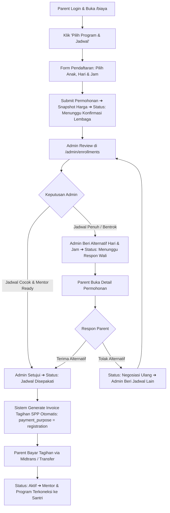
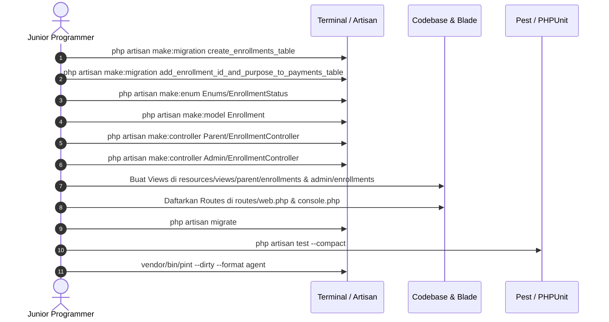

# 📋 PRODUCT REQUIREMENTS DOCUMENT (PRD) & TECHNICAL BLUEPRINT
## MODUL PENDAFTARAN PROGRAM FLEKSIBEL DENGAN NEGOSIASI JADWAL (FLEXIBLE ENROLLMENT WITH SCHEDULE NEGOTIATION)

> **Dokumen Resmi Arsitektur & Panduan Implementasi Junior Programmer**  
> **Modul:** Flexible Program Enrollment, Multi-Day Selection, Schedule Negotiation & Post-Deal Invoicing Pipeline  
> **Target Framework:** Laravel 12 | Bootstrap 5 | Blade | MySQL 8.0+ | PHP 8.2+  
> **Status:** 🚀 **Approved & Ready for Implementation (Production Hardened Edition v2.1)**  
> **Versi:** 2.1  
> **Tanggal:** 15 Agustus 2026  
> **File Lokasi:** `c:\xampp\htdocs\al-hikmah-lms\new.md`  

---

## 1. EXECUTIVE SUMMARY

### 1.1 Problem Statement (Akar Masalah)
Berdasarkan analisis alur pendaftaran pada [biaya.blade.php](file:///c:/xampp/htdocs/al-hikmah-lms/resources/views/biaya.blade.php) dan dokumen sistem [tentang.md](file:///c:/xampp/htdocs/al-hikmah-lms/tentang.md), ditemukan kesenjangan operasional (*operational gap*) pada alur penerimaan santri baru:

1. **Ketiadaan Preferensi Jadwal Belajar:** Wali santri hanya memilih nama program tanpa bisa mengajukan preferensi hari (Senin–Minggu) dan perkiraan jam belajar santri.
2. **Ketiadaan Kanal Negosiasi Jadwal:** Jika mentor pilihan penuh pada hari yang diminta, admin lembaga harus berkoordinasi manual melalui WhatsApp di luar sistem LMS yang rawan tercecer.
3. **Pembayaran Sebelum Jadwal Disepakati (*Premature Invoicing*):** Tagihan SPP terbit sebelum kepastian ketersediaan mentor dan kesepakatan jadwal belajar final.
4. **Fluktuasi Harga Program (*Price Dispute Risk*):** Belum ada penguncian harga program (*price snapshot*) saat pendaftaran diajukan jika sewaktu-waktu harga program diedit oleh manajemen.

### 1.2 Proposed Solution (Solusi Sistem)
Membangun **Modul Pendaftaran Program Fleksibel & Negosiasi Jadwal Terpadu**:
- Wali Santri (*Parent*) memilih santri binaan, memilih kombinasi hari belajar (multi-select), memilih perkiraan jam, catatan preferensi, dan sistem mengunci harga program saat itu (`program_price`).
- Administrator mereview antrean permohonan, memverifikasi ketersediaan & kuota mentor (`Mentor::hasQuotaOnDay()`), lalu dapat:
  - **Opsi A: Menyetujui Jadwal Langsung** ➔ Memilih mentor, menentukan tanggal mulai (`start_date`), dan menerbitkan tagihan invoice otomatis (`payments`).
  - **Opsi B: Memberikan Tawaran Jadwal Alternatif (*Counter-Offer*)** ➔ Mengajukan pilihan hari/jam/mentor alternatif ke portal Orang Tua dengan catatan penjelasan.
- Wali Santri dapat menerima (*Accept*) tawaran alternatif atau menolak (*Reject*) untuk dicarikan jadwal lain.
- **Tagihan Pembayaran SPP (`payments`) hanya diterbitkan setelah jadwal 100% disepakati (*Deal / Confirmed*)**.
- **Audit Trail & Auto-Expire:** Aktivitas negosiasi dicatat ke log mentor dan pendaftaran mengendap > 7 hari otomatis expired via scheduler Laravel 12.



### 1.3 Success Criteria & Measurable KPIs
| Indikator Keberhasilan | Target | Metode Pengukuran |
|---|---|---|
| **Akurasi Pilihan Hari & Jam** | 100% | Setiap permohonan menyimpan array hari (`requested_days`) dan waktu (`requested_time`). |
| **Proteksi Harga (Price Snapshot)** | 100% | Kolom `program_price` tersimpan permanen saat submit pendaftaran. |
| **Pipeline Negosiasi Dua Arah** | 100% | Status enrollment terupdate secara real-time antar portal Parent dan Admin. |
| **Integritas Post-Deal Invoicing** | 100% | Baris tabel `payments` hanya tercipta saat enrollment berstatus `schedule_confirmed`. |
| **Domain Synchronization** | 100% | Saat enrollment aktif, data otomatis terhubung ke `mentor_student` dan `student_program`. |
| **Zero Database Constraint Error** | 100% | Seluruh relasi model selaras dengan skema database live tanpa kolom fiktif. |

---

## 2. USER EXPERIENCE & FUNCTIONALITY

### 2.1 User Personas
1. **Orang Tua / Wali Santri (Parent):** Pengguna terdaftar yang ingin mendaftarkan anak ke program tertentu dengan mencocokkan jadwal sekolah/aktivitas anak.
2. **Administrator Lembaga (Admin):** Pengelola harian yang memetakan ketersediaan mentor, kuota hari, dan mengoordinasikan jadwal belajar.
3. **Mentor / Guru Pengajar:** Pengajar yang menerima jadwal santri baru yang sudah terkonfirmasi tanpa kelebihan kuota mengajar.

### 2.2 User Stories & Acceptance Criteria

#### 📝 Story 1: Parent Mengajukan Pendaftaran & Jadwal
- **Sebagai** Orang Tua / Wali Santri,
- **Saya ingin** memilih program, memilih anak binaan saya, mencentang hari belajar yang diinginkan, dan memilih perkiraan jam,
- **Agar** admin dapat mencarikan mentor yang sesuai dengan preferensi waktu luang anak saya.
- **Acceptance Criteria (AC):**
  - [x] **AC-1.1:** Form menampilkan dropdown anak yang terdaftar pada profil Orang Tua (`$user->parentProfile->students`).
  - [x] **AC-1.2:** Jika Orang Tua belum mendaftarkan anak, sistem memberikan alert dan mengarahkan ke form tambah anak (`parent.profile.children`).
  - [x] **AC-1.3:** Pilihan hari menggunakan checkbox multi-select (Senin–Minggu) dengan validasi minimal 1 hari terpilih.
  - [x] **AC-1.4:** Input jam bersifat opsional (*nullable time picker*).
  - [x] **AC-1.5:** Textarea catatan khusus disediakan (misal: "Lebih diutamakan mentor wanita").
  - [x] **AC-1.6:** Sistem mengunci `program_price` dari harga program saat ini.
  - [x] **AC-1.7:** Setelah submit, record tersimpan di tabel `enrollments` dengan status `waiting_admin_confirmation`.

#### 🛠️ Story 2: Admin Memproses & Negosiasi Jadwal
- **Sebagai** Administrator Lembaga,
- **Saya ingin** melihat antrean permohonan pendaftaran, mengecek jadwal request parent terhadap kuota mentor (`Mentor::hasQuotaOnDay()`), dan memberikan persetujuan atau penawaran jadwal alternatif,
- **Agar** tidak ada kelas yang melebihi kapasitas mentor (*over-capacity*).
- **Acceptance Criteria (AC):**
  - [x] **AC-2.1:** Halaman `/admin/enrollments` menampilkan tabel antrean permohonan dengan filter status, filter pencarian, filter tanggal (`date_from`, `date_to`), dan badge counter.
  - [x] **AC-2.2:** Halaman proses `/admin/enrollments/{id}/edit` menampilkan rincian request parent berdampingan dengan form respon admin.
  - [x] **AC-2.3:** Jika admin memilih **Terima**: Admin memilih mentor, menentukan tanggal mulai (`start_date`), status berubah menjadi `schedule_confirmed`, sistem otomatis menerbitkan invoice pembayaran (`payment_purpose = registration`), dan mencatat `MentorActivityLog`.
  - [x] **AC-2.4:** Jika admin memilih **Beri Alternatif**: Admin memilih hari alternatif (`offered_days`), jam alternatif (`offered_time`), menuliskan catatan alasan/solusi, dan status berubah menjadi `waiting_parent_response`.
  - [x] **AC-2.5:** Fitur **Batch Confirm (Bulk Accept)** disediakan untuk menyetujui beberapa pendaftaran sekaligus jika mentor dan jadwal sudah sesuai.

#### 💬 Story 3: Parent Merespon Alternatif Jadwal
- **Sebagai** Orang Tua / Wali Santri,
- **Saya ingin** melihat tawaran jadwal alternatif dari admin dan dapat memilih untuk menerimanya atau menolaknya,
- **Agar** kesepakatan waktu belajar tetap nyaman bagi keluarga saya.
- **Acceptance Criteria (AC):**
  - [x] **AC-3.1:** Halaman `/parent/enrollments/{id}` menampilkan komparasi visual: *Jadwal yang Anda Minta* vs *Jadwal Alternatif dari Lembaga*.
  - [x] **AC-3.2:** Tombol hijau **"Setujui Jadwal Ini"** mengubah status menjadi `schedule_confirmed` dan langsung menerbitkan invoice pembayaran SPP.
  - [x] **AC-3.3:** Tombol merah **"Minta Alternatif Lain"** memunculkan modal alasan penolakan, mengembalikan status ke `waiting_admin_confirmation`, dan mengirim notifikasi ke Admin.

#### 💳 Story 4: Pembayaran & Aktivasi Kelas
- **Sebagai** Orang Tua / Wali Santri,
- **Saya ingin** membayar tagihan setelah jadwal disepakati,
- **Agar** saya merasa aman bertransaksi dan kelas anak saya langsung terjadwal aktif.
- **Acceptance Criteria (AC):**
  - [x] **AC-4.1:** Pada status `schedule_confirmed`, muncul tombol *"Bayar Sekarang"* yang mengarahkan langsung ke invoice pembayaran Midtrans / Transfer.
  - [x] **AC-4.2:** Setelah pembayaran berstatus `paid` (atau saat admin menandai aktif): enrollment berubah menjadi `active`, serta otomatis tersinkronisasi ke tabel relasi `mentor_student` dan `student_program`.

---

## 3. TECHNICAL SPECIFICATIONS & DATABASE SCHEMA

### 🗄️ 3.1 Database Migration

#### A. Migration Tabel Baru: `create_enrollments_table.php`
```php
<?php

use Illuminate\Database\Migrations\Migration;
use Illuminate\Database\Schema\Blueprint;
use Illuminate\Support\Facades\Schema;

return new class extends Migration
{
    public function up(): void
    {
        Schema::create('enrollments', function (Blueprint $table) {
            $table->id();
            
            // Relasi Domain
            $table->foreignId('student_id')->constrained('students')->cascadeOnDelete();
            $table->foreignId('program_id')->constrained('programs')->cascadeOnDelete();
            $table->decimal('program_price', 12, 2)->nullable(); // Snapshot harga saat daftar
            $table->foreignId('mentor_id')->nullable()->constrained('mentors')->nullOnDelete();
            
            // Preferensi Awal Orang Tua (Request)
            $table->json('requested_days')->nullable();      // Format: ["monday", "wednesday"]
            $table->time('requested_time')->nullable();      // Format: 15:30:00
            $table->text('parent_notes')->nullable();        // Catatan / preferensi orang tua
            
            // Penawaran Alternatif Admin (Counter Offer)
            $table->json('offered_days')->nullable();        // Format: ["tuesday", "thursday"]
            $table->time('offered_time')->nullable();        // Format: 16:00:00
            $table->text('admin_notes')->nullable();         // Catatan penjelasan admin
            
            // Status Pipeline
            $table->string('status', 40)->default('waiting_admin_confirmation');
            
            // Milestone Timestamps
            $table->timestamp('confirmed_at')->nullable();
            $table->timestamp('paid_at')->nullable();
            $table->date('start_date')->nullable();
            
            $table->timestamps();
            
            // Database Indexing
            $table->index(['status', 'mentor_id']);
            $table->index(['student_id', 'program_id']);
            $table->index('created_at');
        });
    }

    public function down(): void
    {
        Schema::dropIfExists('enrollments');
    }
};
```

#### B. Migration Alter Tabel: `add_enrollment_id_and_purpose_to_payments_table.php`
```php
<?php

use Illuminate\Database\Migrations\Migration;
use Illuminate\Database\Schema\Blueprint;
use Illuminate\Support\Facades\Schema;

return new class extends Migration
{
    public function up(): void
    {
        Schema::table('payments', function (Blueprint $table) {
            // enrollment_id ditaruh setelah student_id / program_id
            $table->foreignId('enrollment_id')->nullable()->after('program_id')->constrained('enrollments')->nullOnDelete();
            // payment_purpose untuk membedakan pendaftaran vs spp bulanan
            $table->string('payment_purpose', 30)->default('registration')->after('amount');
        });
    }

    public function down(): void
    {
        Schema::table('payments', function (Blueprint $table) {
            $table->dropForeign(['enrollment_id']);
            $table->dropColumn(['enrollment_id', 'payment_purpose']);
        });
    }
};
```

---

### 🧩 3.2 Enum: `App\Enums\EnrollmentStatus`
File: `app/Enums/EnrollmentStatus.php`
```php
<?php

namespace App\Enums;

enum EnrollmentStatus: string
{
    case WAITING_ADMIN = 'waiting_admin_confirmation';
    case WAITING_PARENT = 'waiting_parent_response';
    case CONFIRMED = 'schedule_confirmed';
    case ACTIVE = 'active';
    case CANCELLED = 'cancelled';

    public function label(): string
    {
        return match ($this) {
            self::WAITING_ADMIN => 'Menunggu Konfirmasi Lembaga',
            self::WAITING_PARENT => 'Menunggu Respon Wali Santri',
            self::CONFIRMED => 'Jadwal Disepakati (Siap Bayar)',
            self::ACTIVE => 'Kelas Aktif',
            self::CANCELLED => 'Dibatalkan / Expired',
        };
    }

    public function badgeClass(): string
    {
        return match ($this) {
            self::WAITING_ADMIN => 'warning',
            self::WAITING_PARENT => 'info',
            self::CONFIRMED => 'primary',
            self::ACTIVE => 'success',
            self::CANCELLED => 'danger',
        };
    }

    public function icon(): string
    {
        return match ($this) {
            self::WAITING_ADMIN => 'bi-hourglass-split',
            self::WAITING_PARENT => 'bi-chat-dots',
            self::CONFIRMED => 'bi-check-circle',
            self::ACTIVE => 'bi-award',
            self::CANCELLED => 'bi-x-circle',
        };
    }
}
```

---

### 🏛️ 3.3 Model: `App\Models\Enrollment.php`
File: `app/Models/Enrollment.php`
```php
<?php

namespace App\Models;

use App\Enums\EnrollmentStatus;
use Illuminate\Database\Eloquent\Factories\HasFactory;
use Illuminate\Database\Eloquent\Model;
use Illuminate\Database\Eloquent\Relations\BelongsTo;
use Illuminate\Database\Eloquent\Relations\HasOne;

class Enrollment extends Model
{
    use HasFactory;

    protected $fillable = [
        'student_id',
        'program_id',
        'program_price',
        'mentor_id',
        'requested_days',
        'requested_time',
        'parent_notes',
        'offered_days',
        'offered_time',
        'admin_notes',
        'status',
        'confirmed_at',
        'paid_at',
        'start_date',
    ];

    protected function casts(): array
    {
        return [
            'program_price' => 'float',
            'requested_days' => 'array',
            'offered_days' => 'array',
            'status' => EnrollmentStatus::class,
            'confirmed_at' => 'datetime',
            'paid_at' => 'datetime',
            'start_date' => 'date',
        ];
    }

    public const DAYS = [
        'monday' => 'Senin',
        'tuesday' => 'Selasa',
        'wednesday' => 'Rabu',
        'thursday' => 'Kamis',
        'friday' => 'Jumat',
        'saturday' => 'Sabtu',
        'sunday' => 'Minggu',
    ];

    // Relasi Domain
    public function student(): BelongsTo
    {
        return $this->belongsTo(Student::class);
    }

    public function program(): BelongsTo
    {
        return $this->belongsTo(Program::class);
    }

    public function mentor(): BelongsTo
    {
        return $this->belongsTo(Mentor::class);
    }

    public function payment(): HasOne
    {
        return $this->hasOne(Payment::class);
    }

    // Helper Format Tampilan
    public function getRequestedDaysLabelAttribute(): string
    {
        if (empty($this->requested_days)) {
            return '-';
        }
        $labels = array_map(fn ($day) => self::DAYS[$day] ?? ucfirst($day), $this->requested_days);

        return implode(', ', $labels);
    }

    public function getOfferedDaysLabelAttribute(): string
    {
        if (empty($this->offered_days)) {
            return '-';
        }
        $labels = array_map(fn ($day) => self::DAYS[$day] ?? ucfirst($day), $this->offered_days);

        return implode(', ', $labels);
    }

    public function getRequestedTimeLabelAttribute(): string
    {
        return $this->requested_time ? date('H:i', strtotime($this->requested_time)) . ' WIB' : 'Fleksibel';
    }

    public function getOfferedTimeLabelAttribute(): string
    {
        return $this->offered_time ? date('H:i', strtotime($this->offered_time)) . ' WIB' : 'Fleksibel';
    }

    public function getFormattedPriceAttribute(): string
    {
        $amount = $this->program_price ?? $this->program?->price ?? 0;

        return 'Rp ' . number_format($amount, 0, ',', '.');
    }

    // State Helper Checks
    public function isWaitingAdmin(): bool
    {
        return $this->status === EnrollmentStatus::WAITING_ADMIN;
    }

    public function isWaitingParent(): bool
    {
        return $this->status === EnrollmentStatus::WAITING_PARENT;
    }

    public function isConfirmed(): bool
    {
        return $this->status === EnrollmentStatus::CONFIRMED;
    }

    public function isActive(): bool
    {
        return $this->status === EnrollmentStatus::ACTIVE;
    }
}
```

---

## 4. CONTROLLERS & LOGIKA BISNIS

### 🎮 4.1 Controller Portal Orang Tua: `Parent\EnrollmentController.php`
File: `app/Http/Controllers/Parent/EnrollmentController.php`
```php
<?php

namespace App\Http\Controllers\Parent;

use App\Enums\EnrollmentStatus;
use App\Http\Controllers\Controller;
use App\Models\Enrollment;
use App\Models\Notification;
use App\Models\Payment;
use App\Models\Program;
use App\Models\Student;
use App\Models\User;
use Illuminate\Http\RedirectResponse;
use Illuminate\Http\Request;
use Illuminate\Support\Facades\DB;
use Illuminate\View\View;

class EnrollmentController extends Controller
{
    /**
     * Tampilkan daftar seluruh permohonan pendaftaran milik orang tua
     */
    public function index(Request $request): View
    {
        $parentProfile = auth()->user()->parentProfile;
        $studentIds = $parentProfile ? $parentProfile->students()->pluck('id') : collect();

        $query = Enrollment::whereIn('student_id', $studentIds)
            ->with(['student', 'program', 'mentor.user', 'payment'])
            ->latest();

        if ($request->filled('status')) {
            $query->where('status', $request->status);
        }

        $enrollments = $query->paginate(10)->withQueryString();

        return view('parent.enrollments.index', compact('enrollments'));
    }

    /**
     * Form pengajuan pendaftaran program + pemilihan hari & jam
     */
    public function create(Request $request): View|RedirectResponse
    {
        $programId = $request->query('program_id');
        $program = Program::where('is_active', true)->findOrFail($programId);

        $parentProfile = auth()->user()->parentProfile;
        $children = $parentProfile ? $parentProfile->students()->with('programs')->get() : collect();

        if ($children->isEmpty()) {
            return redirect()->route('parent.profile.children')
                ->with('warning', 'Silakan daftarkan data anak binaan Anda terlebih dahulu sebelum memilih jadwal program.');
        }

        $availableDays = Enrollment::DAYS;

        return view('parent.enrollments.create', compact('program', 'children', 'availableDays'));
    }

    /**
     * Simpan permohonan pendaftaran baru dengan snapshot harga
     */
    public function store(Request $request): RedirectResponse
    {
        $parentProfile = auth()->user()->parentProfile;
        if (! $parentProfile) {
            return redirect()->route('parent.dashboard')->with('error', 'Profil orang tua tidak ditemukan.');
        }

        $validated = $request->validate([
            'student_id' => ['required', 'exists:students,id'],
            'program_id' => ['required', 'exists:programs,id'],
            'requested_days' => ['required', 'array', 'min:1'],
            'requested_days.*' => ['in:monday,tuesday,wednesday,thursday,friday,saturday,sunday'],
            'requested_time' => ['nullable', 'date_format:H:i'],
            'parent_notes' => ['nullable', 'string', 'max:500'],
        ]);

        // Verifikasi kepemilikan data anak
        $student = $parentProfile->students()->where('id', $validated['student_id'])->firstOrFail();
        $program = Program::findOrFail($validated['program_id']);

        // Cek duplikasi pendaftaran aktif
        $duplicate = Enrollment::where('student_id', $student->id)
            ->where('program_id', $program->id)
            ->whereIn('status', [
                EnrollmentStatus::WAITING_ADMIN->value,
                EnrollmentStatus::WAITING_PARENT->value,
                EnrollmentStatus::CONFIRMED->value,
                EnrollmentStatus::ACTIVE->value,
            ])
            ->exists();

        if ($duplicate) {
            return back()->withInput()->with('error', 'Santri ini sudah memiliki pendaftaran yang sedang berjalan untuk program yang sama.');
        }

        $enrollment = Enrollment::create([
            'student_id' => $student->id,
            'program_id' => $program->id,
            'program_price' => $program->price, // Snapshot harga terkunci
            'requested_days' => $validated['requested_days'],
            'requested_time' => $validated['requested_time'] ?? null,
            'parent_notes' => $validated['parent_notes'] ?? null,
            'status' => EnrollmentStatus::WAITING_ADMIN,
        ]);

        // Notifikasi ke seluruh Admin
        $admins = User::whereHas('role', fn ($q) => $q->where('name', 'admin'))->get();
        foreach ($admins as $admin) {
            Notification::create([
                'user_id' => $admin->id,
                'type' => 'enrollment_request',
                'title' => 'Permohonan Jadwal Belajar Baru',
                'message' => "Permohonan pendaftaran program {$program->name} untuk santri {$student->getDisplayName()} telah masuk.",
                'is_read' => false,
            ]);
        }

        return redirect()->route('parent.enrollments.show', $enrollment->id)
            ->with('success', 'Permohonan pendaftaran & pilihan jadwal berhasil diajukan. Pengelola lembaga akan mereview jadwal Anda.');
    }

    /**
     * Tampilkan detail permohonan pendaftaran & aksi negosiasi
     */
    public function show(int $id): View
    {
        $parentProfile = auth()->user()->parentProfile;
        $studentIds = $parentProfile ? $parentProfile->students()->pluck('id') : collect();

        $enrollment = Enrollment::whereIn('student_id', $studentIds)
            ->with(['student', 'program', 'mentor.user', 'payment'])
            ->findOrFail($id);

        return view('parent.enrollments.show', compact('enrollment'));
    }

    /**
     * Wali Santri menerima penawaran jadwal alternatif dari Admin
     */
    public function acceptOffer(int $id): RedirectResponse
    {
        $parentProfile = auth()->user()->parentProfile;
        $studentIds = $parentProfile ? $parentProfile->students()->pluck('id') : collect();

        $enrollment = Enrollment::whereIn('student_id', $studentIds)
            ->where('status', EnrollmentStatus::WAITING_PARENT->value)
            ->findOrFail($id);

        DB::transaction(function () use ($enrollment) {
            $enrollment->update([
                'status' => EnrollmentStatus::CONFIRMED,
                'confirmed_at' => now(),
            ]);

            // Menerbitkan invoice pembayaran otomatis
            $this->createEnrollmentInvoice($enrollment);
        });

        return redirect()->route('parent.enrollments.show', $enrollment->id)
            ->with('success', 'Jadwal alternatif berhasil disepakati! Invoice tagihan pendaftaran telah diterbitkan.');
    }

    /**
     * Wali Santri menolak penawaran jadwal alternatif dan meminta jadwal lain
     */
    public function rejectOffer(Request $request, int $id): RedirectResponse
    {
        $validated = $request->validate([
            'rejection_reason' => ['nullable', 'string', 'max:500'],
        ]);

        $parentProfile = auth()->user()->parentProfile;
        $studentIds = $parentProfile ? $parentProfile->students()->pluck('id') : collect();

        $enrollment = Enrollment::whereIn('student_id', $studentIds)
            ->where('status', EnrollmentStatus::WAITING_PARENT->value)
            ->findOrFail($id);

        $reason = $validated['rejection_reason'] ? " (Catatan Wali: {$validated['rejection_reason']})" : '';

        $enrollment->update([
            'status' => EnrollmentStatus::WAITING_ADMIN,
            'parent_notes' => ($enrollment->parent_notes ? $enrollment->parent_notes . "\n" : '') . "[Wali Santri meminta alternatif jadwal lain{$reason}]",
        ]);

        return redirect()->route('parent.enrollments.show', $enrollment->id)
            ->with('warning', 'Penolakan jadwal telah dikirimkan ke Admin untuk dicarikan alternatif jadwal lain.');
    }

    /**
     * Helper privat membuat record tagihan pendaftaran
     */
    private function createEnrollmentInvoice(Enrollment $enrollment): void
    {
        if ($enrollment->payment()->exists()) {
            return;
        }

        $amount = $enrollment->program_price ?? $enrollment->program->price ?? 400000;

        $payment = Payment::create([
            'student_id' => $enrollment->student_id,
            'program_id' => $enrollment->program_id,
            'enrollment_id' => $enrollment->id,
            'amount' => $amount,
            'payment_purpose' => 'registration',
            'due_date' => now()->addDays(3)->toDateString(),
            'status' => 'pending',
            'invoice_number' => 'INV-' . date('Ymd') . '-' . str_pad((string) $enrollment->id, 4, '0', STR_PAD_LEFT),
        ]);

        Notification::create([
            'user_id' => auth()->id(),
            'type' => 'payment_reminder',
            'title' => "Tagihan Pendaftaran: {$enrollment->program->name}",
            'message' => "Jadwal belajar telah disepakati. Tagihan pendaftaran sebesar Rp " . number_format($payment->amount, 0, ',', '.') . " telah siap untuk dibayarkan.",
            'is_read' => false,
        ]);
    }
}
```

---

### 🎮 4.2 Controller Portal Admin: `Admin\EnrollmentController.php`
File: `app/Http/Controllers/Admin/EnrollmentController.php`
```php
<?php

namespace App\Http\Controllers\Admin;

use App\Enums\EnrollmentStatus;
use App\Http\Controllers\Controller;
use App\Models\Enrollment;
use App\Models\Mentor;
use App\Models\MentorActivityLog;
use App\Models\Notification;
use App\Models\Payment;
use Illuminate\Http\RedirectResponse;
use Illuminate\Http\Request;
use Illuminate\Support\Facades\DB;
use Illuminate\View\View;

class EnrollmentController extends Controller
{
    /**
     * Menampilkan antrean pendaftaran dengan filter status, pencarian, dan rentang tanggal
     */
    public function index(Request $request): View
    {
        $query = Enrollment::with(['student.parent.user', 'program', 'mentor.user', 'payment'])
            ->latest();

        if ($request->filled('status')) {
            $query->where('status', $request->status);
        }

        if ($request->filled('search')) {
            $search = $request->search;
            $query->where(function ($q) use ($search) {
                $q->whereHas('student', fn ($s) => $s->where('full_name', 'like', "%{$search}%"))
                    ->orWhereHas('program', fn ($p) => $p->where('name', 'like', "%{$search}%"));
            });
        }

        if ($request->filled('date_from')) {
            $query->whereDate('created_at', '>=', $request->date_from);
        }

        if ($request->filled('date_to')) {
            $query->whereDate('created_at', '<=', $request->date_to);
        }

        $enrollments = $query->paginate(15)->withQueryString();

        $stats = [
            'waiting_admin' => Enrollment::where('status', EnrollmentStatus::WAITING_ADMIN->value)->count(),
            'waiting_parent' => Enrollment::where('status', EnrollmentStatus::WAITING_PARENT->value)->count(),
            'confirmed' => Enrollment::where('status', EnrollmentStatus::CONFIRMED->value)->count(),
            'active' => Enrollment::where('status', EnrollmentStatus::ACTIVE->value)->count(),
        ];

        return view('admin.enrollments.index', compact('enrollments', 'stats'));
    }

    /**
     * Form review dan negosiasi jadwal permohonan
     */
    public function edit(int $id): View
    {
        $enrollment = Enrollment::with(['student.parent.user', 'program', 'mentor'])->findOrFail($id);

        $mentors = Mentor::where('is_active', true)
            ->with(['availabilities', 'students'])
            ->get();

        $days = Enrollment::DAYS;

        return view('admin.enrollments.edit', compact('enrollment', 'mentors', 'days'));
    }

    /**
     * Admin menyetujui jadwal yang diminta oleh orang tua
     */
    public function accept(Request $request, int $id): RedirectResponse
    {
        $validated = $request->validate([
            'mentor_id' => ['required', 'exists:mentors,id'],
            'start_date' => ['required', 'date', 'after_or_equal:today'],
            'admin_notes' => ['nullable', 'string', 'max:500'],
        ]);

        $enrollment = Enrollment::with(['student.parent.user', 'program'])->findOrFail($id);
        $mentor = Mentor::findOrFail($validated['mentor_id']);

        // Verifikasi kuota mentor pada hari yang diminta
        $requestedDays = $enrollment->requested_days ?? ['monday'];
        foreach ($requestedDays as $day) {
            if (! $mentor->hasQuotaOnDay($day)) {
                return back()->withInput()->with('error', "Mentor {$mentor->getDisplayName()} tidak memiliki kuota kosong pada hari " . (Enrollment::DAYS[$day] ?? $day) . '. Silakan pilih mentor lain atau tawarkan jadwal alternatif.');
            }
        }

        DB::transaction(function () use ($enrollment, $validated, $mentor) {
            $enrollment->update([
                'mentor_id' => $mentor->id,
                'start_date' => $validated['start_date'],
                'admin_notes' => $validated['admin_notes'] ?? null,
                'status' => EnrollmentStatus::CONFIRMED,
                'confirmed_at' => now(),
            ]);

            // Menerbitkan invoice pembayaran jika belum ada
            if (! $enrollment->payment()->exists()) {
                Payment::create([
                    'student_id' => $enrollment->student_id,
                    'program_id' => $enrollment->program_id,
                    'enrollment_id' => $enrollment->id,
                    'amount' => $enrollment->program_price ?? $enrollment->program->price ?? 400000,
                    'payment_purpose' => 'registration',
                    'due_date' => now()->addDays(3)->toDateString(),
                    'status' => 'pending',
                    'invoice_number' => 'INV-' . date('Ymd') . '-' . str_pad((string) $enrollment->id, 4, '0', STR_PAD_LEFT),
                ]);
            }

            // Catat log aktivitas mentor
            MentorActivityLog::log(
                $mentor->id,
                'enrollment_accepted',
                "Admin mengkonfirmasi jadwal pendaftaran #{$enrollment->id} santri {$enrollment->student->getDisplayName()} untuk mentor {$mentor->getDisplayName()}."
            );

            // Notifikasi ke Orang Tua
            if ($enrollment->student?->parent?->user_id) {
                Notification::create([
                    'user_id' => $enrollment->student->parent->user_id,
                    'type' => 'enrollment_accepted',
                    'title' => 'Jadwal Pendaftaran Disetujui!',
                    'message' => "Jadwal belajar program {$enrollment->program->name} untuk {$enrollment->student->getDisplayName()} telah disetujui. Silakan lakukan pembayaran tagihan.",
                    'is_read' => false,
                ]);
            }
        });

        return redirect()->route('admin.enrollments.index')
            ->with('success', "Permohonan pendaftaran #{$enrollment->id} berhasil disetujui dan invoice telah diterbitkan.");
    }

    /**
     * Admin memberikan penawaran alternatif jadwal (Counter-Offer)
     */
    public function offerAlternative(Request $request, int $id): RedirectResponse
    {
        $validated = $request->validate([
            'mentor_id' => ['nullable', 'exists:mentors,id'],
            'offered_days' => ['required', 'array', 'min:1'],
            'offered_days.*' => ['in:monday,tuesday,wednesday,thursday,friday,saturday,sunday'],
            'offered_time' => ['nullable', 'date_format:H:i'],
            'admin_notes' => ['required', 'string', 'max:500'],
        ]);

        $enrollment = Enrollment::with(['student.parent.user', 'program'])->findOrFail($id);

        $enrollment->update([
            'mentor_id' => $validated['mentor_id'] ?? null,
            'offered_days' => $validated['offered_days'],
            'offered_time' => $validated['offered_time'] ?? null,
            'admin_notes' => $validated['admin_notes'],
            'status' => EnrollmentStatus::WAITING_PARENT,
        ]);

        // Notifikasi ke Orang Tua
        if ($enrollment->student?->parent?->user_id) {
            Notification::create([
                'user_id' => $enrollment->student->parent->user_id,
                'type' => 'schedule_offer',
                'title' => 'Tawaran Alternatif Jadwal Belajar',
                'message' => "Lembaga memberikan alternatif jadwal untuk program {$enrollment->program->name}. Silakan tinjau dan konfirmasi di portal Anda.",
                'is_read' => false,
            ]);
        }

        return redirect()->route('admin.enrollments.index')
            ->with('success', "Alternatif jadwal untuk permohonan #{$enrollment->id} berhasil dikirim ke Orang Tua.");
    }

    /**
     * Konfirmasi masal beberapa pendaftaran (Batch Confirm)
     */
    public function bulkAccept(Request $request): RedirectResponse
    {
        $validated = $request->validate([
            'enrollment_ids' => ['required', 'array', 'min:1'],
            'enrollment_ids.*' => ['exists:enrollments,id'],
        ]);

        $count = 0;
        DB::transaction(function () use ($validated, &$count) {
            $enrollments = Enrollment::whereIn('id', $validated['enrollment_ids'])
                ->where('status', EnrollmentStatus::WAITING_ADMIN->value)
                ->whereNotNull('mentor_id')
                ->get();

            foreach ($enrollments as $enrollment) {
                $enrollment->update([
                    'status' => EnrollmentStatus::CONFIRMED,
                    'confirmed_at' => now(),
                    'start_date' => $enrollment->start_date ?? now()->addDays(7)->toDateString(),
                ]);

                if (! $enrollment->payment()->exists()) {
                    Payment::create([
                        'student_id' => $enrollment->student_id,
                        'program_id' => $enrollment->program_id,
                        'enrollment_id' => $enrollment->id,
                        'amount' => $enrollment->program_price ?? $enrollment->program->price ?? 400000,
                        'payment_purpose' => 'registration',
                        'due_date' => now()->addDays(3)->toDateString(),
                        'status' => 'pending',
                        'invoice_number' => 'INV-' . date('Ymd') . '-' . str_pad((string) $enrollment->id, 4, '0', STR_PAD_LEFT),
                    ]);
                }
                $count++;
            }
        });

        return back()->with('success', "Sebanyak {$count} permohonan pendaftaran berhasil disetujui secara masal.");
    }

    /**
     * Admin membatalkan permohonan pendaftaran
     */
    public function cancel(Request $request, int $id): RedirectResponse
    {
        $validated = $request->validate([
            'admin_notes' => ['required', 'string', 'max:500'],
        ]);

        $enrollment = Enrollment::findOrFail($id);
        $enrollment->update([
            'status' => EnrollmentStatus::CANCELLED,
            'admin_notes' => $validated['admin_notes'],
        ]);

        return redirect()->route('admin.enrollments.index')
            ->with('warning', "Permohonan pendaftaran #{$enrollment->id} telah dibatalkan.");
    }
}
```

---

## 5. SCHEDULER AUTO-EXPIRE (LARAVEL 12)

Di Laravel 12, daftarkan schedule command di `routes/console.php` untuk otomatis membatalkan pendaftaran yang mengendap tanpa respon > 7 hari:

File: `routes/console.php`
```php
use App\Enums\EnrollmentStatus;
use App\Models\Enrollment;
use Illuminate\Support\Facades\Schedule;

Schedule::call(function () {
    Enrollment::where('status', EnrollmentStatus::WAITING_ADMIN->value)
        ->where('created_at', '<', now()->subDays(7))
        ->update([
            'status' => EnrollmentStatus::CANCELLED->value,
            'admin_notes' => 'Otomatis dibatalkan oleh sistem karena tidak diproses lebih dari 7 hari.',
        ]);

    Enrollment::where('status', EnrollmentStatus::WAITING_PARENT->value)
        ->where('updated_at', '<', now()->subDays(7))
        ->update([
            'status' => EnrollmentStatus::CANCELLED->value,
            'admin_notes' => 'Otomatis dibatalkan oleh sistem karena wali santri tidak merespon tawaran jadwal lebih dari 7 hari.',
        ]);
})->daily()->name('expire-stale-enrollments');
```

---

## 6. ROUTES WEB (`routes/web.php`)

```php
// Grup Middleware: auth & role:parent
Route::middleware(['auth', 'role:parent'])->prefix('parent')->name('parent.')->group(function () {
    Route::get('/enrollments', [App\Http\Controllers\Parent\EnrollmentController::class, 'index'])->name('enrollments.index');
    Route::get('/enrollments/create', [App\Http\Controllers\Parent\EnrollmentController::class, 'create'])->name('enrollments.create');
    Route::post('/enrollments', [App\Http\Controllers\Parent\EnrollmentController::class, 'store'])->name('enrollments.store');
    Route::get('/enrollments/{id}', [App\Http\Controllers\Parent\EnrollmentController::class, 'show'])->name('enrollments.show');
    Route::post('/enrollments/{id}/accept-offer', [App\Http\Controllers\Parent\EnrollmentController::class, 'acceptOffer'])->name('enrollments.accept-offer');
    Route::post('/enrollments/{id}/reject-offer', [App\Http\Controllers\Parent\EnrollmentController::class, 'rejectOffer'])->name('enrollments.reject-offer');
});

// Grup Middleware: auth & role:admin
Route::middleware(['auth', 'role:admin'])->prefix('admin')->name('admin.')->group(function () {
    Route::get('/enrollments', [App\Http\Controllers\Admin\EnrollmentController::class, 'index'])->name('enrollments.index');
    Route::get('/enrollments/{id}/edit', [App\Http\Controllers\Admin\EnrollmentController::class, 'edit'])->name('enrollments.edit');
    Route::post('/enrollments/{id}/accept', [App\Http\Controllers\Admin\EnrollmentController::class, 'accept'])->name('enrollments.accept');
    Route::post('/enrollments/{id}/offer', [App\Http\Controllers\Admin\EnrollmentController::class, 'offerAlternative'])->name('enrollments.offer');
    Route::post('/enrollments/bulk-accept', [App\Http\Controllers\Admin\EnrollmentController::class, 'bulkAccept'])->name('enrollments.bulk-accept');
    Route::post('/enrollments/{id}/cancel', [App\Http\Controllers\Admin\EnrollmentController::class, 'cancel'])->name('enrollments.cancel');
});
```

---

## 7. VIEW TEMPLATES (BLADE)

### 🎨 7.1 Form Pengajuan: `resources/views/parent/enrollments/create.blade.php`
```blade
@extends('layouts.parent')

@section('title', 'Pilih Jadwal Belajar | AL-HIKMAH')

@section('content')
<div class="container-fluid py-4">
    <div class="row justify-content-center">
        <div class="col-lg-8">
            <div class="card border-0 shadow-sm rounded-4">
                <div class="card-header bg-white border-0 pt-4 px-4">
                    <div class="d-flex align-items-center">
                        <div class="p-2 rounded-circle bg-success-subtle me-3">
                            <i class="bi bi-calendar-plus text-success fs-4"></i>
                        </div>
                        <div>
                            <h5 class="fw-bold mb-1">Pengajuan Pendaftaran & Jadwal Belajar</h5>
                            <p class="text-muted small mb-0">Tentukan santri binaan dan preferensi jadwal belajar Anda.</p>
                        </div>
                    </div>
                </div>

                <div class="card-body p-4">
                    <!-- Ringkasan Program & Penguncian Harga -->
                    <div class="alert alert-success-subtle border-0 rounded-3 mb-4 d-flex justify-content-between align-items-center">
                        <div>
                            <span class="badge bg-success mb-1">{{ ucfirst($program->category) }}</span>
                            <h6 class="fw-bold mb-0 text-success-emphasis">{{ $program->name }}</h6>
                            <small class="text-muted">{{ $program->level }} • {{ $program->duration_weeks }} Minggu</small>
                        </div>
                        <div class="text-end">
                            <span class="text-muted small d-block">Investasi Belajar Terkunci</span>
                            <span class="fw-bold text-success fs-5">{{ $program->formatted_price }}</span>
                        </div>
                    </div>

                    <form action="{{ route('parent.enrollments.store') }}" method="POST">
                        @csrf
                        <input type="hidden" name="program_id" value="{{ $program->id }}">

                        <!-- Pilih Santri -->
                        <div class="mb-4">
                            <label class="form-label fw-bold small text-secondary">Pilih Santri / Anak Binaan <span class="text-danger">*</span></label>
                            <select name="student_id" class="form-select @error('student_id') is-invalid @enderror" required>
                                <option value="">-- Pilih Anak --</option>
                                @foreach($children as $child)
                                    <option value="{{ $child->id }}" {{ old('student_id') == $child->id ? 'selected' : '' }}>
                                        {{ $child->getDisplayName() }} ({{ $child->age }} Tahun)
                                    </option>
                                @endforeach
                            </select>
                            @error('student_id')
                                <div class="invalid-feedback">{{ $message }}</div>
                            @enderror
                        </div>

                        <!-- Pilih Hari -->
                        <div class="mb-4">
                            <label class="form-label fw-bold small text-secondary d-block">Preferensi Hari Belajar (Bisa Pilih > 1) <span class="text-danger">*</span></label>
                            <div class="row g-2">
                                @foreach($availableDays as $val => $dayLabel)
                                    <div class="col-6 col-md-3">
                                        <div class="form-check p-2 border rounded-3 text-center">
                                            <input class="form-check-input ms-0 me-2" type="checkbox" name="requested_days[]" value="{{ $val }}" id="day_{{ $val }}" {{ is_array(old('requested_days')) && in_array($val, old('requested_days')) ? 'checked' : '' }}>
                                            <label class="form-check-label fw-medium small" for="day_{{ $val }}">
                                                {{ $dayLabel }}
                                            </label>
                                        </div>
                                    </div>
                                @endforeach
                            </div>
                            @error('requested_days')
                                <div class="text-danger small mt-1">{{ $message }}</div>
                            @enderror
                        </div>

                        <!-- Pilih Jam & Catatan -->
                        <div class="row g-3 mb-4">
                            <div class="col-md-6">
                                <label class="form-label fw-bold small text-secondary">Perkiraan Jam Belajar (Opsional)</label>
                                <input type="time" name="requested_time" class="form-control @error('requested_time') is-invalid @enderror" value="{{ old('requested_time') }}">
                                <small class="text-muted">Kosongkan jika fleksibel mengikuti jadwal mentor.</small>
                            </div>
                            <div class="col-md-6">
                                <label class="form-label fw-bold small text-secondary">Catatan Khusus (Opsional)</label>
                                <textarea name="parent_notes" class="form-control @error('parent_notes') is-invalid @enderror" rows="2" placeholder="Misal: Lebih nyaman mentor wanita, atau ada hari libur keluarga.">{{ old('parent_notes') }}</textarea>
                            </div>
                        </div>

                        <div class="d-flex gap-2 justify-content-end pt-3 border-top">
                            <a href="{{ route('biaya') }}" class="btn btn-outline-secondary px-4 rounded-pill">Batal</a>
                            <button type="submit" class="btn btn-primary-custom px-4 rounded-pill">
                                <i class="bi bi-send me-1"></i> Ajukan Permohonan Jadwal
                            </button>
                        </div>
                    </form>
                </div>
            </div>
        </div>
    </div>
</div>
@endsection
```

---

### 🎨 7.2 Panel Negosiasi: `resources/views/parent/enrollments/show.blade.php`
```blade
@extends('layouts.parent')

@section('title', 'Detail Permohonan Pendaftaran | AL-HIKMAH')

@section('content')
<div class="container-fluid py-4">
    <div class="card border-0 shadow-sm rounded-4 mb-4">
        <div class="card-body p-4">
            <div class="d-flex flex-wrap justify-content-between align-items-center gap-3 pb-3 border-bottom mb-4">
                <div>
                    <span class="badge bg-{{ $enrollment->status->badgeClass() }} px-3 py-2 rounded-pill fw-bold">
                        <i class="bi {{ $enrollment->status->icon() }} me-1"></i> {{ $enrollment->status->label() }}
                    </span>
                    <h5 class="fw-bold mt-2 mb-0">{{ $enrollment->program->name }} — {{ $enrollment->student->getDisplayName() }}</h5>
                </div>
                <div class="text-end">
                    <span class="text-muted small d-block">Nomor Permohonan</span>
                    <span class="fw-bold">#ENR-{{ str_pad($enrollment->id, 5, '0', STR_PAD_LEFT) }}</span>
                </div>
            </div>

            <div class="row g-4">
                <!-- Kolom Request Parent -->
                <div class="col-md-6">
                    <div class="p-3 rounded-3 bg-light border h-100">
                        <h6 class="fw-bold text-secondary mb-3"><i class="bi bi-person-check me-2"></i>Jadwal Yang Anda Ajukan</h6>
                        <p class="mb-2 small"><strong>Hari Pilihan:</strong> {{ $enrollment->requested_days_label }}</p>
                        <p class="mb-2 small"><strong>Estimasi Jam:</strong> {{ $enrollment->requested_time_label }}</p>
                        <p class="mb-2 small"><strong>Biaya Program Terkunci:</strong> {{ $enrollment->formatted_price }}</p>
                        <p class="mb-0 small"><strong>Catatan Anda:</strong> {{ $enrollment->parent_notes ?? '-' }}</p>
                    </div>
                </div>

                <!-- Kolom Alternatif Lembaga -->
                <div class="col-md-6">
                    <div class="p-3 rounded-3 {{ $enrollment->isWaitingParent() ? 'bg-warning-subtle border border-warning' : 'bg-light border' }} h-100">
                        <h6 class="fw-bold text-secondary mb-3"><i class="bi bi-building me-2"></i>Respon / Alternatif Lembaga</h6>
                        @if($enrollment->offered_days || $enrollment->admin_notes)
                            <p class="mb-2 small"><strong>Hari Ditawarkan:</strong> {{ $enrollment->offered_days_label }}</p>
                            <p class="mb-2 small"><strong>Jam Ditawarkan:</strong> {{ $enrollment->offered_time_label }}</p>
                            @if($enrollment->mentor)
                                <p class="mb-2 small"><strong>Mentor Disarankan:</strong> {{ $enrollment->mentor->getDisplayName() }}</p>
                            @endif
                            <p class="mb-0 small"><strong>Catatan Lembaga:</strong> {{ $enrollment->admin_notes ?? '-' }}</p>
                        @else
                            <p class="text-muted small mb-0">Lembaga sedang mereview jadwal dan ketersediaan kuota guru pembimbing.</p>
                        @endif
                    </div>
                </div>
            </div>

            <!-- Action: Respon Alternatif -->
            @if($enrollment->isWaitingParent())
                <div class="alert alert-warning border-0 rounded-3 mt-4 p-4">
                    <h6 class="fw-bold mb-2"><i class="bi bi-exclamation-circle me-1"></i> Tindakan Diperlukan: Konfirmasi Jadwal Alternatif</h6>
                    <p class="small mb-3">Lembaga menawarkan alternatif jadwal di atas. Silakan pilih apakah Anda menyetujui jadwal ini atau ingin dicarikan jadwal lain.</p>
                    <div class="d-flex gap-2">
                        <form action="{{ route('parent.enrollments.accept-offer', $enrollment->id) }}" method="POST">
                            @csrf
                            <button type="submit" class="btn btn-success px-4 rounded-pill">
                                <i class="bi bi-check-circle me-1"></i> Setujui Jadwal Ini
                            </button>
                        </form>
                        <button type="button" class="btn btn-outline-danger px-4 rounded-pill" data-bs-toggle="modal" data-bs-target="#rejectModal">
                            <i class="bi bi-x-circle me-1"></i> Minta Alternatif Lain
                        </button>
                    </div>
                </div>

                <!-- Modal Tolak -->
                <div class="modal fade" id="rejectModal" tabindex="-1">
                    <div class="modal-dialog">
                        <form action="{{ route('parent.enrollments.reject-offer', $enrollment->id) }}" method="POST">
                            @csrf
                            <div class="modal-content rounded-4 border-0">
                                <div class="modal-header">
                                    <h5 class="modal-title fw-bold">Minta Jadwal Lain</h5>
                                    <button type="button" class="btn-close" data-bs-dismiss="modal"></button>
                                </div>
                                <div class="modal-body">
                                    <label class="form-label small fw-bold">Alasan / Preferensi Tambahan</label>
                                    <textarea name="rejection_reason" class="form-control" rows="3" placeholder="Contoh: Jika hari Selasa tidak bisa, bagaimana jika Jumat jam 16:00?"></textarea>
                                </div>
                                <div class="modal-footer">
                                    <button type="button" class="btn btn-secondary rounded-pill" data-bs-dismiss="modal">Kembali</button>
                                    <button type="submit" class="btn btn-danger rounded-pill">Kirim Permintaan Ulang</button>
                                </div>
                            </div>
                        </form>
                    </div>
                </div>
            @endif

            <!-- Action: Bayar Tagihan (Jika Sudah Confirmed) -->
            @if($enrollment->isConfirmed() && $enrollment->payment)
                <div class="alert alert-success-subtle border-0 rounded-3 mt-4 p-4 d-flex flex-wrap justify-content-between align-items-center gap-3">
                    <div>
                        <h6 class="fw-bold text-success mb-1"><i class="bi bi-check2-all me-1"></i> Jadwal Telah Disepakati!</h6>
                        <p class="small text-muted mb-0">Invoice tagihan pendaftaran sebesar <strong>Rp {{ number_format($enrollment->payment->amount, 0, ',', '.') }}</strong> telah siap dibayar.</p>
                    </div>
                    <div>
                        <a href="{{ route('parent.payments.show', $enrollment->payment->id) }}" class="btn btn-primary-custom px-4 py-2 rounded-pill shadow-sm">
                            <i class="bi bi-wallet2 me-1"></i> Bayar Sekarang
                        </a>
                    </div>
                </div>
            @endif
        </div>
    </div>
</div>
@endsection
```

---

### 🎨 7.3 Update Tombol pada `resources/views/biaya.blade.php`
Ganti tombol *"Pilih Program Ini"* pada setiap kartu program di [resources/views/biaya.blade.php](file:///c:/xampp/htdocs/al-hikmah-lms/resources/views/biaya.blade.php):

```blade
@auth
    @if(auth()->user()->isParent())
        <a href="{{ route('parent.enrollments.create', ['program_id' => $program->id]) }}" 
           class="btn btn-primary-custom w-100 py-2 rounded-pill">
            <i class="bi bi-calendar-plus me-2"></i> Pilih Program & Jadwal
        </a>
    @elseif(auth()->user()->isAdmin())
        <a href="{{ route('admin.enrollments.index') }}" 
           class="btn btn-outline-warning w-100 py-2 rounded-pill">
            <i class="bi bi-gear me-2"></i> Kelola Pendaftaran (Admin)
        </a>
    @endif
@endauth
```

---

## 8. TAHAPAN EKSEKUSI UNTUK JUNIOR PROGRAMMER



### 📋 Checklist Tugas Langkah demi Langkah:
- [ ] **Langkah 1: Migrasi Database**
  - Buat migration tabel `enrollments` dengan kolom `program_price`.
  - Buat migration alter tabel `payments` menambahkan `enrollment_id` dan `payment_purpose`.
  - Jalankan `php artisan migrate`.
- [ ] **Langkah 2: Model & Enum**
  - Buat enum `App\Enums\EnrollmentStatus`.
  - Buat model `App\Models\Enrollment` lengkap dengan cast, relasi, format label, dan helper status.
  - Tambahkan relasi `enrollment()` pada model `Payment.php`.
- [ ] **Langkah 3: Controllers**
  - Buat `App\Http\Controllers\Parent\EnrollmentController` (method `index`, `create`, `store`, `show`, `acceptOffer`, `rejectOffer`).
  - Buat `App\Http\Controllers\Admin\EnrollmentController` (method `index`, `edit`, `accept`, `offerAlternative`, `bulkAccept`, `cancel`).
- [ ] **Langkah 4: Views & Tampilan**
  - `resources/views/parent/enrollments/index.blade.php`
  - `resources/views/parent/enrollments/create.blade.php`
  - `resources/views/parent/enrollments/show.blade.php`
  - `resources/views/admin/enrollments/index.blade.php`
  - `resources/views/admin/enrollments/edit.blade.php`
  - Update tombol pendaftaran di `resources/views/biaya.blade.php`.
  - Tambahkan item menu di sidebar admin (`layouts/admin.blade.php`) dan sidebar orang tua (`layouts/parent.blade.php`).
- [ ] **Langkah 5: Routing & Scheduler**
  - Daftarkan route parent & admin di `routes/web.php`.
  - Daftarkan scheduler auto-expire di `routes/console.php`.
- [ ] **Langkah 6: Pengujian Otomatis (Testing)**
  - Buat feature test `tests/Feature/EnrollmentNegotiationTest.php`.
  - Jalankan `php artisan test --compact` hingga seluruh test **100% HIJAU (PASS)**.
  - Jalankan formatter: `vendor/bin/pint --dirty --format agent`.

---

## 9. RISKS, BLINDSPOTS & MITIGATION SENIOR TECH

| No | Potensi Blindspot / Risiko | Dampak | Solusi & Mitigasi Senior Tech |
|:--:|---|---|---|
| 1 | **Duplikasi Pendaftaran Anak** | Santri terdaftar ganda di program yang sama | Validasi `whereIn('status', [waiting_admin, waiting_parent, confirmed, active])` di method `store()`. |
| 2 | **Orang Tua Belum Punya Data Anak** | Dropdown anak kosong, error saat submit | Cek `$children->isEmpty()` di method `create()`, lalu redirect ke form input anak dengan flash alert ramah. |
| 3 | **Over-Quota Mentor** | Mentor kelebihan santri di hari tertentu | Validasi `$mentor->hasQuotaOnDay($day)` sebelum admin menyetujui jadwal. |
| 4 | **Premature Payment Creation** | Invoice terbit sebelum jadwal deal | Logika pembuatan invoice `createEnrollmentInvoice()` hanya dipanggil saat status beralih ke `CONFIRMED`. |
| 5 | **Perubahan Harga Program** | Orang tua komplain selisih harga | Sistem mengunci `program_price` saat record `enrollments` pertama kali dibuat. |
| 6 | **Database Transaction Rollback** | Data enrollment terupdate tapi invoice gagal dibuat | Seluruh perubahan multi-tabel wajib dibungkus dalam `DB::transaction()`. |