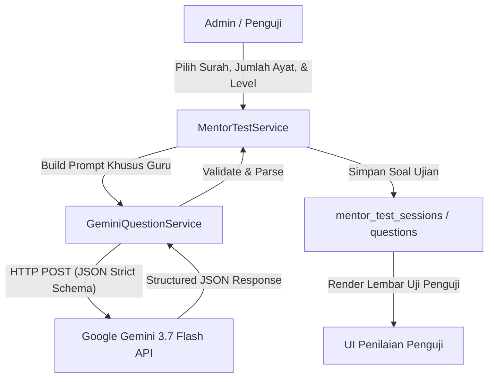
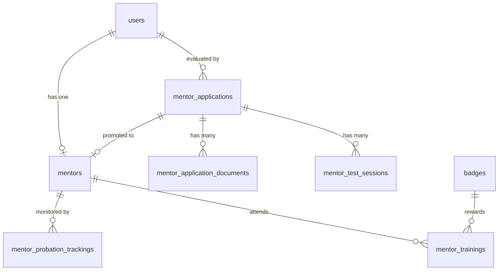
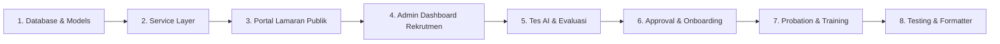

# 📄 PRODUCT REQUIREMENTS DOCUMENT (PRD)
# 🕌 SISTEM REKRUTMEN, EVALUASI AI, & ONBOARDING MENTOR TERPADU (v8.3)

> **Dokumen Spesifikasi Teknis & Panduan Implementasi Lengkap untuk Pengembang (Junior Friendly)**  
> **Sistem Induk:** AL-HIKMAH Learning Management System (LMS)  
> **Versi Target:** 8.3 (Enterprise HR & Mentor Lifecycle Edition)  
> **Status Dokumen:** 🟢 **Final Approved Specification — Siap Diimplementasikan**  
> **Basis Kompatibilitas:** Laravel 12 (PHP 8.2), Pest PHP, Bootstrap 5.3 + Etrain Theme, ApexCharts, DataTables.js, Google Gemini API, WhatsApp Gateway  
> **Tanggal Rilis:** 28 Agustus 2026  

---

## 📋 DAFTAR ISI PRD

1. [📌 1. Executive Summary](#-1-executive-summary)
2. [👥 2. User Experience, Personas, & Functional Requirements](#-2-user-experience-personas--functional-requirements)
3. [🤖 3. AI System Requirements (Google Gemini 3.7 Flash Integration)](#-3-ai-system-requirements-google-gemini-37-flash-integration)
4. [📐 4. Arsitektur Teknis & Database Specifications](#-4-arsitektur-teknis--database-specifications)
5. [🔌 5. Matriks Integrasi dengan Service Layer Existing (v8.2)](#-5-matriks-integrasi-dengan-service-layer-existing-v82)
6. [🎨 6. Spesifikasi Antarmuka Pengguna (UI/UX Design System)](#-6-spesifikasi-antarmuka-pengguna-uiux-design-system)
7. [🛡️ 7. Keamanan, Otorisasi, & Jejak Audit](#-7-keamanan-otorisasi--jejak-audit)
8. [⚠️ 8. Manajemen Risiko & Mitigasi Teknis](#-8-manajemen-risiko--mitigasi-teknis)
9. [🚀 9. Panduan Implementasi Step-by-Step (Khusus Junior Programmer)](#-9-panduan-implementasi-step-by-step-khusus-junior-programmer)
10. [🧪 10. Strategi Pengujian & Quality Assurance (Pest Test Suite)](#-10-strategi-pengujian--quality-assurance-pest-test-suite)
11. [🏁 11. Checklist Quality Gate Sebelum Merge](#-11-checklist-quality-gate-sebelum-merge)

---

## 📌 1. EXECUTIVE SUMMARY

### 1.1 Problem Statement
Lembaga Pembelajaran Al-Qur'an AL-HIKMAH mengalami pertumbuhan jumlah santri yang pesat, namun proses rekrutmen dan penerimaan guru pembimbing (mentor) saat ini masih menghadapi tantangan:
1. **Pendaftaran Manual**: Berkas CV dan sertifikat sanad masuk melalui berbagai saluran tidak terpusat (WhatsApp admin, email, formulir fisik), menyebabkan berkas tercecer dan lambat diproses (> 30 hari).
2. **Evaluasi Belum Terstandarisasi**: Pengujian hafalan Juz 30 dan hukum tajwid calon guru bergantung pada ketersediaan penguji manual tanpa bank soal terstandar.
3. **Onboarding & Pembuatan Akun Lambat**: Setelah dinyatakan lulus, pembuatan akun login mentor, pengisian data profil, dan penyerahan kredensial masih dilakukan manual.
4. **Ketiadaan Pemantauan Masa Percobaan (*Probation*)**: Belum ada sistem pelacakan otomatis untuk memantau performa 3 bulan pertama guru baru (tingkat presensi, rating wali santri, dan beban santri).

### 1.2 Proposed Solution
Membangun **Modul Rekrutmen, Evaluasi AI, & Onboarding Mentor Terpadu (v8.3)** yang terintegrasi secara *native* ke dalam ekosistem AL-HIKMAH LMS:
- **Portal Publik Lamaran Guru**: Formulir multi-tahap (*progressive disclosure*) yang ramah perangkat seluler dengan pelacak status mandiri (*Public Status Tracker*).
- **Pengujian Terstandarisasi AI**: Integrasi Google Gemini AI untuk pembuatan soal ujian hafalan/tajwid dan panduan simulasi mengajar.
- **Automated Onboarding & Credential Delivery**: Otomasi pembuatan akun `User` & `Mentor` dengan pengiriman kredensial aman langsung ke WhatsApp calon guru.
- **Probation & Training Tracker**: Dasbor pemantauan masa percobaan 90 hari, penugasan modul pelatihan mandiri, dan apresiasi *Mentor Badges*.
- **Integrasi Penuh Ekosistem v8.2**: Terkoneksi langsung dengan *Operational Alerts Center*, *Staff Workload Analytics*, *Financial Audit Logs*, dan *ApexCharts*.

### 1.3 Success Criteria & Measurable KPIs
- ⚡ **Kecepatan Proses Rekrutmen**: Memangkas siklus penerimaan pelamar dari rata-rata 30 hari menjadi **$\le 7$ hari kerja**.
- 🤖 **Standardisasi Ujian**: 100% tes hafalan dan tajwid tertulis memiliki acuan soal dan rubrik penilaian otomatis.
- 📱 **Otomasi Notifikasi**: 100% update tahapan lamaran (diterima, jadwal tes, wawancara, hasil) terkirim otomatis via WhatsApp Gateway.
- 🛡️ **Zero Regression & High Coverage**: Menambah $\ge 50$ test cases Pest baru tanpa merusak 259 existing tests (total $\ge 309$ tests lulus 100% Green).

---

## 👥 2. USER EXPERIENCE, PERSONAS, & FUNCTIONAL REQUIREMENTS

### 2.1 User Personas
1. **Ustadz/Ustadzah Pelamar (Candidate Mentor)**: Praktisi/penghafal Al-Qur'an yang ingin melamar bimbingan, membutuhkan formulir yang mudah diakses dari HP dan transparansi status seleksi.
2. **Administrator HR & Akademik (Admin)**: Tim manajemen yang meninjau berkas, menjadwalkan tes, melihat analitik funnel rekrutmen, dan menyetujui pelamar.
3. **Penguji / Mentor Senior (Evaluator)**: Guru senior yang menguji bacaan, hafalan, sanad, dan simulasi mengajar calon guru.
4. **Mentor Baru dalam Masa Percobaan (Probationary Mentor)**: Guru yang baru diterima dan sedang menjalani masa adaptasi 3 bulan pertama.

### 2.2 User Stories & Acceptance Criteria

#### 🔹 Epik 1: Portal Lamaran Publik & Status Tracking
- **Story 1.1**: *Sebagai calon guru, saya ingin mengisi formulir lamaran kerja secara bertahap melalui HP, agar saya dapat mengunggah berkas tanpa merasa rumit.*
  - **AC 1.1.1**: Formulir terbagi dalam 5 tahap: (1) Data Pribadi, (2) Pendidikan & Sanad, (3) Upload Dokumen, (4) Kesiapan Mengajar, (5) Konfirmasi & Submit.
  - **AC 1.1.2**: Mendukung unggah berkas PDF/JPG/PNG (CV, Sertifikat, KTP, Foto) maksimal 2MB per file.
  - **AC 1.1.3**: Setelah submit, sistem menerbitkan `application_code` unik (contoh: `APP-202608-0012`) dan mengirim konfirmasi via WhatsApp.
- **Story 1.2**: *Sebagai calon guru, saya ingin mengecek progres lamaran saya secara mandiri dengan nomor WA/Email, agar saya mengetahui jadwal tes atau hasil seleksi.*
  - **AC 1.2.1**: Halaman `/mentor/application/status` menyediakan pencarian berbasis nomor WhatsApp terdaftar.
  - **AC 1.2.2**: Menampilkan linimasa visual progres: *Submitted $\rightarrow$ Review Dokumen $\rightarrow$ Tes Hafalan $\rightarrow$ Wawancara $\rightarrow$ Keputusan*.

#### 🔹 Epik 2: Pengujian Hafalan & Tajwid Berbasis AI
- **Story 2.1**: *Sebagai admin/penguji, saya ingin membuat set soal ujian hafalan dan tajwid secara instan dengan bantuan AI, agar soal selalu variatif dan terstandarisasi.*
  - **AC 2.1.1**: Admin dapat memilih Surah (contoh: Juz 30 / Al-Mulk), jumlah ayat, dan tingkat kesulitan (*Mudah*, *Sedang*, *Sulit*).
  - **AC 2.1.2**: Sistem memanggil `GeminiQuestionService` untuk merender 5–10 soal pilihan ganda/sambung ayat lengkap dengan kunci jawaban.
  - **AC 2.1.3**: Hasil penilaian tes tersimpan rapi pada tabel `mentor_test_sessions` dengan nilai 0–100 dan predikat (*Mumtaz*, *Jayyid Jiddan*, *Jayyid*, *Maqbul*, *Rasib*).

#### 🔹 Epik 3: Keputusan Seleksi & Otomasi Akun Mentor
- **Story 3.1**: *Sebagai admin, saya ingin menyetujui pelamar yang lulus dengan 1 kali klik, agar akun guru, profil mentor, dan pesan WhatsApp langsung terbit otomatis.*
  - **AC 3.1.1**: Klik tombol "Approve & Terbitkan Akun" memicu pembuatan baris di tabel `users` (`role_id = mentor`) dan `mentors` (`status = probation`).
  - **AC 3.1.2**: Email otomatis dibuat dengan format `{3hurufdepan}.{namabelakang}@{domain}` dan password acak kuat 10 digit.
  - **AC 3.1.3**: Kredensial dikirimkan ke nomor WhatsApp guru baru tanpa menampilkan password plain-text di layar admin.
  - **AC 3.1.4**: Aksi approval dicatat ke `financial_audit_logs`.

#### 🔹 Epik 4: Dasbor Rekrutmen & Pelacakan Masa Percobaan (Probation)
- **Story 4.1**: *Sebagai manajemen, saya ingin melihat analitik corong rekrutmen (*recruitment funnel*) dan tren pelamar bulanan, agar dapat merencanakan kebutuhan guru.*
  - **AC 4.1.1**: Dashboard `/admin/recruitment` memuat metrik KPI (Total Pelamar, Dalam Review, Jadwal Tes, Diterima, Conversion Rate %).
  - **AC 4.1.2**: Grafik interaktif ApexCharts menampilkan tren pelamar 12 bulan dan corong konversi seleksi.
- **Story 4.2**: *Sebagai admin HR, saya ingin memantau perkembangan guru masa percobaan 3 bulan, agar dapat memutuskan pengangkatan menjadi guru tetap.*
  - **AC 4.2.1**: Tabel probation memuat checklist: Orientasi Sistem, Sesi Mengajar Pertama, Modul Pelatihan, Rating Rata-rata, dan Rekap Presensi.
  - **AC 4.2.2**: Peringatan otomatis muncul di *Operational Alerts* jika masa percobaan guru akan habis dalam 14 hari ke depan.

### 2.3 Non-Goals (Batasan Ruang Lingkup)
- ❌ **Sistem Payroll / Penggajian Kompleks**: Perhitungan gaji pokok, lembur, dan potongan pajak di luar cakupan modul ini (hanya mencatat informasi nomor rekening bank untuk administrasi).
- ❌ **Video Call Internal Mandiri**: Sesi wawancara online memanfaatkan link eksternal (Google Meet / Zoom) yang diinputkan admin, bukan server WebRTC mandiri.

---

## 🤖 3. AI SYSTEM REQUIREMENTS (GOOGLE GEMINI 3.7 FLASH INTEGRATION)

### 3.1 Arsitektur Integrasi AI
Modul rekrutmen memperluas pemanfaatan `GeminiQuestionService.php` yang sudah ada di sistem v8.2 untuk kebutuhan pengujian kompetensi calon guru.



### 3.2 Prompt Template Khusus Calon Guru
```text
Anda adalah Pakar Penguji Standarisasi Guru Al-Qur'an dan Sanad Tajwid Internasional.
Buatlah set instrumen ujian kompetensi pedagogi dan tajwid untuk calon guru bimbingan Al-Qur'an:
- Program / Mata Pelajaran: {program} (Tahfidz / Tahsin / Iqra)
- Topik / Target Surah: {topic}
- Jumlah Soal: {count} butir
- Tingkat Kesulitan: {difficulty} (Standar Pengajar)

Format JSON Wajib:
{
  "topic": "{topic}",
  "program": "{program}",
  "total_questions": {count},
  "questions": [
    {
      "question": "Pertanyaan hafalan/tajwid...",
      "options": ["Opsi A", "Opsi B", "Opsi C", "Opsi D"],
      "correct_answer": 0,
      "explanation": "Penjelasan kaidah tajwid/makhraj...",
      "difficulty": "{difficulty}"
    }
  ]
}
```

### 3.3 Quality Benchmark & Fallback Strategy
- **Kecepatan Respons**: Batas waktu eksekusi API $\le 15$ detik dengan timeout 30 detik.
- **Fallback Terproteksi**: Jika kuota API Gemini habis atau terjadi gangguan jaringan eksternal, sistem secara otomatis mengambil paket soal baku dari bank soal master lembaga (`questions` table) tanpa memunculkan pesan error 500 kepada pengguna.

---

## 📐 4. ARSITEKTUR TEKNIS & DATABASE SPECIFICATIONS

### 4.1 Diagram Relasi Entitas (ERD v8.3)



### 4.2 Database Migrations Blueprint

#### 1. Tabel `mentor_applications`
Menyimpan data biodata pelamar, riwayat pendidikan, sanad keilmuan, dan status seleksi.
```php
Schema::create('mentor_applications', function (Blueprint $table) {
    $table->id();
    $table->string('application_code', 30)->unique(); // Contoh: APP-202608-0001
    
    // Data Pribadi
    $table->string('full_name', 150);
    $table->string('email', 150)->index();
    $table->string('phone', 25)->index();
    $table->date('birth_date')->nullable();
    $table->enum('gender', ['male', 'female'])->default('male');
    $table->text('address')->nullable();
    $table->string('city', 100)->nullable();
    
    // Kualifikasi & Sanad
    $table->string('education', 100)->nullable(); // S1 Pendidikan Agama, dll
    $table->string('institution', 150)->nullable(); // Kampus / Ma'had
    $table->unsignedTinyInteger('experience_years')->default(0);
    $table->text('experience_description')->nullable();
    $table->string('specialization', 50)->default('Tahfidz'); // Tahfidz, Tahsin, Iqra, dll
    $table->text('sanad_chain')->nullable(); // Silsilah sanad Al-Qur'an jika ada
    $table->unsignedTinyInteger('hifz_total_juz')->default(0); // Jumlah juz yang dihafal
    
    // Tahapan Seleksi (Status Workflow)
    $table->enum('status', [
        'submitted',            // Lamaran baru masuk
        'document_review',      // Sedang diperiksa admin
        'test_scheduled',       // Tes dijadwalkan
        'test_completed',       // Tes selesai
        'interview_scheduled',  // Wawancara dijadwalkan
        'interview_completed',  // Wawancara selesai
        'approved',             // Diterima (Lulus)
        'rejected',             // Ditolak
        'withdrawn'             // Mengundurkan diri
    ])->default('submitted')->index();
    
    $table->unsignedTinyInteger('current_stage')->default(1); // 1-5 untuk progress bar
    $table->decimal('final_score', 5, 2)->nullable(); // Rata-rata nilai akhir
    $table->text('admin_notes')->nullable();
    $table->text('rejection_reason')->nullable();
    
    // Tracking & Audit
    $table->timestamp('submitted_at')->nullable();
    $table->foreignId('approved_by')->nullable()->constrained('users')->nullOnDelete();
    $table->timestamp('approved_at')->nullable();
    $table->timestamps();

    // Composite Index untuk optimasi filter query
    $table->index(['status', 'submitted_at']);
    $table->index(['specialization', 'status']);
});
```

#### 2. Tabel `mentor_application_documents`
Menyimpan berkas pendukung pelamar (CV, Ijazah, Sertifikat Sanad, KTP, SKCK).
```php
Schema::create('mentor_application_documents', function (Blueprint $table) {
    $table->id();
    $table->foreignId('application_id')->constrained('mentor_applications')->cascadeOnDelete();
    $table->enum('document_type', ['cv', 'certificate', 'sanad', 'id_card', 'photo', 'other'])->default('cv');
    $table->string('file_path', 255);
    $table->string('file_name', 255);
    $table->unsignedInteger('file_size')->default(0); // dalam KB
    $table->string('mime_type', 100)->nullable();
    $table->boolean('is_verified')->default(false);
    $table->foreignId('verified_by')->nullable()->constrained('users')->nullOnDelete();
    $table->timestamp('verified_at')->nullable();
    $table->text('notes')->nullable();
    $table->timestamps();

    $table->index(['application_id', 'document_type']);
});
```

#### 3. Tabel `mentor_test_sessions`
Merekam jadwal dan nilai instrumen ujian kompetensi (Ujian AI, Uji Petik Hafalan, & Wawancara).
```php
Schema::create('mentor_test_sessions', function (Blueprint $table) {
    $table->id();
    $table->foreignId('application_id')->constrained('mentor_applications')->cascadeOnDelete();
    $table->enum('session_type', ['juz_test', 'tajwid_test', 'teaching_simulation', 'interview'])->default('juz_test');
    $table->dateTime('scheduled_at');
    $table->unsignedSmallInteger('duration_minutes')->default(45);
    $table->enum('mode', ['online', 'offline'])->default('online');
    $table->string('meeting_link', 255)->nullable();
    $table->string('location', 255)->nullable();
    
    // Evaluasi & Skor
    $table->decimal('score', 5, 2)->nullable(); // 0.00 - 100.00
    $table->enum('grade', ['mumtaz', 'jayyid_jiddan', 'jayyid', 'maqbul', 'rasib'])->nullable();
    $table->text('evaluator_notes')->nullable();
    $table->foreignId('evaluator_id')->nullable()->constrained('users')->nullOnDelete();
    
    // Status Sesi
    $table->enum('status', ['scheduled', 'in_progress', 'completed', 'cancelled', 'rescheduled'])->default('scheduled');
    $table->timestamp('completed_at')->nullable();
    $table->json('ai_question_payload')->nullable(); // Snapshot soal AI yang digunakan
    $table->timestamps();

    $table->index(['application_id', 'session_type']);
    $table->index(['scheduled_at', 'status']);
});
```

#### 4. Tabel `mentor_probation_trackings`
Merekam checklist onboarding dan KPI guru selama 3 bulan pertama masa percobaan.
```php
Schema::create('mentor_probation_trackings', function (Blueprint $table) {
    $table->id();
    $table->foreignId('mentor_id')->constrained('mentors')->cascadeOnDelete();
    $table->date('start_date');
    $table->date('end_date');
    $table->unsignedTinyInteger('duration_months')->default(3);
    
    // Checklist Onboarding
    $table->boolean('orientation_completed')->default(false);
    $table->boolean('system_training_completed')->default(false);
    $table->boolean('first_session_conducted')->default(false);
    $table->unsignedTinyInteger('training_modules_completed')->default(0);
    $table->unsignedTinyInteger('training_modules_required')->default(4);
    
    // Metrik Kinerja Aktual
    $table->unsignedSmallInteger('total_sessions_conducted')->default(0);
    $table->unsignedSmallInteger('active_students_assigned')->default(0);
    $table->decimal('average_rating', 3, 2)->default(5.00);
    $table->decimal('attendance_rate', 5, 2)->default(100.00);
    
    // Hasil Evaluasi
    $table->date('mid_review_date')->nullable();
    $table->text('mid_review_notes')->nullable();
    $table->date('final_evaluation_date')->nullable();
    $table->enum('final_decision', ['passed', 'extended', 'terminated'])->nullable();
    $table->text('final_notes')->nullable();
    $table->foreignId('evaluated_by')->nullable()->constrained('users')->nullOnDelete();
    
    $table->enum('status', ['active', 'passed', 'extended', 'terminated'])->default('active')->index();
    $table->timestamps();

    $table->index(['mentor_id', 'status']);
});
```

#### 5. Tabel `mentor_trainings`
Mencatat pelatihan pengembangan kompetensi guru dan integrasi perolehan badge lencana.
```php
Schema::create('mentor_trainings', function (Blueprint $table) {
    $table->id();
    $table->foreignId('mentor_id')->constrained('mentors')->cascadeOnDelete();
    $table->string('title', 200);
    $table->enum('category', ['pedagogy', 'tajwid', 'tahfidz_method', 'technology', 'adab_counseling'])->default('pedagogy');
    $table->string('instructor_name', 150)->nullable();
    $table->date('training_date');
    $table->decimal('duration_hours', 4, 1)->default(2.0);
    $table->string('certificate_path', 255)->nullable();
    $table->foreignId('badge_id')->nullable()->constrained('badges')->nullOnDelete();
    $table->text('notes')->nullable();
    $table->timestamps();

    $table->index(['mentor_id', 'category']);
});
```

#### 6. Modifikasi Tabel Existing `mentors` (Additive & Safe Migration)
> ⚠️ **Catatan Penting untuk Junior Dev**: Tabel `mentors` SUDAH memiliki kolom `id`, `user_id`, `full_name`, `specialization`, `bio`, `rating`, `is_active`, `default_max_students_per_day`, dan `timestamps`. JANGAN menambahkan kolom yang sudah ada! Tambahkan HANYA kolom baru berikut:
```php
Schema::table('mentors', function (Blueprint $table) {
    $table->foreignId('application_id')->nullable()->after('user_id')->constrained('mentor_applications')->nullOnDelete();
    $table->date('join_date')->nullable()->after('rating');
    $table->date('probation_end_date')->nullable()->after('join_date');
    $table->enum('status', ['active', 'inactive', 'probation', 'suspended', 'resigned'])->default('active')->after('probation_end_date');
    $table->boolean('is_trainer')->default(false)->after('status');
    $table->text('sanad_chain')->nullable()->after('bio');
    $table->string('bank_name', 100)->nullable();
    $table->string('bank_account_number', 50)->nullable();
    $table->string('bank_account_name', 150)->nullable();
    $table->string('emergency_contact', 50)->nullable();
    
    $table->index('status');
    $table->index('join_date');
});
```

---

## 🔌 5. MATRIKS INTEGRASI DENGAN SERVICE LAYER EXISTING (v8.2)

Setiap fitur baru pada v8.3 wajib menggunakan service yang telah terbukti stabil di sistem:

| Service Existing | Modul v8.3 yang Memanfaatkan | Detail Implementasi & Output |
| :--- | :--- | :--- |
| **`WhatsAppService.php`** | Recruitment & Onboarding | Mengirim pesan selamat datang, info berkas diterima, link ujian/wawancara, dan kredensial login akun baru. |
| **`AlertService.php`** | Operational Alerts Center | Menambahkan notifikasi 🔴 Kritis (Lamaran $\gt 7$ hari belum diproses) dan 🟡 Perhatian (Guru probation habis tempo dalam 14 hari). |
| **`StaffAnalyticsService.php`** | HR Management Dashboard | Memasukkan guru berstatus `probation` ke dalam matriks kapasitas dan deteksi beban mengajar secara real-time. |
| **`GeminiQuestionService.php`**| Test Engine Calon Guru | Menghasilkan soal ujian hafalan/tajwid otomatis dengan prompt evaluator pengajar. |
| **`FinancialAuditLog.php`** | Keamanan & Kepatuhan | Mencatat log setiap perubahan status lamaran (*approve*, *reject*, *reschedule*, *probation pass*). |
| **`StudentAccountService.php`**| Acuan `MentorAccountService`| Mengadopsi algoritma sanitasi nama, pola email unik `{3huruf}.{belakang}@{domain}`, dan generator password acak aman. |
| **`BroadcastService.php`** | Rekrutmen Massal | Digunakan admin saat ingin menyiarkan pengumuman pembukaan lowongan guru ke kontak relasi. |
| **`RevenueReportExport.php`** | Laporan Rekrutmen | Mengadopsi pola *chunked export* memory-efficient untuk ekspor pelamar ke CSV/Excel dan PDF resmi. |

### 5.1 Service Baru yang Perlu Dibuat (`app/Services/`):
1. **`MentorRecruitmentService.php`**: Mengelola siklus lamaran (submit, validasi dokumen, update tahapan, penolakan, dan persetujuan).
2. **`MentorAccountService.php`**: Otomasi pembuatan akun `User` & `Mentor`, kalkulasi email unik, enkripsi password, dan pengiriman kredensial via WhatsApp.
3. **`MentorTestService.php`**: Penjadwalan tes, orkestrasi pembuatan soal via `GeminiQuestionService`, dan kalkulasi skor evaluasi.
4. **`MentorProbationService.php`**: Pengelolaan masa percobaan 90 hari, checklist kelulusan, dan evaluasi pengangkatan guru tetap.

---

## 🎨 6. SPESIFIKASI ANTARMUKA PENGGUNA (UI/UX DESIGN SYSTEM)

### 6.1 Desain Konsisten dengan Standar LMS v8.2
- **Warna & Token CSS**: Gunakan variabel CSS yang telah terpasang pada `layouts/admin.blade.php` (`var(--card-bg)`, `var(--text-primary)`, `var(--border-color)`, `var(--primary-lighter)`).
- **Komponen Tabel**: Wajib menggunakan inisialisasi DataTables terintegrasi (`.datatable` dengan opsi bahasa Indonesia dan dark-mode support).
- **Grafik & Visualisasi**: Menggunakan **ApexCharts** dengan skema **Hybrid AJAX Loading** (skeleton shimmer saat data sedang di-fetch).

### 6.2 Struktur Halaman Baru

```
resources/views/
├── public/
│   └── mentor-recruitment/
│       ├── register.blade.php        # Form Multi-Step Lamaran Guru (Mobile First)
│       ├── status-tracker.blade.php  # Cek Status Lamaran Mandiri (by Phone/Email)
│       └── success.blade.php         # Halaman Sukses dengan Kode Registrasi & WA Card
├── admin/
│   ├── recruitment/
│   │   ├── index.blade.php           # Dashboard Utama Rekrutmen (KPI + ApexCharts)
│   │   ├── applications/
│   │   │   ├── index.blade.php       # DataTables Seluruh Pelamar + Filter Tab
│   │   │   ├── show.blade.php        # Detail Pelamar, CV Viewer, & Action Buttons
│   │   │   └── partials/
│   │   │       ├── document-card.blade.php
│   │   │       ├── test-modal.blade.php
│   │   │       └── approval-modal.blade.php
│   │   └── reports/
│   │       └── pdf/recruitment-pdf.blade.php # Format PDF Resmi Kop Surat
│   └── mentors/
│       └── probation/
│           ├── index.blade.php       # Monitoring Guru Probation 90 Hari
│           └── show.blade.php        # Checklist Onboarding & Form Evaluasi
```

---

## 🛡️ 7. KEAMANAN, OTORISASI, & JEJAK AUDIT

1. **Proteksi Unggah Berkas**:
   - Berkas dokumen calon guru wajib divalidasi MIME type (`application/pdf`, `image/jpeg`, `image/png`) dan ukuran maksimal $2048 \text{ KB}$ (2MB).
   - Disimpan di disk privat `storage/app/private/mentor_applications/{id}/` dan hanya dapat diakses melalui rute terproteksi middleware `role:admin`.
2. **Kebijakan Zero Plain-Text Password**:
   - Password baru guru langsung di-hash menggunakan `Hash::make()` sebelum disimpan.
   - Kredensial akun dikirim langsung via WhatsApp ke nomor pelamar dan tidak disimpan di session atau database dalam format teks terbuka.
3. **Pencatatan Audit Trail Otomatis**:
   - Setiap perubahan status lamaran, pembatalan jadwal, penolakan, maupun approval wajib memanggil helper:
     ```php
     FinancialAuditLog::log(
         userId: auth()->id() ?? 1,
         action: 'mentor_application_approved',
         entityType: 'mentor_application',
         entityId: $application->id,
         oldValues: ['status' => 'interview_completed'],
         newValues: ['status' => 'approved', 'mentor_id' => $newMentor->id]
     );
     ```

---

## ⚠️ 8. MANAJEMEN RISIKO & MITIGASI TEKNIS

| Potensi Risiko | Tingkat Dampak | Solusi Mitigasi Teknis |
| :--- | :---: | :--- |
| **Duplikasi Kolom pada Tabel `mentors`** | 🔴 Tinggi | Pastikan migration hanya menambahkan kolom tambahan (gunakan `Schema::table`) tanpa mendefinisikan ulang kolom existing (`rating`, `specialization`). |
| **Kegagalan Koneksi WhatsApp API** | 🟡 Sedang | `WhatsAppService` telah dilengkapi mode Mock Fallback (mencatat ke Laravel Log saat API key tidak diset), sehingga sistem tidak crash saat pengujian lokal. |
| **Gagal Transaksi saat Pembuatan Akun** | 🔴 Tinggi | Bungkus proses approval di dalam `DB::transaction(...)`. Jika pembuatan `Mentor` atau pengiriman notifikasi gagal, rollback database secara penuh. |
| **Lonjakan Ukuran Berkas Dokumen** | 🟡 Sedang | Terapkan validasi form ketat di sisi klien (HTML5 file size check) dan server-side Laravel validation rules. |

---

## 🚀 9. PANDUAN IMPLEMENTASI STEP-BY-STEP (KHUSUS JUNIOR PROGRAMMER)

Ikuti tahapan berurutan berikut secara disiplin agar tidak terjadi kesalahan atau tabrakan dengan fitur yang sudah berjalan:



---

### 🔹 FASE 1: DATABASE MIGRATIONS & ELOQUENT MODELS (Hari 1–2)

#### Langkah 1.1: Buat Berkas Migrasi
Jalankan perintah artisan untuk membuat migrasi baru:
```bash
php artisan make:migration create_mentor_recruitment_tables
```

Buka berkas migrasi yang baru dibuat di `database/migrations/` dan tuliskan skema sesuai Bagian 4.2 (tabel `mentor_applications`, `mentor_application_documents`, `mentor_test_sessions`, `mentor_probation_trackings`, `mentor_trainings`, serta penambahan kolom pada `mentors`).

Jalankan migrasi:
```bash
php artisan migrate
```

#### Langkah 1.2: Buat Model Eloquent
Buat model-model berikut di `app/Models/`:
1. `app/Models/MentorApplication.php`
2. `app/Models/MentorApplicationDocument.php`
3. `app/Models/MentorTestSession.php`
4. `app/Models/MentorProbationTracking.php`
5. `app/Models/MentorTraining.php`

**Contoh Template Model `MentorApplication.php`:**
```php
<?php

namespace App\Models;

use Illuminate\Database\Eloquent\Factories\HasFactory;
use Illuminate\Database\Eloquent\Model;
use Illuminate\Database\Eloquent\Relations\BelongsTo;
use Illuminate\Database\Eloquent\Relations\HasMany;
use Illuminate\Database\Eloquent\Relations\HasOne;

class MentorApplication extends Model
{
    use HasFactory;

    protected $fillable = [
        'application_code',
        'full_name',
        'email',
        'phone',
        'birth_date',
        'gender',
        'address',
        'city',
        'education',
        'institution',
        'experience_years',
        'experience_description',
        'specialization',
        'sanad_chain',
        'hifz_total_juz',
        'status',
        'current_stage',
        'final_score',
        'admin_notes',
        'rejection_reason',
        'submitted_at',
        'approved_by',
        'approved_at',
    ];

    protected function casts(): array
    {
        return [
            'birth_date' => 'date',
            'submitted_at' => 'datetime',
            'approved_at' => 'datetime',
            'final_score' => 'float',
            'experience_years' => 'integer',
            'hifz_total_juz' => 'integer',
            'current_stage' => 'integer',
        ];
    }

    public function documents(): HasMany
    {
        return $this->hasMany(MentorApplicationDocument::class, 'application_id');
    }

    public function testSessions(): HasMany
    {
        return $this->hasMany(MentorTestSession::class, 'application_id');
    }

    public function approver(): BelongsTo
    {
        return $this->belongsTo(User::class, 'approved_by');
    }

    public function mentor(): HasOne
    {
        return $this->hasOne(Mentor::class, 'application_id');
    }

    public function getStatusBadgeAttribute(): string
    {
        return match ($this->status) {
            'submitted' => '<span class="badge bg-secondary">Baru Masuk</span>',
            'document_review' => '<span class="badge bg-info text-dark">Review Berkas</span>',
            'test_scheduled' => '<span class="badge bg-primary">Tes Dijadwalkan</span>',
            'test_completed' => '<span class="badge bg-primary">Tes Selesai</span>',
            'interview_scheduled' => '<span class="badge bg-warning text-dark">Wawancara</span>',
            'interview_completed' => '<span class="badge bg-warning text-dark">Wawancara Selesai</span>',
            'approved' => '<span class="badge bg-success">Diterima</span>',
            'rejected' => '<span class="badge bg-danger">Ditolak</span>',
            'withdrawn' => '<span class="badge bg-dark">Mundur</span>',
            default => '<span class="badge bg-light text-dark">Unknown</span>',
        };
    }
}
```

Perbarui juga model `app/Models/Mentor.php` dengan menambahkan relasi:
```php
public function application(): BelongsTo
{
    return $this->belongsTo(MentorApplication::class, 'application_id');
}

public function probationTracking(): HasOne
{
    return $this->hasOne(MentorProbationTracking::class, 'mentor_id');
}

public function trainings(): HasMany
{
    return $this->hasMany(MentorTraining::class, 'mentor_id');
}
```

---

### 🔹 FASE 2: SERVICE LAYER ARCHITECTURE (Hari 3–4)

Buat service-service pendukung di `app/Services/`:

#### Langkah 2.1: `MentorAccountService.php`
Mengadaptasi keunggulan `StudentAccountService` untuk pembuatan akun guru secara otomatis.
```php
<?php

namespace App\Services;

use App\Enums\Role as RoleEnum;
use App\Models\Mentor;
use App\Models\MentorApplication;
use App\Models\MentorProbationTracking;
use App\Models\Role;
use App\Models\Setting;
use App\Models\User;
use Illuminate\Support\Facades\DB;
use Illuminate\Support\Facades\Hash;
use Illuminate\Support\Str;

class MentorAccountService
{
    public function __construct(
        protected WhatsAppService $whatsAppService
    ) {}

    public function generateEmail(string $name): string
    {
        $domain = Setting::where('key', 'institution_domain')->value('value') ?: 'alhikmah.com';
        $cleaned = trim(preg_replace('/[^a-zA-Z\s]/', '', preg_replace('/\b(ustadz|ustadzah|guru|pengajar)\b/i', '', $name)));
        $parts = preg_split('/\s+/', $cleaned);
        $first = Str::lower(substr($parts[0] ?? 'men', 0, 3));
        $last = Str::lower(count($parts) > 1 ? end($parts) : ($parts[0] ?? 'tor'));
        
        $base = "{$first}.{$last}";
        $email = "{$base}@{$domain}";
        $counter = 1;

        while (User::where('email', $email)->exists()) {
            $email = "{$base}{$counter}@{$domain}";
            $counter++;
        }

        return $email;
    }

    public function generatePassword(int $length = 10): string
    {
        $chars = 'abcdefghijklmnopqrstuvwxyzABCDEFGHIJKLMNOPQRSTUVWXYZ0123456789!@#$%^&*';
        return substr(str_shuffle(str_repeat($chars, 3)), 0, $length);
    }

    public function createMentorAccount(MentorApplication $application): array
    {
        return DB::transaction(function () use ($application) {
            $email = $this->generateEmail($application->full_name);
            $plainPassword = $this->generatePassword(10);

            $mentorRole = Role::firstOrCreate(
                ['name' => RoleEnum::MENTOR->value],
                ['label' => RoleEnum::MENTOR->label()]
            );

            // 1. Buat User Login
            $user = User::create([
                'name' => $application->full_name,
                'email' => $email,
                'password' => Hash::make($plainPassword),
                'role_id' => $mentorRole->id,
                'phone' => $application->phone,
            ]);

            // 2. Buat Profil Mentor
            $mentor = Mentor::create([
                'user_id' => $user->id,
                'application_id' => $application->id,
                'full_name' => $application->full_name,
                'specialization' => $application->specialization,
                'bio' => $application->experience_description ?? 'Guru Pembimbing Al-Qur\'an',
                'rating' => 5.00,
                'is_active' => true,
                'join_date' => today(),
                'probation_end_date' => today()->addMonths(3),
                'status' => 'probation',
                'sanad_chain' => $application->sanad_chain,
            ]);

            // 3. Inisialisasi Probation Tracking
            MentorProbationTracking::create([
                'mentor_id' => $mentor->id,
                'start_date' => today(),
                'end_date' => today()->addMonths(3),
                'duration_months' => 3,
                'status' => 'active',
            ]);

            // 4. Update Status Lamaran
            $application->update([
                'status' => 'approved',
                'approved_by' => auth()->id() ?? 1,
                'approved_at' => now(),
            ]);

            // 5. Kirim Kredensial via WhatsApp
            $this->sendCredentialsNotification($application, $email, $plainPassword);

            return [
                'user' => $user,
                'mentor' => $mentor,
                'plain_password' => $plainPassword,
            ];
        });
    }

    protected function sendCredentialsNotification(MentorApplication $app, string $email, string $password): void
    {
        $message = "Assalamu'alaikum Wr. Wb. Ustadz/Ustadzah *{$app->full_name}*,\n\n"
            . "Ahlan wa Sahlan! Selamat, lamaran Anda telah *DITERIMA* sebagai Guru Pembimbing di *AL-HIKMAH LMS*.\n\n"
            . "Berikut informasi akun login Anda:\n"
            . "📧 Email: {$email}\n"
            . "🔑 Password: {$password}\n"
            . "🌐 URL Login: " . url('/login') . "\n\n"
            . "Status Anda saat ini adalah *Masa Percobaan (Probation 3 Bulan)*. Silakan login untuk memulai orientasi dan melengkapi jadwal bimbingan Anda.\n\n"
            . "Barakallahu fiikum,\n*Manajemen AL-HIKMAH LMS*";

        $this->whatsAppService->sendMessage($app->phone, $message);
    }
}
```

---

### 🔹 FASE 3: PORTAL LAMARAN PUBLIK & STATUS TRACKER (Hari 5–6)

#### Langkah 3.1: Controller Publik
Buat `app/Http/Controllers/Public/MentorApplicationController.php`:
- Method `create()`: Render form pendaftaran multi-step.
- Method `store(Request $request)`: Validasi data, simpan berkas ke `storage`, buat nomor registrasi `APP-YYYYMM-XXXX`, kirim notifikasi WhatsApp, dan redirect dengan pesan sukses.
- Method `status(Request $request)`: Render form cek status dan hasil pencarian status lamaran.

#### Langkah 3.2: Formulir Multi-Step Blade
Buat `resources/views/public/mentor-recruitment/register.blade.php`:
- Desain responsive bertema Etrain dengan progress indicator (Step 1 s.d. Step 5).
- Input field yang divalidasi dengan jelas.
- Drag and Drop file uploader untuk dokumen.

---

### 🔹 FASE 4: ADMIN RECRUITMENT CONTROL CENTER (Hari 7–8)

#### Langkah 4.1: Controller Admin
Buat `app/Http/Controllers/Admin/AdminRecruitmentController.php`:
- `index()`: Mengambil ringkasan metrik (Total Lamaran, Pending Review, Tes Minggu Ini, Approved Bulan Ini) dan merender view `admin.recruitment.index`.
- `show($id)`: Menampilkan detail pelamar, preview dokumen PDF/gambar, riwayat nilai tes, dan modal aksi.
- `updateStage(Request $request, $id)`: Memindahkan tahap lamaran.
- `reject(Request $request, $id)`: Menolak lamaran dengan alasan penolakan dan pengiriman pesan WhatsApp sopan.

#### Langkah 4.2: Integrasi ApexCharts & Hybrid Rendering
Buat endpoint API di `app/Http/Controllers/Api/RecruitmentApiController.php`:
- `GET /api/recruitment/trend`: Mengembalikan data JSON tren lamaran 12 bulan terakhir.
- `GET /api/recruitment/funnel`: Mengembalikan data persentase konversi tiap tahapan seleksi.

---

### 🔹 FASE 5: TES AI & INSTRUMEN WAWANCARA (Hari 9–10)

1. Buat modal di halaman detail pelamar: **"Generate Soal Tes AI"**.
2. Hubungkan dengan method controller yang memanggil `GeminiQuestionService::generateQuestions()`.
3. Simpan set soal ke `mentor_test_sessions` kolom `ai_question_payload`.
4. Sediakan form input penilaian untuk penguji (Nilai Angka 0–100, Catatan Tajwid, Catatan Makhraj, dan Rekomendasi).

---

### 🔹 FASE 6: ONBOARDING, PROBATION TRACKING, & BADGES (Hari 11–12)

#### Langkah 6.1: Dasbor Pemantauan Probation
Buat `app/Http/Controllers/Admin/AdminMentorProbationController.php`:
- Menampilkan daftar seluruh guru yang berstatus `probation`.
- Menghubungkan metrik performa langsung dari `StaffAnalyticsService::getMentorWorkloadList()`.
- Menyediakan tombol evaluasi akhir: *Lulus Menjadi Guru Tetap*, *Perpanjang Probation*, atau *Berhentikan*.

#### Langkah 6.2: Master Lencana Mentor (Gamifikasi)
Tambahkan 3 lencana khusus mentor pada seeder/tabel `badges`:
- `M01` — **Mentor Certified**: Diberikan saat guru lulus masa percobaan 3 bulan (+500 Poin).
- `M02` — **Sanad Keeper**: Diberikan kepada guru yang memiliki sanad Al-Qur'an muttashil (+300 Poin).
- `M03` — **Master Trainer**: Diberikan kepada mentor yang melatih sesama pengajar (+1000 Poin).

---

### 🔹 FASE 7: LAPORAN DUAL-FORMAT & OPERATIONAL ALERTS (Hari 13–14)

1. **Integrasi Operational Alerts**:
   Perbarui `app/Services/AlertService.php`:
   - Di `getCriticalAlerts()`: Tambahkan deteksi jika ada lamaran berstatus `submitted` lebih dari 7 hari belum ditinjau admin.
   - Di `getWarningAlerts()`: Tambahkan deteksi jika ada guru probation yang masa percobaannya akan berakhir dalam 14 hari ke depan.
2. **Ekspor Laporan**:
   - Buat `app/Exports/RecruitmentReportExport.php` untuk unduh spreadsheet CSV/Excel.
   - Buat view `resources/views/admin/recruitment/reports/pdf/recruitment-pdf.blade.php` lengkap dengan Kop Surat Lembaga AL-HIKMAH.

---

### 🔹 FASE 8: INTEGRASI ROUTING LENGKAP (Hari 15)

Daftarkan seluruh rute baru di `routes/web.php`:

```php
// ============================================
// 1. PUBLIC MENTOR RECRUITMENT ROUTES
// ============================================
Route::prefix('mentor')->name('mentor.recruitment.')->group(function () {
    Route::get('/register', [MentorApplicationController::class, 'create'])->name('register');
    Route::post('/register', [MentorApplicationController::class, 'store'])->name('store');
    Route::get('/status', [MentorApplicationController::class, 'status'])->name('status');
    Route::post('/status', [MentorApplicationController::class, 'checkStatus'])->name('check-status');
});

// ============================================
// 2. ADMIN RECRUITMENT & ONBOARDING ROUTES
// ============================================
Route::middleware(['auth', 'role:admin'])->prefix('admin')->name('admin.')->group(function () {
    // Recruitment Dashboard & Management
    Route::prefix('recruitment')->name('recruitment.')->group(function () {
        Route::get('/', [AdminRecruitmentController::class, 'index'])->name('index');
        Route::get('/applications', [AdminRecruitmentController::class, 'applications'])->name('applications.index');
        Route::get('/applications/{id}', [AdminRecruitmentController::class, 'show'])->name('applications.show');
        Route::post('/applications/{id}/stage', [AdminRecruitmentController::class, 'updateStage'])->name('applications.update-stage');
        Route::post('/applications/{id}/approve', [AdminRecruitmentController::class, 'approve'])->name('applications.approve');
        Route::post('/applications/{id}/reject', [AdminRecruitmentController::class, 'reject'])->name('applications.reject');
        
        // Testing & AI Generator
        Route::post('/applications/{id}/test/schedule', [AdminRecruitmentController::class, 'scheduleTest'])->name('test.schedule');
        Route::post('/applications/{id}/test/generate-ai', [AdminRecruitmentController::class, 'generateAiTest'])->name('test.generate-ai');
        Route::post('/applications/{id}/test/score', [AdminRecruitmentController::class, 'scoreTest'])->name('test.score');
        
        // Reports
        Route::get('/export-excel', [AdminRecruitmentController::class, 'exportExcel'])->name('export-excel');
        Route::get('/export-pdf', [AdminRecruitmentController::class, 'exportPdf'])->name('export-pdf');
    });

    // Probation Tracking
    Route::prefix('mentors/probation')->name('mentors.probation.')->group(function () {
        Route::get('/', [AdminMentorProbationController::class, 'index'])->name('index');
        Route::get('/{id}', [AdminMentorProbationController::class, 'show'])->name('show');
        Route::post('/{id}/review', [AdminMentorProbationController::class, 'review'])->name('review');
    });
});

// ============================================
// 3. API ANALYTICS ENDPOINTS
// ============================================
Route::middleware(['auth', 'role:admin'])->prefix('api/analytics')->name('api.analytics.')->group(function () {
    Route::get('/recruitment-trend', [RecruitmentApiController::class, 'trend'])->name('recruitment-trend');
    Route::get('/recruitment-funnel', [RecruitmentApiController::class, 'funnel'])->name('recruitment-funnel');
});
```

---

## 🧪 10. STRATEGI PENGUJIAN & QUALITY ASSURANCE (PEST TEST SUITE)

Target pengujian adalah membuat minimal **50+ test cases baru** di folder `tests/Feature/MentorRecruitment/`.

### Struktur File Pengujian Baru:
1. `tests/Feature/MentorRecruitment/PublicApplicationTest.php` (12 Tests)
2. `tests/Feature/MentorRecruitment/AdminRecruitmentDashboardTest.php` (10 Tests)
3. `tests/Feature/MentorRecruitment/AiTestGeneratorTest.php` (8 Tests)
4. `tests/Feature/MentorRecruitment/ApprovalAndOnboardingTest.php` (10 Tests)
5. `tests/Feature/MentorRecruitment/ProbationTrackingTest.php` (8 Tests)
6. `tests/Feature/MentorRecruitment/RecruitmentReportsAndAlertsTest.php` (6 Tests)

### Contoh Cuplikan Pengujian Pest:
```php
<?php

use App\Models\Mentor;
use App\Models\MentorApplication;
use App\Models\Role;
use App\Models\User;
use App\Services\WhatsAppService;

beforeEach(function () {
    $this->adminRole = Role::firstOrCreate(['name' => 'admin'], ['label' => 'Administrator']);
    $this->admin = User::factory()->create(['role_id' => $this->adminRole->id]);
});

test('public applicant can submit mentor application form successfully', function () {
    $response = $this->post(route('mentor.recruitment.store'), [
        'full_name' => 'Ustadz Salman Al-Farisi',
        'email' => 'salman@example.com',
        'phone' => '081299887766',
        'education' => 'S1 Ilmu Al-Qur\'an dan Tafsir',
        'institution' => 'Universitas PTIQ Jakarta',
        'experience_years' => 4,
        'specialization' => 'Tahfidz',
        'hifz_total_juz' => 30,
        'sanad_chain' => 'Sanad Riwayat Hafsh \'an \'Ashim',
    ]);

    $response->assertRedirect();
    $response->assertSessionHas('success');

    $app = MentorApplication::where('email', 'salman@example.com')->first();
    expect($app)->not->toBeNull();
    expect($app->status)->toBe('submitted');
    expect($app->application_code)->toStartWith('APP-');
});

test('admin can approve candidate, creating user and mentor account with WhatsApp credentials', function () {
    // Mock WhatsApp
    $mockWa = Mockery::mock(WhatsAppService::class);
    $mockWa->shouldReceive('sendMessage')->andReturn(true);
    app()->instance(WhatsAppService::class, $mockWa);

    $application = MentorApplication::create([
        'application_code' => 'APP-TEST-001',
        'full_name' => 'Ustadzah Fatimah Azzahra',
        'email' => 'fatimah.azzahra@example.com',
        'phone' => '081311223344',
        'specialization' => 'Tahsin',
        'status' => 'interview_completed',
    ]);

    $response = $this->actingAs($this->admin)
        ->post(route('admin.recruitment.applications.approve', $application->id));

    $response->assertRedirect();
    $response->assertSessionHas('success');

    $application->refresh();
    expect($application->status)->toBe('approved');

    $mentorUser = User::where('phone', '081311223344')->first();
    expect($mentorUser)->not->toBeNull();
    expect($mentorUser->role->name)->toBe('mentor');

    $mentor = Mentor::where('user_id', $mentorUser->id)->first();
    expect($mentor)->not->toBeNull();
    expect($mentor->status)->toBe('probation');
});
```

---

## 🏁 11. CHECKLIST QUALITY GATE SEBELUM MERGE

Sebelum mengajukan pull request atau memfinalisasi pekerjaan, Junior Developer wajib memeriksa dan mencentang checklist berikut:

- [ ] Seluruh migrasi database berjalan sukses tanpa error (`php artisan migrate`).
- [ ] Tidak ada duplikasi kolom di tabel `mentors`.
- [ ] Fitur upload dokumen memvalidasi ukuran file ($\le 2\text{ MB}$) dan ekstensi aman.
- [ ] Seluruh endpoint admin diamankan dengan middleware `role:admin`.
- [ ] Notifikasi WhatsApp terkirim dan tidak crash jika API key kosong (mock test pass).
- [ ] Aksi approval membungkus transaksi database dengan `DB::transaction`.
- [ ] Format kode PHP lulus pemeriksaan Laravel Pint (`vendor/bin/pint --format agent`).
- [ ] Menjalankan pengujian otomatis lengkap dan **100% Green Pass** (`php artisan test --compact`).
- [ ] Memperbarui dokumentasi sistem di [tentang.md](file:///c:/xampp/htdocs/al-hikmah-lms/tentang.md).

---

> 📌 **Referensi Berkas Penting:**
> - [Laporan Eksekutif Proyek](tentang.md)
> - [Panduan Pengembang](AGENTS.md)
> - [Model Mentor Existing](app/Models/Mentor.php)
> - [Service Akun Santri (Pola Acuan)](app/Services/StudentAccountService.php)
> - [Service WhatsApp Existing](app/Services/WhatsAppService.php)
> - [Service Alerts Existing](app/Services/AlertService.php)
> - [Service SDM Guru Existing](app/Services/StaffAnalyticsService.php)