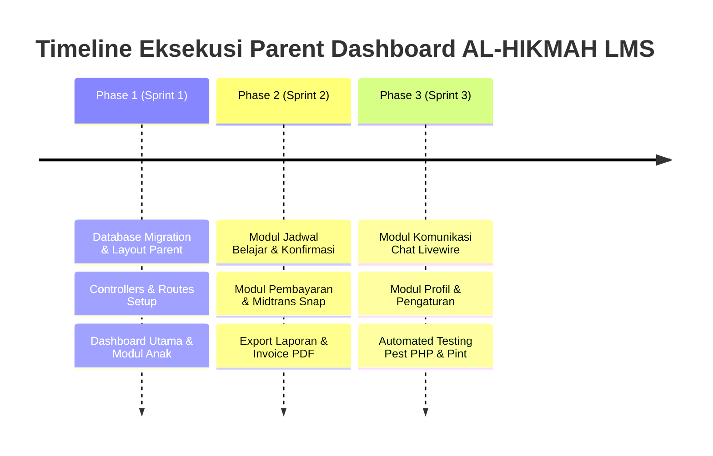

# 📄 PRODUCT REQUIREMENTS DOCUMENT (PRD)
## MODUL PARENT DASHBOARD (PORTAL ORANG TUA / WALI)
### AL-HIKMAH LEARNING MANAGEMENT SYSTEM (LMS)

---

## 📄 Document Control

| Property | Details |
|---|---|
| **Project Title** | AL-HIKMAH LMS - Parent Dashboard Module |
| **Document Version** | 1.0 (Production Blueprint) |
| **Status** | Draft for Review |
| **Author** | Antigravity AI & Development Team |
| **Target Framework** | Laravel 12 | Livewire 4.3 | Bootstrap 5 | Chart.js | MySQL |

---

## 1. Executive Summary

### 1.1 Problem Statement
Saat ini, Orang Tua / Wali santri belum memiliki portal khusus yang terpadu untuk memantau capaian hafalan Al-Qur'an anak secara multi-santri, melihat jadwal bimbingan mendatang, melakukan komunikasi dua arah dengan mentor, mengunduh invoice/laporan PDF, serta membayar SPP secara digital.

### 1.2 Proposed Solution
Membangun **Parent Dashboard Portal** (`/parent/*`) yang terintegrasi sepenuhnya dengan arsitektur AL-HIKMAH LMS yang sudah berjalan (Laravel 12, Livewire 4.3, Bootstrap 5, MySQL, dan Midtrans Payment Gateway). Portal ini mencakup 6 modul utama:
1. **Dashboard Utama** (`/parent/dashboard`)
2. **Modul Anak & Progress** (`/parent/children/*`)
3. **Modul Jadwal Belajar** (`/parent/schedules/*`)
4. **Modul Pembayaran** (`/parent/payments/*`)
5. **Modul Komunikasi** (`/parent/messages/*`)
6. **Modul Profil & Pengaturan** (`/parent/profile/*`)

### 1.3 Success Criteria (KPIs)
- **Time to Access Progress**: Orang tua dapat melihat progres hafalan terbaru anak < 3 detik dari saat login.
- **Multi-Child Management**: Mendukung 1 akun orang tua membimbing >= 1 anak sekaligus tanpa bentrok data.
- **Digital Payment Conversion**: >= 80% pembayaran SPP dilakukan via sistem online (Midtrans).
- **Report Download Speed**: Generasi Laporan Progress PDF & Invoice < 2 detik.
- **Test Coverage**: 100% test pass pada suite pengujian Pest PHP.

---

## 2. User Experience & Functionality

### 2.1 User Personas
- **Persona Primary**: Bpk/Ibu Wali Santri (Usia 30–50 tahun, berlatar belakang non-teknis, mengakses via Smartphone / Laptop).
- **Kebutuhan Utama**: Kemudahan membaca nilai tajwid, kejelasan tagihan SPP, kemudahan mengunduh PDF, dan komunikasi cepat dengan Mentor.

---

### 2.2 User Stories & Acceptance Criteria per Modul

#### ✅ A. Dashboard Utama (`/parent/dashboard`)
- **User Story**: Sebagai orang tua, saya ingin melihat ringkasan statistik anak, progres hafalan terbaru, jadwal bimbingan 7 hari ke depan, notifikasi pengumuman/pembayaran, dan tombol aksi cepat agar saya mendapatkan kabar terkini hanya dalam 1 layar.
- **Acceptance Criteria**:
  - `AC-A1`: Menampilkan 4 Kartu Statistik (Jumlah Anak Binaan, Total Sesi Bulan Ini, Rata-rata Nilai Tajwid Anak, Tagihan Pending).
  - `AC-A2`: Menampilkan daftar anak beserta surah/ayat hafalan terakhir dan badge nilai tajwid.
  - `AC-A3`: Menampilkan widget jadwal sesi 7 hari ke depan untuk seluruh anak.
  - `AC-A4`: Widget Notifikasi Real-time (pengumuman admin/mentor & pengingat SPP).
  - `AC-A5`: Quick Action Buttons: `Lihat Semua Anak`, `Histori Pembayaran`, `Hubungi Mentor`.

#### ✅ B. Modul Anak & Progress (`/parent/children`)
- **User Story**: Sebagai orang tua, saya ingin mengelola data anak, melihat grafik perkembangan bulanan, membaca catatan evaluasi mentor, dan mengunduh Laporan PDF.
- **Acceptance Criteria**:
  - `AC-B1` (`/parent/children`): Menampilkan kartu/tabel daftar anak terdaftar dengan status aktif.
  - `AC-B2` (`/parent/children/{id}`): Halaman detail anak berisi profil, program yang diikuti, dan riwayat bimbingan lengkap.
  - `AC-B3`: Visual Chart (Chart.js) capaian hafalan & nilai tajwid per bulan di halaman detail anak.
  - `AC-B4` (`/parent/children/{id}/report`): Mengunduh Laporan Progress format PDF resmi.
  - `AC-B5`: Widget Catatan Mentor (evaluasi tajwid, adab, dan tugas rumah / PR).

#### ✅ C. Modul Jadwal Belajar (`/parent/schedules`)
- **User Story**: Sebagai orang tua, saya ingin melihat kalender bimbingan anak, menyaring daftar sesi, melihat detail mentor, dan mengonfirmasi kehadiran anak.
- **Acceptance Criteria**:
  - `AC-C1` (`/parent/schedules`): Tampilan kalender interaktif (Livewire / FullCalendar) seluruh sesi anak.
  - `AC-C2` (`/parent/schedules/list`): Tabel sesi belajar dengan filter status (`terjadwal`, `in_progress`, `selesai`, `batal`) dan filter tanggal.
  - `AC-C3` (`/parent/schedules/{id}`): Detail sesi (waktu, metode online/offline, nama mentor, catatan).
  - `AC-C4` (`/parent/schedules/{id}/confirm`): Form konfirmasi kehadiran anak (Hadir / Izin / Sakit).

#### ✅ D. Modul Pembayaran (`/parent/payments`)
- **User Story**: Sebagai orang tua, saya ingin melihat daftar tagihan aktif, membayar via online (Midtrans), melihat riwayat pembayaran, dan mengunduh invoice PDF.
- **Acceptance Criteria**:
  - `AC-D1` (`/parent/payments`): Daftar tagihan SPP & pendaftaran status pending/unpaid.
  - `AC-D2` (`/parent/payments/history`): Riwayat seluruh transaksi yang sudah dibayar (lunas).
  - `AC-D3` (`/parent/payments/{id}`): Halaman detail invoice tagihan.
  - `AC-D4` (`/parent/payments/{id}/pay`): Integrasi Snap Midtrans Payment Gateway (QRIS, Transfer Bank, E-Wallet).
  - `AC-D5` (`/parent/payments/{id}/download`): Unduh Invoice pembayaran format PDF.

#### ✅ E. Modul Komunikasi (`/parent/messages`)
- **User Story**: Sebagai orang tua, saya ingin berkirim pesan dengan mentor anak dan menerima notifikasi real-time jika ada pesan baru.
- **Acceptance Criteria**:
  - `AC-E1` (`/parent/messages`): Inbox daftar percakapan aktif dengan mentor/admin.
  - `AC-E2` (`/parent/messages/create`): Form kirim pesan baru ke mentor anak.
  - `AC-E3`: Komponen Livewire untuk notifikasi real-time pesan masuk.
  - `AC-E4` (`/parent/messages/{mentor_id}`): Tampilan riwayat chat (messaging UI) per mentor.

#### ✅ F. Modul Profil & Pengaturan (`/parent/profile`)
- **User Story**: Sebagai orang tua, saya ingin memperbarui profil diri, mengatur preferensi notifikasi, mengubah password, dan mengelola data anak.
- **Acceptance Criteria**:
  - `AC-F1` (`/parent/profile`): Form update nama, email, nomor HP/WhatsApp, dan foto profil.
  - `AC-F2` (`/parent/profile/notifications`): Form pengaturan preferensi notifikasi (WhatsApp / Email / In-App).
  - `AC-F3` (`/parent/profile/password`): Form ubah password akun dengan validasi password lama.
  - `AC-F4` (`/parent/profile/children`): Pengelolaan data anak (tambah anak baru / ajukan pendaftaran).

---

### 2.3 Non-Goals (Out of Scope for Initial Version)
- Fitur Video Call internal di dalam aplikasi (bimbingan online tetap menggunakan Zoom/Google Meet link yang dicantumkan pada sesi).
- Pengubahan jadwal sesi secara mandiri oleh Orang Tua tanpa persetujuan Admin/Mentor.

---

## 3. Technical Specifications & Architecture

### 3.1 Existing Codebase Alignment
Arsitektur Parent Dashboard dibangun penuh di atas struktur AL-HIKMAH LMS yang sudah berjalan:
- **Framework**: Laravel 12 + Livewire 4.3 + Bootstrap 5 + Chart.js.
- **Auth & RBAC**: Middleware `auth` & `role:parent`.
- **Layout Template**: `resources/views/layouts/parent.blade.php` (menyesuaikan dengan `layouts/mentor.blade.php` & `layouts/admin.blade.php`).

---

### 3.2 Database Schema & Model Enhancements

1. **Model `ParentProfile` (`parent_profiles`)**:
   - Relasi: `hasMany(Student::class, 'parent_id')`, `belongsTo(User::class)`.
2. **Model `Student` (`students`)**:
   - Relasi: `belongsTo(ParentProfile::class, 'parent_id')`, `belongsToMany(Mentor::class, 'mentor_student')`, `hasMany(Progress::class)`, `hasMany(Session::class)`.
3. **Model `Payment` (`payments`)**:
   - Kolom: `student_id`, `parent_id`, `invoice_number`, `amount`, `payment_type`, `status` (`pending`, `paid`, `failed`), `snap_token`, `payment_url`, `paid_at`.
4. **[NEW] Model `Message` (`messages`)**:
   - Kolom: `id`, `sender_id`, `receiver_id`, `student_id`, `message`, `is_read`, `created_at`.
5. **[NEW] Model `SessionConfirmation` (`session_confirmations`)**:
   - Kolom: `id`, `session_id`, `parent_id`, `status` (`hadir`, `izin`, `sakit`), `notes`, `created_at`.

---

### 3.3 Route Architecture

```php
Route::middleware(['auth', 'role:parent'])
    ->prefix('parent')
    ->name('parent.')
    ->group(function () {
        // A. Dashboard Utama
        Route::get('/dashboard', [ParentDashboardController::class, 'index'])->name('dashboard');

        // B. Modul Anak & Progress
        Route::get('/children', [ParentChildController::class, 'index'])->name('children.index');
        Route::get('/children/{id}', [ParentChildController::class, 'show'])->name('children.show');
        Route::get('/children/{id}/report', [ParentChildController::class, 'exportReport'])->name('children.report');

        // C. Modul Jadwal Belajar
        Route::get('/schedules', [ParentScheduleController::class, 'index'])->name('schedules.index');
        Route::get('/schedules/list', [ParentScheduleController::class, 'list'])->name('schedules.list');
        Route::get('/schedules/{id}', [ParentScheduleController::class, 'show'])->name('schedules.show');
        Route::post('/schedules/{id}/confirm', [ParentScheduleController::class, 'confirm'])->name('schedules.confirm');

        // D. Modul Pembayaran
        Route::get('/payments', [ParentPaymentController::class, 'index'])->name('payments.index');
        Route::get('/payments/history', [ParentPaymentController::class, 'history'])->name('payments.history');
        Route::get('/payments/{id}', [ParentPaymentController::class, 'show'])->name('payments.show');
        Route::post('/payments/{id}/pay', [ParentPaymentController::class, 'payOnline'])->name('payments.pay');
        Route::get('/payments/{id}/download', [ParentPaymentController::class, 'downloadInvoice'])->name('payments.download');

        // E. Modul Komunikasi
        Route::get('/messages', [ParentMessageController::class, 'index'])->name('messages.index');
        Route::get('/messages/create', [ParentMessageController::class, 'create'])->name('messages.create');
        Route::get('/messages/{mentor_id}', [ParentMessageController::class, 'chat'])->name('messages.chat');
        Route::post('/messages', [ParentMessageController::class, 'store'])->name('messages.store');

        // F. Modul Profil & Pengaturan
        Route::get('/profile', [ParentProfileController::class, 'edit'])->name('profile.edit');
        Route::post('/profile', [ParentProfileController::class, 'update'])->name('profile.update');
        Route::get('/profile/notifications', [ParentProfileController::class, 'notifications'])->name('profile.notifications');
        Route::post('/profile/notifications', [ParentProfileController::class, 'updateNotifications'])->name('profile.update-notifications');
        Route::post('/profile/password', [ParentProfileController::class, 'updatePassword'])->name('profile.password');
        Route::get('/profile/children', [ParentProfileController::class, 'children'])->name('profile.children');
    });
```

---

## 4. Risks & Roadmap

### 4.1 Implementation Phased Roadmap



### 4.2 Technical Risks & Mitigation Strategies
- **Risk 1: Callback Payment Gateway Midtrans Sandbox vs Production**
  - *Mitigation*: Gunakan helper `midtrans_config()` dengan environment flag yang aman.
- **Risk 2: Multi-Child Data Leak (Akses data anak milik orang tua lain)**
  - *Mitigation*: Seluruh query Eloquent wajib difilter `where('parent_id', $parent->id)` atau `findOrFail` terotorisasi.
- **Risk 3: Performa Chart & Query pada Banyak Anak**
  - *Mitigation*: Gunakan eager loading (`with(['progress', 'sessions'])`) dan pembatasan query 6 bulan terakhir.

---

## 5. Verification & Acceptance Testing Plan

1. **Automated Pest PHP Tests**:
   - `ParentDashboardTest.php`: Menguji akses dashboard, kartu statistik, dan widget progres.
   - `ParentChildModuleTest.php`: Menguji daftar anak, detail anak, grafik, dan export PDF.
   - `ParentScheduleTest.php`: Menguji kalender sesi dan konfirmasi kehadiran.
   - `ParentPaymentTest.php`: Menguji tagihan, history, dan invoice PDF.
   - `ParentMessageTest.php`: Menguji pesan inbox dan pengiriman chat.
2. **Standardisasi Kode**:
   - `vendor/bin/pint --dirty --format agent`
