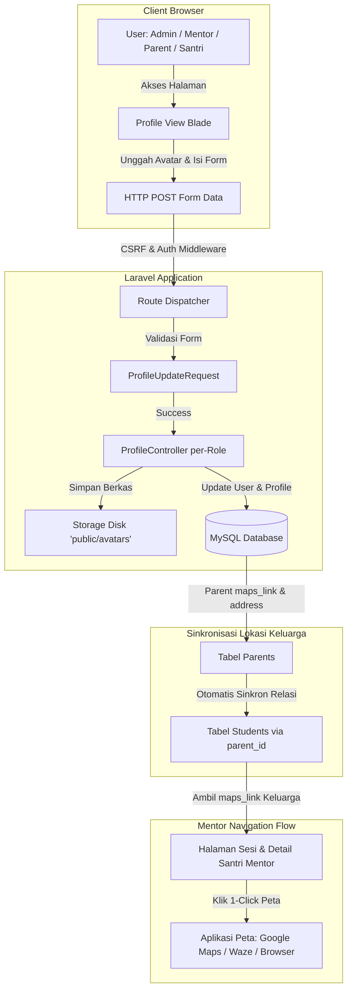

# Product Requirements Document (PRD): Sistem Manajemen Profil Multi-Role (Admin, Mentor, Parent, Santri)

| Dokumen | Spesifikasi Teknis & Kebutuhan Produk (PRD) |
| :--- | :--- |
| **Nama Dokumen** | `profile.md` |
| **Target Implementasi** | Junior Programmer / Fullstack Developer |
| **Target URL** | `/admin/profile`, `/mentor/profile`, `/parent/profile`, `/santri/profile` (alias `/student/profile`) |
| **Framework & Tech Stack** | Laravel 12, Blade Engine, Bootstrap 5.3, Vanilla CSS/JS (`style.css`, `scripts.js`), Pest Testing |
| **Status** | **Approved & Finalized (Siap Dikerjakan)** |

---

## 1. Executive Summary

### 1.1 Problem Statement
Saat ini portal Al-Hikmah LMS belum memiliki modul pengaturan profil yang terpadu dan dapat diedit secara mandiri oleh masing-masing pengguna di dashboardnya. Halaman profil mentor masih bersifat *read-only*, admin dan santri belum memiliki antarmuka pengaturan profil, serta wali santri belum dapat menyematkan tautan navigasi lokasi rumah (*share location Maps*) yang sangat dibutuhkan oleh guru/mentor privat untuk mendatangi rumah santri pada sesi belajar offline (*home private*).

### 1.2 Proposed Solution
Membangun modul **Manajemen Profil Multi-Role Mandiri** pada 4 dashboard role utama:
1. **Admin (`/admin/profile`)**: Manajemen identitas penanggung jawab platform, kontak pengelola, foto profil, dan keamanan kredensial.
2. **Mentor (`/mentor/profile`)**: Manajemen biodata ustadz/ustazah, spesialisasi kurikulum, **rekening pencairan honor (input mandiri langsung aktif tanpa validasi manual)**, foto profil resmi, alamat tinggal, dan keamanan akun.
3. **Parent / Wali Santri (`/parent/profile`)**: **Pusat tunggal (Single Source of Truth) lokasi keluarga**: input kontak darurat WhatsApp, alamat domisili, tautan navigasi titik peta (**fleksibel: Google Maps, Waze, Apple Maps, dll.**), yang otomatis tersinkronisasi ke seluruh akun santri/anaknya.
4. **Santri (`/santri/profile` & `/student/profile`)**: Antarmuka profil ramah anak untuk personalisasi nama panggilan, foto avatar santri, kontak, pembaruan password belajar, serta melihat alamat & titik peta yang **otomatis tersinkronisasi dari profil orang tua**.
5. **Integrasi Navigasi Mentor**: Tombol aksi langsung bagi mentor untuk membuka titik lokasi rumah santri via aplikasi peta pada halaman detail santri dan sesi belajar.

### 1.3 Success Criteria & Measurable KPIs
- **Completion Rate**: 100% dari 4 role (Admin, Mentor, Parent, Santri) dapat mengakses dan memperbarui data profil serta mengunggah foto profil tanpa hambatan.
- **Navigation Efficiency**: Mentor dapat mengakses tautan navigasi peta rumah santri dalam **<= 1 klik** langsung dari halaman sesi/detail santri dengan *zero-error* pembukaan aplikasi peta.
- **Single Source of Location**: Cukup 1 kali input lokasi oleh Orang Tua/Wali, 100% otomatis tersinkron ke semua data anak/santri dan terbaca oleh mentor terkait.
- **Upload Reliability**: Unggah foto profil berhasil diproses dalam waktu **< 1.5 detik** dengan kompresi/validasi berkas otomatis (maksimal 2MB, format JPG/PNG/WEBP).
- **Test Coverage**: Pengujian otomatis (*automated feature tests*) mencapai **>= 90% code coverage** pada controller profil dan form request baru.
- **Accessibility & Design Consistency**: 100% tampilan antarmuka selaras dengan *design tokens* `public/assets/css/style.css` serta mendukung mode Gelap (*Dark Mode*) bawaan platform.

---

## 2. User Experience & Functionality

### 2.1 User Personas
1. **Ustadz Abdullah (Admin / Superadmin)**: Memerlukan profil resmi untuk identitas komunikasi sistem dan keamanan akun pengelola.
2. **Ustazah Fatimah (Mentor / Guru Privat)**: Memerlukan profil yang menampilkan spesialisasi, biografi santun, nomor rekening honorarium (diperbarui mandiri tanpa verifikasi admin), serta membutuhkan titik peta alamat santri offline agar tidak tersesat saat menuju rumah santri.
3. **Bunda Siti (Orang Tua / Wali Santri)**: Menginginkan kemudahan membagikan tautan titik rumah peta (*share link*) langsung ke mentor, memperbarui nomor WhatsApp untuk pelaporan nilai, dan mengelola anak-anaknya cukup dari 1 tempat.
4. **Ahmad (Santri 10 Tahun)**: Menginginkan tampilan visual dashboard yang menarik, avatar personal, melihat data domisili keluarga yang tersinkron dari orang tua, dan kemudahan mengingat profil belajarnya.

### 2.2 Matrix Hak Akses & Field Profil Per-Role (Settled Rules)

| Field Profil | Admin (`/admin/profile`) | Mentor (`/mentor/profile`) | Parent (`/parent/profile`) | Santri (`/santri/profile`) | Ditampilkan ke Role Lain |
| :--- | :---: | :---: | :---: | :---: | :--- |
| **Nama Lengkap / Akun** | ✅ Edit | ✅ Edit | ✅ Edit | ✅ Edit | Publik/Internal |
| **Email Login** | ✅ Edit | ✅ Edit | ✅ Edit | ✅ Edit (Opsional/Wali) | Internal |
| **Nomor Telepon / WhatsApp** | ✅ Edit | ✅ Edit | ✅ Edit (Emergency) | ⚠️ Edit (Opsional) | Wali & Mentor |
| **Foto Profil (Avatar)** | ✅ Upload | ✅ Upload | ✅ Upload | ✅ Upload | Seluruh Pengguna Terkait |
| **Tanggal Lahir & Gender** | ❌ N/A | ✅ **Edit (Sinkron `/bergabung`)** | ❌ N/A | ❌ N/A | Internal |
| **Alamat Fisik / Domisili** | ✅ Edit | ✅ Edit | ✅ **Input Utama** | 🔄 **Otomatis Sinkron dari Wali** | Mentor (Sesi Offline) |
| **Kota / Kabupaten** | ❌ N/A | ✅ **Edit (Sinkron `/bergabung`)** | ❌ N/A | ❌ N/A | Internal |
| **Link Share Lokasi Rumah (Semua Peta)** | ❌ N/A | ❌ N/A | ✅ **Input Utama (Fleksibel)** | 🔄 **Otomatis Sinkron dari Wali** | **Wajib Dilihat Mentor** |
| **Pendidikan & Institusi** | ❌ N/A | ✅ **Edit (Sinkron `/bergabung`)** | ❌ N/A | ❌ N/A | Wali & Admin |
| **Hafalan (Juz) & Pengalaman (Thn)** | ❌ N/A | ✅ **Edit (Sinkron `/bergabung`)** | ❌ N/A | ❌ N/A | Wali & Admin |
| **Spesialisasi Mengajar & Bio** | ❌ N/A | ✅ Edit | ❌ N/A | ❌ N/A | Orang Tua & Admin |
| **Silsilah Sanad Al-Qur'an** | ❌ N/A | ✅ **Edit (Sinkron `/bergabung`)** | ❌ N/A | ❌ N/A | Wali & Admin |
| **Berkas CV & Sertifikat Sanad** | ❌ N/A | ✅ **Unduh & Update Dokumen** | ❌ N/A | ❌ N/A | Admin Rekrutmen |
| **Rekening Bank (Pencairan Honor)** | ❌ N/A | ✅ **Edit Mandiri (Tanpa Verifikasi Admin)** | ❌ N/A | ❌ N/A | Keuangan / Admin |
| **Ganti Password Akun** | ✅ Ada | ✅ Ada | ✅ Ada | ✅ Ada | Pribadi |

---

### 2.3 User Stories & Acceptance Criteria

#### Story 1: Update Profil & Foto Profil (All Roles)
> *Sebagai pengguna (Admin/Mentor/Parent/Santri), saya ingin memperbarui nama, email, no telp, dan mengunggah foto profil saya agar data identitas saya selalu akurat.*

**Acceptance Criteria:**
- [ ] Pengguna dapat melihat foto profil saat ini atau inisial nama jika belum ada foto.
- [ ] Pengguna dapat memilih foto dari komputer/smartphone melalui tombol "Pilih Foto".
- [ ] Sistem menampilkan *instant client-side image preview* sebelum tombol Simpan ditekan.
- [ ] Sistem menolak berkas non-gambar atau ukuran `> 2MB` dengan pesan error bahasa Indonesia yang jelas.
- [ ] Foto lama dihapus dari storage saat foto baru berhasil diunggah.
- [ ] Nama dan no telepon berhasil diperbarui di database tabel `users`.

#### Story 2: Input & Validasi Link Share Lokasi Rumah Fleksibel (Parent)
> *Sebagai orang tua, saya ingin memasukkan alamat rumah dan link share lokasi peta rumah saya (Google Maps / Waze / Apple Maps dll.) agar guru pendamping privat dapat langsung menavigasi ke rumah kami tanpa tersesat, dan data ini otomatis sinkron ke profil anak-anak saya.*

**Acceptance Criteria:**
- [ ] Pada halaman `/parent/profile`, terdapat input textarea untuk **Alamat Lengkap** dan input URL untuk **Tautan Lokasi Rumah (Share Location Link)**.
- [ ] Tautan bersifat fleksibel: Menerima link peta apa pun (Google Maps `maps.app.goo.gl` / `goo.gl/maps`, Waze `waze.com/ul`, Apple Maps `maps.apple.com`, OpenStreetMap, dll.) selama diawali `http://` atau `https://`.
- [ ] Dilengkapi petunjuk ringkas: *"Buka aplikasi peta (Google Maps/Waze/Apple Maps) di HP -> Pilih Titik Rumah -> Klik Bagikan (Share) -> Salin Tautan (Copy Link) lalu tempel di sini"*.
- [ ] Terdapat tombol interaktif **"Uji Buka Titik Peta"** di samping input URL yang membuka tautan di tab baru sehingga orang tua dapat memastikan tautan sudah tepat sebelum disimpan.
- [ ] Data tersimpan pada database tabel `parents` kolom `maps_link`.
- [ ] Seluruh anak binaan yang terhubung dengan orang tua ini otomatis menggunakan alamat dan `maps_link` yang sama.

#### Story 3: Akses Navigasi Lokasi Rumah Santri oleh Mentor
> *Sebagai mentor sesi offline, saya ingin melihat dan mengklik tautan peta rumah santri agar aplikasi peta di ponsel/laptop saya langsung membuka rute navigasi perjalanan ke rumah santri.*

**Acceptance Criteria:**
- [ ] Pada halaman **Detail Santri Mentor** (`/mentor/students/{id}`), terdapat kartu informasi alamat santri yang memuat tombol hijau: **"🗺️ Buka Rute Peta Lokasi"**.
- [ ] Pada halaman **Daftar Sesi Mentor** (`/mentor/sessions`), jika jenis sesi adalah `offline`, ikon pin peta dapat diklik dan mengarahkan langsung ke `maps_link` orang tua santri.
- [ ] Jika orang tua belum mengisi link peta, sistem menampilkan badge abu-abu: *"Titik peta belum ditambahkan wali"*.

#### Story 4: Sinkronisasi Penuh Formulir `/bergabung`, Portofolio & Rekening Bank Guru
> *Sebagai mentor, saya ingin seluruh data kualifikasi yang saya daftarkan di `/bergabung` (Pendidikan, Institusi, Jumlah Hafalan Juz, Pengalaman Mengajar, Sanad, Berkas Dokumen CV & Sertifikat) tampil lengkap dan dapat diperbarui di profil, serta dapat menginput rekening bank secara mandiri.*

**Acceptance Criteria:**
- [ ] Pada `/mentor/profile`, tampil seluruh isian yang pernah diisi saat mendaftar di `/bergabung`: Tanggal Lahir, Jenis Kelamin, Alamat, Kota, Pendidikan Terakhir, Institusi, Spesialisasi Bimbingan, Jumlah Hafalan Juz, Pengalaman Mengajar, Deskripsi Pengalaman (Bio), dan Sanad Al-Qur'an.
- [ ] Berkas dokumen CV dan Sertifikat yang diunggah saat pendaftaran dapat dilihat/diunduh secara aman via route `mentor.profile.document.download`.
- [ ] Guru dapat mengunggah pembaruan berkas CV (PDF maks 2MB) dan Sertifikat (PDF/JPG/PNG maks 2MB).
- [ ] Terdapat formulir rekening pencairan honor: Nama Bank, Nomor Rekening, dan Atas Nama Rekening yang langsung aktif mandiri tanpa approval admin.
- [ ] Perubahan data tersinkronisasi otomatis pada tabel `mentors` dan `mentor_applications`.

#### Story 5: Modul Profil Khusus Santri & Sinkronisasi Lokasi Keluarga (`/santri/profile`)
> *Sebagai santri, saya ingin melihat informasi belajar saya, nama panggilan, foto avatar, melihat alamat rumah yang tersinkron dari orang tua, dan mengganti password saya secara mandiri.*

**Acceptance Criteria:**
- [ ] Santri dapat mengakses endpoint `/santri/profile` atau `/student/profile`.
- [ ] Menampilkan informasi ringkasan: Total Poin, Streak Belajar, Program Terdaftar, dan Nama Pembimbing / Ustadz.
- [ ] Menampilkan alamat dan link peta lokasi rumah dengan label **"Sinkron dari Akun Orang Tua"** (read-only bagi santri, diedit terpusat oleh orang tua).
- [ ] Santri dapat memperbarui nama panggilan (*nickname*) dan mengganti password akun.

---

### 2.4 Non-Goals (Batasan Ruang Lingkup)
- ❌ Tidak membangun fitur geocoding otomatis via API berbayar Google Maps Platform (menggunakan format *URL Share link* native gratis yang disalin langsung dari aplikasi peta oleh wali santri).
- ❌ Tidak mengubah alur pendaftaran siswa baru atau struktur transaksi pembayaran paket belajar.
- ❌ Tidak membangun modul *face recognition* atau verifikasi biometrik pada foto profil.

---

## 3. Desain Antarmuka & Styling Sesuai `style.css` & `scripts.js`

### 3.1 Panduan Design System (`style.css`)
Junior programmer **wajib** memanfaatkan class dan CSS variable yang telah tersedia pada `public/assets/css/style.css`:

```css
/* Design Tokens Utama (Tersedia di style.css) */
--primary: #0d7a3e;              /* Hijau Al-Hikmah */
--primary-dark: #095c2e;         /* Hijau Tua */
--primary-light: #12a852;        /* Hijau Muda */
--primary-lighter: #e8f5e9;      /* Aksen Hijau Pudar */
--primary-gradient: linear-gradient(135deg, #0d7a3e 0%, #12a852 50%, #095c2e 100%);
--card-bg: #ffffff;
--radius-md: 12px;
--radius-lg: 20px;
--radius-pill: 9999px;
--shadow-sm: 0 2px 8px rgba(0, 0, 0, 0.06);
--shadow-md: 0 4px 20px rgba(0, 0, 0, 0.08);
--shadow-primary: 0 4px 20px rgba(13, 122, 62, 0.25);
```

### 3.2 Struktur Komponen Visual Profil (Blade Template Standard)

#### A. Komponen Avatar Uploader Interaktif
Gunakan komponen avatar melingkar dengan ikon kamera di pojok kanan bawah:
```html
<div class="d-flex flex-column align-items-center text-center mb-4">
    <div class="position-relative d-inline-block">
        avatar_url }}" 
             alt="Avatar {{ $user->name }}" 
             class="rounded-circle shadow-sm border border-3 border-success-subtle object-fit-cover"
             style="width: 120px; height: 120px;">
        <label for="avatarInput" 
               class="position-absolute bottom-0 end-0 bg-primary text-white rounded-circle p-2 shadow cursor-pointer d-flex align-items-center justify-content-center"
               style="width: 38px; height: 38px; cursor: pointer;"
               title="Ubah Foto Profil">
            <i class="bi bi-camera-fill"></i>
        </label>
        <input type="file" name="avatar" id="avatarInput" class="d-none" accept="image/png, image/jpeg, image/webp">
    </div>
    <div class="mt-2">
        <h5 class="fw-bold text-dark mb-0">{{ $user->name }}</h5>
        <span class="badge bg-success-subtle text-success rounded-pill px-3 py-1 mt-1">
            {{ $user->role?->label ?? 'Pengguna' }}
        </span>
    </div>
    <small class="text-muted mt-1">Format: JPG, PNG, atau WEBP. Maks 2MB.</small>
</div>
```

#### B. Komponen Form Input Link Share Lokasi Fleksibel (Parent Profile)
```html
<div class="col-12">
    <label class="form-label fw-semibold text-secondary small">
        <i class="bi bi-geo-alt-fill text-danger me-1"></i> Tautan Share Lokasi Rumah (Google Maps / Waze / Apple Maps)
    </label>
    <div class="input-group">
        <span class="input-group-text bg-light border-end-0 text-muted">
            <i class="bi bi-link-45deg"></i>
        </span>
        <input type="url" 
               name="maps_link" 
               id="mapsLinkInput"
               class="form-control border-start-0 ps-0" 
               placeholder="Contoh: https://maps.app.goo.gl/... atau https://waze.com/ul/..."
               value="{{ old('maps_link', $parent?->maps_link) }}">
        <button type="button" 
                class="btn btn-outline-success px-3" 
                id="btnTestMap"
                onclick="testMapLink()">
            <i class="bi bi-box-arrow-up-right me-1"></i> Uji Titik Peta
        </button>
    </div>
    <div class="form-text small text-muted">
        <i class="bi bi-info-circle me-1"></i> <strong>Satu link untuk sekeluarga:</strong> Tautan ini otomatis tersinkron ke semua profil anak/santri Anda dan digunakan Mentor untuk navigasi kunjungan tatap muka.
    </div>
</div>
```

#### C. Integrasi JavaScript Preview (`public/assets/js/scripts.js`)
Tambahkan script client-side berikut di footer view atau file `scripts.js`:
```javascript
// Instant Avatar Preview
document.getElementById('avatarInput')?.addEventListener('change', function(e) {
    const file = e.target.files[0];
    if (file) {
        if (file.size > 2 * 1024 * 1024) {
            alert('Ukuran file maksimal adalah 2MB!');
            this.value = '';
            return;
        }
        const reader = new FileReader();
        reader.onload = function(event) {
            document.getElementById('avatarPreview').src = event.target.result;
        };
        reader.readAsDataURL(file);
    }
});

// Test Map Link Opener (Mendukung semua link peta: Google Maps, Waze, Apple Maps, dll.)
function testMapLink() {
    const url = document.getElementById('mapsLinkInput')?.value.trim();
    if (!url) {
        alert('Silakan masukkan link lokasi peta terlebih dahulu.');
        return;
    }
    if (!url.startsWith('http://') && !url.startsWith('https://')) {
        alert('Link harus diawali dengan http:// atau https://');
        return;
    }
    window.open(url, '_blank');
}
```

---

## 4. Technical Specifications & Architecture

### 4.1 Data Flow Architecture (Mermaid)



### 4.2 Database Changes (Migrations)

Junior programmer harus membuat migration baru:
```bash
php artisan make:migration add_profile_fields_to_users_and_parents_tables
```

#### Spesifikasi Perubahan Kolom Database:
1. **Tabel `parents`**:
   - Tambahkan kolom `maps_link` (`string, 500, nullable`) setelah `address`.
2. **Tabel `mentors`**:
   - Tambahkan kolom `address` (`text, nullable`) setelah `bio`.
   - Pastikan `bank_name`, `bank_account_number`, `bank_account_name` terdaftar di `$fillable` Model `Mentor`.
3. **Tabel `students`**:
   - Tambahkan `nickname` (`string, 50, nullable`) setelah `full_name`.
4. **Tabel `users`**:
   - Kolom `avatar`, `phone` sudah ada di database.

#### Kode Migration Lengkap (`database/migrations/...`):
```php
<?php

use Illuminate\Database\Migrations\Migration;
use Illuminate\Database\Schema\Blueprint;
use Illuminate\Support\Facades\Schema;

return new class extends Migration
{
    public function up(): void
    {
        Schema::table('parents', function (Blueprint $table) {
            if (!Schema::hasColumn('parents', 'maps_link')) {
                $table->string('maps_link', 500)->nullable()->after('address');
            }
        });

        Schema::table('mentors', function (Blueprint $table) {
            if (!Schema::hasColumn('mentors', 'address')) {
                $table->text('address')->nullable()->after('bio');
            }
        });

        Schema::table('students', function (Blueprint $table) {
            if (!Schema::hasColumn('students', 'nickname')) {
                $table->string('nickname', 50)->nullable()->after('full_name');
            }
        });
    }

    public function down(): void
    {
        Schema::table('parents', function (Blueprint $table) {
            $table->dropColumn('maps_link');
        });

        Schema::table('mentors', function (Blueprint $table) {
            $table->dropColumn('address');
        });

        Schema::table('students', function (Blueprint $table) {
            $table->dropColumn('nickname');
        });
    }
};
```

---

### 4.3 Routing Specifications (`routes/web.php`)

Junior programmer wajib mendaftarkan route berikut di dalam grup middleware masing-masing role:

```php
// ==========================================
// 📌 1. ROUTE PROFILE ADMIN
// ==========================================
Route::middleware(['auth', 'role:admin'])->prefix('admin')->name('admin.')->group(function () {
    Route::get('/profile', [App\Http\Controllers\Admin\AdminProfileController::class, 'edit'])->name('profile.edit');
    Route::post('/profile', [App\Http\Controllers\Admin\AdminProfileController::class, 'update'])->name('profile.update');
    Route::post('/profile/password', [App\Http\Controllers\Admin\AdminProfileController::class, 'updatePassword'])->name('profile.password');
});

// ==========================================
// 📌 2. ROUTE PROFILE MENTOR
// ==========================================
Route::middleware(['auth', 'role:mentor'])->prefix('mentor')->name('mentor.')->group(function () {
    Route::get('/profile', [App\Http\Controllers\Mentor\MentorProfileController::class, 'edit'])->name('profile');
    Route::post('/profile', [App\Http\Controllers\Mentor\MentorProfileController::class, 'update'])->name('profile.update');
    Route::post('/profile/password', [App\Http\Controllers\Mentor\MentorProfileController::class, 'updatePassword'])->name('profile.password');
});

// ==========================================
// 📌 3. ROUTE PROFILE PARENT (Lengkapi maps_link)
// ==========================================
Route::middleware(['auth', 'role:parent'])->prefix('parent')->name('parent.')->group(function () {
    Route::get('/profile', [App\Http\Controllers\Parent\ParentProfileController::class, 'edit'])->name('profile.edit');
    Route::post('/profile', [App\Http\Controllers\Parent\ParentProfileController::class, 'update'])->name('profile.update');
    Route::post('/profile/password', [App\Http\Controllers\Parent\ParentProfileController::class, 'updatePassword'])->name('profile.password');
});

// ==========================================
// 📌 4. ROUTE PROFILE SANTRI / STUDENT
// ==========================================
Route::middleware(['auth', 'role:student'])->group(function () {
    Route::prefix('student')->name('student.')->group(function () {
        Route::get('/profile', [App\Http\Controllers\Student\StudentProfileController::class, 'edit'])->name('profile.edit');
        Route::post('/profile', [App\Http\Controllers\Student\StudentProfileController::class, 'update'])->name('profile.update');
        Route::post('/profile/password', [App\Http\Controllers\Student\StudentProfileController::class, 'updatePassword'])->name('profile.password');
    });

    // Alias URL ramah bahasa Indonesia /santri/profile
    Route::get('/santri/profile', [App\Http\Controllers\Student\StudentProfileController::class, 'edit'])->name('santri.profile');
});
```

---

### 4.4 Model & Helper Relasi Sinkronisasi Lokasi Santri

Pada model `Student.php` (`app/Models/Student.php`), tambahkan accessor helper agar lokasi dan link peta otomatis mengambil data dari profil orang tua tanpa duplikasi data:

```php
/**
 * Dapatkan Tautan Peta Lokasi Rumah (Sinkron dari Orang Tua)
 */
public function getMapsLinkAttribute(): ?string
{
    return $this->parent?->maps_link;
}

/**
 * Dapatkan Alamat Rumah Lengkap (Sinkron dari Orang Tua atau fallback data pendaftaran)
 */
public function getEffectiveAddressAttribute(): string
{
    return $this->parent?->address ?: ($this->getFullAddress() ?: 'Alamat belum diatur oleh wali.');
}
```

Dan pada model `User.php` (`app/Models/User.php`), pastikan helper accessor avatar terpasang:
```php
public function getAvatarUrlAttribute(): string
{
    if ($this->avatar && \Illuminate\Support\Facades\Storage::disk('public')->exists($this->avatar)) {
        return asset('storage/' . $this->avatar);
    }

    $name = urlencode($this->name ?? 'User');
    return "https://ui-avatars.com/api/?name={$name}&background=0d7a3e&color=ffffff&size=200&bold=true";
}
```

---

### 4.5 Controller Mentor: Pengelolaan Rekening Mandiri
Pada `MentorProfileController.php`, pastikan field bank langsung diupdate ke model `Mentor` tanpa approval manual:
```php
$mentor = $user->mentor;
if ($mentor) {
    $mentor->update([
        'bio' => $request->bio,
        'address' => $request->address,
        'specialization' => $request->specialization,
        'bank_name' => $request->bank_name,
        'bank_account_number' => $request->bank_account_number,
        'bank_account_name' => $request->bank_account_name,
    ]);
}
```

---

## 5. Rincian Fitur Khusus: Link Share Lokasi Rumah & Navigasi Mentor

### 5.1 Format URL Peta Fleksibel yang Valid
Sesuai keputusan produk, platform mendukung **semua layanan peta terkemuka**:
1. **Google Maps**: `https://maps.app.goo.gl/...`, `https://goo.gl/maps/...`, `https://maps.google.com/?q=...`
2. **Waze**: `https://waze.com/ul?ll=...`
3. **Apple Maps**: `https://maps.apple.com/?address=...`
4. **OpenStreetMap / Generic GPS**: `https://...`

**Aturan Validasi Form Request:**
```php
'maps_link' => ['nullable', 'url', 'max:500'],
```

### 5.2 Tampilan Lokasi Santri pada Portal Mentor
Pada view **Detail Santri Mentor** (`resources/views/mentor/students/show.blade.php`) dan **Sesi Belajar** (`resources/views/mentor/sessions/index.blade.php`):
```blade
@php
    $mapsLink = $student->maps_link;
@endphp

<div class="card border-0 shadow-sm rounded-4 p-3 mb-3 bg-white">
    <div class="d-flex align-items-center justify-content-between flex-wrap gap-2">
        <div>
            <div class="fw-semibold text-dark">
                <i class="bi bi-geo-alt-fill text-danger me-1"></i> Alamat Rumah Santri (Tatap Muka)
            </div>
            <p class="text-secondary small mb-0 mt-1">
                {{ $student->effective_address }}
            </p>
        </div>
        <div>
            @if($mapsLink)
                <a href="{{ $mapsLink }}" 
                   target="_blank" 
                   rel="noopener noreferrer" 
                   class="btn btn-success rounded-pill px-3 py-2 fw-semibold shadow-sm btn-sm d-inline-flex align-items-center gap-1">
                    <i class="bi bi-pin-map-fill"></i>
                    <span>Buka Rute Navigasi</span>
                    <i class="bi bi-box-arrow-up-right ms-1" style="font-size: 0.75rem;"></i>
                </a>
            @else
                <span class="badge bg-secondary-subtle text-secondary rounded-pill px-3 py-2 small">
                    <i class="bi bi-geo-alt me-1"></i> Link Peta Belum Diisi Wali
                </span>
            @endif
        </div>
    </div>
</div>
```

---

## 6. Implementation Roadmap for Junior Programmer

```
┌─────────────────────────────────────────────────────────────┐
│ LANGKAH 1: DATABASE & MODELS                                │
│ 1. Buat migration add_profile_fields_to_users_and_parents  │
│ 2. Tambah fillable di ParentProfile, Mentor, Student        │
│ 3. Tambah accessor getMapsLinkAttribute() di Student.php    │
│ 4. Tambah accessor getAvatarUrlAttribute() di User.php      │
└──────────────────────────────┬──────────────────────────────┘
                               │
                               ▼
┌─────────────────────────────────────────────────────────────┐
│ LANGKAH 2: CONTROLLERS & FORM REQUESTS                      │
│ 1. Buat AdminProfileController                              │
│ 2. Buat MentorProfileController (migrasi dari readonly)     │
│ 3. Perbarui ParentProfileController (tambah avatar & map)   │
│ 4. Buat StudentProfileController                            │
│ 5. Buat FormRequest ProfileUpdateRequest                    │
└──────────────────────────────┬──────────────────────────────┘
                               │
                               ▼
┌─────────────────────────────────────────────────────────────┐
│ LANGKAH 3: VIEWS & TEMPLATING                               │
│ 1. Buat resources/views/admin/profile/edit.blade.php        │
│ 2. Perbarui resources/views/mentor/profile.blade.php        │
│ 3. Perbarui resources/views/parent/profile/edit.blade.php   │
│ 4. Buat resources/views/student/profile/edit.blade.php      │
└──────────────────────────────┬──────────────────────────────┘
                               │
                               ▼
┌─────────────────────────────────────────────────────────────┐
│ LANGKAH 4: INTEGRASI LAYOUTS & MENTOR MAP ACCESS            │
│ 1. Hubungkan menu dropdown profil di layouts/admin.blade    │
│ 2. Hubungkan menu dropdown profil di layouts/mentor.blade   │
│ 3. Hubungkan menu dropdown profil di layouts/parent.blade   │
│ 4. Hubungkan menu sidebar & dropdown di layouts/student     │
│ 5. Pasang tombol navigasi peta di mentor/students/show.blade│
└──────────────────────────────┬──────────────────────────────┘
                               │
                               ▼
┌─────────────────────────────────────────────────────────────┐
│ LANGKAH 5: TESTING & CODE STYLE FORMATTING                  │
│ 1. Buat Feature Test: ProfileManagementTest                 │
│ 2. Jalankan: php artisan test --filter=ProfileManagement    │
│ 3. Jalankan: vendor/bin/pint --dirty --format agent         │
└─────────────────────────────────────────────────────────────┘
```

---

## 7. Security, Privacy & Validation Safeguards

1. **Proteksi IDOR (Insecure Direct Object Reference)**:
   - Dilarang keras menerima `$user_id` dari input form POST (`$request->input('user_id')`).
   - Wajib menggunakan user yang terautentikasi: `$user = auth()->user();`.
2. **Validasi File Upload**:
   - `avatar => 'nullable|image|mimes:jpeg,png,jpg,webp|max:2048'`.
   - Hindari ekstensi berkas yang dieksekusi server (PHP, SVG, executable).
3. **Penyimpanan Berkas**:
   - Simpan pada direktori disk `public/avatars`.
   - Pastikan `php artisan storage:link` sudah terpasang.
4. **Keamanan Pergantian Password**:
   - Wajib memverifikasi password lama (`Hash::check($request->current_password, $user->password)`).
   - Password baru minimal 8 karakter dengan konfirmasi (`confirmed`).
5. **Keamanan URL Peta**:
   - Validasi menggunakan rule `url` dan sanitasi output dengan `e()` / Blade `{{ }}` untuk mencegah serangan XSS via atribut `href`.

---

## 8. Test Enforcement Plan (Pest PHP)

Junior programmer harus menyertakan file test `tests/Feature/ProfileManagementTest.php` dengan cakupan pengujian berikut:

1. `test('admin can view and update their profile with avatar')`
2. `test('mentor can update bio, bank account directly without approval, and phone')`
3. `test('parent can update address and flexible map share link')`
4. `test('student profile inherits location from parent automatically')`
5. `test('mentor can see student parent map link on student detail')`
6. `test('student can view profile and update password')`
7. `test('profile update rejects avatar larger than 2mb')`
8. `test('password update fails with wrong current password')`

---

## 9. Keputusan Desain Terkonfirmasi (Settled Design Decisions)

Berikut keputusan resmi yang telah disepakati dan menjadi acuan mutlak implementasi:
1. **Penyimpanan Alamat & Lokasi Santri (Terkonfirmasi)**:
   - Sumber data utama (*Single Source of Truth*) berada pada profil **Orang Tua / Wali** (`parents.address` dan `parents.maps_link`).
   - Cukup **1 kali input link lokasi** per keluarga yang otomatis tersinkron ke semua fitur dan akun anak/santri binaannya.
2. **Rekening Bank Mentor (Terkonfirmasi)**:
   - Nomor rekening dan nama bank diunggah/diperbarui secara mandiri oleh mentor masing-masing langsung di halaman profilnya tanpa perlu proses validasi/persetujuan manual admin.
3. **Format Link Share Lokasi (Terkonfirmasi)**:
   - Format tautan lokasi rumah bersifat **fleksibel** (mendukung Google Maps, Waze, Apple Maps, OpenStreetMap, dll.) asalkan diawali protokol valid `http://` atau `https://`.
