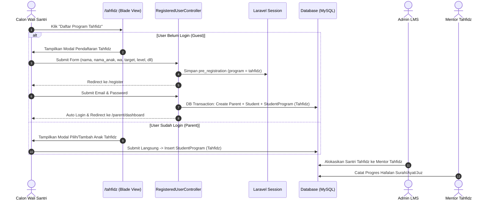

# 📘 PRODUCT REQUIREMENTS DOCUMENT (PRD)
## MODUL PENDAFTARAN & INTEGRASI PROGRAM TAHFIDZ AL-QUR'AN

> **Nama Fitur:** Pendaftaran & Integrasi Terpadu Program Tahfidz Al-Qur'an (`/tahfidz`)  
> **Target Pengguna:** Calon Wali Santri (Guest), Wali Santri Terdaftar (Parent), Administrator (Admin), dan Pengajar (Mentor Tahfidz)  
> **Status Dokumen:** 📝 **Draft Rencana Kerja & Spesifikasi Teknis (Production Blueprint)**  
> **Versi:** 1.0  
> **Tanggal:** 13 Agustus 2026  

---

## 1. EXECUTIVE SUMMARY

### 1.1 Problem Statement
Pada halaman publik `/tahfidz` (`resources/views/tahfidz.blade.php`), tombol **"Daftar Program Tahfidz"** saat ini masih mengarahkan pengguna ke pesan manual WhatsApp (`wa_url(...)`). Hal ini menyebabkan:
1. **Data Tercecer & Tidak Terstruktur**: Data pendaftar Tahfidz tidak tersimpan di database sistem.
2. **Nama Orang Tua & Anak Rawan Tertukar**: Proses manual lewat WA sering membingungkan identitas nama Wali dan nama Santri.
3. **Akun Belum Otomatis Dibuat**: Orang tua yang berminat tidak langsung dibuatkan portal akun `parent` dan akun `student`.
4. **Admin & Guru Sulit Melacak Target Hafalan**: Admin tidak bisa mengalokasikan pengajar Tahfidz berdasarkan target juz/surah awal santri secara otomatis.

### 1.2 Proposed Solution
Mengubah tombol pendaftaran pada route `/tahfidz` agar terintegrasi penuh ke dalam sistem LMS dengan alur pintar:
- **Pengguna Belum Login (Guest)**: Menampilkan modal form pendaftaran khusus Tahfidz (`modal-tahfidz-daftar.blade.php`). Form mengumpulkan data lengkap (Nama Wali, Nama Anak, No. WA, Usia, Gender, Lokasi, Target Hafalan/Juz, Level Hafalan Saat Ini, dan Metode Belajar). Data disimpan ke Session (`pre_registration`) dan diarahkan ke `/register` dengan role otomatis `parent`.
- **Pengguna Sudah Login (Parent)**: Menampilkan modal pendaftaran kelas Tahfidz langsung di mana Wali Santri dapat memilih anak yang sudah ada atau mendaftarkan anak baru ke Program Tahfidz tanpa buat akun Wali baru.
- **Integrasi Admin Dashboard**: Pendaftaran Tahfidz masuk ke antrean Admin untuk alokasi Mentor Tahfidz yang sesuai kuota & ketersediaan hari mengajar.
- **Integrasi Mentor Dashboard**: Guru Tahfidz dapat melihat target juz/surah santri dan mencatat progres hafalan harian (Surah start-end, ayat, juz, nilai tajwid/kelancaran).

### 1.3 Success Criteria (KPIs)
- **100% Retensi Data**: Pendaftaran dari halaman `/tahfidz` tersimpan otomatis ke database (`users`, `parents`, `students`, `student_program`).
- **Akurasi Identitas 100%**: Nama Orang Tua dan Nama Santri terpisah secara jelas di database & tampilan UI.
- **Kecepatan Konversi Pendaftaran**: Calon santri terdaftar dan mendapatkan akun portal dalam < 2 menit.
- **Efisiensi Alokasi Admin**: Admin dapat mengalokasikan santri Tahfidz ke Mentor Tahfidz yang tepat dalam < 3 klik di dashboard.

---

## 2. USER EXPERIENCE & FUNCTIONALITY

### 2.1 User Personas
1. **Calon Wali Santri (Guest)**: Ingin mendaftarkan anaknya ke program Tahfidz Al-Qur'an secara praktis dan langsung mendapatkan akses portal pemantauan.
2. **Wali Santri Terdaftar (Parent)**: Ingin mengikutsertakan anaknya ke Program Tahfidz tambahan dari portal yang sudah dimiliki.
3. **Admin Lembaga (Admin)**: Memverifikasi pendaftaran Tahfidz, mengalokasikan ke pengajar Tahfidz yang memili kuota hari mengajar, dan mengelola pembayaran SPP Tahfidz.
4. **Pengajar Tahfidz (Mentor)**: Menerima santri binaan Tahfidz baru, membaca target juz/level awal, dan mengisi catatan kelancaran setoran hafalan.

### 2.2 User Stories & Acceptance Criteria

#### User Story 1: Pra-Pendaftaran Tahfidz oleh Guest
`As a Calon Wali Santri (Guest), I want to click 'Daftar Program Tahfidz' on /tahfidz so that I can fill in my child's Tahfidz registration details without being redirected to manual WhatsApp.`
- **Acceptance Criteria**:
  - Tombol pada `resources/views/tahfidz.blade.php` mengeksekusi modal `modal-tahfidz-daftar` (BUKAN link WA).
  - Modal mengumpulkan field:
    - Nama Orang Tua / Wali (`nama`) - *Required*
    - Nama Santri / Anak (`nama_anak`) - *Required*
    - Nomor WhatsApp (`whatsapp`) - *Required*
    - Usia Anak (`usia`) - *Required*
    - Jenis Kelamin (`gender`) - *Dropdown L/P, Required*
    - Lokasi / Kota (`lokasi`) - *Required*
    - Target Hafalan (`target_tahfidz`) - *Dropdown: Juz 30 (Juz Amma), Juz 29, Surah Al-Baqarah, Target 30 Juz, Bebas/Bertahap*
    - Level Hafalan Saat Ini (`level_tahfidz`) - *Dropdown: Pemula (Belum ada hafalan), Juz 30 Sebagian, Sudah Hafal 1-3 Juz, Lanjutan > 3 Juz*
    - Metode Belajar (`metode`) - *Dropdown: Online, Home Visit/Offline, Hybrid*
  - Saat disubmit, data tersimpan di Session `pre_registration` dengan flag `program_slug = 'tahfidz'`.
  - User langsung diarahkan ke halaman `/register` dengan notifikasi banner banner info pendaftaran Tahfidz.

#### User Story 2: Registrasi & Akun Otomatis
`As a Parent registering after filling Tahfidz Form, I want my parent account and child's student account to be created automatically so we both can access the LMS dashboard.`
- **Acceptance Criteria**:
  - Di halaman `/register`, role terkunci secara otomatis sebagai **Orang Tua / Wali (`parent`)**.
  - Setelah melengkapi email & password:
    - Akun User Parent dibuat (`role = parent`) + profil `ParentProfile`.
    - Akun User Student dibuat (`role = student`, email otomatis dari slug nama anak, password random 10 karakter) + profil `Student`.
    - Record `Student` menyimpan data `full_name = nama_anak`, `age`, `gender`, `location`, serta catatan awal `notes = Target: [target_tahfidz] | Level: [level_tahfidz]`.
    - Terhubung otomatis ke `Program` Tahfidz Al-Qur'an pada tabel pivot `student_program`.

#### User Story 3: Pendaftaran Tahfidz untuk Parent Terdaftar
`As an existing Parent user, I want to enroll my child directly into Program Tahfidz from the /tahfidz page without creating a new Parent account.`
- **Acceptance Criteria**:
  - Jika pengguna sudah login sebagai `parent`, tombol di `/tahfidz` membuka modal pendaftaran kelas Tahfidz khusus user terdaftar (`modal-tahfidz-logged-in.blade.php`).
  - Wali dapat memilih anak yang sudah terdaftar ATAU memilih "Tambah Anak Baru".
  - Langsung mendaftarkan anak ke program Tahfidz di database tanpa perlu proses registrasi ulang.

#### User Story 4: Kelola & Alokasi oleh Admin
`As an Admin, I want to view Tahfidz enrollments and assign specialized Tahfidz Mentors based on teacher availability.`
- **Acceptance Criteria**:
  - Admin dapat memfilter santri Program Tahfidz di `/admin/students` dan `/admin/mentors/availability`.
  - Admin melihat catatan awal target & level Tahfidz anak saat memilih mentor.
  - Alokasi mentor memperhitungkan sisa kuota hari mengajar mentor Tahfidz.

#### User Story 5: Bimbingan & Setoran Hafalan oleh Mentor Tahfidz
`As a Tahfidz Mentor, I want to see my student's Tahfidz targets and record their daily memorization progress.`
- **Acceptance Criteria**:
  - Mentor melihat badge "Program Tahfidz" dan target juz/surah anak pada Dashboard Mentor & Data Santri.
  - Form pencatatan progres (`/mentor/progress/create`) secara otomatis mengisi kategori `Tahfidz` atau `Murojaah` untuk santri program ini.

### 2.3 Non-Goals
- **Fitur Video Call Streaming Internal**: Aplikasi tidak membuat server video call sendiri, melainkan menggunakan link Zoom / Google Meet / WhatsApp Call yang sudah didukung pada modul sesi.
- **Tes Penempatan Otomatis AI (Placement Test AI)**: Evaluasi awal dilakukan langsung oleh Mentor Tahfidz pada sesi pertama bimbingan.

---

## 3. TECHNICAL SPECIFICATIONS

### 3.1 Architecture Overview & Data Flow



### 3.2 Database Schema Updates
Untuk mendukung pencatatan spesifik Program Tahfidz, tambahkan kolom penunjang pada migrasi / model jika belum ada:

```sql
-- Tambahan atribut pada tabel students (opsional / via notes terstruktur)
ALTER TABLE `students` ADD COLUMN `target_tahfidz` VARCHAR(100) NULL AFTER `notes`;
ALTER TABLE `students` ADD COLUMN `level_tahfidz` VARCHAR(100) NULL AFTER `target_tahfidz`;
```

### 3.3 API & Route Endpoints

| Method | URI Path | Controller Method | Fungsi / Deskripsi |
|:--:|:--|:--|:--|
| `GET` | `/tahfidz` | `PageController@tahfidz` | Menampilkan halaman landing page Program Tahfidz. |
| `POST` | `/tahfidz/pre-register` | `Auth\RegisteredUserController@preRegisterTahfidz` | Menyimpan data pra-pendaftaran khusus Tahfidz ke Session. |
| `POST` | `/parent/enroll-tahfidz` | `Parent\ParentChildController@enrollTahfidz` | Mendaftarkan anak dari Wali yang sudah login ke Program Tahfidz. |
| `GET` | `/register` | `Auth\RegisteredUserController@create` | Halaman form registrasi akun (membaca session Tahfidz jika ada). |
| `POST` | `/register` | `Auth\RegisteredUserController@store` | Memproses pendaftaran final (Parent + Student + Tahfidz Program). |

---

## 4. TAHAPAN IMPLEMENTASI (DEVELOPMENT ROADMAP)

Implementasi fitur ini dibagi menjadi **4 Tahapan Utama** yang terstruktur:

### 📍 Tahap 1: Pembuatan Form Modal Pendaftaran Tahfidz (`tahfidz-form.blade.php`)
1. Buat partial view baru: `resources/views/partials/modal-tahfidz-daftar.blade.php`.
2. Buat partial view untuk user terdaftar: `resources/views/partials/modal-tahfidz-logged-in.blade.php`.
3. Update `resources/views/tahfidz.blade.php`: Ubah tombol "Daftar Program Tahfidz" (`L46-L49`) untuk memicu modal pendaftaran Tahfidz (`data-bs-toggle="modal" data-bs-target="#tahfidzDaftarModal"`).

### 📍 Tahap 2: Pengembangan Backend Controller & Session Handling
1. Tambahkan method `preRegisterTahfidz()` pada `app/Http/Controllers/Auth/RegisteredUserController.php`.
2. Validasi input: `nama`, `nama_anak`, `whatsapp`, `usia`, `gender`, `lokasi`, `target_tahfidz`, `level_tahfidz`, `metode`.
3. Simpan data ke session `pre_registration` dengan flag `is_tahfidz = true` dan `program_slug = 'tahfidz'`.
4. Update `store()` pada `RegisteredUserController.php` agar menyimpan `target_tahfidz` dan `level_tahfidz` ke catatan/profil `Student`, serta otomatis menghubungkan ke `Program` Tahfidz Al-Qur'an.
5. Buat method `enrollTahfidz()` pada `ParentChildController.php` untuk memproses pendaftaran anak oleh Wali yang sudah login.

### 📍 Tahap 3: Integrasi Admin Dashboard & Alokasi Mentor Tahfidz
1. Update `admin/mentors/availability.blade.php` & `Admin\MentorAvailabilityController.php` agar menampilkan badge "Program Tahfidz" dan target juz/surah anak saat memilih santri untuk dialokasikan.
2. Pastikan notifikasi alokasi dikirimkan ke Mentor Tahfidz dan Wali Santri.

### 4. Integrasi Mentor Dashboard & Verification Testing
1. Update tampilan `mentor/dashboard.blade.php` dan `mentor/students/index.blade.php` untuk menampilkan informasi target Tahfidz anak.
2. Buat Automated Feature Test Pest PHP (`tests/Feature/TahfidzRegistrationTest.php`) untuk menguji seluruh alur (Guest -> Session -> Register -> Student & Parent Account -> Admin Allocation -> Mentor View).
3. Jalankan `vendor/bin/pint` dan `php artisan test` untuk memastikan 100% PASS.

---

## 5. RISKS & MITIGATIONS

| Potensi Risiko | Tingkat Risiko | Strategi Mitigasi / Solusi |
|:---|:--:|:---|
| **Session Kadaluarsa saat Registrasi** | Sedang | Jika session `pre_registration` hilang, halaman `/register` tetap mengizinkan registrasi normal sebagai Parent dengan form input data anak manual. |
| **Email Anak Duplicate** | Rendah | Menggunakan generator slug unik berformat `[nama-anak]-[random3]@alhikmah.com` untuk menjamin keunikan email akun Student. |
| **Mentor Penuh / Tidak Memiliki Kuota Tahfidz** | Sedang | Matriks ketersediaan Admin memberikan peringatan visual jika kuota mentor penuh pada hari yang dipilih. |

---

> **Dokumen PRD ini telah disusun menggunakan skill `/prd` dan siap digunakan sebagai panduan eksekusi pengembangan.**
