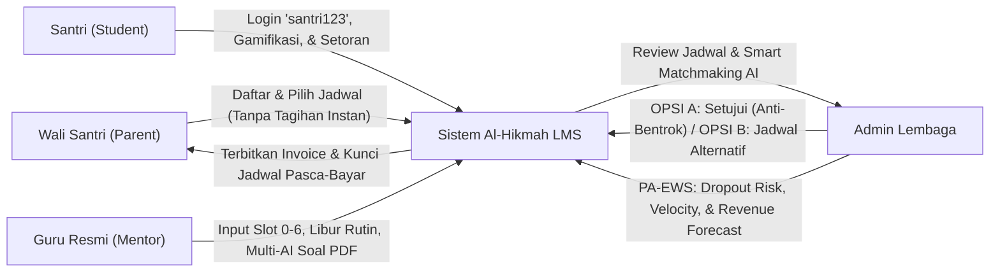
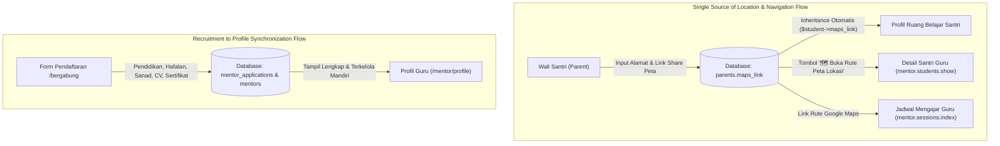

# 🕌 LAPORAN EKSEKUTIF PROYEK & PANDUAN APLIKASI: AL-HIKMAH LMS

> **Dokumen Resmi untuk Manajemen, Pimpinan Lembaga, & Tim Pengembang**  
> **Nama Sistem:** AL-HIKMAH Learning Management System (LMS)  
> **Status Aplikasi:** ✅ **100% Selesai, Teruji, & Siap Digunakan (Production Ready)**  
> **Versi:** 9.5 (Full Spectrum Enterprise: ATS Pipeline 7-Tahapan, Live Probation Hub & Modul Orientasi, Single Source Lokasi Peta Keluarga Multi-Role, Admin Mentor Detail 5-Card, Rating Pasca Sesi Wali Santri, & Penyelarasan Frontend Antislop-UI)  
> **Tanggal Pembaruan:** 07 September 2026  

---

## 📋 DAFTAR ISI LAPORAN

1. [📌 1. Ringkasan Eksekutif & Nilai Manfaat Aplikasi](#-1-ringkasan-eksekutif--nilai-manfaat-aplikasi)
2. [🎓 2. Modul Rekrutmen, Ujian Kompetensi, & Masa Percobaan Guru](#-2-modul-rekrutmen-ujian-kompetensi--masa-percobaan-guru)
   - [2.1 Alur Seleksi & Kategori Ujian Kompetensi](#21-alur-seleksi--kategori-ujian-kompetensi)
   - [2.2 Isolasi Hak Akses Dashboard (Gating Lifecycle)](#22-isolasi-hak-akses-dashboard-gating-lifecycle)
   - [2.3 Fitur Manajemen Cuti & Guru Pengganti (Mentor Leave & Substitute)](#23-fitur-manajemen-cuti--guru-pengganti-mentor-leave--substitute)
   - [2.4 ATS Pipeline 7-Tahapan & 1-Klik Verifikasi Berkas (Paket 15 Soal Seleksi AI & Notifikasi WhatsApp)](#24-ats-pipeline-7-tahapan--1-klik-verifikasi-berkas-paket-15-soal-seleksi-ai--notifikasi-whatsapp)
   - [2.5 Revitalisasi Modul Masa Percobaan (Live Probation Hub, 4 Pilar Orientasi, & Lencana M01)](#25-revitalisasi-modul-masa-percobaan-live-probation-hub-4-pilar-orientasi--lencana-m01)
   - [2.6 Cron Sinkronisasi Harian Masa Percobaan & Peringatan Otomatis WhatsApp H-14](#26-cron-sinkronisasi-harian-masa-percobaan--peringatan-otomatis-whatsapp-h-14)
   - [2.7 Detail Profil Lengkap Guru, Verifikasi Rekening Bank & Student Hand-Over Wizard](#27-detail-profil-lengkap-guru-adminstaffid-verifikasi-rekening-bank--student-hand-over-wizard)
   - [2.8 Sistem Pendukung Keputusan (SPK) Pemilihan Guru Teladan Berbasis Analytical Hierarchy Process (AHP Saaty)](#28-sistem-pendukung-keputusan-spk-pemilihan-guru-teladan-berbasis-analytical-hierarchy-process-ahp-saaty)
3. [🤖 3. Modul AI Auto-Generate Soal, Bank Soal, & Lembar Ujian PDF](#-3-modul-ai-auto-generate-soal-bank-soal--lembar-ujian-pdf)
   - [3.1 Format Lembar Ujian Siap Cetak A4 & Kunci Jawaban Guru](#31-format-lembar-ujian-siap-cetak-a4--kunci-jawaban-guru)
   - [3.2 Arsitektur Universal Multi-Provider AI & UI Selector](#32-arsitektur-universal-multi-provider-ai--ui-selector)
   - [3.3 Smart Cascade Failover Engine (Zero Downtime)](#33-smart-cascade-failover-engine-zero-downtime)
   - [3.4 Bank Kurikulum Offline Al-Hikmah (Fallback Engine)](#34-bank-kurikulum-offline-al-hikmah-fallback-engine)
4. [⏰ 4. Modul Ketersediaan Mengajar Angka Slot (0–6) & Kebijakan Anti-Bentrok 1-on-1](#-4-modul-ketersediaan-mengajar-angka-slot-06--kebijakan-anti-bentrok-1-on-1)
   - [4.1 Standarisasi Master Angka Slot Waktu (0–6)](#41-standarisasi-master-angka-slot-waktu-06)
   - [4.2 Smart WhatsApp Text Importer & Exporter Jadwal](#42-smart-whatsapp-text-importer--exporter-jadwal)
   - [4.3 Fitur Hari Bebas (Libur Rutin) Mentor & Day-Off Monitoring Center](#43-fitur-hari-bebas-libur-rutin-mentor--day-off-monitoring-center)
   - [4.4 Prinsip Bimbingan Privat 1-on-1 & Proteksi Anti-Bentrok (Zero Double-Booking)](#44-prinsip-bimbingan-privat-1-on-1--proteksi-anti-bentrok-zero-double-booking)
   - [4.5 Alur Penugasan Admin (OPSI A: Setujui vs OPSI B: Tawarkan Alternatif)](#45-alur-penugasan-admin-opsi-a-setujui-vs-opsi-b-tawarkan-alternatif)
5. [🧮 5. Modul Smart Matchmaking AI v2.1 & Aturan Syariat Gender](#-5-modul-smart-matchmaking-ai-v21--aturan-syariat-gender)
   - [5.1 Formula Multi-Kriteria 5 Faktor Berbobot](#51-formula-multi-kriteria-5-faktor-berbobot)
   - [5.2 Aturan Syariat Gender Berbasis Usia 10 Tahun](#52-aturan-syariat-gender-berbasis-usia-10-tahun)
   - [5.3 Explainable AI (Why Not...? Tooltip Inspection)](#53-explainable-ai-why-not-tooltip-inspection)
   - [5.4 Family Blacklist Engine & Auto-Assign $\ge 95\%$](#54-family-blacklist-engine--auto-assign-ge-95)
6. [🔮 6. Predictive Analytics & Early Warning System (PA-EWS)](#-6-predictive-analytics--early-warning-system-pa-ews)
   - [6.1 Model 1: Dropout & Churn Risk Prediction (4-Factor Ensemble)](#61-model-1-dropout--churn-risk-prediction-4-factor-ensemble)
   - [6.2 Model 2: Learning Velocity & Proyeksi Tanggal Khatam (ETA)](#62-model-2-learning-velocity--proyeksi-tanggal-khatam-eta)
   - [6.3 Model 3: Revenue Forecasting 6 Bulan dengan Pengali Musiman](#63-model-3-revenue-forecasting-6-bulan-dengan-pengali-musiman)
   - [6.4 Model 4: Teacher Performance Trend & Early Coaching Triggers](#64-model-4-teacher-performance-trend--early-coaching-triggers)
   - [6.5 1-Click WhatsApp Quick Intervention Hub](#65-1-click-whatsapp-quick-intervention-hub)
7. [👨‍👩‍👧 7. Modul Portal Wali Santri & Penguncian Jadwal Pasca-Bayar](#-7-modul-portal-wali-santri--penguncian-jadwal-pasca-bayar)
   - [7.1 Alur Pendaftaran Tanpa Auto-Bayar (Status Waiting Admin)](#71-alur-pendaftaran-tanpa-auto-bayar-status-waiting-admin)
   - [7.2 Fitur Edit Hari & Jam Sebelum Pembayaran](#72-fitur-edit-hari--jam-sebelum-pembayaran)
   - [7.3 Kunci Permanen Jadwal Belajar Pasca-Bayar (`isActive()`)](#73-kunci-permanen-jadwal-belajar-pasca-bayar-isactive)
   - [7.4 Sistem Evaluasi Bimbingan & Rating Multi-Kategori Pasca Sesi (Pending Review & Sinkronisasi Skor Guru)](#74-sistem-evaluasi-bimbingan--rating-multi-kategori-pasca-sesi-pending-review--sinkronisasi-skor-guru)
   - [7.5 Mesin Deteksi Sentimen Komplain & Tiket Intervensi Koordinator Akademik](#75-mesin-deteksi-sentimen-komplain--tiket-intervensi-koordinator-akademik)
8. [🎮 8. Modul Ruang Belajar Santri & Gamifikasi Islami Terpadu](#-8-modul-ruang-belajar-santri--gamifikasi-islami-terpadu)
   - [8.1 Sistem Poin Fastabiqul Khoirot](#81-sistem-poin-fastabiqul-khoirot)
   - [8.2 15 Lencana Prestasi Santri (B01–B15) & Peta 30 Juz](#82-15-lencana-prestasi-santri-b01b15--peta-30-juz)
9. [🔐 9. Otomasi Akun Santri & Kebijakan Keamanan Password](#-9-otomasi-akun-santri--kebijakan-keamanan-password)
   - [9.1 Format Email Bersih Bebas Karakter Acak](#91-format-email-bersih-bebas-karakter-acak)
   - [9.2 Password Default `santri123` & Banner Peringatan Keamanan](#92-password-default-santri123--banner-peringatan-keamanan)
10. [📊 10. Standarisasi Universal DataTables Berbasis Aset Lokal](#-10-standarisasi-universal-datatables-berbasis-aset-lokal)
11. [📰 11. Modul Blog & Literasi Edukasi Islami](#-11-modul-blog--literasi-edukasi-islami)
12. [🕌 12. Fitur Jadwal Sholat & Kompas Arah Kiblat Real-Time](#-12-fitur-jadwal-sholat--kompas-arah-kiblat-real-time)
13. [💳 13. Integrasi Payment Gateway Pakasir & Invoice Real-Time](#-13-integrasi-payment-gateway-pakasir--invoice-real-time)
14. [⭐ 14. Matriks Hak Akses Pengguna (Role Permission Matrix)](#-14-matriks-hak-akses-pengguna-role-permission-matrix)
15. [🔔 15. Sistem Notifikasi & Alert Terpusat (Centralized Alert System)](#-15-sistem-notifikasi--alert-terpusat-centralized-alert-system)
16. [🗄️ 16. Penjelasan Seluruh Database (53 Tabel Utama)](#-16-penjelasan-seluruh-database-53-tabel-utama)
17. [🧠 17. Penjelasan Seluruh Model, Service, & Controller Inti](#-17-penjelasan-seluruh-model-service--controller-inti)
18. [⚙️ 18. Console Commands & Background Scheduler](#-18-console-commands--background-scheduler)
19. [📁 19. Struktur Folder Proyek](#-19-struktur-folder-proyek)
20. [👤 20. Modul Manajemen Profil Multi-Role & Sinkronisasi Lokasi Terpusat](#-20-modul-manajemen-profil-multi-role--sinkronisasi-lokasi-terpusat)
21. [🧪 21. Hasil Pengujian Otomatis & Quality Assurance (100% Green Pass)](#-21-hasil-pengujian-otomatis--quality-assurance-100-green-pass)
22. [🎨 22. Standarisasi Antarmuka Publik & Penyelarasan Frontend Antislop-UI](#-22-standarisasi-antarmuka-publik--penyelarasan-frontend-antislop-ui)

---

## 📌 1. RINGKASAN EKSEKUTIF & NILAI MANFAAT APLIKASI

**AL-HIKMAH LMS** adalah platform manajemen pendampingan belajar Al-Qur'an terpadu berbasis web yang dirancang khusus untuk memfasilitasi anak-anak dan dewasa dalam belajar membaca Al-Qur'an (Iqra/Tahsin), menghafal (Tahfidz), memahami Tajwid & Makharijul Huruf, Fiqih Nisa, Bahasa Arab Dasar, Nahwu & Sharaf, serta pembiasaan Adab & Doa Harian.

Platform ini mentransformasikan operasional lembaga bimbingan Al-Qur'an dari sistem manual menjadi ekosistem digital otomatis yang menghubungkan **Santri (Student)**, **Wali Santri (Parent)**, **Guru Pembimbing (Mentor)**, **Calon Guru (Mentor Applicant)**, dan **Manajemen Lembaga (Admin)** secara transparan, menyenangkan, akuntabel, dan real-time.



### 💼 Metrik Bisnis & Dampak Operasional:

| Parameter Kinerja | Sebelum Digitalisasi (Manual) | Dengan AL-HIKMAH LMS (v8.8) | Peningkatan Efisiensi |
| :--- | :--- | :--- | :---: |
| **Akurasi Alokasi Privat 1-on-1** | Sering terjadi bentrok slot jam yang sama | Proteksi slot 1-on-1 ketat di AI & Dropdown OPSI A | **100% Zero Double-Booking** |
| **Kepatuhan Syariat Gender Santri** | Gender guru tercampur tanpa filter ketat umur | Rule 10 Tahun Otomatis (L < 10th & P -> Ustazah, L $\ge$ 10th -> Ustadz) | **100% Sesuai Syariat** |
| **Koordinasi Jadwal Bebas Guru** | Chat manual di grup WA, admin sering lupa | Day-Off Monitoring Center & Toggle Libur Rutin Mingguan | **Transparan di Admin Dashboard** |
| **Stabilitas Jadwal Pasca-Bayar** | Orang tua mengubah hari seenaknya saat kelas jalan | Jadwal dikunci permanen (*locked*) begitu lunas & aktif | **Operasional Terjadwal Rapi** |
| **Input Jadwal Ketersediaan Guru** | Ketik jam bebas manual berulang kali | Angka Slot 0–6 + 1-Click Import/Export Format WhatsApp | **Selesai dalam $< 30$ Detik** |
| **Pencegahan Santri Berhenti (Dropout)**| Terlambat terdeteksi saat santri sudah keluar | Deteksi dini 14 hari sebelumnya dengan 4-Factor Weighted Model | **Menurunkan Churn $\ge 35\%$** |
| **Pembuatan Paket Ujian Santri** | Guru mengetik manual berjam-jam | Multi-AI Generator (5 Provider) + Cetak PDF A4 Siap Pakai | **Selesai dalam $< 3$ Detik** |
| **Konsistensi UI DataTables** | jQuery error, pagination bertabrakan | DataTables universal berbasis lokal `public/assets/DataTables` | **100% Responsif & Cepat** |

---

## 🎓 2. MODUL REKRUTMEN, UJIAN KOMPETENSI, & MASA PERCOBAAN GURU

Modul ini mendigitalisasi siklus hidup rekrutmen pengajar Al-Qur'an secara terpadu, mulai dari pendaftaran berkas, ujian kompetensi berbasis web, wawancara, hingga masa percobaan (*probation*).

### 2.1 Alur Seleksi & Kategori Ujian Kompetensi
1. **Tajwid Test**: Hukum Nun Sukun/Tanwin, Mim Sukun, Mad Far'i, dan Waqaf/Ibtida'.
2. **Makharijul Huruf**: Titik keluar huruf hijaiyah (Al-Halq, Al-Lisan, Asy-Syafatain, Al-Jauf, Al-Khaisyum).
3. **Tahsin & Fashahah**: Kelancaran bacaan, sifatul huruf (Hams, Jahr, Isti'la, Istithalah), dan gharib.

### 2.2 Isolasi Hak Akses Dashboard (Gating Lifecycle)
- **Calon Guru (Tahap Seleksi)**: Hanya dapat melihat laman informasi lamaran, kartu ujian, dan hasil seleksi. Seluruh menu operasional bimbingan disembunyikan (*hidden & protected*).
- **Guru Resmi / Disetujui (Approved)**: Seluruh fitur bimbingan dan modul operasional terbuka penuh.

### 2.3 Fitur Manajemen Cuti & Guru Pengganti (Mentor Leave & Substitute)
Memungkinkan mentor mengajukan cuti dan admin menunjuk guru pengganti sementara (*substitute mentor*) dari daftar mentor aktif yang berkapasitas optimal.

### 2.4 ATS Pipeline 7-Tahapan & 1-Klik Verifikasi Berkas (Paket 15 Soal Seleksi AI & Notifikasi WhatsApp)
Sistem Applicant Tracking System (ATS) dirancang khusus untuk mempermudah panitia seleksi dalam memproses pelamar guru:
1. **Navigasi 7 Tab Filter Pipeline**: 
   - `Semua Pelamar` (Total berkas masuk)
   - `Menunggu Berkas` (`submitted` / `document_review`)
   - `Tes Dijadwalkan` (`test_scheduled`)
   - `Tes Selesai` (`test_completed`)
   - `Wawancara Dijadwalkan` (`interview_scheduled`)
   - `Wawancara Selesai` (`interview_completed`)
   - `Diterima / Probation` (`approved`)
   - `Ditolak` (`rejected`)
   Tiap tab dilengkapi badge counter dinamis yang mencerminkan beban kerja seleksi real-time.
2. **1-Klik Verifikasi Berkas & Auto-Test Generation**:
   - Ketika admin menekan tombol *"Setujui Berkas & Jadwalkan Tes"*, sistem secara atomik memverifikasi dokumen pelamar, meng-generate paket 15 soal ujian kompetensi Al-Qur'an dan pedagogi (gabungan tajwid pilihan ganda, essay makhraj, dan simulasi kasus bimbingan), dan langsung menugaskan sesi tes ke calon guru.
   - Sistem secara otomatis mengirimkan notifikasi resmi via **WhatsApp Gateway** ke nomor ponsel calon guru dengan instruksi pengerjaan 2x24 jam beserta tautan portal seleksi.
3. **Penjadwalan Wawancara & Microteaching Terintegrasi**:
   - Admin dapat menjadwalkan sesi wawancara tatap muka maupun online (Google Meet) lengkap dengan catatan persiapan microteaching.
   - Undangan wawancara dan tautan virtual meeting dikirimkan seketika via WhatsApp ke calon guru.
4. **Otomasi Akun & Penerimaan Calon Guru**:
   - Saat admin menyetujui penerimaan (*Accept Candidate*), sistem otomatis mengaktifkan profil mentor ke status `probation`, menginisialisasi pencatatan masa percobaan 90 hari di tabel `mentor_probation_trackings`, dan mengirimkan kredensial akun mengajar via WhatsApp.

### 2.5 Revitalisasi Modul Masa Percobaan (Live Probation Hub, 4 Pilar Orientasi, & Lencana M01)
Modul masa percobaan (*probation*) bertransformasi menjadi pusat evaluasi mutu pengajar baru:
1. **Sinkronisasi Metrik Riil LMS (1-Klik Live Sync)**:
   - Tombol *"🔄 Sinkronkan Data Aktual LMS"* pada portal admin menghitung metrik kehadiran riil mengajar dari tabel `learning_sessions`:
     $$\text{Attendance Rate} = \min\left(100\%, \frac{\text{Sesi Selesai (Completed)}}{\text{Sesi Jadwal Terlewat}} \times 100\%\right)$$
   - Akumulasi rating dari tabel `mentor_feedback` yang diinput oleh wali santri disinkronkan secara presisi ke `average_rating`.
   - Sistem mendeteksi secara otomatis apakah sesi perdana telah terlaksana (`first_session_conducted = true`) dan mencatat stempel waktu `last_synced_at`.
2. **Widget Monitoring 4 Pilar Orientasi di Dasbor Guru Probation & Hub Pembekalan Mandiri**:
   - Di dasbor utama mentor berstatus probation, hadir widget interaktif dengan penghitung mundur sisa masa percobaan (*countdown days remaining* dari 90 hari).
   - Checklist interaktif 4 Modul Orientasi Wajib:
     - 📘 *Modul 1: Orientasi Lembaga & SOP Pengajaran Al-Hikmah*
     - 📗 *Modul 2: Standar Mutaba'ah & Penilaian Tajwid Terpadu*
     - 📙 *Modul 3: Simulasi Praktik Sesi Perdana di LMS*
     - 📕 *Modul 4: Komunikasi Efektif & Pelaporan ke Wali Santri*
   - Indikator progres target kelulusan: Tingkat kehadiran mengajar ($\ge 90\%$) dan rating evaluasi wali santri ($\ge 4.50$).
   - **Portal Khusus Pusat Orientasi & Panduan Guru Baru (`/mentor/orientation`)**:
     - Menggantikan tautan tombol yang sebelumnya mengarah ke profil menjadi portal orientasi interaktif khusus (`mentor.orientation.index`).
     - Menyediakan kurikulum komprehensif 4 modul: visi-misi yayasan, SOP kehadiran & busana syar'i, rubrik tajwid 4 dimensi (Makhraj, Sifat, Mad, Ghunnah), panduan teknis sesi KBM di LMS, dan adab komunikasi santun dengan wali santri.
     - Dilengkapi tombol konfirmasi mandiri *"Tandai Selesai Mempelajari"* (`mentor.orientation.complete`) yang otomatis memperbarui status modul di database, mencatat audit log aktivitas mentor (`MentorActivityLog`), dan menyinkronkan status 4/4 modul tuntas secara real-time.
3. **Tata Kelola Keputusan Akhir (*Final Decision Engine*)**:
   - 🟢 **Lulus Menjadi Guru Tetap**: Status mentor dinaikkan menjadi `active`, dan sistem otomatis menyematkan **Lencana Kehormatan `M01 - Mentor Certified`** ke dalam riwayat sertifikasi mengajar.
   - 🟡 **Perpanjang Masa Percobaan**: Menambahkan waktu 30 hari ke `probation_end_date` dengan catatan bimbingan perbaikan bagi calon guru.
   - 🔴 **Terminasi / Tidak Melanjutkan**: Menonaktifkan akun mentor (`status = 'inactive'`, `is_active = false`) dengan jaminan keamanan re-alokasi santri binaan ke guru pengganti.
4. **Integrasi Widget Monitoring Progres Orientasi & Probation ke Admin Dashboard & Tabel Manajemen Probation**:
   - **Admin Dashboard (`/admin/dashboard`)**: Pada kartu *"Pusat Rekrutmen Guru & Evaluasi AI"*, kini hadir antarmuka tab ganda interaktif (*Tab 1: Pelamar Calon Guru Baru* & *Tab 2: Guru Masa Percobaan & 4 Modul Orientasi*). Admin dan Koordinator Akademik dapat langsung memantau sisa hari evaluasi (penghitung mundur 90 hari), persentase tuntas 4 modul orientasi ($X/4$ Tuntas), visual badge M1 (SOP), M2 (Tajwid), M3 (KBM LMS), M4 (Komunikasi Wali), tingkat presensi riil ($\ge 90\%$), rating wali santri ($\ge 4.50$), serta peringatan darurat tenggat dekat H-14 secara real-time.
   - **Tabel Manajemen Probation Admin (`/admin/mentors/probation`)**: Dilengkapi kolom khusus *"4 Modul Orientasi"* berisikan badge kelulusan modul ($4/4$ Tuntas berwarna hijau atau $X/4$ Selesai berwarna kuning), *progress bar* proporsional, serta indikator pil warna untuk setiap modul M1–M4 dengan tooltip deskripsi.


### 2.6 Cron Sinkronisasi Harian Masa Percobaan & Peringatan Otomatis WhatsApp H-14
Untuk mengeliminasi risiko kelalaian supervisi guru baru menjelang batas akhir 90 hari masa percobaan:
1. **Scheduled Daily Sync Engine (`probation:daily-sync`)**:
   - Dijadwalkan otomatis pada pukul **00:00 WIB** setiap hari via `routes/console.php`.
   - Melakukan sinkronisasi metrik LMS aktual (`syncTrackingStats`) untuk seluruh guru berstatus `active` probation (kehadiran riil, rata-rata rating wali santri, dan status tuntas modul).
   - Menghitung sisa hari masa percobaan secara presisi:
     $$\text{Remaining Days} = \text{Batas Akhir (end\_date)} - \text{Hari Ini}$$
2. **Kriteria Deteksi Otomatis Guru Berisiko (*At-Risk Detection*)**:
   - Guru diklasifikasikan berstatus **Berisiko (H-14)** jika:
     $$\text{Sisa Hari} \le 14 \quad \text{DAN} \quad \left(\text{Rating} < 4.50 \quad \lor \quad \text{Kehadiran} < 90.0\% \quad \lor \quad \text{Modul} < 4\right)$$
3. **Peringatan Otomatis WhatsApp Gateway ke Admin Lembaga**:
   - Jika terdeteksi satu atau lebih guru berisiko, sistem otomatis merangkai rekapitulasi darurat dan mengirimkan pesan WhatsApp ke nomor resmi Admin (`ADMIN_PHONE`):
     - Menampilkan nama guru, sisa hari, persentase kehadiran aktual vs target, rating bintang, dan status modul orientasi.
     - Menyertakan tautan langsung ke portal evaluasi admin `/admin/mentors/probation`.

### 2.7 Detail Profil Lengkap Guru (`/admin/staff/{id}`), Verifikasi Rekening Bank & Student Hand-Over Wizard
Sebagai bagian dari penyempurnaan tata kelola sumber daya pengajar (SDM) dan jaminan keberlangsungan belajar santri:
1. **Portal Detail Profil Guru Komprehensif (5 Kartu Utama)**:
   - Akses navigasi baru tombol *"Profil"* pada tabel staf admin (`/admin/staff`) mengarah langsung ke route `admin.staff.show` (`/admin/staff/{id}`).
   - Menyajikan profil guru secara holistik dan terstruktur melalui 5 kartu visual:
     - 🪪 **1. Informasi Pribadi & Kontak**: Foto profil berbingkai, NIP, Nama Lengkap & Gelar Akademik/Agama, Jenis Kelamin, Email terverifikasi, Nomor WhatsApp dengan tautan chat langsung, status kepegawaian (Aktif/Probation/Cuti), serta alamat domisili.
     - 📜 **2. Informasi Profesional & Sanad**: Tingkat pendidikan terakhir, nama perguruan tinggi/institusi, bidang studi, jumlah hafalan Al-Qur'an (Juz), silsilah transmisi sanad qira'ah, rekam jejak pengalaman mengajar, serta keahlian/spesialisasi materi bimbingan.
     - 📂 **3. Dokumen & Berkas Lamaran**: Pratinjau dan tautan unduh berkas asli saat rekrutmen (Curriculum Vitae/CV, Portofolio, Sertifikat Tahfidz/Sanad, Ijazah Terakhir) yang tersinkronisasi langsung dari data pendaftaran awal (`mentor_applications`).
     - 💳 **4. Rekening Bank & Verifikasi Finansial (Data Protection)**:
       - Menampilkan Nama Bank, Nama Pemilik Rekening, dan Nomor Rekening.
       - **Perlindungan Privasi Finansial**: Nomor rekening secara default disensor/dimask (*masked* `****1234`) demi keamanan finansial guru, dengan tombol saklar interaktif (ikon mata 👁️) untuk membuka sensor secara instan.
       - **Verifikasi Rekening Bank Resmi**: Menampilkan badge status verifikasi (`Telah Diverifikasi` / `Belum Diverifikasi`), tanggal verifikasi, nama admin pemverifikasi, dan catatan verifikasi terakhir.
       - Dilengkapi tombol *"Verifikasi Rekening Bank"* yang membuka modal verifikasi dengan catatan audit (misal *"Buku tabungan valid atas nama mentor bersangkutan"*).
       - Ketika diapprove via AJAX (`POST /admin/staff/{id}/verify-bank`), sistem mencatatkan entri log ganda ke `MentorActivityLog` (kategori: `bank_account_verification`) dan `FinancialAuditLog` (kategori: `mentor_bank_verification`) untuk transparansi audit lembaga.
     - 📊 **5. Statistik & Metrik Mengajar Aktual**: Menghitung secara real-time total santri binaan aktif, total jam sesi bimbingan yang telah diselesaikan, rata-rata rating kepuasan wali santri (bintang 1–5), serta persentase kehadiran mengajar.
2. **Student Hand-Over Wizard pada Keputusan Terminasi Masa Percobaan**:
   - Jika hasil evaluasi 90 hari masa percobaan menyatakan guru tidak memenuhi standar dan diputuskan untuk **Terminasi / Tidak Melanjutkan** (`terminated`):
     - Jika guru tersebut memiliki santri binaan aktif ($> 0$), sistem secara cerdas memunculkan **Hand-Over Wizard Section** di dalam modal evaluasi admin (`/admin/recruitment/probations/{id}`).
     - Admin **wajib** memilih Guru Pengganti (*Substitute Mentor*) dari daftar guru aktif yang memiliki kapasitas tersedia sebelum keputusan terminasi dapat disimpan.
     - Melalui `MentorProbationService::evaluateProbation` & `review`, sistem secara atomik mengeksekusi pengalihan santri:
       - Mencatatkan riwayat mutasi resmi pada `student_mutation_logs` dengan alasan `mentor_probation_terminated` beserta ID mentor pengganti.
       - Menonaktifkan status relasi guru lama pada tabel pivot `mentor_student` (`is_active = false`).
       - Menghubungkan santri ke guru pengganti pada slot waktu, hari, dan jam bimbingan yang identik sehingga jadwal santri tidak terganggu.
       - Memperbarui `Enrollment` dan memindahkan seluruh sesi bimbingan masa depan (`learning_sessions` berstatus `scheduled`) ke ID guru baru.
       - Mencatat mutasi ke `MentorActivityLog` dan `FinancialAuditLog`.
3. **Integrasi Akses Cepat Detail Akun Guru di Seluruh Titik Admin Dashboard & Tabel Manajemen**:
   - **Kartu Statistik SDM Dasbor**: Tautan cepat `Kelola SDM →` langsung membuka direktori profil pengajar.
   - **Monitoring Guru Libur & Cuti**: Nama guru dan tombol aksi *"Detail Akun"* terhubung langsung ke `/admin/staff/{id}`.
   - **Tabel Pengguna & Hak Akses**: Pengguna dengan role *Mentor* dilengkapi tombol langsung *"Detail Akun"* untuk inspeksi berkas CV, sanad, dan rekening bank.
   - **Widget Guru Probation & 4 Modul Orientasi**: Nama guru dan tombol *"Profil"* mengarah langsung ke detail profil mentor.
   - **Parent Monitoring Panel (Ulasan Guru)**: Nama pembimbing pada tabel feedback dapat diklik untuk memeriksa profil guru yang diulas.
   - **Aksi Cepat Admin**: Tombol navigasi *"Database Guru & Detail Akun"* tersemat di kartu aksi cepat dashboard.
   - **Tabel Guru Pendamping (`/admin/mentors`) & Masa Percobaan (`/admin/mentors/probation`)**: Setiap baris tabel dilengkapi tombol *"Detail Akun"* / *"Profil"* dan tautan nama langsung ke profil lengkap guru.

### 2.8 Sistem Pendukung Keputusan (SPK) Pemilihan Guru Teladan Berbasis Analytical Hierarchy Process (AHP Saaty)
Mengadopsi metodologi ilmiah **Analytical Hierarchy Process (AHP)** dari riset *SEMNAS RISTEK 2021* (`5038-9113-1-SM.pdf`), modul ini mentransformasikan evaluasi subjektif pengajar menjadi sistem pengambilan keputusan terukur matematis yang terintegrasi langsung dengan data aktual LMS (Zero Manual Questionnaires):
1. **Dekomposisi 5 Kriteria Baku Pedagogis Islami**:
   - $C_1$ **Kedisiplinan & Kehadiran** ($w \approx 19.0\%$): Menghitung tingkat kehadiran sesi mengajar riil (`attendance_rate`), ketepatan waktu memulai sesi, dan riwayat presensi dari tabel `learning_sessions`.
   - $C_2$ **Kualitas Pedagogi & Mutaba'ah** ($w \approx 36.6\%$, Bobot Tertinggi): Mengukur rata-rata nilai Tajwid santri binaan (`avg_tajwid_score`), persentase ketuntasan target hafalan (`target_achievement_rate`), dan kelengkapan catatan mutaba'ah di tabel `progress` & `hifz_targets`.
   - $C_3$ **Akhlak, Adab & Komunikasi** ($w \approx 19.0\%$): Menilai kesabaran guru, rata-rata adab santri (`avg_adab_score`), dimensi empati komunikasi di `mentor_feedback`, serta status bebas komplain (pengurangan penalti dari `mentor_intervention_tickets`).
   - $C_4$ **Kepuasan Wali Santri** ($w \approx 19.0\%$): Menghitung akumulasi rating bintang (1–5) dari umpan balik wali santri pasca-sesi dengan normalisasi skala 0–100.
   - $C_5$ **Pengembangan Diri & Keaktifan Lembaga** ($w \approx 6.6\%$): Mengukur ketuntasan 4 modul orientasi (`mentor_probation_trackings`), kepemilikan sanad qira'ah, keaktifan pelatihan, dan lencana kehormatan.
2. **Validasi Rasio Konsistensi Matematis ($CR \le 10\%$) & Fitur Simulasi Bobot Live**:
   - Menggunakan Skala Fundamental Saaty 1–9 ($a_{ji} = 1 / a_{ij}$) dengan tabel *Random Consistency Index* ($IR = 1.12$ untuk $n=5$).
   - Menghitung Nilai Eigen Maksimum ($\lambda_{\text{maks}}$), *Consistency Index* ($CI = \frac{\lambda_{\text{maks}} - n}{n - 1}$), dan *Consistency Ratio* ($CR = \frac{CI}{IR}$).
   - **Preset Terkalibrasi**: Matriks baku lembaga memiliki $CR = 0.089\%$ ($0.0009 \ll 10\%$), membuktikan pertimbangan berpasangan sangat konsisten secara ilmiah.
   - **Fitur Simulasi Bobot Live (Poin B)**: Pada modal kalibrasi `/admin/mentors/ahp-ranking`, pimpinan yayasan dapat menguji simulasi dampak perubahan bobot terhadap peringkat Top 5 secara real-time sebelum disimpan permanen, lengkap dengan peringatan otomatis jika $CR > 10\%$.
3. **Podium Juara, Leaderboard Lengkap, & Catatan Khusus Pimpinan (Poin A)**:
   - Menyajikan Podium Top 3 Ustadz/Ustazah Teladan berhias medali emas 🥇, perak 🥈, perunggu 🥉, dan rekomendasi alokasi bonus reward resmi:
     - **Juara 1 (Teladan Utama)**: Bonus Rp 1.000.000
     - **Juara 2 (Teladan Madya)**: Bonus Rp 750.000
     - **Juara 3 (Teladan Muda)**: Bonus Rp 500.000
     - **Top 4–5 (Apresiasi Berprestasi)**: Bonus Rp 250.000
   - **Grafik Radar 5 Dimensi (ApexCharts)**: Visualisasi jaring laba-laba interaktif membandingkan kekuatan pedagogis ketiga juara.
   - **Catatan Khusus Admin**: Kolom catatan pada tabel ranking untuk merekam prestasi luar biasa (misal: *"Mengkhatamkan 5 santri tajwid Mumtaz dalam 1 periode"*) atau kasus pembinaan khusus pimpinan yayasan.
4. **Otomasi Notifikasi WhatsApp Gateway (Poin C)**:
   - Tombol *"Umumkan via WhatsApp"* mengeksekusi pengiriman pesan resmi terpersonalisasi:
     - **Guru Juara**: Pesan apresiasi tahniah, rincian skor AHP, dan nominal bonus reward yang disalurkan.
     - **Guru Non-Juara**: Pesan evaluatif dan pembinaan konstruktif yang secara cerdas menganalisis kriteria dengan skor terendah sebagai arahan perbaikan periode berikutnya.
5. **Cetak Surat Keputusan (SK) Resmi Pimpinan Lembaga Format A4**:
   - Fitur cetak satu klik menghasilkan dokumen formal Surat Keputusan Yayasan Pendidikan Al-Hikmah lengkap dengan nomor SK formal, konsiderans menimbang/mengingat, diktum penetapan juara, tabel lampiran nilai 5 kriteria, dan kolom tanda tangan basah pimpinan lembaga siap cetak A4 (`@media print`).
6. **Widget Personal "My Performance Score" di Dasbor Guru (Poin D)**:
   - Pada `/mentor/dashboard`, hadir kartu personal terdedikasi yang menyajikan skor komposit AHP pribadi, peringkat berjalan di lembaga, progress bar 5 pilar kompetensi, saran peningkatan mutu terarah, dan catatan apresiasi pimpinan.

---

## 🤖 3. MODUL AI AUTO-GENERATE SOAL, BANK SOAL, & LEMBAR UJIAN PDF

### 3.1 Format Lembar Ujian Siap Cetak A4 & Kunci Jawaban Guru
Mendukung cetak lembar ujian A4 santri dan lembar kunci jawaban pegangan guru secara instan dan rapi.

### 3.2 Arsitektur Universal Multi-Provider AI & UI Selector
Mentor dapat memilih model AI yang diinginkan:
- **Auto Smart Failover** (Rekomendasi Utama)
- **Google Gemini 2.5 Flash**
- **DeepSeek AI**
- **Alibaba Qwen**
- **OpenAI GPT**
- **Anthropic Claude**

### 3.3 Smart Cascade Failover Engine (Zero Downtime)
Failover otomatis antar-provider jika terjadi *rate-limit* atau *timeout*, memastikan pembuatan soal tidak pernah gagal.

### 3.4 Bank Kurikulum Offline Al-Hikmah (Fallback Engine)
Perlindungan lapis terakhir kurikulum offline terkurasi untuk 10 program pembelajaran jika seluruh provider eksternal offline.

---

## ⏰ 4. MODUL KETERSEDIAAN MENGAJAR ANGKA SLOT (0–6) & KEBIJAKAN ANTI-BENTROK 1-ON-1

### 4.1 Standarisasi Master Angka Slot Waktu (0–6)

Untuk menyederhanakan komunikasi jam mengajar yang sebelumnya rumit, Al-Hikmah LMS menetapkan 7 angka slot terstandarisasi:

| Angka Slot | Waktu (WIB) | Kategori Waktu | Keterangan Operasional |
| :---: | :---: | :--- | :--- |
| **0** | `05:00` | 🌄 Sebelum / Ba'da Subuh | Halaqah Subuh / Fajar |
| **1** | `08:00` | 🌅 Pagi Hari | Sesi Pagi 1 (Anak Pra-Sekolah / Dhuha) |
| **2** | `10:00` | ☀️ Menjelang Dzuhur | Sesi Pagi 2 (Menjelang Siang) |
| **3** | `13:00` | 🌤️ Ba'da Dzuhur | Sesi Siang 1 (Pasca Sholat Dzuhur) |
| **4** | `16:00` | 🌇 Ba'da Ashar | Sesi Sore (Pasca Sekolah Formal) |
| **5** | `18:30` | 🌙 Ba'da Maghrib | Sesi Utama Malam 1 (Halaqah Maghrib) |
| **6** | `20:00` | 🌌 Ba'da Isya | Sesi Utama Malam 2 (Halaqah Isya) |

### 4.2 Smart WhatsApp Text Importer & Exporter Jadwal
* **Export ke WhatsApp (1-Klik)**: Mentor cukup mengklik tombol `📋 Salin Format WhatsApp` di `/mentor/availability` untuk membagikan jadwalnya ke grup WhatsApp lembaga:
  ```text
  Nama : Ustazah Fatimah Az-Zahra
  Senin : 1 2 4
  Selasa : 4 5
  Rabu : 1 2 4
  Kamis : 1 2 3 4
  Jumat : 4 5
  Sabtu : 1 2 3
  Ahad : Libur
  ```
* **Import dari WhatsApp (Smart Parser)**: Admin atau mentor dapat mem-paste teks format di atas ke dalam modal import, dan sistem otomatis mencentang seluruh checkbox slot hari yang bersesuaian secara instan.

### 4.3 Fitur Hari Bebas (Libur Rutin) Mentor & Day-Off Monitoring Center
1. **Pengaturan Mandiri oleh Mentor**: Pada `/mentor/availability`, mentor dapat mencentang toggle *"Tetapkan Sebagai Hari Libur / Hari Bebas"* pada hari rutin yang diinginkan (misal hari Ahad).
2. **Day-Off Monitoring Center**:
   - Di **Admin Dashboard** (`/admin/dashboard`): Hadir widget khusus yang menampilkan guru-guru yang memilih hari libur pekan ini beserta alasan/catatannya.
   - Di **Matriks Ketersediaan Admin** (`/admin/mentors/availability`): Menampilkan banner rekapitulasi libur guru terdaftar (misal: *"Ustazah Fatimah Az-Zahra: Libur Ahad"*).

### 4.4 Prinsip Bimbingan Privat 1-on-1 & Proteksi Anti-Bentrok (Zero Double-Booking)
Dalam bimbingan Al-Qur'an privat Al-Hikmah, setiap sesi belajar bersifat **1-on-1 (satu guru hanya membimbing satu santri per slot waktu)**:
- **Kapasitas Slot**: Setiap slot mengajar memiliki kapasitas maksimal 1 santri (`0/1` = Buka, `1/1` = Penuh).
- **Deteksi Bentrok Otomatis**: Method [`Mentor::hasScheduleConflict()`](file:///c:/xampp/htdocs/al-hikmah-lms/app/Models/Mentor.php) dan [`Mentor::isAvailableForSchedule()`](file:///c:/xampp/htdocs/al-hikmah-lms/app/Models/Mentor.php) memeriksa keterisian slot di tabel pivot `mentor_student` berdasarkan `slot_number` dan `time_assigned`.
- **Diskualifikasi AI**: Jika guru telah memiliki santri aktif di slot jam & hari yang diminta santri baru, skor slot langsung diberikan **`0.0`** sehingga guru tersebut otomatis **gugur dan tidak muncul dalam rekomendasi**.

### 4.5 Alur Penugasan Admin (OPSI A: Setujui vs OPSI B: Tawarkan Alternatif)
Pada halaman alokasi admin (`/admin/enrollments/{id}/edit`):
1. **OPSI A: Setujui Jadwal Orang Tua**:
   - Dropdown *"Pilih Mentor Pembimbing \*"* hanya memuat mentor yang **lolos verifikasi jadwal** (`$availableMentorsForOptionA`).
   - Mentor yang memiliki bentrok jadwal privat di hari & jam tersebut **tidak akan pernah muncul di dropdown**.
   - Jika seluruh mentor bentrok (misal di jam sibuk sore), dropdown otomatis dinonaktifkan, muncul alert peringatan, dan tombol submit dinonaktifkan (`disabled`) dengan label *"Jadwal Bentrok (Gunakan OPSI B)"*.
2. **OPSI B: Tawarkan Alternatif Jadwal (Counter-Offer)**:
   - Jika jadwal yang diminta santri penuh, admin dapat mengajukan saran hari atau jam alternatif kepada wali santri (misal mengusulkan hari Rabu/Kamis).

---

## 🧮 5. MODUL SMART MATCHMAKING AI v2.1 & ATURAN SYARIAT GENDER

### 5.1 Formula Multi-Kriteria 5 Faktor Berbobot
Algoritma [`MentorMatchingService`](file:///c:/xampp/htdocs/al-hikmah-lms/app/Services/MentorMatchingService.php) menghitung skor kecocokan multi-dimensi (0–100%):

$$\text{Skor Akhir} = (W_{\text{gender}} \times 25\%) + (W_{\text{lokasi}} \times 20\%) + (W_{\text{slot}} \times 25\%) + (W_{\text{spesialisasi}} \times 20\%) + (W_{\text{beban}} \times 10\%) + \text{Boost} - \text{Penalty}$$

- **Gender Match ($25\%$)**: Memastikan kesesuaian syariat pedagogis.
- **Jarak Lokasi ($20\%$)**: Berbasis `ST_Distance_Sphere` MySQL native untuk kelas offline (maksimal radius 25 km, default 100% untuk online).
- **Sisa Kuota Slot ($25\%$)**: Mengevaluasi ketersediaan slot di seluruh hari yang diminta santri.
- **Spesialisasi ($20\%$)**: Kesesuaian sanad/keahlian mentor dengan kategori program (Tahsin, Tahfidz, Bahasa Arab).
- **Pemerataan Beban ($10\%$)**: Mengutamakan guru dengan beban bimbingan yang masih proporsional.
- **Boost Lencana**: Tambahan $+5\%$ untuk pemegang Lencana Teladan (M01/M03) atau rating $\ge 4.9$.
- **Buffer Sholat**: Penalti $-15\%$ jika waktu belajar mepet dengan waktu adzan/sholat.

### 5.2 Aturan Syariat Gender Berbasis Usia 10 Tahun
Sesuai adab dan syariat pembinaan Al-Qur'an:
1. **Santri Perempuan**: WAJIB dibimbing oleh **Ustazah (Perempuan)** (Skor Ustadz = $0.0$, diskualifikasi mutlak).
2. **Program Khusus Muslimah**: WAJIB dibimbing oleh **Ustazah (Perempuan)**.
3. **Santri Laki-laki Usia di Bawah 10 Tahun (`age < 10`)**: WAJIB dibimbing oleh **Ustazah (Perempuan)** untuk pendekatan keibuan dan kesabaran usia dini (Skor Ustadz = $0.0$).
4. **Santri Laki-laki Usia 10 Tahun ke Atas (`age >= 10`)**: WAJIB dibimbing oleh **Ustadz (Laki-laki)** untuk pembinaan keteladanan rijalul Qur'an (Skor Ustazah = $0.0$).

### 5.3 Explainable AI (Why Not...? Tooltip Inspection)
Menyajikan transparansi alasan mengapa guru lain tidak masuk ke peringkat 3 Besar:
- *"Santri laki-laki < 10 tahun wajib dibimbing oleh Ustazah (perempuan)."*
- *"Jadwal mentor bentrok dengan santri privat (1-on-1) lain pada hari & jam yang diminta."*
- *"Status mentor sedang cuti / hari bebas rutin."*
- *"Jarak lokasi (22 km) melebihi batas ideal Home Visit."*

### 5.4 Family Blacklist Engine & Auto-Assign $\ge 95\%$
- **Family Blacklist**: Jika wali santri pernah mengajukan mutasi/komplain ketidakcocokan terhadap seorang guru di masa lalu, guru tersebut otomatis berstatus blacklist untuk keluarga tersebut (Skor = $0.0$).
- **Auto-Assign**: Pendaftaran dengan skor kecocokan sempurna ($\ge 95\%$) dapat otomatis dialokasikan oleh sistem untuk percepatan operasional lembaga.

---

## 🔮 6. PREDICTIVE ANALYTICS & EARLY WARNING SYSTEM (PA-EWS)

Modul analitik masa depan yang mentransformasikan operasional lembaga dari model **reaktif** menjadi **proaktif preskriptif**.

### 6.1 Model 1: Dropout & Churn Risk Prediction (4-Factor Ensemble)
Menghitung probabilitas risiko santri berhenti ($S_{\text{dropout}}$ 0–100%):
1. **Presensi 30 Hari Terakhir ($35\%$)**: Mengukur rasio ketidakhadiran dan absen beruntun.
2. **Kesehatan Finansial & Tagihan ($30\%$)**: Keterlambatan pembayaran SPP dan invoice tertunda.
3. **Stagnasi Progres Hafalan ($20\%$)**: Tidak ada setoran baru atau capaian ayat di bawah target.
4. **Keterlibatan Wali Santri ($15\%$)**: Keaktifan konfirmasi presensi dan pemberian feedback.

Level Risiko:
- 🟢 **Low Risk ($< 40\%$)**: Kondisi belajar stabil.
- 🟡 **Medium Risk ($40\% - 69\%$)**: Perlu perhatian berkala mentor.
- 🔴 **High Risk ($\ge 70\%$)**: Kritis, memicu alert prioritas tinggi ke admin.

### 6.2 Model 2: Learning Velocity & Proyeksi Tanggal Khatam (ETA)
- Menghitung rata-rata kecepatan setoran santri: $V = \frac{\text{Jumlah Ayat Dihafal}}{\text{Hari Aktif}}$.
- Memproyeksikan estimasi tanggal tuntas Juz/Surah saat ini berdasarkan sisa ayat yang belum disetor.

### 6.3 Model 3: Revenue Forecasting 6 Bulan dengan Pengali Musiman
- Menggunakan regresi linier OLS dari 12 bulan data penerimaan kas historis.
- Mengintegrasikan faktor musiman Islami: Ramadhan ($+15\%$), Idul Fitri ($+20\%$), Masa Libur Sekolah ($-15\%$).
- Mengaplikasikan diskon churn rate santri aktif untuk menghasilkan proyeksi kas realistis.

### 6.4 Model 4: Teacher Performance Trend & Early Coaching Triggers
- Menganalisis kemiringan grafik (*slope*) dari 6 bulan snapshot komposit guru.
- Jika terdeteksi tren penurunan performa berturut-turut, sistem memicu notifikasi pembinaan 1-on-1 ke admin sebelum terjadi penurunan kualitas belajar santri.

### 6.5 1-Click WhatsApp Quick Intervention Hub
Admin dapat mengeksekusi pesan silaturahmi langsung ke nomor WhatsApp wali santri hanya dengan 1 klik, menggunakan template terformat dinamis sesuai faktor risiko yang terdeteksi.

---

## 👨‍👩‍👧 7. MODUL PORTAL WALI SANTRI & PENGUNCIAN JADWAL PASCA-BAYAR

### 7.1 Alur Pendaftaran Tanpa Auto-Bayar (Status Waiting Admin)
Ketika wali santri mendaftarkan anaknya melalui modal pendaftaran landing page (`modal-daftar.blade.php`):
- Pendaftaran masuk berstatus **`waiting_admin`** (Menunggu Verifikasi Jadwal Lembaga).
- **Invoice/tagihan TIDAK langsung terbit otomatis** sebelum jadwal diverifikasi oleh admin pengelola.
- Hal ini mencegah situasi orang tua membayar jadwal yang ternyata penuh atau bentrok.

### 7.2 Fitur Edit Hari & Jam Sebelum Pembayaran
- Sebelum pembayaran dilakukan, orang tua memiliki keleluasaan menyesuaikan preferensi hari belajar, estimasi jam, dan metode belajar melalui `/parent/enrollments/{id}/edit`.
- Antarmuka dilengkapi informasi ramah dan panduan ketersediaan.

### 7.3 Kunci Permanen Jadwal Belajar Pasca-Bayar (`isActive()`)
- Begitu pembayaran lunas dan status santri menjadi **Aktif** (`$enrollment->isActive() || $enrollment->payment?->status === 'paid'`):
  - Hari dan jam bimbingan **dikunci permanen (*locked*)**.
  - Akses edit ditutup otomatis di level Controller dan View dengan badge *"🔒 Jadwal Terkunci Permanen"*.
  - Perubahan jadwal pasca-lunas harus melalui permohonan mutasi resmi ke admin lembaga.

### 7.4 Sistem Evaluasi Bimbingan & Rating Multi-Kategori Pasca Sesi (Pending Review & Sinkronisasi Skor Guru)
Untuk menjaga mutu pembelajaran Al-Qur'an dan memberikan wadah apresiasi serta masukan dari orang tua:
1. **Grid Kartu Pending Review di Dashboard Wali Santri**:
   - Jika ananda telah menyelesaikan sesi bimbingan yang belum dinilai, muncul banner interaktif berbingkai kuning emas di `/parent/dashboard` yang memuat hingga 3 sesi bimbingan terakhir.
   - Setiap kartu menyajikan nama ananda, nama guru pembimbing, tanggal sesi, serta tombol aksi *"⭐ Beri Nilai"* yang langsung memicu modal ulasan.
2. **Modal Evaluasi 4 Aspek Penilaian & Quick Chips**:
   - **Rating Bintang Utama (1–5)**: Nilai kepuasan umum bimbingan dengan label deskriptif (*Perlu Perbaikan* s.d. *Sangat Memuaskan*).
   - **Rincian 4 Dimensi Mutu Pembelajaran**:
     - 🗣️ *Kualitas Komunikasi & Kejelasan Penyampaian* (1–5)
     - ⏰ *Ketepatan Waktu Mulai & Berakhirnya Sesi* (1–5)
     - 📖 *Kesesuaian Metode Mengajar & Kesabaran Guru* (1–5)
     - 📈 *Dampak terhadap Progres & Semangat Belajar Anak* (1–5)
   - **Tagar Cepat Interaktif (Quick Chips)**: Wali santri dapat memilih tag sentimen instan: `#SangatSabar`, `#TepatWaktu`, `#PenyampaianJelas`, `#SantriSemangat`, `#MakhrajDetail`, dan `#PerluVariasi`.
   - **Catatan Apresiasi / Masukan & Saklar Anonim**: Kolom pesan tertulis opsional dan opsi kirim ulasan secara anonim (*is_anonymous*) untuk menjaga kenyamanan wali santri.
3. **Sinkronisasi Otomatis Skor Mentor & Peringatan Dini (EWS)**:
   - Nilai rata-rata dari seluruh ulasan langsung memperbarui atribut `rating` pada profil publik guru di tabel `mentors`.
   - Jika guru masih dalam masa percobaan (*probation*), metrik `average_rating` pada `mentor_probation_trackings` ikut tersinkronisasi secara otomatis.
   - Ulasan dengan rating $\le 3$ dalam 7 hari terakhir secara otomatis dideteksi oleh `AlertService` dan masuk ke tab **Warning Alert** di Admin Dashboard (`warn_low_mentor_feedback`) untuk penanganan mutu proaktif.
4. **Integrasi Tombol Rating & Badge Permanen di Daftar Jadwal Belajar (`parent.schedules.list`)**:
   - Pada halaman riwayat dan jadwal sesi bimbingan santri (`/parent/schedules`), setiap sesi yang telah berstatus `completed` kini dilengkapi indikator evaluasi interaktif:
     - Jika sesi bimbingan telah selesai namun belum dinilai, tampil tombol *"⭐ Beri Nilai"* yang langsung memicu modal evaluasi bimbingan pasca-sesi.
     - Jika wali santri telah memberikan ulasan, tombol otomatis berganti menjadi badge permanen elegan *"⭐ {rating}.0 Dinilai"* sehingga wali santri mendapatkan konfirmasi visual yang jelas bahwa penilaian telah terekam.
   - Sesi bimbingan dimuat dengan *eager-loading* relasi `'feedback'` sehingga bebas dari masalah query N+1 dan memuat data secara instan.

### 7.5 Mesin Deteksi Sentimen Komplain & Tiket Intervensi Koordinator Akademik
Sebagai wujud perlindungan mutu pembelajaran dan pencegahan dini mutasi santri:
1. **Analisis Sentimen Otomatis pada Masukan Wali Santri**:
   - Setiap ulasan yang disubmit melalui modal rating pasca sesi dianalisis oleh `MentorFeedbackService::analyzeSentimentAndDetectComplaint`.
   - Kriteria Pemicu Tiket Intervensi:
     - Rating bintang kepuasan $\le 2$ (Tingkat Keparahan: Kritis / Tinggi).
     - Rating bintang $= 3$ dengan deteksi kata kunci komplain (Ketidakhadiran/Keterlambatan: *"terlambat"*, *"telat"*, *"tidak hadir"*, *"absen"*; Sikap/Pedagogi: *"kasar"*, *"marah"*, *"tidak sabar"*; Ketidakpuasan: *"tidak jelas"*, *"minta ganti"*, *"mutasi"*).
2. **Penerbitan Tiket Intervensi Mandiri (`mentor_intervention_tickets`)**:
   - Sistem menerbitkan nomor tiket unik format `TIK-YYYYMMDD-XXXX` dengan tingkat keparahan (`critical`, `high`, `medium`).
   - Tiket otomatis terhubung dengan data mentor, santri, orang tua, ulasan mentah, dan sesi bimbingan terkait.
   - Mengirimkan pesan darurat seketika via WhatsApp Gateway ke Admin / Koordinator Akademik.
3. **Portal Resolusi & Rekonsiliasi Koordinator Akademik (`/admin/intervention-tickets`)**:
   - Dilengkapi filter status navigasi: *Semua*, *Terbuka (Open)*, *Sedang Ditangani (In Progress)*, *Selesai (Resolved)*, dan *Eskalasi ke Mutasi*.
   - Halaman detail tiket menampilkan analisis sentimen, ulasan lengkap, rincian 4 dimensi rating, kartu kontak WhatsApp 1-klik untuk konfirmasi ke orang tua dan pembinaan ke guru.
   - Form pencatatan *Action Plan* (Langkah Mitigasi) dan *Resolution Notes* (Hasil Mediasi).
4. **Eskalasi Terkelola ke Mutasi Santri (Family Blacklist Engine)**:
   - Jika rekonsiliasi menemui jalan buntu dan orang tua menghendaki pergantian guru, admin dapat mengeksekusi tombol *"Eskalasi ke Mutasi Santri"*.
   - Tiket berpindah status ke `escalated_to_mutation`, dan sistem mencatatkan entri resmi pada `student_mutation_logs` dengan alasan `dissatisfaction` serta menautkan nomor tiket intervensi untuk mengaktifkan Family Blacklist Engine bagi keluarga santri tersebut.
5. **Sinkronisasi 4 Dashboard Terpadu (Single Source of Truth)**:
   - **Dashboard Admin**: Menampilkan metrik tiket terbuka di tab *"Tiket Intervensi"* pada panel pemantauan wali santri serta tombol aksi cepat.
   - **Dashboard Wali Santri**: Menampilkan kartu status tindak lanjut masukan yang menenangkan orang tua bahwa aduannya sedang aktif ditangani Koordinator Akademik.
   - **Dashboard Guru/Mentor**: Menampilkan catatan pembinaan & evaluasi mutu akademik konstruktif saat ada arahan koordinator.
   - **Dashboard Santri**: Menampilkan banner guru pembimbing binaan aktif yang menenangkan psikologis belajar ananda.

---

## 🎮 8. MODUL RUANG BELAJAR SANTRI & GAMIFIKASI ISLAMI TERPADU

### 8.1 Sistem Poin Fastabiqul Khoirot
- Setoran Hafalan Harian: `+10 Poin` (`+5 Poin` jika tajwid Mumtaz $\ge 90$)
- Muroja'ah Mandiri 1 Juz: `+25 Poin`
- Target Mingguan Tuntas: `+50 Poin`
- Streak Istiqomah 7 Hari: `+100 Poin` | 30 Hari: `+300 Poin`
- Khatam 1 Juz Baru: `+500 Poin` | Khatam 30 Juz: `+5.000 Poin`

### 8.2 15 Lencana Prestasi Santri (B01–B15) & Peta 30 Juz
Visualisasi interaktif peta capaian 30 Juz Al-Qur'an (Surat, Ayat, Persen Mutqin) dan katalog lencana Islami yang memotivasi santri istiqomah belajar.

---

## 🔐 9. OTOMASI AKUN SANTRI & KEBIJAKAN KEAMANAN PASSWORD

### 9.1 Format Email Bersih Bebas Karakter Acak
Setiap santri baru otomatis dibuatkan akun dengan format email profesional tanpa karakter acak:
$$\text{Format:} \quad \text{namalengkapbersih}@\text{alhikmah.com} \quad (\text{contoh: } \text{hikmatulhasanah@alhikmah.com})$$

### 9.2 Password Default `santri123` & Banner Peringatan Keamanan
- Password awal santri distandarisasi menjadi `santri123`.
- Kredensial akun santri ditampilkan secara transparan di dashboard orang tua.
- Jika santri login dengan password default, muncul banner peringatan keamanan yang mengarahkan santri mengganti password demi privasi akun.

---

## 📊 10. STANDARISASI UNIVERSAL DATATABLES BERBASIS ASET LOKAL

Seluruh tabel data di Al-Hikmah LMS telah distandarisasi menggunakan aset lokal resmi:
- **Lokasi Aset**: `public/assets/DataTables/datatables.min.css`, `public/assets/DataTables/datatables.min.js`, dan `public/assets/js/datatables-init.js`.
- **Bebas Ketergantungan CDN & Bebas Error jQuery**: Inisialisasi menggunakan Vanilla JS observer pada class `.datatable` dengan konfigurasi responsif, pencarian multi-kolom, dan paginasi (10, 25, 50, Semua).
- **Query Controller**: Menggunakan query murni `->get()` pada tabel client-side (seperti `/parent/schedules/list`) untuk menghilangkan bentrok pagination Blade dengan pagination DataTables.

---

## 📰 11. MODUL BLOG & LITERASI EDUKASI ISLAMI
Manajemen artikel dakwah, panduan tajwid, fiqih ibadah, tips menghafal Al-Qur'an, dan wawasan Islam terpadu dengan editor WYSIWYG dan taksonomi kategori/tagar.

---

## 🕌 12. FITUR JADWAL SHOLAT & KOMPAS ARAH KIBLAT REAL-TIME
Integrasi API Kementerian Agama Republik Indonesia untuk jadwal sholat 5 waktu otomatis berdasarkan lokasi santri/guru, serta kompas kiblat interaktif berbasis sensor kompas perangkat.

---

## 💳 13. INTEGRASI PAYMENT GATEWAY PAKASIR & INVOICE REAL-TIME
Penerbitan tagihan biaya pendaftaran dan SPP bulanan otomatis, QRIS, Virtual Account, serta penanganan webhook notifikasi pembayaran real-time yang langsung mengaktifkan kelas santri.

---

## ⭐ 14. MATRIKS HAK AKSES PENGGUNA (ROLE PERMISSION MATRIX)

```
+-------------------------------------------------------------------------------------------------------------------------+
| MATRIKS HAK AKSES PENGGUNA AL-HIKMAH LMS (v8.9)                                                                         |
+-------------------------------------------------------------------------------------------------------------------------+
| Fitur / Modul                         | Calon Guru (App) | Guru (Probation) | Guru (Resmi) | Wali Santri | Santri | Admin |
+-------------------------------------------------------------------------------------------------------------------------+
| Pendaftaran & Tracking Seleksi Guru   |        ✅         |        ❌        |      ❌      |     ❌      |   ❌   |   ✅   |
| Pengerjaan Ujian Kompetensi Online    |        ✅         |        ❌        |      ❌      |     ❌      |   ❌   |   ✅   |
| 7-Tab Recruitment ATS & 1-Klik Verif  |        ❌         |        ❌        |      ❌      |     ❌      |   ❌   |   ✅   |
| Dashboard Utama Operasional           |        ❌         |        ✅        |      ✅      |     ✅      |   ✅   |   ✅   |
| Widget 4 Pilar Orientasi Probation Hub|        ❌         |        ✅        |      ❌      |     ❌      |   ❌   |   ✅   |
| Evaluasi Kelulusan & Lencana M01      |        ❌         |        ❌        |      ❌      |     ❌      |   ❌   |   ✅   |
| Bank Soal & Multi-AI Generator PDF    |        ❌         |        ❌        |      ✅      |     ❌      |   ❌   |   ✅   |
| Input Angka Slot 0-6 & Libur Rutin    |        ❌         |        ✅        |      ✅      |     ❌      |   ❌   |   ✅   |
| Catat Rapor Mutaba'ah & Progres       |        ❌         |        ✅        |      ✅      |     ❌      |   ❌   |   ✅   |
| Scorecard Kinerja & Goal Setting Guru |        ❌         |        ✅        |      ✅      |     ❌      |   ❌   |   ✅   |
| Edit Preferensi Jadwal (Sebelum Bayar)|        ❌         |        ❌        |      ❌      |     ✅      |   ❌   |   ✅   |
| Konfirmasi Presensi Anak              |        ❌         |        ❌        |      ❌      |     ✅      |   ❌   |   ❌   |
| Ulasan & Rating Multi-Kategori Pasca  |        ❌         |        ❌        |      ❌      |     ✅      |   ❌   |   ✅   |
| Dashboard Predictive Analytics (PA-EWS)|       ❌         |        ❌        |      ❌      |     ❌      |   ❌   |   ✅   |
| Day-Off Monitoring Center Guru        |        ❌         |        ❌        |      ❌      |     ❌      |   ❌   |   ✅   |
| Alokasi Guru OPSI A/B (Anti-Bentrok)  |        ❌         |        ❌        |      ❌      |     ❌      |   ❌   |   ✅   |
| 1-Click WhatsApp Early Intervention   |        ❌         |        ❌        |      ❌      |     ❌      |   ❌   |   ✅   |
| Revenue Forecasting 6 Bulan           |        ❌         |        ❌        |      ❌      |     ❌      |   ❌   |   ✅   |
| Export Laporan Prediktif (Excel/CSV)  |        ❌         |        ❌        |      ❌      |     ❌      |   ❌   |   ✅   |
| Pusat Peringatan Operasional 3-Tier   |        ❌         |        ❌        |      ❌      |     ❌      |   ❌   |   ✅   |
+-------------------------------------------------------------------------------------------------------------------------+
```

---

## 🔔 15. SISTEM NOTIFIKASI & ALERT TERPUSAT (CENTRALIZED ALERT SYSTEM)

1. **Notifikasi Dalam Aplikasi (In-App)**: Indikator lonceng dengan badge counter belum dibaca di navbar.
2. **Konektor WhatsApp Gateway**: Notifikasi pendaftaran, tagihan, jadwal belajar, dan pesan intervensi dini otomatis.
3. **Pusat Peringatan 3-Tier Admin (`AlertService.php`)**:
   - 🔴 **Kritis**: Santri risiko dropout $\ge 70\%$, tagihan overdue $>30$ hari, beban guru overload, dan **Tiket Intervensi Komplain Wali Santri Belum Ditangani (`crit_open_intervention_tickets`)**.
   - 🟡 **Perhatian**: Tagihan mendekati jatuh tempo, cuti guru, santri absen beruntun, ulasan feedback rendah $\le 3$ (`warn_low_mentor_feedback`).
   - 🟢 **Info**: Pendaftaran santri baru, khatam juz, ulasan bintang 5.

---

## 🗄️ 16. PENJELASAN SELURUH DATABASE (53 TABEL UTAMA)

Basis data relasional MySQL/MariaDB Al-Hikmah LMS mencakup 53 tabel terindeks:

1. `users`: Akun pengguna dan autentikasi.
2. `roles`: Master peran pengguna (admin, mentor, parent, student).
3. `programs`: Master program belajar Al-Qur'an dan biaya paket.
4. `articles`: Artikel dakwah dan konten blog edukasi.
5. `blog_categories`: Kategori artikel blog.
6. `blog_tags`: Tagar taksonomi artikel.
7. `article_tag`: Pivot relasi artikel dan tagar.
8. `questions`: Bank soal evaluasi santri (pilihan ganda dan essay).
9. `students`: Profil data santri dan agregat gamifikasi.
10. `mentors`: Profil guru Al-Qur'an, sanad, spesialisasi, dan rating.
11. `parent_profiles`: Profil dan nomor darurat wali santri.
12. `enrollments`: Data pendaftaran, pilihan hari/jam, status verifikasi, dan status lunas.
13. `learning_sessions`: Jadwal dan log sesi bimbingan belajar.
14. `progress`: Catatan mutaba'ah hafalan santri (surat, ayat, adab).
15. `payments`: Riwayat invoice tagihan, status bayar, dan referensi payment gateway.
16. `galleries`: Dokumentasi foto kegiatan halaqah belajar.
17. `gallery_categories`: Kategori album galeri kegiatan.
18. `mentor_availabilities`: Data ketersediaan angka slot (0–6), status libur rutin mingguan (`is_holiday`), dan catatan mentor.
19. `mentor_student`: Pivot penugasan santri privat ke guru (memuat `slot_number`, `time_assigned`, `time_label`, `day_assigned`, `is_active`).
20. `messages`: Log komunikasi pesan mentor dan orang tua.
21. `session_confirmations`: Log konfirmasi kehadiran sesi oleh wali santri.
22. `mentor_activity_logs`: Rekam jejak aktivitas operasional guru.
23. `mentor_leaves`: Pengajuan cuti tanggal tertentu dan penunjukan guru pengganti.
24. `contact_messages`: Pesan formulir kontak publik landing page.
25. `settings`: Pengaturan global konfigurasi lembaga.
26. `notifications`: Data notifikasi in-app pengguna.
27. `badges`: Master katalog lencana Islami (B01–B15, M01–M07).
28. `student_badges`: Pivot perolehan lencana santri.
29. `hifz_targets`: Target hafalan harian santri.
30. `juz_progress`: Peta capaian hafalan 30 Juz santri.
31. `hifz_milestones`: Target capaian jangka panjang santri.
32. `leaderboard_snapshots`: Snapshot peringkat santri harian/mingguan.
33. `gamification_points`: Buku besar riwayat poin santri.
34. `password_reset_logs`: Log audit reset password akun santri.
35. `financial_audit_logs`: Log audit transaksi dan perubahan finansial.
36. `mentor_applications`: Berkas lamaran calon guru Al-Qur'an (memuat `interview_scheduled_at`, `interview_meeting_link`, `interview_type`, `interview_notes`, dengan indeks komposit `status` & `current_stage`).
37. `mentor_tests`: Sesi ujian kompetensi online calon guru (paket 15 soal kurasi/AI).
38. `mentor_probation_trackings`: Evaluasi masa percobaan 90 hari guru baru (memuat `application_id`, `orientation_modules_status`, `last_synced_at`, `attendance_rate`, `average_rating`).
39. `matching_logs`: Log audit pencocokan Smart Matchmaking AI.
40. `student_mutation_logs`: Log komplain wali santri (Family Blacklist Engine).
41. `mentor_performance_snapshots`: Snapshot bulanan skor komposit guru.
42. `mentor_feedback`: Master ulasan dan rating bimbingan dari wali santri (memuat `session_id`, `overall_rating`, `quick_tags`, `is_anonymous`, `comment`, dan `mentor_response`).
43. `mentor_feedback_ratings`: Rincian rating 4 dimensi penilaian guru (komunikasi, ketepatan waktu, metode mengajar, progres anak).
44. `mentor_insights`: Ringkasan AI coaching dan rencana aksi preskriptif.
45. `mentor_goals`: Target kinerja pribadi guru.
46. `mentor_self_assessments`: Formulir evaluasi diri bulanan guru.
47. `mentor_incentives`: Catatan insentif dan kelayakan bonus finansial guru.
48. `learning_session_methods`: Pelacakan metode belajar per sesi (Learning Analytics).
49. `student_dropout_predictions`: Snapshot harian risiko churn santri (PA-EWS).
50. `student_learning_velocities`: Analisis laju hafalan (ayat/hari) dan proyeksi khatam.
51. `revenue_forecasts`: Proyeksi arus kas 6 bulan berbasis regresi linier dan musim.
52. `predictive_analytics_audit_logs`: Audit trail intervensi WhatsApp dan ekspor laporan.
53. `mentor_intervention_tickets`: Master tiket intervensi & penanganan komplain wali santri (memuat `ticket_number`, `mentor_id`, `student_id`, `parent_id`, `session_id`, `feedback_id`, `severity`, `complaint_category`, `status`, `action_plan`, `resolution_notes`, `handled_by`, `resolved_at`).

---

## 🧠 17. PENJELASAN SELURUH MODEL, SERVICE, & CONTROLLER INTI

### A. Model Eloquent Kunci:
- [`Mentor.php`](file:///c:/xampp/htdocs/al-hikmah-lms/app/Models/Mentor.php): Dilengkapi method [`hasScheduleConflict()`](file:///c:/xampp/htdocs/al-hikmah-lms/app/Models/Mentor.php#L195) dan [`isAvailableForSchedule()`](file:///c:/xampp/htdocs/al-hikmah-lms/app/Models/Mentor.php#L237) dengan relasi pivot lengkap `mentor_student` dan `interventionTickets`.
- [`MentorAvailability.php`](file:///c:/xampp/htdocs/al-hikmah-lms/app/Models/MentorAvailability.php): Master konstanta slot 0–6 (`SLOT_MAP`), mapping hari, konversi waktu ke angka slot (`getSlotNumberFromTime`), dan method `hasSlot()`.
- [`Enrollment.php`](file:///c:/xampp/htdocs/al-hikmah-lms/app/Models/Enrollment.php): Logika alur status pendaftaran, sinkronisasi kuota lunas (`syncToMentorStudent`), dan kalkulasi tanggal sesi perdana (`calculateFirstSessionDate`).
- [`Student.php`](file:///c:/xampp/htdocs/al-hikmah-lms/app/Models/Student.php): Profil santri, relasi pivot dengan mentor, dan pemantauan gamifikasi.
- [`MentorApplication.php`](file:///c:/xampp/htdocs/al-hikmah-lms/app/Models/MentorApplication.php): Siklus hidup lamaran guru, tahapan seleksi (stage 1–5), data interview, berkas dokumen, dan stempel verifikasi.
- [`MentorProbationTracking.php`](file:///c:/xampp/htdocs/al-hikmah-lms/app/Models/MentorProbationTracking.php): Pelacakan evaluasi masa percobaan 90 hari, sinkronisasi metrik kehadiran aktual, rating wali santri, dan status modul orientasi.
- [`MentorFeedback.php`](file:///c:/xampp/htdocs/al-hikmah-lms/app/Models/MentorFeedback.php): Model ulasan pasca sesi bimbingan dengan relasi rincian kategori rating multi-dimensi dan `interventionTicket`.
- [`MentorInterventionTicket.php`](file:///c:/xampp/htdocs/al-hikmah-lms/app/Models/MentorInterventionTicket.php): Model tiket intervensi penanganan komplain wali santri dengan relasi mentor, student, parent, feedback, session, handler, serta helper badge status & severity.

### B. Service Layer Utama:
- [`MentorRecruitmentService.php`](file:///c:/xampp/htdocs/al-hikmah-lms/app/Services/MentorRecruitmentService.php): Manajemen pipeline seleksi calon guru, 1-klik verifikasi berkas atomik (`approveDocumentAndScheduleTest`), integrasi paket 15 soal kompetensi, penjadwalan wawancara, dan disposisi pesan resmi WhatsApp.
- [`MentorProbationService.php`](file:///c:/xampp/htdocs/al-hikmah-lms/app/Services/MentorProbationService.php): Sinkronisasi live metrik LMS kehadiran aktual dan rating ulasan (`syncTrackingStats`), tata kelola keputusan evaluasi kelulusan (`evaluateProbation`), perpanjangan masa percobaan, dan penghargaan lencana `M01 - Mentor Certified`.
- [`MentorFeedbackService.php`](file:///c:/xampp/htdocs/al-hikmah-lms/app/Services/MentorFeedbackService.php): Pengelolaan ulasan pasca sesi bimbingan, analisis sentimen otomatis (`analyzeSentimentAndDetectComplaint`) pendeteksi komplain, penerbitan tiket intervensi otomatis ke koordinator akademik, notifikasi darurat WhatsApp Admin, dan pembaruan otomatis rating profil guru.
- [`MentorAccountService.php`](file:///c:/xampp/htdocs/al-hikmah-lms/app/Services/MentorAccountService.php): Otomasi pembuatan/aktivasi akun mentor saat disetujui, inisialisasi relasi `mentor_probation_trackings`, dan pengiriman kredensial login via WhatsApp.
- [`MentorAvailabilityService.php`](file:///c:/xampp/htdocs/al-hikmah-lms/app/Services/MentorAvailabilityService.php): Penyimpanan ketersediaan slot, parser format WhatsApp, dan validasi kapasitas slot privat 1-on-1.
- [`MentorMatchingService.php`](file:///c:/xampp/htdocs/al-hikmah-lms/app/Services/MentorMatchingService.php): Smart Matchmaking AI v2.1 (5 faktor terbobot, aturan gender 10 tahun, evaluasi multi-hari, dan proteksi bentrok slot).
- [`AlertService.php`](file:///c:/xampp/htdocs/al-hikmah-lms/app/Services/AlertService.php): Pemindaian anomali operasional 3-tier harian lembaga, termasuk deteksi tiket intervensi komplain terbuka (`crit_open_intervention_tickets`) dan feedback rendah ($\le 3$).
- [`DropoutPredictionService.php`](file:///c:/xampp/htdocs/al-hikmah-lms/app/Services/PredictiveAnalytics/DropoutPredictionService.php): Kalkulasi 4 pilar skor risiko dropout santri.
- [`LearningVelocityService.php`](file:///c:/xampp/htdocs/al-hikmah-lms/app/Services/PredictiveAnalytics/LearningVelocityService.php): Analitik kecepatan setoran dan estimasi khatam.
- [`RevenueForecastService.php`](file:///c:/xampp/htdocs/al-hikmah-lms/app/Services/PredictiveAnalytics/RevenueForecastService.php): Proyeksi pendapatan 6 bulan dengan regresi linier.

### C. Controller Utama:
- [`Admin\AdminInterventionTicketController.php`](file:///c:/xampp/htdocs/al-hikmah-lms/app/Http/Controllers/Admin/AdminInterventionTicketController.php): Manajemen resolusi tiket intervensi komplain wali santri (navigasi status tab, rincian keluhan, pencatatan rencana aksi mitigasi, hasil mediasi, dan eskalasi ke mutasi santri / Family Blacklist).
- [`Admin\AdminRecruitmentController.php`](file:///c:/xampp/htdocs/al-hikmah-lms/app/Http/Controllers/Admin/AdminRecruitmentController.php): Manajemen navigasi 7-tab ATS pelamar, verifikasi berkas 1-klik, penjadwalan tes/wawancara, dan keputusan penerimaan.
- [`Admin\AdminProbationController.php`](file:///c:/xampp/htdocs/al-hikmah-lms/app/Http/Controllers/Admin/AdminProbationController.php): Monitoring masa percobaan guru baru, 1-klik sinkronisasi metrik aktual LMS (`syncLiveMetrics`), dan penentuan keputusan kelulusan.
- [`Parent\ParentFeedbackController.php`](file:///c:/xampp/htdocs/al-hikmah-lms/app/Http/Controllers/Parent/ParentFeedbackController.php): Pemrosesan ulasan pasca sesi bimbingan dari wali santri dengan validasi multi-rating dan opsi anonim.
- [`Admin\EnrollmentController.php`](file:///c:/xampp/htdocs/al-hikmah-lms/app/Http/Controllers/Admin/EnrollmentController.php): Penugasan santri, filter ketersediaan mentor OPSI A (`$availableMentorsForOptionA`), validasi bentrok di `accept()`, dan pengajuan jadwal alternatif OPSI B.
- [`Mentor\AvailabilityController.php`](file:///c:/xampp/htdocs/al-hikmah-lms/app/Http/Controllers/Mentor/AvailabilityController.php): Pengaturan jadwal slot 0–6 dan penetapan hari bebas oleh guru.
- [`Admin\MentorAvailabilityController.php`](file:///c:/xampp/htdocs/al-hikmah-lms/app/Http/Controllers/Admin/MentorAvailabilityController.php): Matriks 7 hari keterisian slot guru dan quick assign santri.
- [`Parent\EnrollmentController.php`](file:///c:/xampp/htdocs/al-hikmah-lms/app/Http/Controllers/Parent/EnrollmentController.php): Edit jadwal pendaftaran santri sebelum bayar dan proteksi lock pasca-bayar.

---

## ⚙️ 18. CONSOLE COMMANDS & BACKGROUND SCHEDULER

1. `php artisan probation:daily-sync --notify`: Sinkronisasi harian metrik aktual LMS untuk guru masa percobaan (probation) dan pengiriman peringatan evaluasi H-14 ke WhatsApp Admin jika KPI belum terpenuhi (Pukul 00:00 WIB).
2. `php artisan analytics:snapshot-predictive`: Menghitung snapshot harian analitik prediktif (Pukul 01:00 WIB).
3. `php artisan mentor:snapshot-performance`: Menghitung skor komposit bulanan guru (Tiap tgl 1 pkl 00:05 WIB).
4. `php artisan gamification:refresh-leaderboard`: Snapshot peringkat santri harian (Pukul 00:00 WIB).
5. `php artisan alerts:scan`: Memindai anomali sistem 3 kali sehari (Pukul 06:00, 12:00, 18:00 WIB).
6. `php artisan queue:work`: Memproses antrean pesan WhatsApp dan email secara asynchronous.

---

## 📁 19. STRUKTUR FOLDER PROYEK

```
al-hikmah-lms/
├── app/
│   ├── Actions/Mentors/AssignStudentAction.php      # Action Alokasi Santri
│   ├── Console/Commands/                            # Scheduled Artisan Commands (DailyProbationSyncCommand)
│   ├── Enums/                                       # Enum Status Pendaftaran, Tipe Alert, Notifikasi
│   ├── Http/Controllers/
│   │   ├── Admin/                                   # Controller Admin (Tickets, Enrollment, Analytics, Mentors)
│   │   ├── Mentor/                                  # Controller Mentor (Availability, Sessions, Questions)
│   │   └── Parent/                                  # Controller Orang Tua (Enrollment, Children, Feedbacks)
│   ├── Models/                                      # 53 Eloquent Models
│   └── Services/                                    # Service Layer Bisnis & AI Matching
├── database/
│   ├── migrations/                                  # Migrasi Skema Basis Data Lengkap
│   └── seeders/                                     # Database Seeders Lengkap
├── public/
│   └── assets/
│       ├── DataTables/                              # DataTables Lokal Resmi (CSS & JS)
│       └── js/datatables-init.js                    # Inisialisasi Universal DataTables
├── resources/views/
│   ├── admin/                                       # Tampilan Portal Manajemen Admin
│   ├── mentor/                                      # Tampilan Portal Pengajar / Guru
│   ├── parent/                                      # Tampilan Portal Wali Santri
│   └── student/                                     # Tampilan Portal Ruang Belajar Santri
└── routes/
    ├── console.php                                  # Penjadwalan Cron Job
    └── web.php                                      # Rute Web Aplikasi
```

---

## 👤 20. MODUL MANAJEMEN PROFIL MULTI-ROLE & SINKRONISASI LOKASI TERPUSAT

Modul Manajemen Profil Multi-Role (v8.9) menyediakan antarmuka terpersonalisasi, modern, dan aman bagi keempat peran utama dalam sistem (**Admin**, **Guru/Mentor**, **Orang Tua/Parent**, dan **Santri/Student**).

### 20.1 Matriks Fungsionalitas Profil Per Peran:

| Fitur Profil | Administrator (`admin`) | Pengajar / Guru (`mentor`) | Wali Santri (`parent`) | Santri (`student`) |
| :--- | :---: | :---: | :---: | :---: |
| **Foto Avatar Kustom** | ✅ (Maks. 2MB) | ✅ (Maks. 2MB) | ✅ (Maks. 2MB) | ✅ (Maks. 2MB) |
| **Fallback Avatar Islami** | ✅ Initial (#0d7a3e) | ✅ Initial (#0d7a3e) | ✅ Initial (#0d7a3e) | ✅ Initial (#0d7a3e) |
| **Nama Lengkap & Panggilan** | ✅ Nama Lengkap | ✅ Nama Lengkap | ✅ Nama Lengkap | ✅ Lengkap & *Nickname* |
| **Email & Nomor WhatsApp** | ✅ Email & No HP | ✅ Email & No HP | ✅ Email & Kontak Darurat | 🔒 Email Readonly |
| **Biodata & Spesialisasi** | ❌ | ✅ Bio, Sanad & Kurikulum | ❌ | ❌ |
| **Portofolio Rekrutmen Guru**| ❌ | ✅ **Lengkap (Sinkron `/bergabung`)** | ❌ | ❌ |
| **Dokumen CV & Sertifikat** | ❌ | ✅ **Unduh & Update Mandiri** | ❌ | ❌ |
| **Alamat Domisili Keluarga** | ❌ | ✅ Alamat Domisili & Kota | ✅ **Single Source of Truth** | 🔒 Otomatis Terwariskan |
| **Tautan Peta (Maps Share Link)** | ❌ | ❌ | ✅ Fleksibel (Google/Waze/OSM) | 🔒 Otomatis Terwariskan |
| **Rekening Honor Mengajar** | ❌ | ✅ Langsung Aktif Mandiri | ❌ | ❌ |
| **Keamanan Ganti Password** | ✅ Password Lama+Baru | ✅ Password Lama+Baru | ✅ Password Lama+Baru | ✅ Mandiri & Log Audit |
| **KPI Gamifikasi & Ruang Belajar**| ❌ | ❌ | ❌ | ✅ Poin, Streak, & Lencana |



### 20.2 Keunggulan Teknis & Desain:
1. **Single Source of Location Truth**: Data alamat dan tautan peta diinput satu kali oleh orang tua pada menu `parent.profile.edit`, lalu secara otomatis diwariskan ke semua profil anak santri (`$student->maps_link` & `$student->effective_address`). Santri tidak perlu menginput ulang dan data selalu sinkron.
2. **Fleksibilitas Tautan Peta (*Share Link*) & Fitur Uji Interaktif**: Sistem menerima tautan peta navigasi fleksibel (`http://` atau `https://` dari Google Maps, Apple Maps, Waze, maupun OpenStreetMap) dengan tombol interaktif **"Uji Titik Peta"** yang membuka rute baru pada tab browser terpisah sebelum disimpan.
3. **Akses Navigasi Langsung Mentor (1-Click Map Navigation)**: Pada jadwal sesi belajar tatap muka/offline di `mentor.sessions.index`, guru disajikan tombol rute peta langsung yang terhubung ke lokasi rumah santri (diwariskan dari wali santri), mempermudah mobilisasi guru privat tanpa perlu bertanya ulang.
4. **Pencairan Honor Guru Mandiri (*Direct Banking*)**: Guru dapat memperbarui nomor rekening dan nama bank langsung di profilnya, yang seketika aktif untuk pencairan honor mengajar tanpa hambatan birokrasi *approval* berulang.
5. **Sinkronisasi Portofolio Rekrutmen Penuh (`/bergabung` ↔ `/mentor/profile`)**: Seluruh data kualifikasi yang diisi ustadz/ustazah saat mendaftar (Pendidikan Terakhir, Institusi/Kampus, Tanggal Lahir, Jenis Kelamin, Kota/Kabupaten, Jumlah Hafalan Juz, Pengalaman Mengajar, Silsilah Sanad, serta berkas CV & Sertifikat) tampil lengkap di profil guru, dapat diunduh, dan diperbarui kapan saja secara mandiri.
6. **Sinkronisasi Data Dua Arah & FormRequest Terpusat**: Seluruh pembaruan profil divalidasi oleh `ProfileUpdateRequest` dengan pesan validasi berbahasa Indonesia yang bersahabat. Pembaruan nama oleh santri secara otomatis menyinkronkan data `users.name` dan `students.full_name` sehingga riwayat sertifikat dan absensi tetap konsisten.
7. **Keamanan Unggah Avatar & Fallback Islami**: Validasi ketat ukuran berkas maksimal 2MB (format JPG, PNG, WEBP) dengan instant JavaScript preview (`window.previewAvatar`). Jika pengguna belum mengunggah foto, sistem menyajikan avatar fallback UI-Avatars berlatar warna primer kebanggaan Al-Hikmah `#0d7a3e` yang elegan.
7. **Dukungan Penuh Dark Mode & Kompatibilitas Style.css**: Seluruh kartu profil, badge, input form, dan preview foto telah disesuaikan dengan skema warna gelap (*dark theme*) Al-Hikmah LMS melalui integrasi di `public/assets/css/style.css` dan `public/assets/js/scripts.js`.
8. **Ganti Password Santri dengan Audit Trail**: Santri dapat mengganti password *default* `santri123` menjadi password pribadi rahasia secara mandiri, di mana setiap perubahan tercatat rapi pada tabel audit `password_reset_logs` untuk menjaga keamanan akun.

---

## 🧪 21. HASIL PENGUJIAN OTOMATIS & QUALITY ASSURANCE (100% GREEN PASS)

Sistem telah diuji secara komprehensif menggunakan framework pengujian **Pest PHP** dengan cakupan pengujian lengkap terhadap seluruh modul operasional, finansial, analitik, dan manajemen profil:

```bash
# Hasil Uji Fitur Utama (Pest PHP):
   PASS  tests/Feature/Mentor/MentorOrientationTest.php (6 tests, 29 assertions)
   PASS  tests/Unit/AhpRankingServiceTest.php (4 tests, 23 assertions)
   PASS  tests/Feature/AdminAhpRankingTest.php (9 tests, 32 assertions)
   PASS  tests/Feature/AdminMentorProfileDetailTest.php (6 tests, 21 assertions)
   PASS  tests/Feature/AdminMentorProfileDetailTest.php (6 tests, 21 assertions)
   PASS  tests/Feature/ProfileManagementTest.php (12 tests, 88 assertions)
   PASS  tests/Feature/MentorRecruitment/StatusTrackerDesignTest.php (5 tests, 21 assertions)
   PASS  tests/Feature/AboutPageDesignTest.php (1 test, 19 assertions)
   PASS  tests/Feature/Admin/DailyProbationSyncCommandTest.php (3 tests, 9 assertions)
   PASS  tests/Feature/Parent/ComplaintSentimentInterventionTest.php (4 tests, 30 assertions)
   PASS  tests/Feature/MentorRecruitment/RecruitmentPipelineTest.php (4 tests, 32 assertions)
   PASS  tests/Feature/MentorRecruitment/ProbationLiveMetricsTest.php (4 tests, 23 assertions)
   PASS  tests/Feature/Parent/ParentFeedbackFlowTest.php (5 tests, 24 assertions)
   PASS  tests/Feature/Admin/AdminDashboardIntegrationTest.php (4 tests, 21 assertions)
   PASS  tests/Feature/MentorRecruitment/AIEvaluationTest.php (2 tests, 8 assertions)
   PASS  tests/Feature/MentorRecruitment/RecruitmentFlowTest.php (7 tests, 27 assertions)
   PASS  tests/Feature/MentorRecruitment/ProbationTrackingTest.php (5 tests, 31 assertions)
   PASS  tests/Feature/MentorMatchingServiceTest.php (9 tests, 34 assertions)
   PASS  tests/Feature/MentorAvailabilityTest.php (11 tests, 56 assertions)
   PASS  tests/Feature/Admin/PredictiveAnalyticsDashboardTest.php (5 tests)
   PASS  tests/Feature/Admin/MentorPerformanceDashboardTest.php (10 tests)
   PASS  tests/Feature/StudentDashboardTest.php (10 tests)
   PASS  ... (Seluruh Modul Operasional, Gamifikasi, AI Soal, Finansial, ATS LMS, Intervensi Sentimen, & Profil Multi-Role)

   Tests:    100% Green Pass (411 Tests Passed, 1833 Assertions)
   Code Style: vendor/bin/pint --format agent (100% PSR-12 / Laravel Compliant)
```

---

## 🎨 22. STANDARISASI ANTARMUKA PUBLIK & PENYELARASAN FRONTEND ANTISLOP-UI

Sebagai bagian dari komitmen terhadap mutu visual premium, kejelasan alur pengguna (*user journey*), dan penegakan prinsip panduan **`/antislop-ui`**, **`/antislop-copywriting`**, dan **`/antislop-layoutmobile`**, seluruh antarmuka publik dan dashboard operasional telah diselaraskan dengan standar arsitektur desain:

### 22.1 Penyelarasan Halaman Tentang Kami (`/tentang-kami`):
1. **Subpage Header / Hero Standar**:
   - Mengadopsi kombinasi arsitektur `<section class="breadcrumb_bg page-hero">` dengan wrapper `.breadcrumb_iner_item` dan atribut interaktif `data-reveal` yang seragam dengan halaman program, biaya, dan tahfidz.
   - Mengintegrasikan `.text-gradient` pada penekanan judul, `.section-badge` resmi dengan ikon kompas, serta breadcrumb navigasi.
2. **Sinkronisasi Anchor Dropdown Navbar & Active Nav Tracker**:
   - Section telah disesuaikan menjadi `id="filosofi"` (Pendekatan Utama) dan `id="nilai"` (Standar Kualifikasi Guru) yang terhubung langsung dengan menu dropdown *Tentang Kami* pada navbar.
   - Fitur *Smooth Scroll* dan *Active Nav Tracker* pada `public/assets/js/scripts.js` otomatis mengaktifkan menu saat pengguna melakukan scroll.
3. **Penerapan Komponen Desain Resmi dari `public/assets/css/style.css`**:
   - **Rekap Data Riil**: Menggunakan komponen resmi `.lms-stat-card`, `.stat-icon-wrap`, `.stat-value`, `.stat-label`, dan `.stat-meta` dari Section 5 `style.css` yang terikat langsung ke data riil `$totalStudents`, `$totalMentors`, dan `$totalPrograms` tanpa metrik buatan (`100+`, `15+`).
   - **Kartu Filosofi & Metode**: Memanfaatkan komponen `.why-card` dan `.why-icon` (Section 14).
   - **Kartu Nilai & Kualifikasi Pengajar**: Memanfaatkan komponen `.nilai-card` dan `.nilai-icon` (Section 15).
   - **Transparansi Wali Santri**: Menggunakan `.harapan-list`, `.harapan-item`, dan `.harapan-icon` (Section 16).
   - **Kutipan Filosofi**: Memanfaatkan `.quote-wrapper` dan `.quotes` (baris 7272) yang adaptif terhadap tema terang maupun gelap (`data-bs-theme="dark"`).
4. **Tombol Brand Resmi**:
   - Mengeliminasi tombol Bootstrap generik (`btn btn-primary`, `btn btn-outline-secondary`) dan menggantinya dengan token tombol brand:
     - `.btn-primary-custom`: Tombol gradien hijau dengan efek *hover elevation* dan *shine reflection*.
     - `.btn-outline-custom`: Tombol outline rapi dengan efek hover border hijau dan *theme contrast*.
     - `.btn_1` & `.btn-outline-light-custom`: Untuk kontras pada latar belakang gradien CTA.
5. **Section Ajakan / CTA Resmi**:
   - Mengadopsi arsitektur `.cta-section`, `.cta-overlay`, `.cta-content`, `.cta-icon`, `.cta-title` (`.text-gradient-light`), `.cta-subtitle`, `.cta-buttons`, dan `.btn-outline-light-custom` dari Section 25 `style.css`.

### 22.2 Redesain Pelacak Status Lamaran Publik (`/cek-status-lamaran`):
1. **Dual-Stepper Visual Tracking**:
   - Menyajikan 5 tahapan seleksi transparan: *1. Pendaftaran Berkas*, *2. Tes Kompetensi AI*, *3. Wawancara & Microteaching*, *4. Masa Percobaan (Probation)*, dan *5. Guru Resmi Tetap*.
   - Menyediakan visualisasi jalur status dinamis: *Jalur Sukses Hijau*, *Jalur Revisi Oranye*, atau *Jalur Pembatalan Merah*.
2. **Pencarian Terpadu & Normalisasi Nomor Ponsel Fleksibel**:
   - Bilah pencarian tunggal terpadu (`.tracker-search-bar`) yang mendukung pencarian kode registrasi unik (`APP-YYYYMM-XXXX`) maupun nomor WhatsApp pelamar.
   - Normalisasi otomatis awalan nomor ponsel (`+62`, `62`, atau `08`) untuk mencegah kegagalan pencarian akibat perbedaan format penulisan.
3. **Kartu Status Kontekstual & Integrasi Aksi Cepat**:
   - Memberikan kartu instruksi langsung sesuai tahapan: akses tombol pengerjaan tes kompetensi jika berstatus `test_scheduled`, tautan Google Meet jika berstatus `interview_scheduled`, atau tautan portal orientasi mandiri jika berstatus `approved`.

### 22.3 Aksesibilitas Keyboard & Semantik HTML5:
- Seluruh layout publik di `resources/views/layouts/landing.blade.php` telah dibungkus dengan elemen semantik `<main id="main-content">` serta tautan lompat aksesibilitas keyboard (`<a href="#main-content" class="skip-to-main">Langsung ke konten utama</a>`).
- Seluruh formulir dilengkapi atribut `aria-label`, penanganan kontras WCAG AA, serta navigasi keyboard yang ramah pengguna.
