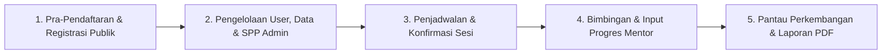

# 🕌 LAPORAN EKSEKUTIF PROYEK & PANDUAN APLIKASI: AL-HIKMAH LMS

> **Dokumen Resmi untuk Manajemen / Pimpinan Lembaga (Non-Technical Executive Guide)**  
> **Nama Sistem:** AL-HIKMAH Learning Management System (LMS)  
> **Status Aplikasi:** ✅ **100% Selesai, Teruji, & Siap Digunakan (Production Ready)**  
> **Versi:** 3.0 (Granular Role-Based Visibility & User-Role Management Edition)  
> **Tanggal:** 14 Agustus 2026  

---

## 📋 DAFTAR ISI LAPORAN

1. [📌 Ringkasan Eksekutif & Nilai Manfaat Aplikasi](#-1-ringkasan-eksekutif--nilai-manfaat-aplikasi)
2. [🔄 Tahapan & Alur Kerja Utama Aplikasi](#-2-tahapan--alur-kerja-utama-aplikasi)
3. [⭐ Penjelasan Seluruh Fitur Aplikasi (Berdasarkan Hak Akses)](#-3-penjelasan-seluruh-fitur-aplikasi-berdasarkan-hak-akses)
4. [🗄️ Penjelasan Seluruh Database (Penyimpanan Data Lembaga)](#-4-penjelasan-seluruh-database-penyimpanan-data-lembaga)
5. [🎮 Penjelasan Seluruh Model & Controller (Pemroses Logika Sistem)](#-5-penjelasan-seluruh-model--controller-pemroses-logika-sistem)
6. [📁 Penjelasan Seluruh Struktur Folder Aplikasi](#-6-penjelasan-seluruh-struktur-folder-aplikasi)
7. [🎯 Kesimpulan & Rekomendasi Langkah Ke Depan](#-7-kesimpulan--rekomendasi-langkah-ke-depan)

---

## 📌 1. RINGKASAN EKSEKUTIF & NILAI MANFAAT APLIKASI

**AL-HIKMAH LMS** adalah platform manajemen pendampingan belajar Al-Qur'an terpadu berbasis web yang dirancang khusus untuk memfasilitasi anak-anak dan dewasa dalam belajar membaca Al-Qur'an (Iqra/Tahsin), menghafal (Tahfidz), memahami Tajwid, serta pembiasaan Adab & Doa Harian.

### 💡 Masalah Utama yang Berhasil Diselesaikan:
1. **Manajemen Pengguna & Kontrol Role Terpusat (User Management)**: Administrator kini memiliki panel terpusat untuk melihat daftar seluruh pengguna, mencari berdasarkan nama/email/telepon, mengedit data diri, membuat akun baru, hingga mengubah role pengguna dengan sinkronisasi profil domain otomatis (*Domain Profile Sync* untuk Mentor, Parent, dan Student) serta proteksi anti-lockout (*Anti-Self Deletion* & *Anti-Demotion Guard*).
2. **Granular Role-Based Visibility & Proteksi Biaya**: Halaman rincian biaya (`/biaya`) terproteksi khusus untuk Orang Tua dan Administrator. Pengunjung publik (guest), santri, dan mentor disembunyikan dari tombol biaya di seluruh landing page (`/metode`, `/tahfidz`, `/program`, Navbar, Footer). Administrator diberikan penanda visual `(Kamu Administrator)` yang jelas di antarmuka.
3. **Arsitektur Single Source of Truth Program & Biaya**: Informasi kurikulum program belajar dan biaya terpusat 100% dari database. Halaman `/program` menyajikan kurikulum deskriptif per kategori (Anak, Dewasa & Muslimah, Bahasa Arab) tanpa membingungkan calon wali dengan angka, sementara halaman `/biaya` menyajikan transparansi investasi belajar, biaya pendaftaran, dan tombol pendaftaran program langsung bagi orang tua.
4. **Alur Pendaftaran Terintegrasi & Anti-Drop-Off**: Calon orang tua murid yang mendaftar melalui formulir konsultasi navbar ("Mulai Perjalanan"), halaman khusus Tahfidz, maupun tombol *"Pilih Program Ini"* di halaman Biaya secara otomatis dibuatkan akun **Orang Tua (`parent`)** dan akun **Murid (`student`)** serta langsung terhubung ke program pilihannya, menghilangkan proses manual lewat pesan WhatsApp acak.
5. **Pencatatan Terpusat & Bebas Data Tercecer**: Pendaftaran santri, catatan hafalan harian, dan pembayaran SPP yang dulu dicatat manual kini tersimpan aman dan otomatis terstruktur di sistem database.
6. **Pengelolaan Website Mandiri Tanpa Coding**: Manajemen atau Admin dapat merubah nomor WhatsApp CS, alamat lembaga, email resmi, susunan/urutan program, dan tarif harga program kapan saja langsung dari halaman web tanpa memerlukan bantuan programmer.
7. **Transparansi & Kemudahan Orang Tua (Parent Portal)**: Orang tua santri dapat memantau perkembangan nilai tajwid, capaian surah/juz anaknya secara real-time, mengonfirmasi kehadiran anak, memantau akun email LMS anak, menerima notifikasi tagihan SPP, hingga mengunduh **Laporan Perkembangan Format PDF Resmi**.
8. **Efisiensi Kerja Pengajar / Mentor**: Fitur *Catat Progres Massal* memungkinkan pengajar menginput nilai dan evaluasi banyak santri sekaligus dalam hitungan detik, serta mencetak rekapitulasi kinerja pengajar.
9. **Kemudahan Pembayaran SPP Online**: Dukungan integrasi pembayaran online (Midtrans Payment Gateway QRIS/Virtual Account) dan fitur penerbitan tagihan SPP dinamis oleh Admin.

---

## 2. TAHAPAN & ALUR KERJA UTAMA APLIKASI

Operasional aplikasi AL-HIKMAH LMS terbagi menjadi **5 Tahapan Utama**:



### 📋 Penjelasan Rinci 5 Tahapan Operasional:
1. **Tahap 1 - Pra-Pendaftaran & Registrasi Publik Terintegrasi**: 
   - Calon wali santri dapat mendaftar melalui 3 pintu masuk:
     - **Modal "Mulai Perjalanan"** di navbar/hero halaman utama.
     - **Formulir Khusus Tahfidz** pada halaman `/tahfidz`.
     - **Modal Pendaftaran Program** via tombol *"Pilih Program Ini"* pada halaman `/biaya`.
   - Mengisi data awal Orang Tua, Murid, No. WhatsApp, Usia, Gender, Lokasi, dan Metode Belajar.
   - Sistem menyimpan data awal ke Session Laravel (`pre_registration`) dan mengarahkan ke halaman registrasi (`/register`) dengan role yang otomatis terkunci pada **Orang Tua / Wali (`parent`)**.
   - Setelah melengkapi password, sistem otomatis membuat akun Orang Tua & akun Murid terpisah yang saling terhubung dan otomatis menambatkan program pilihan (`program_id`).
2. **Tahap 2 - Pengelolaan User, Role, Data & SPP oleh Admin**: Admin mengelola akun pengguna & hak akses role (`/admin/users`), mendaftarkan akun santri, menentukan mentor pembimbing, dan menerbitkan tagihan SPP bulanan dengan tanggal jatuh tempo serta nominal angka yang fleksibel.
3. **Tahap 3 - Penjadwalan Sesi & Konfirmasi Kehadiran**: Admin atau Mentor menjadwalkan sesi mengajar (Online, Home Visit/Offline, atau Hybrid). Wali Santri menerima pengingat dan melakukan **Konfirmasi Kehadiran Anak** (`Hadir`/`Izin`/`Sakit`).
4. **Tahap 4 - Bimbingan & Pencatatan Progres**: Mentor melatih santri, kemudian mencatat capaian surah/ayat, juz, nilai tajwid, kelancaran, adab, dan tugas rumah (bisa satuan maupun massal/bulk).
5. **Tahap 5 - Evaluasi & Pelaporan Transparan**: Sistem mengolah nilai menjadi grafik tren 6 bulan (Chart.js), notifikasi real-time lonceng header Livewire, dan laporan ringkasan perkembangan format PDF yang dapat diunduh oleh Orang Tua.

---

## ⭐ 3. PENJELASAN SELURUH FITUR APLIKASI (BERDASARKAN HAK AKSES)

Sistem ini mendukung **4 Peran Pengguna (Multi-Role Access Control)** yang aman dan terisolasi:

### A. Keamanan, Otentikasi & Pra-Pendaftaran Terpusat
- **Alur Pra-Pendaftaran Multi-Pintu**: Menangkap formulir konsultasi dari modal navbar, landing Tahfidz, maupun halaman Biaya, menyimpan data pra-pendaftaran ke HTTP Session, dan mengarahkan pengguna ke halaman registrasi akun resmi.
- **Login Multi-Role Terproteksi (`/login`)**: Halaman masuk terpusat dengan enkripsi standar keamanan Laravel.
- **Auto-Redirect Cerdas (`/dashboard`)**: Otomatis mengarahkan pengguna ke halaman Admin, Portal Mentor, Portal Orang Tua, atau Dashboard Santri sesuai jenis akunnya.
- **Proteksi Hak Akses (Middleware RBAC)**: Mencegah pengguna membuka halaman di luar hak aksesnya dengan template error 403 berdesain tema resmi AL-HIKMAH (`style.css`).
- **Pendaftaran Mandiri Mentor (`/bergabung`)**: Form registrasi khusus untuk calon pengajar Al-Qur'an baru.
- **Logout Sesi Safe Exits (`/logout`)**: Fitur keluar sistem untuk mengamankan akun dari perangkat umum.

### B. Halaman Depan Publik (Dapat Diakses Umum)
- **Halaman Utama (Home)**: Tampilan modern dengan banner promo, keunggulan lembaga, modal "Mulai Perjalanan", statistik real-time santri & mentor, serta testimoni wali santri.
- **Halaman Tentang Kami (`/tentang-kami`)**: Profil lembaga, visi-misi, nilai-nilai utama, jajaran pengajar Al-Qur'an, dan counter statistik dinamis database.
- **Halaman Program Belajar (`/program`)**: Katalog kurikulum edukatif yang mengelompokkan materi ke dalam 3 rumpun utama (Program Anak 10–15 th, Program Dewasa & Muslimah, Program Bahasa Arab) tanpa distraksi harga.
- **Halaman Biaya & Investasi (`/biaya`)**: Khusus Orang Tua & Admin (terproteksi 403 untuk guest/santri/mentor), informasi biaya transparan terhubung database, rincian biaya pendaftaran, kartu paket belajar, serta **Modal Pendaftaran Program Interaktif** (`#modalProgramDaftar`).
- **Halaman Khusus Tahfidz (`/tahfidz`)**: Halaman landing khusus akselerasi hafalan Qur'an dengan modal pra-registrasi target juz dan level santri.
- **Halaman Metode Belajar (`/metode`)**: Penjelasan metode Talaqqi, Sorogan, dan Private Intensif dengan kontrol visibilitas tombol biaya berbasis role.
- **Halaman Galeri**: Dokumentasi foto kegiatan mengajar & syiar Al-Qur'an.
- **Tombol Floating WhatsApp CS**: Tombol pesan langsung ke WhatsApp Pengelola dengan teks otomatis.

### C. Portal Admin (Pengelola Pusat / Administrator)
- **Dashboard Admin & Widget Monitoring**: Ringkasan total santri aktif, total guru/mentor, jumlah program, status pembayaran, serta widget daftar pengguna & ringkasan role.
- **Manajemen Pengguna & Role (`/admin/users`)**:
  - Tabel data user interaktif (Nama, Role badge, Email, No. Telp / WA link, Tanggal dibuat).
  - Filter pencarian keyword (Nama/Email/Telepon) & filter role dropdown.
  - Tambah Akun Pengguna Baru (Nama, Email, Telepon, Role, Password).
  - Edit Profil & Hak Akses Role (Bisa mengganti role pengguna dengan sinkronisasi domain otomatis `Mentor`/`ParentProfile`/`Student`).
  - Hapus Pengguna Aman (*Protected Deletion* mencegah penghapusan akun diri sendiri & user yang memiliki data relasi santri/sesi/pembayaran aktif).
- **Manajemen Santri**: Menambah santri baru, merubah data diri, menautkan ke Orang Tua & Mentor pembimbing.
- **Manajemen Mentor/Pengajar**: Mengelola data pengajar, spesialisasi, biografi, rating, dan status keaktifan.
- **Manajemen Program**: Menyesuaikan durasi kelas, kategori, ikon, status popularitas, urutan tampil (`sort_order`), status aktif, dan tarif biaya program.
- **Manajemen Pembayaran & SPP (`/admin/payments`)**: 
  - **Input Tagihan SPP Baru**: Modal form khusus bagi Admin untuk menginput nominal SPP dalam Rupiah, menentukan tanggal jatuh tempo, dan memilih santri binaan.
  - **Edit Tagihan & Status**: Merubah nominal tagihan SPP dan memperbarui status pembayaran (`Pending` -> `Paid`).
  - **Kirim Pengingat Massal (`sendReminder`)**: Tombol satu klik untuk mengirimkan notifikasi pengingat SPP otomatis ke seluruh Wali Santri yang tagihannya mendekati jatuh tempo.
- **Pengaturan Website (CMS Settings)**: Mengubah nomor WhatsApp CS, email resmi, username Instagram, alamat lembaga, dan tagline secara instan.

### D. Portal Mentor / Guru Pengajar
- **Dashboard Mentor & Quick Actions**: Ringkasan sesi hari ini, total santri binaan, rata-rata nilai tajwid, dan tombol aksi cepat (`Mulai Sesi`, `Catat Massal`, `Export Laporan`).
- **Grafik Perkembangan Bimbingan (Chart.js)**: Grafik interaktif visual tren jumlah bimbingan dan perkembangan nilai tajwid 6 bulan terakhir.
- **Alert Santri Perlu Perhatian Khusus**: Peringatan visual otomatis jika nilai tajwid santri di bawah 75 agar pengajar segera memberikan bimbingan ekstra.
- **Toggle View Jadwal (Tabel & Timeline Visual)**: Pilihan tampilan jadwal harian berbentuk tabel atau berbentuk garis waktu (timeline) visual.
- **Catat Progres Hafalan Single**: Form penginputan capaian surah/ayat, juz, nilai tajwid, kelancaran, adab, dan tugas rumah per santri.
- **Catat Progres Massal (Bulk Progress Entry)**: Fitur hemat waktu untuk menginput nilai & catatan evaluasi banyak santri sekaligus dalam 1 formulir.
- **Export Laporan Mentor (PDF / Siap Cetak)**: Cetak rekapitulasi kinerja pengajar dan seluruh santri binaannya dalam format resmi.
- **Log Aktivitas Pengajar (Activity Feed)**: Catatan otomatis rekam jejak aktivitas pengajar.

### E. Portal Orang Tua & Wali Santri (Parent Portal Modul A - F)
- **Modul A: Dashboard Utama (`/parent/dashboard`)**: 4 Kartu Statistik (Anak Aktif, Sesi Bulan Ini, Rata-rata Nilai Tajwid, Tagihan Pending), daftar anak & progres hafalan terbaru, jadwal sesi 7 hari mendatang, notifikasi tagihan, serta tombol aksi cepat (*Quick Actions*).
- **Modul B: Anak & Progress (`/parent/children/*`)**: Daftar anak binaan, detail profil & riwayat hafalan anak, grafik interaktif tren bimbingan (Chart.js), catatan evaluasi mentor, serta unduh **Laporan Perkembangan PDF**.
- **Modul C: Jadwal Belajar (`/parent/schedules/*`)**: Kalender sesi bimbingan anak, tabel sesi berfilter status, detail sesi, dan **Form Konfirmasi Kehadiran Anak** (Hadir/Izin/Sakit).
- **Modul D: Pembayaran & SPP (`/parent/payments/*`)**: Daftar tagihan aktif dengan tanggal jatuh tempo (`due_date`), riwayat pembayaran lunas, detail invoice, **Integrasi Pembayaran Online Midtrans QRIS/VA**, serta unduh **Invoice PDF**.
- **Modul E: Komunikasi & Chat (`/parent/messages/*`)**: Inbox pesan, form kirim pesan ke mentor pembimbing, notifikasi real-time pesan masuk, serta ruang diskusi (*Chat UI*).
- **Modul F: Profil & Pengaturan (`/parent/profile/*`)**: Pengelolaan informasi diri & kontak darurat, pengaturan preferensi notifikasi, ubah password, serta **Kelola Data Anak (`parent.profile.children`)** yang menampilkan rincian nama santri dan **Email Akun LMS Anak**.
- **Livewire Real-time Header Notification (`ParentNotifications`)**: Lonceng notifikasi header real-time dengan badge unread count merah dan tombol *Tandai Dibaca*.

---

## 🗄️ 4. PENJELASAN SELURUH DATABASE (PENYIMPANAN DATA LEMBAGA)

Aplikasi ini menggunakan **18 Tabel Database MySQL** yang saling terhubung secara aman (*Relational Foreign Keys*):

| No | Nama Tabel | Fungsi Utama & Data yang Disimpan |
|:--:|---|---|
| 1 | **`users`** | Menyimpan akun login seluruh pengguna (Nama, email, password terenkripsi, role_id, phone). |
| 2 | **`roles`** | Menyimpan jenis hak akses sistem (Admin, Mentor, Parent, Student). |
| 3 | **`mentors`** | Menyimpan profil khusus Pengajar (Spesialisasi, bio, rating bimbingan, status aktif). |
| 4 | **`students`** | Menyimpan data pribadi Santri (Nama lengkap, umur, gender, lokasi, catatan khusus, parent_id). |
| 5 | **`parents`** | Menyimpan data profil Orang Tua/Wali (`ParentProfile`: nomor darurat, alamat rumah). |
| 6 | **`mentor_student`** | Tabel relasi penghubung Many-to-Many antara Pengajar dan Santri Binaan. |
| 7 | **`programs`** | Menyimpan daftar kelas/program belajar Al-Qur'an (Kategori `anak`/`dewasa`/`bahasa_arab`, ikon Bootstrap Icons, harga paket, durasi, `is_popular`, `is_active`, `sort_order`). |
| 8 | **`student_program`** | Menyimpan riwayat pendaftaran kelas yang diikuti santri beserta status keaktifan. |
| 9 | **`learning_sessions`** | Menyimpan jadwal sesi bimbingan (Tanggal, jam, metode Online/Offline/Hybrid, status sesi). |
| 10 | **`progress`** | Menyimpan catatan nilai & hafalan santri (Surah, ayat, juz, nilai kelancaran, nilai tajwid, adab, PR). |
| 11 | **`payments`** | Menyimpan transaksi pembayaran SPP & pendaftaran (Nominal amount, due_date, invoice_number, status). |
| 12 | **`messages`** | Menyimpan komunikasi pesan internal dua arah antara Orang Tua dan Mentor (Sender, Receiver, Content, Is_read). |
| 13 | **`session_confirmations`** | Menyimpan data konfirmasi kehadiran anak dari Orang Tua (Session ID, Parent ID, status Hadir/Izin/Sakit). |
| 14 | **`settings`** | Menyimpan variabel konfigurasi dinamis website (No. WA CS, email, Instagram, alamat). |
| 15 | **`galleries`** | Menyimpan galeri foto dokumentasi kegiatan lembaga. |
| 16 | **`notifications`** | Menyimpan pesan notifikasi internal sistem (Judul, isi pesan, type, status dibaca). |
| 17 | **`mentor_activity_logs`** | Menyimpan rekam jejak aktivitas harian pengajar (Waktu & aksi yang dilakukan). |
| 18 | **`mentor_availabilities`** | Menyimpan ketersediaan jam & hari mengajar mentor (Day, Start Time, End Time, Max Students, Status Holiday). |

---

## 🎮 5. PENJELASAN SELURUH MODEL & CONTROLLER (PEMROSES LOGIKA SISTEM)

### A. Daftar Model (Penghubung Database)
1. **`User.php`**: Mengatur autentikasi user dan pengecekan role (`isAdmin()`, `isMentor()`, `isParent()`, `isStudent()`).
2. **`Role.php`**: Mengatur tingkatan hak akses pengguna.
3. **`Mentor.php`**: Mengatur profil pengajar dan relasinya ke santri binaan serta log aktivitas.
4. **`Student.php`**: Mengatur data santri dan relasinya ke orang tua, kelas program, dan catatan progres.
5. **`ParentProfile.php`**: Mengatur data wali santri dan anak-anak binaannya (`parents`).
6. **`Program.php`**: Mengatur data kelas program belajar dengan query scopes (`scopeAnak()`, `scopeDewasa()`, `scopeBahasaArab()`), casts, dan accessor harga Rupiah (`formatted_price`).
7. **`Session.php`**: Mengatur logika jadwal sesi mengajar (`learning_sessions`).
8. **`Progress.php`**: Mengatur pencatatan nilai tajwid, kelancaran, hafalan surah, dan adab.
9. **`Payment.php`**: Mengatur transaksi pembayaran SPP, nominal, tanggal jatuh tempo, dan status.
10. **`Message.php`**: Mengatur komunikasi pesan dua arah antara Orang Tua dan Mentor.
11. **`SessionConfirmation.php`**: Mengatur konfirmasi kehadiran anak dari Orang Tua.
12. **`Setting.php`**: Mengatur variabel konfigurasi dinamis CMS website.
13. **`Gallery.php`**: Mengatur galeri foto dokumentasi.
14. **`Notification.php`**: Mengatur penyimpanan notifikasi pesan sistem.
15. **`MentorActivityLog.php`**: Mengatur pencatatan rekam jejak aktivitas pengajar.
16. **`MentorAvailability.php`**: Mengatur ketersediaan hari & jam mengajar mentor serta batas kuota murid.

### B. Daftar Controller & Komponen Livewire (Pemroses Logika Aplikasi)
1. **`Admin\UserController.php` (NEW)**: Mengatur CRUD data pengguna (User Management), filter role, pencarian nama/email/telepon, sinkronisasi profil domain otomatis (`syncUserProfile`), proteksi anti-self deletion, dan proteksi anti-demotion role admin.
2. **`LandingController.php`**: Mengatur penampilan katalog kurikulum program deskriptif (`program`) dan halaman investasi/biaya belajar terproteksi otorisasi Parent/Admin (`biaya`).
3. **`Auth\RegisteredUserController.php`**: Memproses pra-pendaftaran modal umum (`preRegister`), pra-pendaftaran Tahfidz (`preRegisterTahfidz`), pra-pendaftaran Program Biaya (`preRegisterProgram`), penyimpanan session, serta pembuatan akun Orang Tua & Akun Murid via *Database Transaction* (`store`).
4. **`Auth\RegisterMentorController.php`**: Memproses pendaftaran mandiri akun guru/mentor baru.
5. **`Admin\DashboardController.php`**: Mengolah data statistik utama Admin, ringkasan user terbaru, dan Widget Monitor Aktivitas Orang Tua.
6. **`Admin\PaymentController.php`**: Memproses penerbitan tagihan SPP baru (`store`), penyesuaian nominal & tanggal jatuh tempo (`update`), pembatalan tagihan (`destroy`), laporan tagihan pending/paid, dan pengiriman pengingat massal (`sendReminder`).
7. **`Admin\SettingController.php`**: Memproses pengubahan nomor CS WhatsApp, Instagram, dan informasi kontak website.
8. **`Admin\MentorAvailabilityController.php`**: Mengolah matriks ketersediaan jam mengajar 7 hari seluruh mentor, mengecek sisa kuota murid per hari, serta mengalokasikan santri baru ke mentor yang memiliki kuota.
9. **`Livewire\Parent\ParentNotifications.php`**: Komponen Livewire real-time header lonceng notifikasi untuk orang tua (`unreadCount`, `markAsRead`).
10. **`Mentor\DashboardController.php`**: Mengolah statistik guru, grafik tren Chart.js, alert santri khusus, dan feed aktivitas.
11. **`Mentor\ProgressController.php`**: Memproses penyimpanan nilai progres santri (baik penginputan *single* maupun *massal/bulk*).
12. **`Mentor\SessionController.php`**: Mengatur pengubahan status sesi mengajar (`Sedang Berlangsung`, `Selesai`, `Batal`).
13. **`Mentor\StudentController.php`**: Menampilkan daftar santri binaan guru dan detail riwayat belajarnya.
14. **`Mentor\AvailabilityController.php`**: Mengolah formulir mandiri mentor dalam mengatur jam mengajar, hari libur, dan batas kuota murid per hari.
15. **`Mentor\ReportController.php`**: Membuat laporan kinerja guru & santri yang siap dicetak/diunduh sebagai PDF.
16. **`Parent\ParentDashboardController.php`**: Mengolah data statistik portal orang tua, 4 kartu ringkasan, progres terbaru, dan jadwal 7 hari.
17. **`Parent\ParentChildController.php`**: Mengolah daftar anak, detail progres hafalan, grafik Chart.js perkembangan 6 bulan, dan laporan cetak PDF.
18. **`Parent\ParentScheduleController.php`**: Mengolah kalender sesi bimbingan anak, filter status sesi, dan konfirmasi kehadiran anak.
19. **`Parent\ParentPaymentController.php`**: Mengolah daftar tagihan aktif, riwayat lunas, detail invoice, bayar online Midtrans, dan cetak invoice PDF.
20. **`Parent\ParentMessageController.php`**: Mengolah inbox pesan, form tulis pesan baru ke mentor, dan ruang chat interaktif.
21. **`Parent\ParentProfileController.php`**: Mengolah pembaharuan data diri wali santri, preferensi notifikasi, ubah password, serta pengisian data anak baru.
22. **`ReportController.php`**: Mengolah pencetakan ringkasan laporan perkembangan santri untuk Orang Tua.

---

## 📁 6. PENJELASAN SELURUH STRUKTUR FOLDER APLIKASI

Berikut adalah peta struktur direktori proyek AL-HIKMAH LMS beserta kegunaannya:

```text
al-hikmah-lms/
├── 📁 app/                     --> Pusat Logika Utama Aplikasi (Model, Controller, Livewire, Middleware)
│   ├── 📁 Http/Controllers/    --> Pengendali alur kerja aplikasi (Landing, Admin, Mentor, Parent, Auth)
│   │   └── 📁 Admin/           --> Controller Admin (UserController, PaymentController, DashboardController, dll)
│   ├── 📁 Livewire/Parent/     --> Komponen interaktif real-time Livewire (ParentNotifications)
│   └── 📁 Models/              --> Pengatur struktur data & relasi database (16 Models)
├── 📁 bootstrap/               --> File inisialisasi awal penjalankan sistem Laravel 12
├── 📁 config/                  --> Berkas konfigurasi pengaturan sistem (database, mail, session)
├── 📁 database/                --> Pusat pengelolaan database
│   ├── 📁 factories/           --> Pembuat data uji coba otomatis
│   ├── 📁 migrations/          --> Berkas pembentuk tabel-tabel database (21 Migrations)
│   └── 📁 seeders/             --> Berkas pengisi data awal (10 Seeders akun default, role, program, ketersediaan mentor)
├── 📁 public/                  --> Folder yang dapat diakses publik/browser
│   └── 📁 assets/              --> Gambar logo, foto galeri, CSS gaya tampilan (style.css), & JavaScript
├── 📁 resources/               --> Tampilan Antarmuka Pengguna (User Interface)
│   └── 📁 views/               --> Berkas tampilan halaman web (.blade.php)
│       ├── 📁 admin/           --> Halaman-halaman panel Admin (Users, Dashboard, Payments, Settings)
│       ├── 📁 errors/          --> Halaman error responsif bertema AL-HIKMAH (403, 404, dll)
│       ├── 📁 mentor/          --> Halaman-halaman portal Mentor/Guru (Dashboard, Progress, Report)
│       ├── 📁 parent/          --> Halaman-halaman portal Orang Tua (Dashboard, Children, Payments, Messages, dll)
│       ├── 📁 partials/        --> Komponen parsial (Navbar, Footer, Modal Pendaftaran)
│       ├── 📁 livewire/        --> Tampilan view untuk komponen Livewire
│       ├── 📁 layouts/         --> Kerangka template utama halaman (admin, mentor, parent, app, landing)
│       └── 📁 reports/         --> Template laporan cetak PDF
├── 📁 routes/                  --> Berkas pendaftaran alamat URL website (web.php, auth.php)
├── 📁 storage/                 --> Tempat menyimpan berkas unggahan, file cache, & catatan log
└── 📁 tests/                   --> Pengujian kualitas otomatis (Automated Testing Pest PHP - 79 Passed Tests)
```

---

## 🎯 7. KESIMPULAN & REKOMENDASI LANGKAH KE DEPAN

### 🏁 Kesimpulan Akhir:
Aplikasi **AL-HIKMAH LMS (Versi 3.0)** berada dalam kondisi **100% Selesai, Teruji (79 Passed Tests dengan 342 assertions), dan Siap Digunakan (Production Ready)**. Seluruh fitur dari manajemen pengguna & role, proteksi biaya berbasis hak akses, halaman depan publik, Single Source of Truth program belajar & biaya, modal pra-pendaftaran terintegrasi, panel matriks ketersediaan guru & alokasi santri, portal operasional guru, hingga portal orang tua (Modul A - F & Notifikasi Real-time) telah terintegrasi secara stabil, aman, cepat, dan modern.

### 🚀 Rekomendasi Langkah Ke Depan untuk Pimpinan / Manajemen:
1. **Go-Live / Deploy ke Server Production**: Aplikasi sudah sangat siap diunggah ke server domain utama lembaga.
2. **Sosialisasi Manajemen User untuk Admin**: Melatih administrator lembaga dalam mengelola pengguna baru dan mengatur role via panel `/admin/users`.
3. **Sosialisasi & Pelatihan Pengajar**: Mengadakan orientasi singkat penggunaan portal pengajar (fitur *Catat Progres Massal* & *Cetak PDF*).
4. **Sosialisasi Orang Tua / Wali Santri**: Menginformasikan kemudahan memilih program belajar di halaman `/biaya` serta akses login Portal Orang Tua agar wali santri dapat mengonfirmasi kehadiran anak dan memantau akun email anak secara transparan.

---

*Laporan eksekutif resmi ini disusun khusus untuk jajaran Manajemen / Pimpinan Lembaga AL-HIKMAH.*
