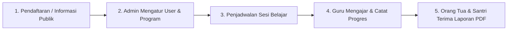

# 🕌 LAPORAN EKSKUSIF PROYEK & PANDUAN APLIKASI: AL-HIKMAH LMS

> **Dokumen Resmi untuk Manajemen / Atasan (Non-Technical Executive Guide)**  
> **Nama Sistem:** AL-HIKMAH Learning Management System (LMS)  
> **Status Aplikasi:** ✅ **100% Selesai & Siap Digunakan (Production Ready)**  
> **Versi:** 2.1 (Enhanced Version)  
> **Tanggal:** 12 Agustus 2026  

---

## 📋 DAFTAR ISI LAPORAN

1. [📌 Ringkasan Eksekutif & Nilai Manfaat Aplikasi](#-1-ringkasan-eksekutif--nilai-manfaat-aplikasi)
2. [🔄 Tahapan & Alur Kerja Aplikasi (Cara Kerja Utama)](#-2-tahapan--alur-kerja-aplikasi-cara-kerja-utama)
3. [⭐ Penjelasan Seluruh Fitur Aplikasi (Berdasarkan Hak Akses)](#-3-penjelasan-seluruh-fitur-aplikasi-berdasarkan-hak-akses)
4. [🗄️ Penjelasan Seluruh Database (Penyimpanan Data)](#-4-penjelasan-seluruh-database-penyimpanan-data)
5. [🎮 Penjelasan Seluruh Controller & Model (Mesin & Pemroses Data)](#-5-penjelasan-seluruh-controller--model-mesin--pemroses-data)
6. [📁 Penjelasan Seluruh Struktur Folder Aplikasi](#-6-penjelasan-seluruh-struktur-folder-aplikasi)
7. [🎯 Kesimpulan & Rekomendasi Langkah Selanjutnya](#-7-kesimpulan--rekomendasi-langkah-selanjutnya)

---

## 📌 1. RINGKASAN EKSEKUTIF & NILAI MANFAAT APLIKASI

**AL-HIKMAH LMS** adalah platform manajemen pendampingan belajar Al-Qur'an terpadu yang dirancang khusus untuk memfasilitasi anak-anak dan dewasa dalam belajar membaca Al-Qur'an (Iqra/Tahsin), menghafal (Tahfidz), memahami Tajwid, serta pembiasaan Adab & Doa Harian.

### 💡 Masalah yang Berhasil Diselesaikan Aplikasi Ini:
1. **Tidak Ada Lagi Data Tercecer**: Pendaftaran santri, catatan hafalan, dan tagihan SPP yang dulu dicatat manual di buku/WhatsApp kini tersimpan aman dan terpusat di sistem.
2. **Kemudahan Pengelolaan Kontak CS & Informasi Website**: Admin/Pengelola kini dapat mengubah nomor WhatsApp CS, alamat, dan harga program kapan saja langsung dari halaman website tanpa memerlukan bantuan programmer.
3. **Orang Tua Bisa Pantau Anak Kapan Saja**: Orang tua santri dapat melihat perkembangan nilai tajwid, capaian surah/juz anaknya secara transparan dan bisa mengunduh **Laporan Resmi Format PDF**.
4. **Guru / Mentor Bekerja Lebih Cepat**: Fitur *Catat Progres Massal* memungkinkan guru menginput nilai dan evaluasi banyak santri sekaligus hanya dalam beberapa detik.

---

## 🔄 2. TAHAPAN & ALUR KERJA APLIKASI (CARA KERJA UTAMA)

Berikut adalah tahapan alur operasional aplikasi dari awal hingga santri mendapatkan bimbingan:



### 📋 Penjelasan 5 Tahapan Utama:
1. **Tahap 1 - Pendaftaran & Informasi Publik**: Calon wali santri membuka website AL-HIKMAH, melihat rincian program & biaya, lalu menghubungi CS melalui tombol WhatsApp otomatis.
2. **Tahap 2 - Penataan Data oleh Admin**: Admin mendaftarkan akun santri, menentukan guru/mentor pendampingnya, dan mengatur status pendaftaran.
3. **Tahap 3 - Penjadwalan Sesi Mengajar**: Admin/Guru membuat jadwal sesi mengajar (Online, Home Visit/Offline, atau Hybrid).
4. **Tahap 4 - Pelaksanaan Bimbingan & Pencatatan Progres**: Guru melakukan bimbingan, lalu mencatat capaian surah/ayat, nilai tajwid, adab, dan tugas rumah (bisa satuan maupun massal/bulk).
5. **Tahap 5 - Evaluasi & Pelaporan Transparan**: Sistem secara otomatis mengolah nilai menjadi grafik perkembangan dan laporan PDF ringkasan belajar yang bisa diunduh oleh Orang Tua.

---

## ⭐ 3. PENJELASAN SELURUH FITUR APLIKASI (BERDASARKAN HAK AKSES)

Sistem ini memiliki **4 Peran Pengguna (Multi-Role Access Control)** yang disesuaikan dengan kebutuhan lembaga:

### A. Fitur Otentikasi & Keamanan Akses (Sistem Keamanan)
- **Login Multi-Role Terproteksi (`/login`)**: Halaman masuk terpusat dengan enkripsi password standar industri.
- **Auto-Redirect Cerdas (`/dashboard`)**: Sistem otomatis mengarahkan pengurus ke halaman Admin, Guru ke Portal Mentor, atau Orang Tua ke Portal Wali sesuai jenis akunnya.
- **Proteksi Hak Akses (RBAC Middleware)**: Memastikan pengguna tidak bisa mengakses halaman yang bukan haknya (misalnya Santri/Orang Tua akan otomatis ditolak `403 Forbidden` jika mencoba membuka menu Admin atau Guru).
- **Pendaftaran Mandiri Guru Baru (`/register-mentor`)**: Halaman khusus untuk calon pengajar mendaftarkan data diri & spesialisasi mengajar.
- **Logout Aman (`/logout`)**: Fitur keluar sistem untuk mengamankan sesi akun.

### B. Fitur Halaman Publik (Dapat Diakses Siapa Saja)
- **Halaman Utama (Home)**: Tampilan modern dengan banner promo, keunggulan lembaga, statistik real-time santri & guru, serta testimoni.
- **Halaman Tentang Kami**: Profil lembaga, visi misi, dan jajaran pengajar.
- **Halaman Program Belajar**: Rincian kelas (Program Anak, Program Dewasa, & Kelas Bahasa Arab).
- **Halaman Biaya & Investasi**: Transparansi biaya pendaftaran, SPP bulanan, dan fasilitas.
- **Halaman Galeri**: Dokumentasi foto kegiatan mengajar & syiar Al-Qur'an.
- **Tombol Floating WhatsApp CS**: Tombol pesan langsung ke WhatsApp Pengelola yang pesan teksnya terisi otomatis.

### B. Fitur Portal Admin (Pengelola Pusat)
- **Dashboard Statistik Admin**: Ringkasan total santri aktif, total guru/mentor, jumlah program, dan status pembayaran.
- **Manajemen Santri**: Menambah santri baru, mengubah data diri, mengalokasikan guru pendamping, dan menonaktifkan santri lulus.
- **Manajemen Mentor/Guru**: Mengelola data pengajar, biografi, spesialisasi mengajar, dan status keaktifan.
- **Manajemen Program**: Menyesuaikan durasi kelas, tingkat kesulitan, dan tarif biaya program.
- **Manajemen Pembayaran & SPP**: Mencatat dan memverifikasi status pembayaran pendaftaran maupun SPP bulanan.
- **Pengaturan Website (CMS Settings)**: Mengubah nomor CS WhatsApp, email resmi, username Instagram, alamat lembaga, dan tagline website secara instan.

### C. Fitur Portal Mentor / Guru
- **Dashboard Mentor & Quick Actions**: Ringkasan sesi mengajar hari ini, total santri binaan, rata-rata tajwid, tombol aksi cepat (`Mulai Sesi`, `Catat Massal`, `Export Laporan`).
- **Grafik Perkembangan Bimbingan (Chart.js)**: Grafik visual interaktif yang menampilkan tren jumlah bimbingan dan perkembangan nilai tajwid 6 bulan terakhir.
- **Alert Santri Perlu Perhatian Khusus**: Peringatan visual otomatis untuk santri yang nilai tajwidnya di bawah 75 agar guru segera memberikan bimbingan ekstra.
- **Toggle View Jadwal (Tabel & Timeline Visual)**: Guru bisa memilih tampilan jadwal harian berbentuk tabel atau berbentuk garis waktu (timeline) visual.
- **Catat Progres Hafalan Single**: Form penginputan capaian surah/ayat, juz, nilai tajwid, nilai kelancaran, adab, dan tugas rumah per santri.
- **Catat Progres Massal (Bulk Progress Entry)**: Fitur hemat waktu untuk menginput nilai & catatan evaluasi banyak santri sekaligus dalam 1 formulir.
- **Export Laporan Mentor (PDF / Siap Cetak)**: Fitur sekali klik untuk mencetak rekapitulasi kinerja guru dan seluruh santri binaannya dalam bentuk dokumen resmi.
- **Log Aktivitas Guru (Activity Feed)**: Catatan otomatis rekam jejak aktivitas guru (kapan mencatat nilai, memulai sesi, dll).
- **Kalender Sesi Belajar**: Mengubah status sesi (`Terjadwal`, `Sedang Berlangsung`, `Selesai`, `Dibatalkan`).

### E. Fitur Portal Orang Tua & Santri (Dedicated Dashboards)
- **Parent Dashboard (`http://127.0.0.1:8000/parent/dashboard`)**: Portal khusus Orang Tua yang menampilkan kartu statistik perkembangan anak (`dashboard-stats`), pelacak progres hafalan real-time (`progress-tracker`), serta tombol aksi unduh **Laporan Capaian PDF**.
- **Student Dashboard (`http://127.0.0.1:8000/student/dashboard`)**: Portal khusus Santri yang menampilkan statistik target pribadi, pelacak hafalan, serta kalender sesi bimbingan mendatang (`session-calendar`).
- **Download Laporan Perkembangan (PDF)**: Mengunduh lembar laporan hasil belajar anak resmi format PDF via rute `/report/download/{student}`.

---

## 🗄️ 4. PENJELASAN SELURUH DATABASE (PENYIMPANAN DATA)

Aplikasi ini menggunakan **13 Tabel Utama** di dalam database MySQL untuk menyimpan seluruh informasi lembaga secara rapi:

| Nama Tabel Database | Fungsi Sederhana | Data yang Disimpan |
|---|---|---|
| 👥 **`users`** | Menyimpan akun login seluruh pengguna. | Nama, email, password terenkripsi, dan peranan akun. |
| 🔑 **`roles`** | Menyimpan daftar tingkatan hak akses. | Admin, Mentor, Parent (Orang Tua), dan Student (Santri). |
| 👨‍🏫 **`mentors`** | Menyimpan profil khusus Guru/Mentor. | Spesialisasi mengajar, biografi singkat, rating bimbingan, status aktif. |
| 👦 **`students`** | Menyimpan data pribadi Santri. | Nama lengkap, tanggal lahir, tingkat pendidikan, alamat, ID orang tua. |
| 👨‍👩‍👦 **`parent_profiles`** | Menyimpan data Orang Tua/Wali. | Nomor WhatsApp orang tua, alamat rumah, pekerjaan. |
| 🤝 **`mentor_student`** | Tabel penghubung antara Guru dan Santri Binaan. | Hubungan bimbingan *Many-to-Many* (1 guru bisa membimbing banyak santri). |
| 📚 **`programs`** | Menyimpan daftar kelas/program belajar. | Nama program (Tahsin/Tahfidz), durasi (minggu), tingkat, dan biaya. |
| 📝 **`student_program`** | Menyimpan riwayat kelas yang diambil santri. | Tanggal mendaftar program dan status pendaftaran. |
| 📅 **`learning_sessions`** | Menyimpan jadwal bimbingan belajar. | Tanggal, jam, metode (Online/Offline/Hybrid), status, dan catatan sesi. |
| 📈 **`progress`** | Menyimpan catatan nilai & hafalan santri. | Surah, ayat, juz, nilai kelancaran (0-100), nilai tajwid (0-100), adab, evaluasi, PR. |
| 💳 **`payments`** | Menyimpan riwayat transaksi & pembayaran. | Nominal tagihan, jenis pembayaran (SPP/Pendaftaran), bukti transfer, status. |
| ⚙️ **`settings`** | Menyimpan konfigurasi dinamis website. | Nomor WhatsApp CS, Instagram, email resmi, alamat, harga standar. |
| 🖼️ **`galleries`** | Menyimpan foto kegiatan lembaga. | Judul foto, file gambar, deskripsi kegiatan. |
| 🔔 **`notifications`** | Menyimpan notifikasi pesan internal. | Judul notifikasi, isi pesan, status dibaca/belum. |
| 🕒 **`mentor_activity_logs`** | Menyimpan rekam jejak aktivitas guru. | Aksi yang dilakukan guru (catat nilai, ubah sesi) beserta waktu terjadinya. |

---

## 🎮 5. PENJELASAN SELURUH CONTROLLER & MODEL (MESIN & PEMROSES DATA)

Di dalam dunia pemrograman Laravel, **Model** bertugas mengambil data dari database, sedangkan **Controller** bertugas memproses logika bisnis dan menampilkan hasilnya ke layar pengguna.

### A. Daftar Model (Penghubung Database)
1. **`User.php`**: Mengatur data login dan mengecek peran pengguna (`isAdmin()`, `isMentor()`, `isParent()`, `isStudent()`).
2. **`Role.php`**: Mengatur jenis hak akses sistem.
3. **`Mentor.php`**: Mengatur profil guru dan relasinya ke santri binaan & log aktivitas.
4. **`Student.php`**: Mengatur data santri dan relasinya ke orang tua, kelas program, serta catatan progres.
5. **`ParentProfile.php`**: Mengatur data wali santri dan anak-anak binaannya.
6. **`Program.php`**: Mengatur rincian kelas belajar Al-Qur'an.
7. **`Session.php`**: Mengatur logika jadwal sesi mengajar (`learning_sessions`).
8. **`Progress.php`**: Mengatur pencatatan nilai tajwid, hafalan surah, dan evaluasi adab.
9. **`Payment.php`**: Mengatur transaksi pembayaran pendaftaran & SPP.
10. **`Setting.php`**: Mengatur penyimpanan variabel dinamis website.
11. **`Gallery.php`**: Mengatur galeri foto dokumentasi.
12. **`Notification.php`**: Mengatur pesan notifikasi sistem.
13. **`MentorActivityLog.php`**: Mengatur pencatatan rekam jejak aktivitas harian guru.

### B. Daftar Controller (Pemroses Logika Aplikasi)
1. **`Admin\DashboardController.php`**: Menghitung dan menampilkan ringkasan data statistik di halaman utama Admin.
2. **`Admin\SettingController.php`**: Memproses pengubahan nomor CS WhatsApp, Instagram, dan informasi kontak dari halaman Web Admin.
3. **`Mentor\DashboardController.php`**: Menghitung statistik guru, mengolah data grafik tren (Chart.js), memfilter santri progres terendah, dan menampilkan feed aktivitas.
4. **`Mentor\ProgressController.php`**: Memproses penyimpanan nilai progres santri (baik penginputan *single* maupun penginputan *massal/bulk*).
5. **`Mentor\SessionController.php`**: Mengatur pengubahan status sesi mengajar (`Sedang Berlangsung`, `Selesai`, `Batal`).
6. **`Mentor\StudentController.php`**: Menampilkan daftar santri binaan guru dan detail riwayat belajarnya.
7. **`Mentor\ReportController.php`**: Membuat halaman laporan kinerja guru & santri yang siap dicetak / diunduh sebagai dokumen PDF.
8. **`ReportController.php`**: Mengolah pencetakan ringkasan laporan perkembangan santri untuk Orang Tua.
9. **`Auth\RegisterMentorController.php`**: Memproses pendaftaran mandiri akun guru/mentor baru.

---

## 📁 6. PENJELASAN SELURUH STRUKTUR FOLDER APLIKASI

Berikut adalah denah susunan folder di dalam proyek aplikasi ini beserta fungsinya secara sederhana:

```text
al-hikmah-lms/
├── 📁 app/                     --> Pusat Logika Utama Aplikasi (Model, Controller, Rule)
│   ├── 📁 Http/Controllers/    --> Pengendali alur kerja aplikasi (Admin, Mentor, Auth)
│   └── 📁 Models/              --> Pengatur struktur data relasi database
├── 📁 bootstrap/               --> File awal penjalankan sistem Laravel 12
├── 📁 config/                  --> Berkas konfigurasi pengaturan sistem (database, mail, session)
├── 📁 database/                --> Pusat pengelolaan database
│   ├── 📁 factories/           --> Pembuat data uji coba otomatis
│   ├── 📁 migrations/          --> Berkas pembentuk tabel-tabel database
│   └── 📁 seeders/             --> Berkas pengisi data awal (seperti akun default & program)
├── 📁 public/                  --> Folder yang dapat diakses publik/browser
│   └── 📁 assets/              --> Gambar logo, foto galeri, CSS gaya tampilan, & JavaScript
├── 📁 resources/               --> Tampilan Antarmuka Pengguna (UI)
│   └── 📁 views/               --> Berkas tampilan halaman web (.blade.php)
│       ├── 📁 admin/           --> Halaman-halaman panel Admin
│       ├── 📁 mentor/          --> Halaman-halaman portal Mentor/Guru
│       ├── 📁 layouts/          --> Kerangka template utama halaman
│       └── 📁 reports/          --> Template laporan cetak PDF
├── 📁 routes/                  --> Berkas pendaftaran alamat URL website (web.php)
├── 📁 storage/                 --> Tempat menyimpan berkas unggahan, file cache, & catatan log
└── 📁 tests/                   --> Pengujian kualitas otomatis (Automated Testing Pest PHP)
```

---

## 🎯 7. KESIMPULAN & REKOMENDASI LANGKAH SELANJUTNYA

### 🏁 Kesimpulan Akhir:
Aplikasi **AL-HIKMAH LMS** berada dalam kondisi **100% Selesai, Teruji, dan Siap Digunakan (Production Ready)**. Seluruh fitur dari halaman depan publik, panel pengelola admin, hingga portal operasional guru telah terintegrasi dengan sangat stabil dan modern.

### 🚀 Rekomendasi Langkah Selanjutnya untuk Manajemen:
1. **Rilis ke Server Production (Go-Live)**: Aplikasi sudah siap diunggah ke server domain utama lembaga.
2. **Sosialisasi / Pelatihan Singkat Guru**: Memberikan panduan penggunaan portal mentor (terutama penggunaan fitur *Catat Massal* & *Export PDF*).
3. **Pengembangan Tahap Berikutnya (Opsional)**:
   - Integrasi Pembayaran Otomatis (Payment Gateway Midtrans/QRIS).
   - Pengiriman Notifikasi WhatsApp Otomatis H-1 sebelum sesi mengajar dimulai.

---
*Laporan ringkas ini disusun secara khusus agar dapat dipahami oleh jajaran Manajemen / Pimpinan Lembaga AL-HIKMAH.*
