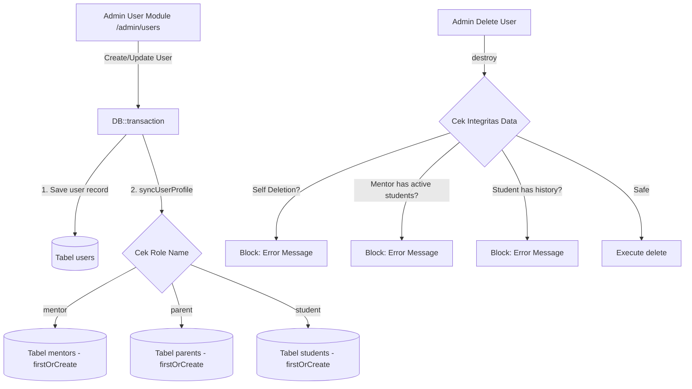

# 📋 PRODUCT REQUIREMENTS DOCUMENT (PRD) & TECHNICAL BLUEPRINT (REVISED)
# MANAJEMEN PENGGUNA & KONTROL HAK AKSES ROLE (ENTERPRISE USER CRUD)

> **Dokumen PRD & Panduan Revisi Junior Programmer**  
> **Modul:** Admin User Management & Role Access Control  
> **Target Framework:** Laravel 12 (PHP 8.2+) | Bootstrap 5 | Blade | MySQL 8.0+  
> **Status:** 🚀 Production-Ready Architecture & Domain Hardened  
> **Versi:** 2.0 (Revised)  
> **Tanggal:** 14 Agustus 2026  

---

## 1. EXECUTIVE SUMMARY

### 1.1 Problem Statement
Saat ini Administrator Lembaga AL-HIKMAH belum memiliki modul terpadu untuk mengelola master data seluruh pengguna sistem (`users`). Perubahan hak akses (misal mengangkat Mentor menjadi Admin, atau mengoreksi nomor telepon dan data Orang Tua/Santri) masih harus dilakukan secara manual via database SQL/Tinker yang rentan kesalahan manusia (*human error*). Selain itu, pembuatan user dengan role domain tertentu tanpa profil entitas terkait (`mentors`, `parents`, `students`) dapat memicu *Error 500 null pointer exception* saat user login ke dashboard perannya.

### 1.2 Proposed Solution
Membangun modul **CRUD Pengguna & Manajemen Role Terpusat** di dalam Panel Admin (`/admin/users`) dan menambahkan **Widget Ringkasan Data Pengguna** pada Dashboard Admin (`/admin/dashboard`). Modul ini dilengkapi dengan:
1. **Domain Profile Synchronization (`syncUserProfile`)**: Otomatis membuat/menyesuaikan profil entitas domain (`Mentor`, `ParentProfile`, `Student`) menggunakan `firstOrCreate()` saat user baru dibuat atau role-nya diubah.
2. **Pre-Deletion Cascade Integrity Guards**: Mencegah *SQL Foreign Key Constraint Violation (SQLSTATE 23000)* saat menghapus user yang masih memiliki data anak/santri aktif, riwayat bimbingan, pembayaran SPP, atau progres hafalan.
3. **Anti-Demotion & Anti-Self Deletion Protections**: Menjamin akun Admin yang sedang aktif tidak terkunci keluar (*Anti-Lockout Protection*).

### 1.3 Success Criteria
1. Admin dapat melihat seluruh daftar pengguna dengan pagination, filter pencarian nama/email/no. telp, dan filter role.
2. Kolom tabel menampilkan secara jelas: **Nama**, **Nama Role (Admin / Mentor / Parent / Santri)**, **Email**, **Nomor Telepon**, dan **Aksi**.
3. Admin dapat mengedit data pengguna dan mengganti role akses pengguna secara instan melalui modal interaktif tanpa merusak relasi domain.
4. Profil domain (`mentors`, `parents`, `students`) otomatis terbuat secara konsisten di dalam `DB::transaction`.
5. 100% lulus uji otomatis (*Automated Feature Test*) dan lolos standar *Laravel Pint*.

---

## 2. USER EXPERIENCE & FUNCTIONALITY

### 2.1 User Personas
- **Primary Persona:** Administrator Lembaga (Super Admin / Staff Operasional IT) yang bertugas mengelola hak akses akun, mereset kata sandi darurat, dan memonitor seluruh user yang terdaftar di LMS.

### 2.2 User Stories & Acceptance Criteria

#### 🧑‍💻 User Story 1: Menampilkan Daftar Pengguna
- **Story:** *Sebagai Admin, saya ingin melihat daftar lengkap seluruh pengguna terdaftar beserta informasi kontak dan perannya, agar saya dapat memantau populasi akun di AL-HIKMAH LMS.*
- **Acceptance Criteria (AC):**
  - [x] Menampilkan tabel dengan kolom: **Nama Lengkap**, **Role (Badge Berwarna)**, **Email**, **Nomor WhatsApp/Telepon**, dan **Aksi**.
  - [x] Menyediakan kolom pencarian (*search bar*) berdasarkan Nama, Email, atau No. Telepon.
  - [x] Menyediakan dropdown filter berdasarkan Role (`admin`, `mentor`, `parent`, `student`).
  - [x] Tampilan responsif di layar desktop maupun mobile.

#### 🔐 User Story 2: Mengubah Hak Akses Role & Sinkronisasi Profil
- **Story:** *Sebagai Admin, saya ingin dapat mengubah role seorang pengguna (misal: Parent menjadi Mentor/Admin), agar penugasan hak akses sistem fleksibel dan profil pendukungnya otomatis tersedia tanpa crash dashboard.*
- **Acceptance Criteria (AC):**
  - [x] Terdapat tombol aksi **"Edit Role & Akun"** pada setiap baris pengguna.
  - [x] Membuka modal yang berisi form edit: Nama, Email, No. Telepon, Pilihan Role (`admin`, `mentor`, `parent`, `student`), dan Password Baru (opsional).
  - [x] Role tersimpan secara konsisten ke relasi `role_id` dan otomatis menyinkronkan profil domain pendukung via `syncUserProfile()`.

#### ➕ User Story 3: Menambah Pengguna Baru dari Admin
- **Story:** *Sebagai Admin, saya ingin dapat mendaftarkan pengguna baru langsung dari panel admin tanpa melalui alur register publik.*
- **Acceptance Criteria (AC):**
  - [x] Terdapat tombol **"+ Tambah Pengguna Baru"**.
  - [x] Validasi input: Email harus unik, Password minimal 8 karakter, Role wajib dipilih.
  - [x] Eksekusi di dalam `DB::transaction()` untuk menjamin pembuatan akun user & profil domain terjadi secara atomik.

#### 🛡️ User Story 4: Proteksi Keamanan & Integritas Relasi Database
- **Story:** *Sebagai Admin, saya ingin sistem memproteksi akun saya dari penghapusan tidak sengaja dan memblokir penghapusan akun yang masih memiliki transaksi/riwayat aktif.*
- **Acceptance Criteria (AC):**
  - [x] Tombol "Hapus" dinonaktifkan / disembunyikan untuk akun admin yang sedang login (`auth()->id() === $user->id`).
  - [x] Admin dicegah mencabut role Admin dari akunnya sendiri (*Anti-Demotion Guard*).
  - [x] Mentor yang masih memiliki santri binaan aktif (`mentor_student`) tidak dapat dihapus sebelum santrinya dialihkan.
  - [x] Santri yang memiliki riwayat sesi bimbingan, pembayaran SPP, atau progres hafalan tidak dapat dihapus langsung untuk mencegah *Integrity Constraint Violation*.

---

## 3. TECHNICAL ARCHITECTURE & DOMAIN HARDENING



### 3.1 Pemetaan Role & Badge Warna Visual
| Role Code | Label Indonesia | Badge Bootstrap 5 |
|---|---|---|
| `admin` | Administrator | `<span class="badge bg-danger-subtle text-danger px-3 py-2 rounded-pill fw-semibold"><i class="bi bi-shield-lock-fill me-1"></i> Administrator</span>` |
| `mentor` | Mentor / Guru | `<span class="badge bg-primary-subtle text-primary px-3 py-2 rounded-pill fw-semibold"><i class="bi bi-person-badge-fill me-1"></i> Mentor / Guru</span>` |
| `parent` | Orang Tua / Wali | `<span class="badge bg-success-subtle text-success px-3 py-2 rounded-pill fw-semibold"><i class="bi bi-people-fill me-1"></i> Orang Tua / Wali</span>` |
| `student` | Santri Binaan | `<span class="badge bg-info-subtle text-info px-3 py-2 rounded-pill fw-semibold"><i class="bi bi-book-half me-1"></i> Santri Binaan</span>` |

---

## 4. PANDUAN IMPLEMENTASI LANGKAH DEMI LANGKAH

### 📍 Langkah 1: Buat Controller `app/Http/Controllers/Admin/UserController.php`

Jalankan perintah:
```bash
php artisan make:controller Admin/UserController --no-interaction
```

Isi file [`app/Http/Controllers/Admin/UserController.php`](file:///c:/xampp/htdocs/al-hikmah-lms/app/Http/Controllers/Admin/UserController.php) dengan kode berikut:

```php
<?php

namespace App\Http\Controllers\Admin;

use App\Enums\Role as RoleEnum;
use App\Http\Controllers\Controller;
use App\Models\Mentor;
use App\Models\ParentProfile;
use App\Models\Role;
use App\Models\Student;
use App\Models\User;
use Illuminate\Http\RedirectResponse;
use Illuminate\Http\Request;
use Illuminate\Support\Facades\DB;
use Illuminate\Support\Facades\Hash;
use Illuminate\Validation\Rule;
use Illuminate\Validation\Rules\Password;
use Illuminate\View\View;

class UserController extends Controller
{
    /**
     * Tampilkan daftar seluruh pengguna dengan filter pencarian & role
     */
    public function index(Request $request): View
    {
        $query = User::with('role')->latest();

        // 1. Filter Pencarian (Nama / Email / No. Telp)
        if ($request->filled('search')) {
            $search = $request->search;
            $query->where(function ($q) use ($search) {
                $q->where('name', 'like', "%{$search}%")
                    ->orWhere('email', 'like', "%{$search}%")
                    ->orWhere('phone', 'like', "%{$search}%");
            });
        }

        // 2. Filter Role
        if ($request->filled('role')) {
            $roleName = $request->role;
            $query->whereHas('role', function ($q) use ($roleName) {
                $q->where('name', $roleName);
            });
        }

        $users = $query->paginate(10)->withQueryString();
        $roles = Role::all();

        return view('admin.users.index', compact('users', 'roles'));
    }

    /**
     * Simpan pengguna baru dan inisialisasi profil peran otomatis
     */
    public function store(Request $request): RedirectResponse
    {
        $validated = $request->validate([
            'name'     => ['required', 'string', 'max:255'],
            'email'    => ['required', 'string', 'lowercase', 'email', 'max:255', 'unique:users,email'],
            'phone'    => ['nullable', 'string', 'max:30'],
            'role_id'  => ['required', 'exists:roles,id'],
            'password' => ['required', Password::defaults()],
        ]);

        DB::transaction(function () use ($validated) {
            $user = User::create([
                'name'     => $validated['name'],
                'email'    => $validated['email'],
                'phone'    => $validated['phone'] ?? null,
                'role_id'  => $validated['role_id'],
                'password' => Hash::make($validated['password']),
            ]);

            // Sinkronisasi profil relasi domain
            $this->syncUserProfile($user);
        });

        return redirect()->route('admin.users.index')
            ->with('success', 'Pengguna baru dan profil perannya berhasil dibuat.');
    }

    /**
     * Update data pengguna, ubah role, dan sinkronkan dependensi profil
     */
    public function update(Request $request, User $user): RedirectResponse
    {
        $validated = $request->validate([
            'name'     => ['required', 'string', 'max:255'],
            'email'    => ['required', 'string', 'lowercase', 'email', 'max:255', Rule::unique('users')->ignore($user->id)],
            'phone'    => ['nullable', 'string', 'max:30'],
            'role_id'  => ['required', 'exists:roles,id'],
            'password' => ['nullable', Password::defaults()],
        ]);

        // Anti-Demotion Guard: Admin tidak boleh mencabut role admin dari dirinya sendiri
        if (auth()->id() === $user->id && (int) $user->role_id !== (int) $validated['role_id']) {
            return back()->with('error', 'Anda tidak dapat mencabut hak akses Administrator dari akun Anda sendiri.');
        }

        DB::transaction(function () use ($request, $user, $validated) {
            $updateData = [
                'name'    => $validated['name'],
                'email'   => $validated['email'],
                'phone'   => $validated['phone'] ?? null,
                'role_id' => $validated['role_id'],
            ];

            if ($request->filled('password')) {
                $updateData['password'] = Hash::make($validated['password']);
            }

            $user->update($updateData);

            // Sinkronkan profil domain sesuai role baru
            $this->syncUserProfile($user->fresh());
        });

        return redirect()->route('admin.users.index')
            ->with('success', 'Data profil dan hak akses pengguna berhasil diperbarui.');
    }

    /**
     * Hapus akun pengguna dengan proteksi Anti-Lockout & Foreign Key Integrity Check
     */
    public function destroy(User $user): RedirectResponse
    {
        // 1. Anti-Self Deletion Guard
        if (auth()->id() === $user->id) {
            return back()->with('error', 'Anda tidak dapat menghapus akun Anda sendiri.');
        }

        // 2. Proteksi Mentor yang Masih Membina Santri Aktif
        if ($user->mentor && $user->mentor->students()->wherePivot('is_active', true)->exists()) {
            return back()->with('error', 'Mentor tidak dapat dihapus karena masih memiliki santri binaan aktif. Alihkan santri terlebih dahulu.');
        }

        // 3. Proteksi Santri dengan Riwayat Belajar / Transaksi
        if ($user->student && ($user->student->sessions()->exists() || $user->student->payments()->exists() || $user->student->progress()->exists())) {
            return back()->with('error', 'Santri tidak dapat dihapus karena memiliki riwayat sesi bimbingan, pembayaran, atau progres hafalan.');
        }

        $user->delete();

        return redirect()->route('admin.users.index')
            ->with('success', 'Akun pengguna berhasil dihapus.');
    }

    /**
     * Helper sinkronisasi profil peran agar selalu tersedia di database
     */
    private function syncUserProfile(User $user): void
    {
        $roleName = strtolower($user->role?->name ?? '');

        if ($roleName === 'mentor') {
            Mentor::updateOrCreate(
                ['user_id' => $user->id],
                ['full_name' => $user->name, 'is_active' => true]
            );
        } elseif ($roleName === 'parent') {
            ParentProfile::firstOrCreate(
                ['user_id' => $user->id],
                ['emergency_phone' => $user->phone]
            );
        } elseif ($roleName === 'student') {
            Student::updateOrCreate(
                ['user_id' => $user->id],
                ['full_name' => $user->name, 'age' => 12]
            );
        }
    }
}
```

---

### 📍 Langkah 2: Daftarkan Route di `routes/web.php`

Tambahkan import `UserController` dan baris route di dalam grup middleware `['auth', 'role:admin']`:

```php
use App\Http\Controllers\Admin\UserController as AdminUserController;

// Di dalam Route::middleware(['auth', 'role:admin'])->prefix('admin')->name('admin.')->group(function () {
    Route::get('/users', [AdminUserController::class, 'index'])->name('users.index');
    Route::post('/users', [AdminUserController::class, 'store'])->name('users.store');
    Route::put('/users/{user}', [AdminUserController::class, 'update'])->name('users.update');
    Route::delete('/users/{user}', [AdminUserController::class, 'destroy'])->name('users.destroy');
// });
```

---

### 📍 Langkah 3: Buat View `resources/views/admin/users/index.blade.php`

Buat file baru di [`resources/views/admin/users/index.blade.php`](file:///c:/xampp/htdocs/al-hikmah-lms/resources/views/admin/users/index.blade.php):

```html
@extends('layouts.admin')

@section('title', 'Manajemen Pengguna & Role | AL-HIKMAH')
@section('header', 'Manajemen Pengguna')
@section('subheader', 'Kelola seluruh akun pengguna, kontak, dan hak akses peran (Role Access Control)')

@section('content')
<div class="container-fluid px-0">
    <!-- Flash Messages -->
    @if(session('success'))
        <div class="alert alert-success alert-dismissible fade show rounded-4 border-0 shadow-sm mb-4" role="alert">
            <i class="bi bi-check-circle-fill me-2"></i> {{ session('success') }}
            <button type="button" class="btn-close" data-bs-dismiss="alert" aria-label="Close"></button>
        </div>
    @endif

    @if(session('error'))
        <div class="alert alert-danger alert-dismissible fade show rounded-4 border-0 shadow-sm mb-4" role="alert">
            <i class="bi bi-exclamation-triangle-fill me-2"></i> {{ session('error') }}
            <button type="button" class="btn-close" data-bs-dismiss="alert" aria-label="Close"></button>
        </div>
    @endif

    <!-- Card Filter & Tombol Tambah -->
    <div class="card border-0 shadow-sm rounded-4 mb-4">
        <div class="card-body p-4">
            <div class="row g-3 align-items-center justify-content-between">
                <div class="col-md-8">
                    <form action="{{ route('admin.users.index') }}" method="GET" class="row g-2">
                        <div class="col-sm-7">
                            <div class="input-group">
                                <span class="input-group-text bg-light border-0"><i class="bi bi-search text-muted"></i></span>
                                <input type="text" name="search" class="form-control bg-light border-0" placeholder="Cari nama, email, atau no. telp..." value="{{ request('search') }}">
                            </div>
                        </div>
                        <div class="col-sm-3">
                            <select name="role" class="form-select bg-light border-0">
                                <option value="">Semua Role</option>
                                <option value="admin" {{ request('role') == 'admin' ? 'selected' : '' }}>Administrator</option>
                                <option value="mentor" {{ request('role') == 'mentor' ? 'selected' : '' }}>Mentor / Guru</option>
                                <option value="parent" {{ request('role') == 'parent' ? 'selected' : '' }}>Orang Tua / Wali</option>
                                <option value="student" {{ request('role') == 'student' ? 'selected' : '' }}>Santri Binaan</option>
                            </select>
                        </div>
                        <div class="col-sm-2">
                            <button type="submit" class="btn btn-primary-custom w-100 rounded-3">Filter</button>
                        </div>
                    </form>
                </div>
                <div class="col-md-4 text-md-end">
                    <button type="button" class="btn btn-primary-custom rounded-pill px-4 py-2" data-bs-toggle="modal" data-bs-target="#modalTambahUser">
                        <i class="bi bi-person-plus-fill me-2"></i> Tambah Pengguna
                    </button>
                </div>
            </div>
        </div>
    </div>

    <!-- Tabel Data Pengguna -->
    <div class="card border-0 shadow-sm rounded-4">
        <div class="card-body p-0">
            <div class="table-responsive">
                <table class="table align-middle table-hover mb-0">
                    <thead class="table-light">
                        <tr>
                            <th class="ps-4">Nama Pengguna</th>
                            <th>Hak Akses (Role)</th>
                            <th>Alamat Email</th>
                            <th>Nomor Telepon</th>
                            <th>Terdaftar Sejak</th>
                            <th class="text-end pe-4">Aksi</th>
                        </tr>
                    </thead>
                    <tbody>
                        @forelse($users as $user)
                            <tr>
                                <td class="ps-4">
                                    <div class="d-flex align-items-center gap-3">
                                        <div class="avatar-circle bg-primary-subtle text-primary fw-bold rounded-circle d-flex align-items-center justify-content-center" style="width: 40px; height: 40px;">
                                            {{ strtoupper(substr($user->name, 0, 2)) }}
                                        </div>
                                        <div>
                                            <div class="fw-bold text-dark">{{ $user->name }}</div>
                                            @if(auth()->id() === $user->id)
                                                <span class="badge bg-warning-subtle text-warning small"><i class="bi bi-star-fill me-1"></i> Akun Anda</span>
                                            @endif
                                        </div>
                                    </div>
                                </td>
                                <td>
                                    @php
                                        $roleName = strtolower($user->role?->name ?? '');
                                    @endphp
                                    @if($roleName === 'admin')
                                        <span class="badge bg-danger-subtle text-danger px-3 py-2 rounded-pill fw-semibold">
                                            <i class="bi bi-shield-lock-fill me-1"></i> Administrator
                                        </span>
                                    @elseif($roleName === 'mentor')
                                        <span class="badge bg-primary-subtle text-primary px-3 py-2 rounded-pill fw-semibold">
                                            <i class="bi bi-person-badge-fill me-1"></i> Mentor / Guru
                                        </span>
                                    @elseif($roleName === 'parent')
                                        <span class="badge bg-success-subtle text-success px-3 py-2 rounded-pill fw-semibold">
                                            <i class="bi bi-people-fill me-1"></i> Orang Tua / Wali
                                        </span>
                                    @else
                                        <span class="badge bg-info-subtle text-info px-3 py-2 rounded-pill fw-semibold">
                                            <i class="bi bi-book-half me-1"></i> Santri Binaan
                                        </span>
                                    @endif
                                </td>
                                <td class="text-secondary fw-semibold">{{ $user->email }}</td>
                                <td>
                                    @if($user->phone)
                                        <a href="https://wa.me/{{ preg_replace('/[^0-9]/', '', $user->phone) }}" target="_blank" class="text-decoration-none text-success fw-medium">
                                            <i class="bi bi-whatsapp me-1"></i> {{ $user->phone }}
                                        </a>
                                    @else
                                        <span class="text-muted small">-</span>
                                    @endif
                                </td>
                                <td class="text-muted small">{{ $user->created_at->translatedFormat('d M Y') }}</td>
                                <td class="text-end pe-4">
                                    <button type="button" 
                                            class="btn btn-sm btn-outline-primary rounded-pill px-3 me-1 btn-edit-user"
                                            data-bs-toggle="modal" 
                                            data-bs-target="#modalEditUser"
                                            data-id="{{ $user->id }}"
                                            data-name="{{ $user->name }}"
                                            data-email="{{ $user->email }}"
                                            data-phone="{{ $user->phone }}"
                                            data-role-id="{{ $user->role_id }}"
                                            data-action="{{ route('admin.users.update', $user->id) }}">
                                        <i class="bi bi-pencil me-1"></i> Edit Role
                                    </button>

                                    @if(auth()->id() !== $user->id)
                                        <form action="{{ route('admin.users.destroy', $user->id) }}" method="POST" class="d-inline" onsubmit="return confirm('Apakah Anda yakin ingin menghapus akun {{ $user->name }}?');">
                                            @csrf
                                            @method('DELETE')
                                            <button type="submit" class="btn btn-sm btn-outline-danger rounded-pill px-2" title="Hapus User">
                                                <i class="bi bi-trash"></i>
                                            </button>
                                        </form>
                                    @endif
                                </td>
                            </tr>
                        @empty
                            <tr>
                                <td colspan="6" class="text-center py-5 text-muted">
                                    <i class="bi bi-people display-6 d-block mb-2 text-secondary"></i>
                                    Tidak ada data pengguna yang sesuai dengan filter pencarian.
                                </td>
                            </tr>
                        @endforelse
                    </tbody>
                </table>
            </div>
        </div>
        @if($users->hasPages())
            <div class="card-footer bg-white border-0 py-3 px-4">
                {{ $users->links() }}
            </div>
        @endif
    </div>
</div>

<!-- MODAL TAMBAH PENGGUNA -->
<div class="modal fade" id="modalTambahUser" tabindex="-1" aria-labelledby="modalTambahUserLabel" aria-hidden="true">
    <div class="modal-dialog modal-dialog-centered">
        <div class="modal-content border-0 shadow-lg rounded-4">
            <form action="{{ route('admin.users.store') }}" method="POST">
                @csrf
                <div class="modal-header border-0 pb-0">
                    <h5 class="modal-title fw-bold text-dark" id="modalTambahUserLabel">
                        <i class="bi bi-person-plus text-primary me-2"></i> Tambah Pengguna Baru
                    </h5>
                    <button type="button" class="btn-close" data-bs-dismiss="modal" aria-label="Close"></button>
                </div>
                <div class="modal-body p-4">
                    <div class="mb-3">
                        <label class="form-label fw-semibold text-secondary small">Nama Lengkap <span class="text-danger">*</span></label>
                        <input type="text" name="name" class="form-control" required placeholder="Contoh: Ahmad Dahlan">
                    </div>
                    <div class="mb-3">
                        <label class="form-label fw-semibold text-secondary small">Alamat Email <span class="text-danger">*</span></label>
                        <input type="email" name="email" class="form-control" required placeholder="user@alhikmah.com">
                    </div>
                    <div class="mb-3">
                        <label class="form-label fw-semibold text-secondary small">Nomor Telepon / WhatsApp</label>
                        <input type="text" name="phone" class="form-control" placeholder="081234567890">
                    </div>
                    <div class="mb-3">
                        <label class="form-label fw-semibold text-secondary small">Peran / Hak Akses (Role) <span class="text-danger">*</span></label>
                        <select name="role_id" class="form-select" required>
                            @foreach($roles as $role)
                                <option value="{{ $role->id }}">{{ $role->label ?? ucfirst($role->name) }}</option>
                            @endforeach
                        </select>
                    </div>
                    <div class="mb-3">
                        <label class="form-label fw-semibold text-secondary small">Kata Sandi (Password) <span class="text-danger">*</span></label>
                        <input type="password" name="password" class="form-control" required minlength="8" placeholder="Minimal 8 karakter...">
                    </div>
                </div>
                <div class="modal-footer border-0 pt-0">
                    <button type="button" class="btn btn-light rounded-pill px-4" data-bs-dismiss="modal">Batal</button>
                    <button type="submit" class="btn btn-primary-custom rounded-pill px-4">Simpan Pengguna</button>
                </div>
            </form>
        </div>
    </div>
</div>

<!-- MODAL EDIT PENGGUNA & ROLE -->
<div class="modal fade" id="modalEditUser" tabindex="-1" aria-labelledby="modalEditUserLabel" aria-hidden="true">
    <div class="modal-dialog modal-dialog-centered">
        <div class="modal-content border-0 shadow-lg rounded-4">
            <form id="formEditUser" action="" method="POST">
                @csrf
                @method('PUT')
                <div class="modal-header border-0 pb-0">
                    <h5 class="modal-title fw-bold text-dark" id="modalEditUserLabel">
                        <i class="bi bi-pencil-square text-primary me-2"></i> Edit Data & Hak Akses Role
                    </h5>
                    <button type="button" class="btn-close" data-bs-dismiss="modal" aria-label="Close"></button>
                </div>
                <div class="modal-body p-4">
                    <div class="mb-3">
                        <label class="form-label fw-semibold text-secondary small">Nama Lengkap <span class="text-danger">*</span></label>
                        <input type="text" id="editUserName" name="name" class="form-control" required>
                    </div>
                    <div class="mb-3">
                        <label class="form-label fw-semibold text-secondary small">Alamat Email <span class="text-danger">*</span></label>
                        <input type="email" id="editUserEmail" name="email" class="form-control" required>
                    </div>
                    <div class="mb-3">
                        <label class="form-label fw-semibold text-secondary small">Nomor Telepon / WhatsApp</label>
                        <input type="text" id="editUserPhone" name="phone" class="form-control">
                    </div>
                    <div class="mb-3">
                        <label class="form-label fw-semibold text-secondary small">Peran / Hak Akses (Role) <span class="text-danger">*</span></label>
                        <select id="editUserRoleId" name="role_id" class="form-select" required>
                            @foreach($roles as $role)
                                <option value="{{ $role->id }}">{{ $role->label ?? ucfirst($role->name) }}</option>
                            @endforeach
                        </select>
                        <small class="text-muted">Perubahan role akan otomatis menyinkronkan profil domain pengguna tersebut.</small>
                    </div>
                    <div class="mb-3">
                        <label class="form-label fw-semibold text-secondary small">Ubah Kata Sandi (Opsional)</label>
                        <input type="password" name="password" class="form-control" minlength="8" placeholder="Kosongkan jika tidak ingin mengubah password">
                    </div>
                </div>
                <div class="modal-footer border-0 pt-0">
                    <button type="button" class="btn btn-light rounded-pill px-4" data-bs-dismiss="modal">Batal</button>
                    <button type="submit" class="btn btn-primary-custom rounded-pill px-4">Simpan Perubahan</button>
                </div>
            </form>
        </div>
    </div>
</div>

@push('scripts')
<script>
document.addEventListener('DOMContentLoaded', function () {
    const editModalEl = document.getElementById('modalEditUser');
    if (!editModalEl) return;

    editModalEl.addEventListener('show.bs.modal', function (event) {
        const button = event.relatedTarget;
        if (!button) return;

        const action = button.getAttribute('data-action');
        const name   = button.getAttribute('data-name');
        const email  = button.getAttribute('data-email');
        const phone  = button.getAttribute('data-phone');
        const roleId = button.getAttribute('data-role-id');

        const form = editModalEl.querySelector('#formEditUser');
        form.action = action;

        editModalEl.querySelector('#editUserName').value = name || '';
        editModalEl.querySelector('#editUserEmail').value = email || '';
        editModalEl.querySelector('#editUserPhone').value = phone || '';
        editModalEl.querySelector('#editUserRoleId').value = roleId || '';
    });
});
</script>
@endpush
@endsection
```

---

### 📍 Langkah 4: Tambahkan Menu Sidebar di `resources/views/layouts/admin.blade.php`

Buka [`resources/views/layouts/admin.blade.php`](file:///c:/xampp/htdocs/al-hikmah-lms/resources/views/layouts/admin.blade.php) dan tambahkan link menu navigasi:

```html
<a href="{{ route('admin.users.index') }}" class="admin-nav-item {{ request()->routeIs('admin.users.*') ? 'active' : '' }}">
    <i class="bi bi-person-gear"></i> Manajemen User & Role
</a>
```

---

### 📍 Langkah 5: Update Widget Dashboard Admin di `DashboardController.php` & `dashboard.blade.php`

Pada [`app/Http/Controllers/Admin/DashboardController.php`](file:///c:/xampp/htdocs/al-hikmah-lms/app/Http/Controllers/Admin/DashboardController.php), tambahkan data pengguna:
```php
use App\Models\User;

// Di dalam method index():
$recentUsers = User::with('role')->latest()->take(5)->get();
$totalUsers = User::count();

return view('admin.dashboard', compact(
    // ... data eksisting
    'recentUsers',
    'totalUsers'
));
```

Lalu di [`resources/views/admin/dashboard.blade.php`](file:///c:/xampp/htdocs/al-hikmah-lms/resources/views/admin/dashboard.blade.php), tambahkan section widget:

```html
<!-- Section Widget Tabel Pengguna & Role Terdaftar -->
<div class="row g-4 mb-4">
    <div class="col-12">
        <div class="card border-0 shadow-sm rounded-4 bg-white">
            <div class="card-header bg-white border-0 pt-4 px-4 pb-0 d-flex justify-content-between align-items-center flex-wrap gap-2">
                <div>
                    <h5 class="fw-bold text-dark mb-1">
                        <i class="bi bi-people-fill text-primary me-2"></i>Daftar Pengguna & Hak Akses Role
                    </h5>
                    <small class="text-muted">Ringkasan akun pengguna terdaftar di sistem AL-HIKMAH LMS</small>
                </div>
                <a href="{{ route('admin.users.index') }}" class="btn btn-sm btn-outline-primary rounded-pill px-3">
                    Lihat Semua Pengguna ({{ $totalUsers }}) <i class="bi bi-arrow-right ms-1"></i>
                </a>
            </div>
            <div class="card-body p-4">
                <div class="table-responsive">
                    <table class="table align-middle table-hover mb-0">
                        <thead class="table-light">
                            <tr>
                                <th>Nama</th>
                                <th>Role</th>
                                <th>Email</th>
                                <th>No. Telp</th>
                                <th class="text-end">Aksi</th>
                            </tr>
                        </thead>
                        <tbody>
                            @foreach($recentUsers as $user)
                                <tr>
                                    <td class="fw-bold text-dark">{{ $user->name }}</td>
                                    <td>
                                        @php
                                            $rName = strtolower($user->role?->name ?? '');
                                        @endphp
                                        @if($rName === 'admin')
                                            <span class="badge bg-danger-subtle text-danger px-2 py-1 rounded-pill">Admin</span>
                                        @elseif($rName === 'mentor')
                                            <span class="badge bg-primary-subtle text-primary px-2 py-1 rounded-pill">Mentor</span>
                                        @elseif($rName === 'parent')
                                            <span class="badge bg-success-subtle text-success px-2 py-1 rounded-pill">Parent</span>
                                        @else
                                            <span class="badge bg-info-subtle text-info px-2 py-1 rounded-pill">Santri</span>
                                        @endif
                                    </td>
                                    <td class="text-secondary">{{ $user->email }}</td>
                                    <td>{{ $user->phone ?? '-' }}</td>
                                    <td class="text-end">
                                        <a href="{{ route('admin.users.index', ['search' => $user->email]) }}" class="btn btn-sm btn-light rounded-pill px-3">
                                            <i class="bi bi-gear me-1"></i> Kelola Role
                                        </a>
                                    </td>
                                </tr>
                            @endforeach
                        </tbody>
                    </table>
                </div>
            </div>
        </div>
    </div>
</div>
```

---

### 📍 Langkah 6: Buat Test Suite `tests/Feature/AdminUserManagementTest.php`

Jalankan perintah:
```bash
php artisan make:test AdminUserManagementTest --no-interaction
```

Isi file [`tests/Feature/AdminUserManagementTest.php`](file:///c:/xampp/htdocs/al-hikmah-lms/tests/Feature/AdminUserManagementTest.php) dengan kode lengkap berikut:

```php
<?php

namespace Tests\Feature;

use App\Enums\Role as RoleEnum;
use App\Models\Mentor;
use App\Models\ParentProfile;
use App\Models\Role;
use App\Models\Student;
use App\Models\User;
use Illuminate\Foundation\Testing\RefreshDatabase;
use Tests\TestCase;

class AdminUserManagementTest extends TestCase
{
    use RefreshDatabase;

    private User $admin;
    private Role $adminRole;
    private Role $mentorRole;
    private Role $parentRole;
    private Role $studentRole;

    protected function setUp(): void
    {
        parent::setUp();

        $this->adminRole   = Role::firstOrCreate(['name' => RoleEnum::ADMIN->value], ['label' => RoleEnum::ADMIN->label()]);
        $this->mentorRole  = Role::firstOrCreate(['name' => RoleEnum::MENTOR->value], ['label' => RoleEnum::MENTOR->label()]);
        $this->parentRole  = Role::firstOrCreate(['name' => RoleEnum::PARENT->value], ['label' => RoleEnum::PARENT->label()]);
        $this->studentRole = Role::firstOrCreate(['name' => RoleEnum::STUDENT->value], ['label' => RoleEnum::STUDENT->label()]);

        $this->admin = User::factory()->create(['role_id' => $this->adminRole->id]);
    }

    public function test_admin_can_view_users_list_page(): void
    {
        $response = $this->actingAs($this->admin)->get(route('admin.users.index'));

        $response->assertStatus(200);
        $response->assertSee($this->admin->name);
        $response->assertSee('Manajemen Pengguna');
    }

    public function test_admin_can_create_user_and_auto_creates_mentor_profile(): void
    {
        $response = $this->actingAs($this->admin)->post(route('admin.users.store'), [
            'name'     => 'Ustadz Baru',
            'email'    => 'ustadz.baru@alhikmah.com',
            'phone'    => '081234567890',
            'role_id'  => $this->mentorRole->id,
            'password' => 'password123',
        ]);

        $response->assertRedirect(route('admin.users.index'));
        $this->assertDatabaseHas('users', ['email' => 'ustadz.baru@alhikmah.com']);
        $this->assertDatabaseHas('mentors', ['full_name' => 'Ustadz Baru']);
    }

    public function test_admin_can_update_user_role_and_sync_profile(): void
    {
        $user = User::factory()->create(['role_id' => $this->parentRole->id]);

        $response = $this->actingAs($this->admin)->put(route('admin.users.update', $user->id), [
            'name'    => $user->name,
            'email'   => $user->email,
            'role_id' => $this->mentorRole->id,
        ]);

        $response->assertRedirect(route('admin.users.index'));
        $this->assertEquals($this->mentorRole->id, $user->fresh()->role_id);
        $this->assertDatabaseHas('mentors', ['user_id' => $user->id]);
    }

    public function test_admin_cannot_demote_own_admin_role(): void
    {
        $response = $this->actingAs($this->admin)->put(route('admin.users.update', $this->admin->id), [
            'name'    => $this->admin->name,
            'email'   => $this->admin->email,
            'role_id' => $this->mentorRole->id,
        ]);

        $response->assertSessionHas('error');
        $this->assertEquals($this->adminRole->id, $this->admin->fresh()->role_id);
    }

    public function test_admin_cannot_delete_own_account(): void
    {
        $response = $this->actingAs($this->admin)->delete(route('admin.users.destroy', $this->admin->id));

        $response->assertSessionHas('error');
        $this->assertDatabaseHas('users', ['id' => $this->admin->id]);
    }

    public function test_non_admin_cannot_access_user_management(): void
    {
        $mentorUser = User::factory()->create(['role_id' => $this->mentorRole->id]);

        $response = $this->actingAs($mentorUser)->get(route('admin.users.index'));
        $this->assertTrue(in_array($response->status(), [403, 302]));
    }
}
```

---

## 5. CHECKLIST VERIFIKASI SEBELUM SELESAI

- [ ] 1. Controller `app/Http/Controllers/Admin/UserController.php` telah dibuat dengan method `syncUserProfile()` dan proteksi *Foreign Key Integrity Check*.
- [ ] 2. Rute CRUD terdaftar di `routes/web.php` dalam grup middleware `['auth', 'role:admin']`.
- [ ] 3. View `resources/views/admin/users/index.blade.php` berhasil menampilkan tabel dan modal interaktif Bootstrap 5.
- [ ] 4. Link navigasi sidebar dan widget ringkasan pada dashboard admin sudah terhubung.
- [ ] 5. Jalankan verifikasi pengujian:
  ```bash
  php artisan test --filter=AdminUserManagementTest --compact
  ```
  *(Wajib 100% HIJAU / PASS)*
- [ ] 6. Jalankan format kode:
  ```bash
  vendor/bin/pint --dirty --format agent
  ```
