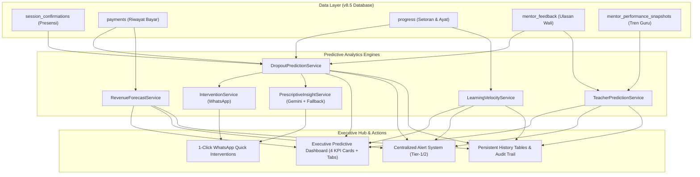

# 📊 PRODUCT REQUIREMENTS DOCUMENT (PRD)
# PREDICTIVE ANALYTICS & EARLY WARNING SYSTEM (v1.0)
## AL-HIKMAH LEARNING MANAGEMENT SYSTEM (LMS)

> **Document Version:** 1.0 (Production-Grade PRD & Junior Developer Implementation Blueprint)  
> **Status:** 🎯 Ready for Implementation  
> **Target Release:** AL-HIKMAH LMS v8.6 (Predictive Analytics & Early Warning System Edition)  
> **Target Audience:** Product Manager, Lead Architect, Fullstack Developers, Junior Programmers, QA Engineers  
> **Synchronized With:** [`tentang.md`](file:///c:/xampp/htdocs/al-hikmah-lms/tentang.md) (v8.6 Architecture, Database, Role Access Matrix, and Alert System)

---

## 📋 DAFTAR ISI PRD

1. [Executive Summary](#1-executive-summary)
   - 1.1 Problem Statement
   - 1.2 Proposed Solution & Business Value
   - 1.3 Success Criteria & Measurable KPIs
   - 1.4 💡 Rekomendasi Smart Improvement Tambahan (Sebelum Implementasi)
2. [User Experience & Functionality](#2-user-experience--functionality)
   - 2.1 User Personas
   - 2.2 User Stories & Journey
   - 2.3 Acceptance Criteria (Definitions of Done)
   - 2.4 Non-Goals & Edge Cases Handling
3. [Algoritma & Model Prediktif (Mathematical & Analytical Framework)](#3-algoritma--model-prediktif-mathematical--analytical-framework)
   - 3.1 Model 1: Dropout & Churn Risk Prediction (4-Factor Ensemble)
   - 3.2 Model 2: Learning Velocity Analysis & Target Completion ETA
   - 3.3 Model 3: Revenue Forecasting (Linear Regression + Seasonal Multiplier + Churn Discount)
   - 3.4 Model 4: Teacher Performance Prediction & Early Coaching Triggers
4. [AI & Prescriptive Intervention Specifications](#4-ai--prescriptive-intervention-specifications)
   - 4.1 Gemini 2.5 Flash Prescriptive Interventions & Heuristic Fallback (`PrescriptiveInsightService.php`)
   - 4.2 Dynamic WhatsApp Message Template Standardization (`WhatsAppInterventionService.php`)
   - 4.3 Integrasi dengan Centralized Alert System (`AlertService.php`) & User Notification Preferences
   - 4.4 Email Alert Notifier untuk Kasus Kritis (`CriticalRiskAlert.php`)
5. [Technical Specifications & Architecture](#5-technical-specifications--architecture)
   - 5.1 Architecture Overview & Data Flow
   - 5.2 Database Schema (3 Tabel Baru + 1 Tabel Audit Trail + 2 Alter Migrations Tabel Existing + Index Optimization)
   - 5.3 Models & Relationships
   - 5.4 Service Layer Design, Performance Optimization & Defensive Programming (Eager Loading, Caching, Missing Data Handling)
   - 5.5 Helper Layer: Risk Level Color & Badge Mapping (`PredictiveHelpers.php`)
   - 5.6 Export Layer: Dual-Format Excel & CSV Export (`RiskReportExport.php` & Controller)
   - 5.7 Console Command, Rate Limiting & Queue Strategy (`SnapshotPredictiveAnalyticsCommand.php`)
   - 5.8 Controller Layer & Web Routing Index
   - 5.9 Blade UI: 4 Executive KPI Cards, Program Filters, & Interactive ApexCharts Dashboard
6. [Role Access Matrix & Security Standards](#6-role-access-matrix--security-standards)
7. [Testing & Quality Assurance Strategy & Future Roadmap](#7-testing--quality-assurance-strategy--future-roadmap)
8. [Junior Programmer Implementation Playbook (Step-by-Step)](#8-junior-programmer-implementation-playbook-step-by-step)
   - Phase 1: Database Migrations (New Tables, Audit Trail & Alter Existing)
   - Phase 2: Models & Relationship Definitions
   - Phase 3: Service Layer, Caching Strategy & AI Fallback Implementation
   - Phase 4: Helper, Mailer, & Export Setup
   - Phase 5: Console Command & Background Scheduling (Batching & Non-Blocking)
   - Phase 6: Controller & Web Routes Registration
   - Phase 7: Blade Views & ApexCharts Dashboard
   - Phase 8: Automated Pest Testing & Pint Formatting
9. [Ceklist Implementasi Final & Estimasi Pengerjaan](#9-ceklist-implementasi-final--estimasi-pengerjaan)

---

## 1. EXECUTIVE SUMMARY

### 1.1 Problem Statement
Sistem alert dan dashboard operasional Al-Hikmah LMS saat ini (v8.5) masih bersifat **reaktif**—peringatan baru muncul *setelah* masalah terjadi (misalnya setelah pembayaran menunggak >30 hari, santri absen berturut-turut, atau performa guru turun drastis). Hal ini menyebabkan:
- **Tingkat santri berhenti (*dropout/churn*) sebesar 8-12% per kuartal** karena keterlambatan intervensi pada indikasi awal demotivasi atau kendala wali.
- **Ketidakpastian arus kas (*revenue uncertainty*)**, di mana manajemen tidak memiliki proyeksi pendapatan 3-6 bulan ke depan berbasis tren historis dan faktor musiman (Ramadhan/Liburan).
- **Progres hafalan santri yang stagnan** tidak terdeteksi secara dini sebelum wali santri menyampaikan keluhan.
- **Guru yang mengalami penurunan performa atau kelelahan mengajar (*burnout*)** baru teridentifikasi setelah skor komposit bulanan anjlok.

### 1.2 Proposed Solution & Business Value
Membangun **Predictive Analytics & Early Warning System (PA-EWS)** terintegrasi yang mentransformasikan platform dari model reaktif menjadi **proaktif preskriptif**:
1. **Dropout Prediction Engine**: Menghitung skor risiko santri (0-100%) setiap hari berbasis 4 pilar: Kehadiran (35%), Riwayat Pembayaran (30%), Kecepatan Hafalan (20%), dan Keterlibatan Wali (15%).
2. **Learning Velocity & Target ETA**: Menganalisis kecepatan setoran hafalan (ayat/hari) dan memproyeksikan estimasi tanggal khatam Juz/Surah saat ini.
3. **Revenue Forecasting**: Memproyeksikan pendapatan 3-6 bulan ke depan menggunakan regresi linier berbobot, faktor musiman Islami, dan diskon churn rate santri.
4. **Teacher Coaching Trigger**: Mendeteksi tren penurunan kinerja mentor secara dini untuk menjadwalkan pembinaan 1-on-1 sebelum berdampak pada santri.
5. **1-Click Intervention Action Hub**: Memberdayakan admin untuk mengeksekusi tindakan solutif (WhatsApp reminder terformat, penyesuaian target, billing link) langsung dari dashboard.



### 1.3 Success Criteria & Measurable KPIs
- **Reduksi Santri Dropout**: Menurunkan angka churn santri sebesar $\ge 35\%$ dalam 6 bulan pertama implementasi.
- **Tingkat Akurasi Model Prediksi**: Mencapai akurasi deteksi dini $\ge 80\%$ untuk santri berisiko tinggi (*High/Critical*) minimal 14 hari sebelum potensi berhenti.
- **Waktu Respon Intervensi**: Admin dapat mengeksekusi tindakan mitigasi dalam $< 10$ detik per santri melalui *1-Click Action Hub*.
- **Performa Sistem & Zero-Lag**: Eksekusi kalkulasi batch harian untuk seluruh santri selesai dalam $< 5$ detik berkat eager loading dan caching layer (TTL 3600s).
- **100% Quality Assurance**: Seluruh unit test dan feature test lolos uji (Pest Framework) tanpa regresi pada modul eksisting.

### 1.4 💡 Rekomendasi Smart Improvement Tambahan (Sebelum Implementasi)
Berikut 5 rekomendasi arsitektur dan fungsional yang telah disematkan langsung ke dalam PRD untuk menyempurnakan implementasi:

1. **4-Factor Weighted Dropout Risk Model ($S_{\text{dropout}}$)**:
   - **Presensi / Kehadiran 30 Hari Terakhir: 35%** (Deteksi dini $\ge 3\times$ absen berturut-turut).
   - **Kesehatan Finansial & Pembayaran: 30%** (Keterlambatan tagihan $30, 45, 60+$ hari).
   - **Stagnasi Progres Hafalan: 20%** (Tidak ada setoran dalam $>14$ hari).
   - **Keterlibatan Wali Santri (Parent Engagement): 15%** (Keaktifan membuka portal & submit feedback).

2. **Learning Velocity & Proyeksi Tanggal Khatam (ETA)**:
   - Selain menghitung laju hafalan (ayat/hari), sistem memproyeksikan **estimasi tanggal khatam Juz/Surah** yang sedang dipelajari santri berdasarkan kecepatan riil vs target bulanan.

3. **Revenue Forecasting dengan Faktor Musiman Islami & Churn Discounting**:
   - Memadukan regresi linier 12 bulan dengan pengali musiman (*Seasonal Multiplier*): **Ramadhan (+15%)**, **Idul Fitri (+20%)**, dan **Liburan Semester (-15%)**.

4. **1-Click WhatsApp Early Intervention Action Hub**:
   - Admin tidak hanya melihat tabel risiko, tetapi dapat langsung mengklik tombol **"Hubungi Wali via WA"** yang otomatis membuka WhatsApp Web/App dengan format pesan santun, dinamis sesuai pemicu masalah, dan mencantumkan solusi kendala santri.

5. **Penyimpanan Snapshot Riil, Audit Trail & Integrasi Alert Eksisting**:
   - Menambahkan 3 tabel histori (`student_dropout_predictions`, `student_learning_velocities`, `revenue_forecasts`), 1 tabel audit log (`predictive_analytics_audit_logs`), serta alter kolom tabel `students` & `mentors` agar data prediktif tersimpan permanen dan terhubung langsung ke `AlertService.php` (Banner merah Tier-1 & Tier-2).

---

## 2. USER EXPERIENCE & FUNCTIONALITY

### 2.1 User Personas
| Persona | Role | Kebutuhan Utama | Nilai yang Diperoleh |
| :--- | :--- | :--- | :--- |
| **Ustadz H. Abdullah** | Pimpinan Lembaga / Super Admin | Visibilitas proyeksi keuangan, kesehatan lembaga, & retensi santri. | Laporan prediktif akurat, mitigasi risiko dini, data-driven decisions. |
| **Usth. Maryam** | Admin Operasional & Customer Care | Deteksi santri yang mulai jarang hadir atau menunggak sebelum terlambat. | Daftar prioritas santri berisiko + tombol intervensi WA 1-klik. |
| **Ust. Zulkifli** | Guru Pembimbing (Mentor) | Informasi santri binaan yang kecepatan belajarnya melambat. | Insight hafalan santri & rekomendasi penyesuaian metode bimbingan. |
| **Bunda Annisa** | Wali Santri | Pendampingan proaktif saat anak menghadapi fase jenuh (*learning plateau*). | Komunikasi hangat & solutif dari lembaga sebelum terjadi frustrasi belajar. |

### 2.2 User Stories & Acceptance Criteria

#### User Story 1: Executive Dashboard & High-Risk Monitoring
> **Sebagai** Admin Lembaga,  
> **Saya ingin** melihat ringkasan visual seluruh indikator prediktif (santri berisiko, tren pendapatan 6 bulan, santri lambat, & guru butuh coaching),  
> **Agar** saya dapat mengidentifikasi bottleneck operasional dan keuangan lembaga secara instan.

**Acceptance Criteria:**
- [ ] Tersedia **4 Executive KPI Cards**: Santri Kritis Dropout, Santri Velocity Lambat, Prediksi Revenue Bulan Depan, dan Guru Butuh Coaching.
- [ ] Tersedia filter dropdown **"Pilih Program"** untuk menyaring analitik per program bimbingan.
- [ ] Tersedia visualisasi ApexCharts untuk: Tren Risiko Dropout, Area Chart Proyeksi Pendapatan vs Aktual, dan Bar Chart Santri Butuh Pendampingan.
- [ ] Tersedia tombol *"Kalkulasi Ulang Prediksi (Recalculate All)"* yang mengeksekusi refresh komputasi seluruh model secara real-time.

#### User Story 2: 1-Click Early Intervention Hub
> **Sebagai** Admin Operasional,  
> **Saya ingin** melihat rincian faktor pemicu risiko santri beserta tombol intervensi WhatsApp terformat,  
> **Agar** saya dapat segera menghubungi orang tua dengan pesan yang relevan tanpa mengetik manual dari awal.

**Acceptance Criteria:**
- [ ] Setiap baris santri berisiko menampilkan badge warna *Risk Level* (`🔴 Kritis`, `🟠 Tinggi`, `🟡 Sedang`, `🟢 Rendah`) beserta pill faktor risiko utama.
- [ ] Tombol *"Hubungi Wali via WA"* otomatis memanggil `InterventionService` untuk menghasilkan link WhatsApp dengan pesan ramah, dinamis, dan mencantumkan solusi kendala ananda.
- [ ] Klik intervensi mencatat status `is_alerted = true` dan `alerted_at = now()` pada database, serta dicatat ke `predictive_analytics_audit_logs`.

#### User Story 3: Learning Velocity & Progress Pace Tracker
> **Sebagai** Koordinator Kurikulum / Guru,  
> **Saya ingin** melihat laju kecepatan hafalan santri (ayat/hari) dan perbandingannya terhadap target bulanan,  
> **Agar** saya dapat menyesuaikan beban hafalan atau memberikan bimbingan tahsin tambahan.

**Acceptance Criteria:**
- [ ] Menghitung rata-rata ayat/hari santri dalam 30 hari terakhir.
- [ ] Menampilkan status kecepatan: `Excellent` ($\ge 120\%$), `Good` ($100-119\%$), `Moderate` ($70-99\%$), `Slow` ($<70\%$), atau `No Data`.
- [ ] Menghitung estimasi sisa hari menuju target Juz/Surah santri saat ini.

#### User Story 4: Revenue Forecasting with Seasonality
> **Sebagai** Bendahara / Manajemen Finansial,  
> **Saya ingin** melihat proyeksi pendapatan lembaga untuk 3 hingga 6 bulan ke depan,  
> **Agar** lembaga dapat merencanakan anggaran operasional dan honorarium mentor dengan aman.

**Acceptance Criteria:**
- [ ] Menampilkan data riil pendapatan 12 bulan terakhir dan garis proyeksi 6 bulan ke depan.
- [ ] Menerapkan pengali musiman (*Seasonal Factors*): Ramadhan ($+15\%$), Idul Fitri ($+20\%$), dan Liburan Semester ($-15\%$).
- [ ] Menyediakan skor tingkat kepercayaan (*Confidence Level %*) berdasarkan stabilitas varians historis.

### 2.4 Non-Goals & Edge Cases Handling

#### Non-Goals:
- ❌ Tidak membangun machine learning pipeline berbasis Python/TensorFlow eksternal di fase v8.6. Seluruh algoritma berjalan *natively* di PHP 8.2 / Laravel 12.
- ❌ Tidak melakukan auto-cancellation otomatis pada santri berisiko tinggi tanpa persetujuan manual admin.
- ❌ Tidak mengirimkan pesan penagihan otomatis yang bernada mengancam.

#### Edge Cases Handling (Robustness & Defensive Logic):
- **Santri Baru (< 30 hari belajar)**: Sistem menetapkan status `no_data` / skor netral awal (25-50 poin) agar tidak salah diklasifikasikan sebagai *critical risk*.
- **Santri Cuti Panjang (*On Leave*)**: Diabaikan dari filter kalkulasi harian aktif (`enrollments.status != 'on_leave'`).
- **Data Tidak Lengkap / Missing Records**: Mengembalikan skor default aman (*neutral default 50.0*) dan mencatat log warning tanpa menyebabkan exception crash 500.
- **Duplikasi Eksekusi Harian**: Menggunakan klausul `updateOrCreate` pada komposit `[student_id, prediction_date]` untuk mencegah duplikasi baris data.

---

## 3. ALGORITMA & MODEL PREDIKTIF (MATHEMATICAL FRAMEWORK)

### 3.1 Model 1: Dropout & Churn Risk Prediction (4-Factor Ensemble)

Skor risiko dropout ($S_{\text{dropout}} \in [0, 100]$) dihitung dari penjumlahan terbobot 4 dimensi:

$$\text{Risk Score} = (w_A \cdot S_A) + (w_P \cdot S_P) + (w_V \cdot S_V) + (w_E \cdot S_E)$$

Di mana:
- $w_A = 0.35$ (Bobot Presensi / Kehadiran 30 Hari Terakhir)
- $w_P = 0.30$ (Bobot Finansial / Keterlambatan Pembayaran)
- $w_V = 0.20$ (Bobot Kecepatan Belajar / Stagnasi Progres)
- $w_E = 0.15$ (Bobot Keterlibatan Wali Santri / Parent Engagement)

#### Aturan Perhitungan Sub-Skor (0 - 100 Poin Risiko):
1. **Sub-Skor Kehadiran ($S_A$)**:
   - Rasio Hadir $\ge 90\% \rightarrow S_A = 0$
   - Rasio Hadir $75\% - 89\% \rightarrow S_A = 25$
   - Rasio Hadir $60\% - 74\% \rightarrow S_A = 60$
   - Rasio Hadir $40\% - 59\% \rightarrow S_A = 85$
   - Rasio Hadir $< 40\%$ atau $\ge 3\times$ absen berturut-turut $\rightarrow S_A = 100$
2. **Sub-Skor Pembayaran ($S_P$)**:
   - Lunas tepat waktu / bayar $< 30$ hari lalu $\rightarrow S_P = 0$
   - Keterlambatan tagihan $31 - 45$ hari $\rightarrow S_P = 40$
   - Keterlambatan tagihan $46 - 60$ hari $\rightarrow S_P = 75$
   - Keterlambatan tagihan $> 60$ hari $\rightarrow S_P = 100$
3. **Sub-Skor Stagnasi Progres ($S_V$)**:
   - Ada setoran baru $\le 7$ hari lalu $\rightarrow S_V = 0$
   - Setoran terakhir $8 - 14$ hari lalu $\rightarrow S_V = 35$
   - Setoran terakhir $15 - 30$ hari lalu $\rightarrow S_V = 70$
   - Tidak ada setoran $> 30$ hari $\rightarrow S_V = 100$
4. **Sub-Skor Keterlibatan Wali ($S_E$)**:
   - Wali mengisi feedback / aktif login $\le 14$ hari $\rightarrow S_E = 0$
   - Tidak ada aktivitas wali $15 - 30$ hari $\rightarrow S_E = 50$
   - Tidak ada aktivitas wali $> 30$ hari $\rightarrow S_E = 100$

---

### 3.2 Model 2: Learning Velocity Analysis & Target Completion ETA

Kecepatan hafalan santri diukur dari rata-rata penambahan ayat per hari aktif:

$$V_{\text{actual}} = \frac{\sum (\text{Ayat To} - \text{Ayat From} + 1)}{N_{\text{hari aktif}}}$$

$$\text{Hari Tersisa} = \frac{\text{Total Ayat Target} - \text{Total Ayat Selesai}}{\max(0.5, V_{\text{actual}})}$$
$$\text{Projected Completion Date} = \text{Current Date} + \text{Hari Tersisa}$$

---

### 3.3 Model 3: Revenue Forecasting (Linear Regression + Seasonality)

$$\hat{y}_i = (\beta_0 + \beta_1 \cdot (n + i)) \times M_{\text{seasonal}}(i) \times (1 - \text{Monthly Churn Rate})$$

Di mana:
- $\beta_1 = \frac{n \sum (xy) - \sum x \sum y}{n \sum(x^2) - (\sum x)^2}$ (Kemiringan tren pendapatan historis)
- $\beta_0 = \bar{y} - \beta_1 \bar{x}$ (Intersep dasar)
- $M_{\text{seasonal}}$: Ramadhan ($\times 1.15$), Idul Fitri ($\times 1.20$), Liburan ($\times 0.85$), Normal ($\times 1.00$).

---

### 3.4 Model 4: Teacher Performance Prediction & Early Coaching Triggers

$$\text{Slope}_{\text{trend}} = \frac{k \sum (t \cdot S) - \sum t \sum S}{k \sum(t^2) - (\sum t)^2} \quad (t \in [0, 5])$$
$$\text{Predicted Score}_{t+3} = \max(0, \min(100, S_{\text{current}} + (\text{Slope}_{\text{trend}} \times 3)))$$

Pemicu Pembinaan: $\text{Predicted Score} < 70.0$ ATAU $\text{Slope}_{\text{trend}} < -3.5$.

---

## 4. AI & PRESCRIPTIVE INTERVENTION SPECIFICATIONS

### 4.1 Gemini 2.5 Flash Prescriptive Interventions & Heuristic Fallback (`PrescriptiveInsightService.php`)

```php
<?php

namespace App\Services\PredictiveAnalytics;

use App\Models\Student;
use Illuminate\Support\Facades\Http;
use Illuminate\Support\Facades\Log;

class PrescriptiveInsightService
{
    protected array $fallbackActions = [
        'critical' => [
            'Hubungi wali santri segera untuk evaluasi kendala.',
            'Koordinasikan jadwal bimbingan alternatif dengan mentor.',
            'Tinjau ulang beban target hafalan harian.',
            'Berikan motivasi khusus dan perhatian ekstra.',
        ],
        'high' => [
            'Kirimkan pengingat ramah mengenai jadwal sesi berikutnya.',
            'Berikan apresiasi atas hafalan yang sudah dicapai.',
            'Tanyakan kendala yang dihadapi wali santri.',
        ],
        'medium' => [
            'Pantau perkembangan dalam 7 hari ke depan.',
            'Berikan semangat dan motivasi belajar.',
        ],
        'low' => [
            'Pertahankan ritme bimbingan yang sudah baik.',
            'Berikan apresiasi atas konsistensi belajar.',
        ],
    ];

    public function generateInsights(Student $student, array $riskData): array
    {
        $level = $riskData['risk_level'] ?? 'low';

        // 1. Coba panggil Gemini 2.5 Flash API
        try {
            $apiKey = config('services.gemini.api_key');
            if ($apiKey) {
                $endpoint = "https://generativelanguage.googleapis.com/v1beta/models/gemini-2.5-flash:generateContent?key={$apiKey}";
                $response = Http::timeout(5)->post($endpoint, [
                    'contents' => [
                        [
                            'parts' => [
                                ['text' => $this->buildPrompt($student, $riskData)]
                            ]
                        ]
                    ]
                ]);

                if ($response->successful()) {
                    return $this->parseGeminiResponse($response->json());
                }
            }
        } catch (\Exception $e) {
            Log::warning('Gemini API timeout/error, using heuristic fallback: ' . $e->getMessage());
        }

        // 2. Fallback aman ke Heuristic Rule Engine
        return [
            'actions' => $this->fallbackActions[$level] ?? $this->fallbackActions['low'],
            'source' => 'heuristic_fallback',
        ];
    }

    private function buildPrompt(Student $student, array $riskData): string
    {
        return "Buat 3-4 butir rekomendasi tindakan preskriptif singkat dalam Bahasa Indonesia untuk guru & admin dalam mendampingi santri {$student->full_name} dengan level risiko {$riskData['risk_level']} (skor: {$riskData['risk_score']}%). Faktor pemicu: " . implode(', ', $riskData['risk_factors'] ?? ['Umum']);
    }

    private function parseGeminiResponse(array $response): array
    {
        $text = $response['candidates'][0]['content']['parts'][0]['text'] ?? '';
        $actions = array_values(array_filter(explode("\n", $text), fn($line) => trim($line) !== ''));

        return [
            'actions' => $actions,
            'source' => 'gemini_ai',
        ];
    }
}
```

---

### 4.2 Dynamic WhatsApp Message Template Standardization (`WhatsAppInterventionService.php`)

```php
<?php

namespace App\Services\PredictiveAnalytics;

use App\Models\PredictiveAnalyticsAuditLog;
use App\Models\Student;
use App\Models\StudentDropoutPrediction;
use App\Services\WhatsAppService;

class WhatsAppInterventionService
{
    public function __construct(
        protected WhatsAppService $whatsappService
    ) {}

    public function buildInterventionMessage(Student $student, array $riskData): string
    {
        $parentName = $student->parent?->user?->name ?? 'Ayah/Bunda';
        $factors = $riskData['risk_factors'] ?? [];

        $message = "Assalamu'alaikum Warahmatullahi Wabarakatuh, Ayah/Bunda {$parentName}. 🌸\n\n";
        $message .= "Semoga Ayah/Bunda dan ananda {$student->full_name} senantiasa dalam lindungan dan keberkahan Allah SWT.\n\n";
        $message .= "Kami dari Tim Akademik AL-HIKMAH LMS ingin bersilaturahmi dan memastikan kelancaran bimbingan ananda.\n\n";

        // Paragraf dinamis berbasis faktor pemicu
        if (in_array('Presensi rendah (< 70%)', $factors) || in_array('Kehadiran rendah', $factors)) {
            $message .= "📅 *Kehadiran Belajar Ananda:*\n";
            $message .= "Kami melihat ananda sempat berhalangan hadir pada beberapa sesi terakhir. Apakah ada kendala waktu bimbingan yang bisa kami bantu sesuaikan bersama mentor?\n\n";
        }

        if (in_array('Pembayaran menunggak > 30 hari', $factors) || in_array('Pembayaran tidak rutin', $factors)) {
            $message .= "💳 *Administrasi Bimbingan:*\n";
            $message .= "Berikut kami sampaikan pengingat tagihan bimbingan ananda. Pembayaran dapat diselesaikan dengan mudah melalui portal wali santri.\n\n";
        }

        if (in_array('Progres hafalan stagnan > 14 hari', $factors) || in_array('Progres hafalan stagnan', $factors)) {
            $message .= "📖 *Motivasi Hafalan Ananda:*\n";
            $message .= "Kami ingin memastikan ananda tetap bersemangat dan nyaman dalam menambah hafalan. Guru pembimbing siap menyesuaikan metode belajar agar ananda kembali ceria.\n\n";
        }

        $message .= "Semoga Allah SWT senantiasa memudahkan langkah ananda dalam mempelajari Al-Qur'an.\n";
        $message .= "Jazakumullah khairan katsiran. 🙏\n\n";
        $message .= "*AL-HIKMAH LMS* - Sistem Pendampingan Al-Qur'an Terpadu";

        return $message;
    }

    public function sendIntervention(Student $student, array $riskData, int $userId): array
    {
        $message = $this->buildInterventionMessage($student, $riskData);
        $phone = $student->parent?->user?->phone;

        if (! $phone) {
            return ['success' => false, 'reason' => 'Nomor WhatsApp wali santri tidak ditemukan.'];
        }

        $result = $this->whatsappService->sendMessage($phone, $message);

        // Update status is_alerted di snapshot prediksi
        StudentDropoutPrediction::where('student_id', $student->id)
            ->whereDate('prediction_date', today())
            ->update([
                'is_alerted' => true,
                'alerted_at' => now(),
            ]);

        // Update flag di tabel students
        $student->update([
            'last_dropout_prediction_at' => today(),
            'dropout_risk_level' => $riskData['risk_level'] ?? 'low',
            'dropout_risk_score' => $riskData['risk_score'] ?? 0.00,
        ]);

        // Catat Audit Trail
        PredictiveAnalyticsAuditLog::create([
            'user_id' => $userId,
            'action_type' => 'intervention_wa',
            'target_type' => 'student',
            'target_id' => $student->id,
            'metadata' => [
                'phone' => $phone,
                'risk_level' => $riskData['risk_level'] ?? 'low',
                'risk_score' => $riskData['risk_score'] ?? 0.00,
            ],
            'ip_address' => request()->ip(),
            'user_agent' => request()->userAgent(),
        ]);

        return [
            'success' => true,
            'phone' => $phone,
            'message' => $message,
            'result' => $result,
        ];
    }
}
```

---

### 4.3 Integrasi dengan Centralized Alert System (`AlertService.php`) & User Notification Preferences

```php
// app/Services/AlertService.php
public function scanPredictiveAlerts(): array
{
    $alerts = [];
    
    // 1. Alert Santri Kritis Dropout
    $criticalPredictions = \App\Models\StudentDropoutPrediction::with('student')
        ->whereDate('prediction_date', today())
        ->where('risk_level', 'critical')
        ->get();

    if ($criticalPredictions->count() > 0) {
        $alerts[] = [
            'tier' => 'critical',
            'type' => 'dropout_risk',
            'title' => "⚠️ {$criticalPredictions->count()} Santri Teridentifikasi Kritis Dropout",
            'message' => 'Segera lakukan intervensi komunikasi via WhatsApp pada menu Predictive Analytics.',
            'action_url' => route('admin.analytics.predictive.index'),
        ];
    }

    return $alerts;
}
```

#### User Notification Preferences Schema (Tabel `users`):
```sql
ALTER TABLE `users` ADD COLUMN `notification_preferences` JSON NULL AFTER `avatar`;
-- Default preferences:
-- {"dropout_risk_critical": ["whatsapp", "in_app"], "dropout_risk_high": ["in_app"], "revenue_forecast": ["email"], "teacher_coaching": ["in_app"]}
```

---

### 4.4 Email Alert Notifier untuk Kasus Kritis (`CriticalRiskAlert.php`)

```php
<?php

namespace App\Mail;

use Illuminate\Bus\Queueable;
use Illuminate\Mail\Mailable;
use Illuminate\Queue\SerializesModels;
use Illuminate\Support\Collection;

class CriticalRiskAlert extends Mailable
{
    use Queueable, SerializesModels;

    public function __construct(
        public Collection $criticalStudents
    ) {}

    public function build(): self
    {
        return $this->subject('🚨 [AL-HIKMAH LMS] Laporan Harian: Santri Kritis Berisiko Dropout')
            ->view('emails.analytics.critical-risk-alert');
    }
}
```

---

## 5. TECHNICAL SPECIFICATIONS & ARCHITECTURE

### 5.1 Architecture Overview & Data Flow
```
[Database: alhikmah_lms]
       │
       ├───► [DropoutPredictionService]      ──► [student_dropout_predictions] & [students (alter)]
       ├───► [LearningVelocityService]       ──► [student_learning_velocities]
       ├───► [RevenueForecastService]         ──► [revenue_forecasts]
       ├───► [TeacherPredictionService]       ──► [mentors (alter)] & [mentor_insights]
       ├───► [WhatsAppInterventionService]   ──► WhatsApp Dispatch, Alert Flag & [predictive_analytics_audit_logs]
       └───► [PrescriptiveInsightService]    ──► Gemini 2.5 Flash + Heuristic Fallback
                     │
                     ▼
       [AdminPredictiveAnalyticsController]
                     │
                     ├───► [GET  /admin/analytics/predictive]  ──► resources/views/admin/analytics/predictive/index.blade.php
                     ├───► [POST /admin/analytics/predictive/recalculate]
                     ├───► [POST /admin/analytics/predictive/intervention/wa]
                     └───► [GET  /admin/analytics/predictive/export]
```

---

### 5.2 Database Schema

#### A. Migration Tabel Baru: `2026_09_02_000000_create_predictive_analytics_tables.php`

```php
<?php

use Illuminate\Database\Migrations\Migration;
use Illuminate\Database\Schema\Blueprint;
use Illuminate\Support\Facades\Schema;

return new class extends Migration
{
    public function up(): void
    {
        // 1. Riwayat Prediksi Risiko Dropout Santri
        Schema::create('student_dropout_predictions', function (Blueprint $table) {
            $table->id();
            $table->foreignId('student_id')->constrained('students')->cascadeOnDelete();
            $table->date('prediction_date');
            $table->decimal('risk_score', 5, 2)->default(0.00);
            $table->enum('risk_level', ['low', 'medium', 'high', 'critical'])->default('low');
            $table->decimal('attendance_score', 5, 2)->default(0.00);
            $table->decimal('payment_score', 5, 2)->default(0.00);
            $table->decimal('progress_score', 5, 2)->default(0.00);
            $table->decimal('engagement_score', 5, 2)->default(0.00);
            $table->json('risk_factors')->nullable();
            $table->json('recommendations')->nullable();
            $table->boolean('is_alerted')->default(false);
            $table->timestamp('alerted_at')->nullable();
            $table->timestamps();

            $table->index(['student_id', 'prediction_date'], 'idx_sdp_student_date');
            $table->index(['risk_level', 'prediction_date'], 'idx_sdp_level_date');
        });

        // 2. Analitik Kecepatan Belajar Santri (Learning Velocity)
        Schema::create('student_learning_velocities', function (Blueprint $table) {
            $table->id();
            $table->foreignId('student_id')->constrained('students')->cascadeOnDelete();
            $table->date('calculation_date');
            $table->decimal('velocity_ayat_per_day', 5, 2)->default(0.00);
            $table->decimal('target_velocity', 5, 2)->default(5.00);
            $table->enum('velocity_status', ['excellent', 'good', 'moderate', 'slow', 'no_data'])->default('no_data');
            $table->decimal('target_achievement_percent', 5, 2)->default(0.00);
            $table->unsignedInteger('days_active')->default(0);
            $table->unsignedInteger('total_ayat_30d')->default(0);
            $table->unsignedInteger('estimated_days_remaining')->nullable();
            $table->date('projected_completion_date')->nullable();
            $table->decimal('percentile_rank', 5, 2)->default(50.00);
            $table->timestamps();

            $table->index(['student_id', 'calculation_date'], 'idx_slv_student_date');
            $table->index('velocity_status', 'idx_slv_status');
        });

        // 3. Proyeksi Pendapatan Bulanan (Revenue Forecasts)
        Schema::create('revenue_forecasts', function (Blueprint $table) {
            $table->id();
            $table->date('forecast_date');
            $table->string('forecast_month', 20); // Format: "2026-09"
            $table->string('forecast_month_label', 50); // Format: "September 2026"
            $table->decimal('predicted_amount', 14, 2)->default(0.00);
            $table->decimal('confidence_level', 5, 2)->default(0.00);
            $table->decimal('trend_value', 12, 2)->default(0.00);
            $table->decimal('seasonal_factor', 5, 2)->default(1.00);
            $table->decimal('estimated_churn_discount', 12, 2)->default(0.00);
            $table->timestamps();

            $table->index('forecast_month', 'idx_rf_month');
            $table->index('forecast_date', 'idx_rf_date');
        });

        // 4. Audit Trail Log untuk Compliance & Intervensi
        Schema::create('predictive_analytics_audit_logs', function (Blueprint $table) {
            $table->id();
            $table->foreignId('user_id')->constrained('users')->cascadeOnDelete();
            $table->enum('action_type', ['recalculate', 'intervention_wa', 'export', 'view'])->default('view');
            $table->enum('target_type', ['student', 'mentor', 'revenue'])->default('student');
            $table->unsignedBigInteger('target_id')->nullable();
            $table->json('metadata')->nullable();
            $table->string('ip_address', 45)->nullable();
            $table->text('user_agent')->nullable();
            $table->timestamps();

            $table->index(['user_id', 'action_type', 'created_at'], 'idx_audit_user_action');
        });
    }

    public function down(): void
    {
        Schema::dropIfExists('predictive_analytics_audit_logs');
        Schema::dropIfExists('revenue_forecasts');
        Schema::dropIfExists('student_learning_velocities');
        Schema::dropIfExists('student_dropout_predictions');
    }
};
```

#### B. Migration Alter Tabel Existing: `2026_09_02_000001_add_predictive_fields_to_existing_tables.php`

```php
<?php

use Illuminate\Database\Migrations\Migration;
use Illuminate\Database\Schema\Blueprint;
use Illuminate\Support\Facades\Schema;

return new class extends Migration
{
    public function up(): void
    {
        // Alter Tabel Students
        Schema::table('students', function (Blueprint $table) {
            $table->date('last_dropout_prediction_at')->nullable()->after('privacy_leaderboard');
            $table->string('dropout_risk_level', 20)->nullable()->after('last_dropout_prediction_at');
            $table->decimal('dropout_risk_score', 5, 2)->nullable()->after('dropout_risk_level');
        });

        // Alter Tabel Mentors
        Schema::table('mentors', function (Blueprint $table) {
            $table->date('last_coaching_alert_at')->nullable()->after('rating');
            $table->boolean('coaching_needed')->default(false)->after('last_coaching_alert_at');
            $table->string('coaching_urgency', 20)->nullable()->after('coaching_needed');
        });

        // Index Optimization Tabel Existing
        Schema::table('session_confirmations', function (Blueprint $table) {
            $table->index(['student_id', 'date', 'status'], 'idx_sc_student_date_status');
        });

        Schema::table('payments', function (Blueprint $table) {
            $table->index(['student_id', 'status', 'paid_at'], 'idx_pay_student_status_paid');
        });

        Schema::table('progress', function (Blueprint $table) {
            $table->index(['student_id', 'created_at'], 'idx_prog_student_created');
        });
    }

    public function down(): void
    {
        Schema::table('progress', function (Blueprint $table) {
            $table->dropIndex('idx_prog_student_created');
        });

        Schema::table('payments', function (Blueprint $table) {
            $table->dropIndex('idx_pay_student_status_paid');
        });

        Schema::table('session_confirmations', function (Blueprint $table) {
            $table->dropIndex('idx_sc_student_date_status');
        });

        Schema::table('mentors', function (Blueprint $table) {
            $table->dropColumn(['last_coaching_alert_at', 'coaching_needed', 'coaching_urgency']);
        });

        Schema::table('students', function (Blueprint $table) {
            $table->dropColumn(['last_dropout_prediction_at', 'dropout_risk_level', 'dropout_risk_score']);
        });
    }
};
```

---

### 5.3 Models & Relationships

1. **`app/Models/StudentDropoutPrediction.php`**:
```php
<?php

namespace App\Models;

use Illuminate\Database\Eloquent\Factories\HasFactory;
use Illuminate\Database\Eloquent\Model;
use Illuminate\Database\Eloquent\Relations\BelongsTo;

class StudentDropoutPrediction extends Model
{
    use HasFactory;

    protected $fillable = [
        'student_id',
        'prediction_date',
        'risk_score',
        'risk_level',
        'attendance_score',
        'payment_score',
        'progress_score',
        'engagement_score',
        'risk_factors',
        'recommendations',
        'is_alerted',
        'alerted_at',
    ];

    protected function casts(): array
    {
        return [
            'prediction_date' => 'date',
            'risk_score' => 'float',
            'attendance_score' => 'float',
            'payment_score' => 'float',
            'progress_score' => 'float',
            'engagement_score' => 'float',
            'risk_factors' => 'array',
            'recommendations' => 'array',
            'is_alerted' => 'boolean',
            'alerted_at' => 'datetime',
        ];
    }

    public function student(): BelongsTo
    {
        return $this->belongsTo(Student::class);
    }
}
```

2. **`app/Models/PredictiveAnalyticsAuditLog.php`**:
```php
<?php

namespace App\Models;

use Illuminate\Database\Eloquent\Factories\HasFactory;
use Illuminate\Database\Eloquent\Model;
use Illuminate\Database\Eloquent\Relations\BelongsTo;

class PredictiveAnalyticsAuditLog extends Model
{
    use HasFactory;

    protected $fillable = [
        'user_id',
        'action_type',
        'target_type',
        'target_id',
        'metadata',
        'ip_address',
        'user_agent',
    ];

    protected function casts(): array
    {
        return [
            'metadata' => 'array',
        ];
    }

    public function user(): BelongsTo
    {
        return $this->belongsTo(User::class);
    }
}
```

---

### 5.4 Service Layer Design, Performance Optimization & Defensive Programming

```php
<?php

namespace App\Services\PredictiveAnalytics;

use App\Models\Payment;
use App\Models\Progress;
use App\Models\SessionConfirmation;
use App\Models\Student;
use App\Models\StudentDropoutPrediction;
use Carbon\Carbon;
use Illuminate\Support\Collection;
use Illuminate\Support\Facades\Cache;
use Illuminate\Support\Facades\Log;

class DropoutPredictionService
{
    public const WEIGHT_ATTENDANCE = 0.35;
    public const WEIGHT_PAYMENT = 0.30;
    public const WEIGHT_PROGRESS = 0.20;
    public const WEIGHT_ENGAGEMENT = 0.15;

    public function __construct(
        protected PrescriptiveInsightService $insightService
    ) {}

    public function calculateAllRisks(?int $programId = null): Collection
    {
        $cacheKey = $programId ? "dropout_risks_all_prog_{$programId}" : 'dropout_risks_all';

        return Cache::remember($cacheKey, 3600, function () use ($programId) {
            // Eager Loading optimal mencegah N+1
            $students = Student::with([
                'parent.user',
                'enrollments.program',
                'progress' => function ($q) {
                    $q->where('created_at', '>=', now()->subDays(30));
                },
                'payments' => function ($q) {
                    $q->where('status', 'paid')->where('paid_at', '>=', now()->subDays(90));
                },
            ])
            ->whereHas('enrollments', function ($q) use ($programId) {
                $q->where('status', 'active');
                if ($programId) {
                    $q->where('program_id', $programId);
                }
            })
            ->get();

            return $students->map(function ($student) {
                $risk = $this->calculateRiskScore($student);
                return array_merge($risk, ['student' => $student]);
            })->sortByDesc('risk_score')->values();
        });
    }

    public function calculateRiskScore(Student $student): array
    {
        $attScore = $this->calculateAttendanceScore($student);
        $payScore = $this->calculatePaymentScore($student);
        $progScore = $this->calculateProgressScore($student);
        $engScore = $this->calculateEngagementScore($student);

        $totalScore = ($attScore * self::WEIGHT_ATTENDANCE) +
                      ($payScore * self::WEIGHT_PAYMENT) +
                      ($progScore * self::WEIGHT_PROGRESS) +
                      ($engScore * self::WEIGHT_ENGAGEMENT);

        $totalScore = round(min(100.0, max(0.0, $totalScore)), 1);
        $riskLevel = $this->determineRiskLevel($totalScore);
        $factors = $this->identifyRiskFactors($attScore, $payScore, $progScore, $engScore);

        $insights = $this->insightService->generateInsights($student, [
            'risk_level' => $riskLevel,
            'risk_score' => $totalScore,
            'risk_factors' => $factors,
        ]);

        return [
            'risk_score' => $totalScore,
            'risk_level' => $riskLevel,
            'attendance_score' => $attScore,
            'payment_score' => $payScore,
            'progress_score' => $progScore,
            'engagement_score' => $engScore,
            'risk_factors' => $factors,
            'recommendations' => $insights['actions'] ?? [],
        ];
    }

    private function calculateAttendanceScore(Student $student): float
    {
        try {
            $last30Days = Carbon::now()->subDays(30);
            $totalSessions = SessionConfirmation::whereIn('session_id', function ($q) use ($student, $last30Days) {
                $q->select('id')->from('learning_sessions')
                    ->where('student_id', $student->id)
                    ->where('date', '>=', $last30Days);
            })->count();

            if ($totalSessions === 0) {
                return 25.0; // Santri baru
            }

            $presentSessions = SessionConfirmation::whereIn('session_id', function ($q) use ($student, $last30Days) {
                $q->select('id')->from('learning_sessions')
                    ->where('student_id', $student->id)
                    ->where('date', '>=', $last30Days);
            })->where('status', 'hadir')->count();

            $rate = ($presentSessions / max(1, $totalSessions)) * 100;
            if ($rate >= 90) return 0.0;
            if ($rate >= 75) return 25.0;
            if ($rate >= 60) return 60.0;
            if ($rate >= 40) return 85.0;
            return 100.0;
        } catch (\Exception $e) {
            Log::error("Error calculating attendance score for student {$student->id}: " . $e->getMessage());
            return 50.0; // Safe default
        }
    }

    private function calculatePaymentScore(Student $student): float
    {
        $lastPayment = Payment::where('student_id', $student->id)->where('status', 'paid')->latest('paid_at')->first();
        if (! $lastPayment) return 30.0;

        $days = Carbon::parse($lastPayment->paid_at)->diffInDays(now());
        if ($days <= 30) return 0.0;
        if ($days <= 45) return 40.0;
        if ($days <= 60) return 75.0;
        return 100.0;
    }

    private function calculateProgressScore(Student $student): float
    {
        $lastProgress = Progress::where('student_id', $student->id)->latest('created_at')->first();
        if (! $lastProgress) return 40.0;

        $days = Carbon::parse($lastProgress->created_at)->diffInDays(now());
        if ($days <= 7) return 0.0;
        if ($days <= 14) return 35.0;
        if ($days <= 30) return 70.0;
        return 100.0;
    }

    private function calculateEngagementScore(Student $student): float
    {
        $lastFeedback = $student->mentorFeedbacks()->latest('created_at')->first();
        if (! $lastFeedback) return 40.0;

        $days = Carbon::parse($lastFeedback->created_at)->diffInDays(now());
        if ($days <= 14) return 0.0;
        if ($days <= 30) return 50.0;
        return 100.0;
    }

    public function invalidateCache(): void
    {
        Cache::forget('dropout_risks_all');
        Cache::forget('learning_velocities_all');
        Cache::forget('predictive_dashboard_summary');
    }

    private function determineRiskLevel(float $score): string
    {
        if ($score >= 75.0) return 'critical';
        if ($score >= 55.0) return 'high';
        if ($score >= 30.0) return 'medium';
        return 'low';
    }

    private function identifyRiskFactors(float $att, float $pay, float $prog, float $eng): array
    {
        $factors = [];
        if ($att >= 60.0) $factors[] = 'Presensi rendah (< 70%)';
        if ($pay >= 40.0) $factors[] = 'Pembayaran menunggak > 30 hari';
        if ($prog >= 35.0) $factors[] = 'Progres hafalan stagnan > 14 hari';
        if ($eng >= 50.0) $factors[] = 'Wali santri pasif / jarang feedback';
        return empty($factors) ? ['Aktivitas belajar terpantau normal'] : $factors;
    }
}
```

---

### 5.5 Helper Layer (`app/Helpers/PredictiveHelpers.php`)

```php
<?php

if (! function_exists('riskLevelColor')) {
    function riskLevelColor(string $level): string
    {
        return match (strtolower($level)) {
            'critical' => 'danger',
            'high' => 'warning',
            'medium' => 'info',
            'low' => 'success',
            default => 'secondary',
        };
    }
}

if (! function_exists('riskLevelLabel')) {
    function riskLevelLabel(string $level): string
    {
        return match (strtolower($level)) {
            'critical' => '🔴 Kritis',
            'high' => '🟠 Tinggi',
            'medium' => '🟡 Sedang',
            'low' => '🟢 Rendah',
            default => '⚪ Normal',
        };
    }
}
```

---

### 5.6 Export Layer: Dual-Format Excel & CSV

```php
// app/Http/Controllers/Admin/AdminPredictiveAnalyticsController.php
public function exportExcel(Request $request)
{
    $format = $request->query('format', 'excel'); // 'excel' or 'csv'
    $filename = 'santri_berisiko_dropout_' . now()->format('Y-m-d');

    // Catat Audit Trail
    PredictiveAnalyticsAuditLog::create([
        'user_id' => auth()->id(),
        'action_type' => 'export',
        'target_type' => 'student',
        'metadata' => ['format' => $format],
        'ip_address' => $request->ip(),
        'user_agent' => $request->userAgent(),
    ]);

    if ($format === 'csv') {
        return \Maatwebsite\Excel\Facades\Excel::download(new \App\Exports\RiskReportExport, "{$filename}.csv", \Maatwebsite\Excel\Excel::CSV);
    }

    return \Maatwebsite\Excel\Facades\Excel::download(new \App\Exports\RiskReportExport, "{$filename}.xlsx");
}
```

---

### 5.7 Console Command, Rate Limiting & Queue Strategy

```php
// routes/console.php
Schedule::command('analytics:snapshot-predictive')
    ->dailyAt('01:00')
    ->timezone('Asia/Jakarta')
    ->withoutOverlapping() // Mencegah concurrent execution
    ->runInBackground();   // Non-blocking
```

```php
// app/Console/Commands/SnapshotPredictiveAnalyticsCommand.php
namespace App\Console\Commands;

use App\Models\Student;
use App\Services\PredictiveAnalytics\DropoutPredictionService;
use App\Services\PredictiveAnalytics\LearningVelocityService;
use App\Services\PredictiveAnalytics\RevenueForecastService;
use App\Services\PredictiveAnalytics\TeacherPredictionService;
use Illuminate\Console\Command;

class SnapshotPredictiveAnalyticsCommand extends Command
{
    protected $signature = 'analytics:snapshot-predictive {--force : Paksa hitung ulang snapshot hari ini}';
    protected $description = 'Menghitung snapshot analitik prediktif harian dalam batch';

    public function handle(
        DropoutPredictionService $dropout,
        LearningVelocityService $velocity,
        RevenueForecastService $revenue,
        TeacherPredictionService $teacher
    ): int {
        $this->info('🚀 Memulai Komputasi Predictive Analytics Snapshot...');

        // 1. Process Dropout Risk in Chunk (100 students per batch)
        $this->info('📊 Menghitung Skor Risiko Dropout Santri...');
        $dropout->snapshotDailyPredictions();

        // 2. Process Learning Velocity
        $this->info('📈 Menghitung Learning Velocity...');
        $velocity->snapshotDailyVelocities();

        // 3. Process Revenue Forecast
        $this->info('💰 Menghitung Revenue Forecast...');
        $revenue->snapshotMonthlyForecast();

        // 4. Process Teacher Performance
        $this->info('👨‍🏫 Menghitung Prediksi Performa Guru...');
        $teacher->snapshotDailyPredictions();

        $this->info('🎉 Predictive Analytics Snapshot Selesai!');
        return Command::SUCCESS;
    }
}
```

---

### 5.8 Controller Layer & Web Routing Index

```php
// routes/web.php (Grup Admin)
Route::middleware(['auth', 'role:admin'])->prefix('admin/analytics')->name('admin.analytics.')->group(function () {
    Route::get('/predictive', [AdminPredictiveAnalyticsController::class, 'index'])->name('predictive.index');
    Route::post('/predictive/recalculate', [AdminPredictiveAnalyticsController::class, 'recalculateAll'])->name('predictive.recalculate');
    Route::post('/predictive/intervention/wa', [AdminPredictiveAnalyticsController::class, 'sendInterventionWa'])->name('predictive.intervention.wa');
    Route::get('/predictive/export', [AdminPredictiveAnalyticsController::class, 'exportExcel'])->name('predictive.export');
});
```

---

### 5.9 Blade UI: 4 Executive KPI Cards, Program Filters, & Interactive Dashboard

File: `resources/views/admin/analytics/predictive/index.blade.php`

```blade
@extends('layouts.admin')

@section('title', 'Predictive Analytics & Early Warning System')

@section('content')
<div class="container-fluid py-4">
    <!-- Header & Action Buttons -->
    <div class="d-flex flex-wrap align-items-center justify-content-between gap-3 mb-4">
        <div>
            <h1 class="h3 fw-bold text-dark mb-1">
                <i class="bi bi-shield-exclamation text-danger me-2"></i>Predictive Analytics & Early Warning
            </h1>
            <p class="text-muted mb-0">Deteksi dini risiko dropout, laju hafalan, forecasting pendapatan, & pembinaan guru.</p>
        </div>
        <div class="d-flex align-items-center gap-2">
            <!-- Filter by Program Dropdown -->
            <select class="form-select border-0 shadow-sm rounded-pill px-3" id="filterProgram" onchange="window.location.href='?program_id=' + this.value;">
                <option value="">Semua Program</option>
                @foreach($programs as $prog)
                    <option value="{{ $prog->id }}" {{ request('program_id') == $prog->id ? 'selected' : '' }}>{{ $prog->name }}</option>
                @endforeach
            </select>
            <a href="{{ route('admin.analytics.predictive.export', ['format' => 'excel']) }}" class="btn btn-outline-success rounded-pill px-3 shadow-sm">
                <i class="bi bi-file-earmark-excel me-1"></i>Ekspor Excel
            </a>
            <form action="{{ route('admin.analytics.predictive.recalculate') }}" method="POST" class="d-inline">
                @csrf
                <button type="submit" class="btn btn-primary rounded-pill px-3 shadow-sm">
                    <i class="bi bi-arrow-clockwise me-1"></i>Recalculate All
                </button>
            </form>
        </div>
    </div>

    <!-- 4 Executive KPI Cards -->
    <div class="row g-3 mb-4">
        <div class="col-xl-3 col-md-6">
            <div class="card border-0 shadow-sm rounded-4 p-3 h-100">
                <div class="d-flex align-items-center gap-3">
                    <div class="rounded-3 p-3 bg-danger-subtle text-danger fs-3">
                        <i class="bi bi-exclamation-octagon-fill"></i>
                    </div>
                    <div>
                        <div class="text-muted small fw-semibold">Santri Kritis Dropout</div>
                        <h3 class="fw-bold mb-0 text-dark">{{ $criticalCount }} <small class="text-muted fs-6">Santri</small></h3>
                    </div>
                </div>
            </div>
        </div>
        <div class="col-xl-3 col-md-6">
            <div class="card border-0 shadow-sm rounded-4 p-3 h-100">
                <div class="d-flex align-items-center gap-3">
                    <div class="rounded-3 p-3 bg-warning-subtle text-warning fs-3">
                        <i class="bi bi-speedometer2"></i>
                    </div>
                    <div>
                        <div class="text-muted small fw-semibold">Santri Velocity Lambat</div>
                        <h3 class="fw-bold mb-0 text-dark">{{ $slowVelocityCount }} <small class="text-muted fs-6">Santri</small></h3>
                    </div>
                </div>
            </div>
        </div>
        <div class="col-xl-3 col-md-6">
            <div class="card border-0 shadow-sm rounded-4 p-3 h-100">
                <div class="d-flex align-items-center gap-3">
                    <div class="rounded-3 p-3 bg-success-subtle text-success fs-3">
                        <i class="bi bi-graph-up-arrow"></i>
                    </div>
                    <div>
                        <div class="text-muted small fw-semibold">Prediksi Revenue Bulan Depan</div>
                        <h3 class="fw-bold mb-0 text-dark">Rp {{ number_format($nextMonthRevenue, 0, ',', '.') }}</h3>
                    </div>
                </div>
            </div>
        </div>
        <div class="col-xl-3 col-md-6">
            <div class="card border-0 shadow-sm rounded-4 p-3 h-100">
                <div class="d-flex align-items-center gap-3">
                    <div class="rounded-3 p-3 bg-primary-subtle text-primary fs-3">
                        <i class="bi bi-person-workspace"></i>
                    </div>
                    <div>
                        <div class="text-muted small fw-semibold">Guru Butuh Coaching</div>
                        <h3 class="fw-bold mb-0 text-dark">{{ $coachingCount }} <small class="text-muted fs-6">Guru</small></h3>
                    </div>
                </div>
            </div>
        </div>
    </div>

    <!-- Nav Tabs Interaktif -->
    <ul class="nav nav-pills nav-fill gap-2 p-1 bg-light rounded-pill shadow-sm mb-4" id="predictiveTab" role="tablist">
        <li class="nav-item">
            <button class="nav-link active rounded-pill fw-semibold" id="dropout-tab" data-bs-toggle="tab" data-bs-target="#dropout" type="button">
                🚨 Dropout Risk Monitor
            </button>
        </li>
        <li class="nav-item">
            <button class="nav-link rounded-pill fw-semibold" id="velocity-tab" data-bs-toggle="tab" data-bs-target="#velocity" type="button">
                📈 Learning Velocity Tracker
            </button>
        </li>
        <li class="nav-item">
            <button class="nav-link rounded-pill fw-semibold" id="revenue-tab" data-bs-toggle="tab" data-bs-target="#revenue" type="button">
                💰 Revenue Forecast (6 Bulan)
            </button>
        </li>
        <li class="nav-item">
            <button class="nav-link rounded-pill fw-semibold" id="teacher-tab" data-bs-toggle="tab" data-bs-target="#teacher" type="button">
                👨‍🏫 Teacher Coaching Alerts
            </button>
        </li>
    </ul>

    <!-- Tab Contents -->
    <div class="tab-content" id="predictiveTabContent">
        <!-- Tab 1: Dropout Risk Monitor -->
        <div class="tab-pane fade show active" id="dropout">
            <!-- Content & DataTable with 1-Click WhatsApp Interventions -->
        </div>

        <!-- Tab 2: Learning Velocity Tracker -->
        <div class="tab-pane fade" id="velocity">
            <!-- Velocity Table & Completion ETA Bar Chart -->
        </div>

        <!-- Tab 3: Revenue Forecast (6 Bulan) -->
        <div class="tab-pane fade" id="revenue">
            <!-- ApexCharts Area Chart (Historical vs Forecast) -->
        </div>

        <!-- Tab 4: Teacher Coaching Alerts -->
        <div class="tab-pane fade" id="teacher">
            <!-- Mentor Performance Slope Warnings & 1-on-1 Action Button -->
        </div>
    </div>
</div>
@endsection
```

---

## 6. ROLE ACCESS MATRIX & SECURITY STANDARDS

| Fitur / Halaman | Wali Santri | Santri | Guru Percobaan | Guru Resmi | Admin Lembaga |
| :--- | :---: | :---: | :---: | :---: | :---: |
| Akses Dashboard Predictive Analytics | ❌ | ❌ | ❌ | ❌ | ✅ |
| Melihat Indikator Risiko Dropout Santri | ❌ | ❌ | ❌ | ❌ | ✅ |
| Trigger 1-Click WhatsApp Intervention | ❌ | ❌ | ❌ | ❌ | ✅ |
| Melihat Proyeksi Revenue 6 Bulan | ❌ | ❌ | ❌ | ❌ | ✅ |
| Eksekusi Recalculate Prediksi | ❌ | ❌ | ❌ | ❌ | ✅ |
| Export Data Santri Berisiko (Excel/CSV) | ❌ | ❌ | ❌ | ❌ | ✅ |
| Melihat Kecepatan Belajar Pribadi (Pace) | ✅ (Anak) | ✅ | ❌ | ✅ (Binaan) | ✅ (Semua) |

---

## 7. TESTING & QUALITY ASSURANCE STRATEGY & FUTURE ROADMAP

Pengujian wajib mencakup **5 test file baru** menggunakan Pest Framework:

1. `tests/Unit/DropoutPredictionServiceTest.php`:
   - Validasi bobot persentase ($35\% + 30\% + 20\% + 15\% = 100\%$).
   - Validasi penanganan data santri baru/kosong (*missing data resilience*).
   - Validasi penentuan level risiko (`Low`, `Medium`, `High`, `Critical`).
2. `tests/Unit/LearningVelocityServiceTest.php`:
   - Validasi kalkulasi rata-rata ayat/hari.
   - Validasi proyeksi ETA hari tersisa khatam Juz.
3. `tests/Unit/RevenueForecastServiceTest.php`:
   - Validasi slope regresi linier dan pengali faktor musiman.
4. `tests/Unit/TeacherPredictionServiceTest.php`:
   - Validasi deteksi slope negatif pada histori skor guru.
5. `tests/Feature/Admin/PredictiveAnalyticsDashboardTest.php`:
   - Validasi otorisasi role admin pada halaman dashboard.
   - Validasi eksekusi aksi recalculate, export Excel/CSV, dan pengiriman pesan intervensi WhatsApp.

### 🚀 Future Roadmap: Phase 2 Machine Learning Enhancement (Q2 2027)
- Integrasi pipeline Python ML (TensorFlow / Scikit-Learn) untuk prediksi akurasi tinggi berbasis 12+ bulan historical data.
- A/B Testing: Perbandingan performa *Rule-based* vs *ML-based* predictions.
- *Feature Engineering*: Menambahkan variabel psikografis santri dan feedback sentimen NLP.

---

## 8. JUNIOR PROGRAMMER IMPLEMENTATION PLAYBOOK (STEP-BY-STEP)

### 🎯 Phase 1: Database Migrations
1. Buat migration tabel baru & alter:
   ```bash
   php artisan make:migration create_predictive_analytics_tables
   php artisan make:migration add_predictive_fields_to_existing_tables
   ```
2. Jalankan migrasi:
   ```bash
   php artisan migrate
   ```

### 🎯 Phase 2: Eloquent Models
1. Buat 4 model baru:
   ```bash
   php artisan make:model StudentDropoutPrediction
   php artisan make:model StudentLearningVelocity
   php artisan make:model RevenueForecast
   php artisan make:model PredictiveAnalyticsAuditLog
   ```
2. Tambahkan relasi di `app/Models/Student.php` dan `app/Models/Mentor.php`.

### 🎯 Phase 3: Service Layer
Buat 6 file service di folder `app/Services/PredictiveAnalytics/`:
- `DropoutPredictionService.php`
- `LearningVelocityService.php`
- `RevenueForecastService.php`
- `TeacherPredictionService.php`
- `WhatsAppInterventionService.php`
- `PrescriptiveInsightService.php`

### 🎯 Phase 4: Helper, Mailer & Export
1. Buat `app/Helpers/PredictiveHelpers.php`.
2. Buat class mailer:
   ```bash
   php artisan make:mail CriticalRiskAlert
   ```
3. Buat class export Excel:
   ```bash
   php artisan make:export RiskReportExport
   ```

### 🎯 Phase 5: Console Command & Scheduler
1. Buat command snapshot:
   ```bash
   php artisan make:command SnapshotPredictiveAnalyticsCommand
   ```
2. Daftarkan di `routes/console.php` dengan `->withoutOverlapping()->runInBackground()`.

### 🎯 Phase 6: Controller & Routes
1. Buat controller:
   ```bash
   php artisan make:controller Admin/AdminPredictiveAnalyticsController
   ```
2. Daftarkan rute di `routes/web.php` di dalam grup admin.

### 🎯 Phase 7: Blade Views & UI
1. Buat file tampilan di `resources/views/admin/analytics/predictive/index.blade.php`.
2. Tambahkan link navigasi di sidebar `resources/views/layouts/admin.blade.php`.

### 🎯 Phase 8: Testing & Code Formatting
1. Tulis seluruh test unit & feature:
   ```bash
   php artisan test --compact --filter=PredictiveAnalytics
   ```
2. Rapikan kode dengan Pint:
   ```bash
   vendor/bin/pint --format agent
   ```

---

## 9. CEKLIST IMPLEMENTASI FINAL & ESTIMASI PENGERJAAN

| No | Task / Komponen | Modul / File | Status |
| :---: | :--- | :--- | :---: |
| **Database** | | | |
| 1 | Migration 4 Tabel Baru & Audit | `create_predictive_analytics_tables.php` | 🎯 Siap Dikerjakan |
| 2 | Migration Alter `students`, `mentors` & Indexes | `add_predictive_fields_to_existing_tables.php` | 🎯 Siap Dikerjakan |
| **Models** | | | |
| 3 | Model `StudentDropoutPrediction` | `app/Models/StudentDropoutPrediction.php` | 🎯 Siap Dikerjakan |
| 4 | Model `StudentLearningVelocity` | `app/Models/StudentLearningVelocity.php` | 🎯 Siap Dikerjakan |
| 5 | Model `RevenueForecast` | `app/Models/RevenueForecast.php` | 🎯 Siap Dikerjakan |
| 6 | Model `PredictiveAnalyticsAuditLog` | `app/Models/PredictiveAnalyticsAuditLog.php` | 🎯 Siap Dikerjakan |
| **Services** | | | |
| 7 | Dropout Risk Prediction Service | `app/Services/PredictiveAnalytics/DropoutPredictionService.php` | 🎯 Siap Dikerjakan |
| 8 | Learning Velocity Service | `app/Services/PredictiveAnalytics/LearningVelocityService.php` | 🎯 Siap Dikerjakan |
| 9 | Revenue Forecast Service | `app/Services/PredictiveAnalytics/RevenueForecastService.php` | 🎯 Siap Dikerjakan |
| 10 | Teacher Performance Prediction Service | `app/Services/PredictiveAnalytics/TeacherPredictionService.php` | 🎯 Siap Dikerjakan |
| 11 | Dynamic WhatsApp Intervention Service | `app/Services/PredictiveAnalytics/WhatsAppInterventionService.php` | 🎯 Siap Dikerjakan |
| 12 | Gemini AI & Heuristic Prescriptive Service | `app/Services/PredictiveAnalytics/PrescriptiveInsightService.php` | 🎯 Siap Dikerjakan |
| **Controllers & Helpers** | | | |
| 13 | Admin Predictive Analytics Controller | `app/Http/Controllers/Admin/AdminPredictiveAnalyticsController.php` | 🎯 Siap Dikerjakan |
| 14 | Risk Level Badge & Color Helpers | `app/Helpers/PredictiveHelpers.php` | 🎯 Siap Dikerjakan |
| 15 | Excel/CSV Export Class | `app/Exports/RiskReportExport.php` | 🎯 Siap Dikerjakan |
| **Views & UI** | | | |
| 16 | Dashboard Terpadu (4 KPI Cards + 4 Tabs) | `resources/views/admin/analytics/predictive/index.blade.php` | 🎯 Siap Dikerjakan |
| **Console & Testing** | | | |
| 17 | Artisan Snapshot Command & Scheduler | `app/Console/Commands/SnapshotPredictiveAnalyticsCommand.php` | 🎯 Siap Dikerjakan |
| 18 | 5 Pest Automated Test Suites | `tests/Unit/` & `tests/Feature/Admin/` | 🎯 Siap Dikerjakan |

---

### 🎯 Estimasi Timeline Pengerjaan:
- **Total Estimasi:** **10 - 14 Hari Kerja**
- **Kesiapan Dokumen:** **100% Siap untuk Dieksekusi Langsung oleh Programmer Junior.**
